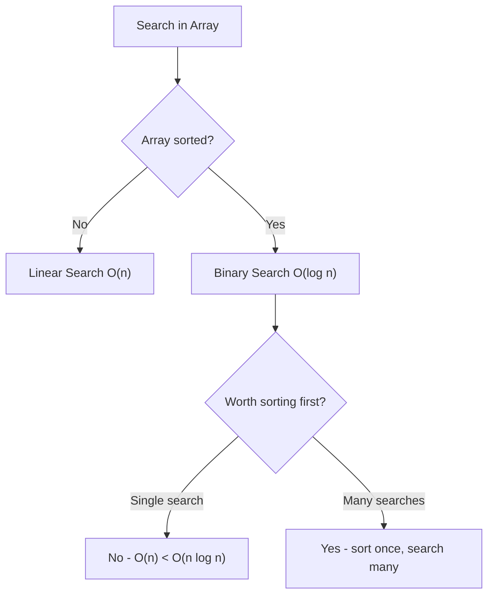

# 1.2 Basic Array Operations

> **Foundation for understanding time complexity trade-offs**  
> **Know these cold for interviews - interviewers test understanding of WHY**

---

## Overview

Every data structure is defined by its operations and their complexities. Arrays excel at **random access** but struggle with **insertions/deletions** that require shifting elements.

---

## ⚡ Operations Complexity Table

| Operation | Time | Space | Notes |
|-----------|------|-------|-------|
| **Access** `arr[i]` |" O(1) "| O(1) | Direct index calculation |
| **Search** (unsorted) |" O(n) "| O(1) | Must check each element |
| **Search** (sorted) |" O(log n) "| O(1) | Binary search |
| **Insert at end** |" O(1)* "| O(1) | Amortized for dynamic arrays |
| **Insert at beginning** |" O(n) "| O(1) | Shift all elements right |
| **Insert at middle** |" O(n) "| O(1) | Shift elements after position |
| **Delete at end** |" O(1) "| O(1) | No shifting needed |
| **Delete at beginning** |" O(n) "| O(1) | Shift all elements left |
| **Delete at middle** |" O(n) "| O(1) | Shift elements after position |
| **Update** `arr[i] = x` |" O(1) "| O(1) | Direct assignment |

> **Note:** * means amortized - occasional resize is O(n), but averaged over many operations is O(1).

---

## 📐 Access - O(1)

**Why O(1)?** Direct calculation: `address = base + (index * element_size)`

```python
# Python
arr = [10, 20, 30, 40, 50]
value = arr[2]      # O(1) - directly gets 30
first = arr[0]      # O(1) - gets 10
last = arr[-1]      # O(1) - gets 50 (Python negative indexing)
```

```javascript
// JavaScript
const arr = [10, 20, 30, 40, 50];
const value = arr[2];              // O(1) - 30
const first = arr[0];              // O(1) - 10
const last = arr[arr.length - 1];  // O(1) - 50
```

### Visualization

```
Memory:  [10][20][30][40][50]
Index:    0   1   2   3   4

arr[2] → base + (2 * 4 bytes) → directly access address
No iteration needed!
```

---

## 🔍 Search - O(n) or O(log n)

### Linear Search (Unsorted) - O(n)

Must check each element until found or end reached.

```python
def linear_search(arr: list, target: int) -> int:
    """Find index of target, or -1 if not found.
    
    Time: O(n), Space: O(1)
    """
    for i in range(len(arr)):
        if arr[i] == target:
            return i
    return -1

# Python built-in (also O(n))
arr = [10, 20, 30, 40, 50]
if 30 in arr:           # O(n) - checks membership
    idx = arr.index(30) # O(n) - finds index
```

```javascript
// JavaScript
function linearSearch(arr, target) {
    for (let i = 0; i < arr.length; i++) {
        if (arr[i] === target) return i;
    }
    return -1;
}

// Built-in methods (also O(n))
const arr = [10, 20, 30, 40, 50];
arr.includes(30);    // O(n) - true
arr.indexOf(30);     // O(n) - 2
```

### Binary Search (Sorted) - O(log n)

Halves search space each step. **Requires sorted array!**

```python
def binary_search(arr: list, target: int) -> int:
    """Find index of target in sorted array.
    
    Time: O(log n), Space: O(1)
    """
    left, right = 0, len(arr) - 1
    
    while left <= right:
        mid = left + (right - left) // 2  # Avoid overflow
        
        if arr[mid] == target:
            return mid
        elif arr[mid] < target:
            left = mid + 1
        else:
            right = mid - 1
    
    return -1
```

```javascript
function binarySearch(arr, target) {
    let left = 0, right = arr.length - 1;
    
    while (left <= right) {
        const mid = Math.floor(left + (right - left) / 2);
        
        if (arr[mid] === target) return mid;
        else if (arr[mid] < target) left = mid + 1;
        else right = mid - 1;
    }
    
    return -1;
}
```

### Search Comparison



---

## ➕ Insertion

### Insert at End - O(1) Amortized

```python
arr = [10, 20, 30]
arr.append(40)      # O(1) amortized
# arr = [10, 20, 30, 40]
```

```javascript
const arr = [10, 20, 30];
arr.push(40);       // O(1) amortized
// arr = [10, 20, 30, 40]
```

**Why "amortized"?** Dynamic arrays occasionally resize (double capacity), which is O(n). But this happens rarely, so averaged cost is O(1).

### Insert at Beginning - O(n)

Must shift ALL elements right to make room.

```python
arr = [10, 20, 30]
arr.insert(0, 5)    # O(n) - shifts all elements
# arr = [5, 10, 20, 30]
```

```javascript
const arr = [10, 20, 30];
arr.unshift(5);     // O(n) - shifts all elements
// arr = [5, 10, 20, 30]
```

### Visualization: Insert at Beginning

```
Before:  [10, 20, 30, __]
         
Step 1:  [10, 20, __, 30]  ← shift 30 right
Step 2:  [10, __, 20, 30]  ← shift 20 right  
Step 3:  [__, 10, 20, 30]  ← shift 10 right
Step 4:  [5, 10, 20, 30]   ← insert 5

Total shifts: n elements = O(n)
```

### Insert at Middle - O(n)

```python
arr = [10, 20, 40, 50]
arr.insert(2, 30)   # O(n) - shifts elements after index 2
# arr = [10, 20, 30, 40, 50]
```

```javascript
const arr = [10, 20, 40, 50];
arr.splice(2, 0, 30);  // O(n) - insert 30 at index 2
// arr = [10, 20, 30, 40, 50]
```

---

## ➖ Deletion

### Delete at End - O(1)

```python
arr = [10, 20, 30, 40]
removed = arr.pop()    # O(1) - removes and returns 40
# arr = [10, 20, 30]
```

```javascript
const arr = [10, 20, 30, 40];
const removed = arr.pop();  // O(1) - removes and returns 40
// arr = [10, 20, 30]
```

### Delete at Beginning - O(n)

Must shift ALL elements left to fill gap.

```python
arr = [10, 20, 30, 40]
removed = arr.pop(0)   # O(n) - shifts all elements
# arr = [20, 30, 40]
```

```javascript
const arr = [10, 20, 30, 40];
const removed = arr.shift();  // O(n) - shifts all elements
// arr = [20, 30, 40]
```

### Visualization: Delete at Beginning

```
Before:  [10, 20, 30, 40]
          ↑ delete this

Step 1:  [20, 20, 30, 40]  ← shift 20 left
Step 2:  [20, 30, 30, 40]  ← shift 30 left
Step 3:  [20, 30, 40, 40]  ← shift 40 left
Step 4:  [20, 30, 40]      ← shrink array

Total shifts: n-1 elements = O(n)
```

### Delete at Middle - O(n)

```python
arr = [10, 20, 30, 40, 50]
del arr[2]          # O(n) - removes 30, shifts rest
# arr = [10, 20, 40, 50]

# Or using pop with index
arr.pop(2)          # O(n) - same effect
```

```javascript
const arr = [10, 20, 30, 40, 50];
arr.splice(2, 1);   // O(n) - remove 1 element at index 2
// arr = [10, 20, 40, 50]
```

---

## ✏️ Update - O(1)

Direct assignment, no shifting needed.

```python
arr = [10, 20, 30, 40]
arr[2] = 35         # O(1) - direct update
# arr = [10, 20, 35, 40]
```

```javascript
const arr = [10, 20, 30, 40];
arr[2] = 35;        // O(1) - direct update
// arr = [10, 20, 35, 40]
```

---

## 🔗 Concept Map

<details>
<summary><strong>Prerequisites & Next Steps</strong></summary>

**Before this, you should know:**
- [Array Basics](./1.1-Array-Basics.md) - Memory layout, indexing
- Basic time complexity (Big O notation)

**After mastering this:**
- [Array Traversal](./1.3-Array-Traversal.md) - Iteration patterns
- [Two Pointers](./1.4-Common-Techniques/01-Two-Pointers.md) - Efficient pair finding
- [Binary Search](../../03-Sorting-Searching.md) - O(log n) search

**Trade-off understanding:**
- **Linked List** - O(1) insert/delete, O(n) access
- **Hash Map** - O(1) lookup by key, O(n) space
- **Balanced BST** - O(log n) for all operations

</details>

---

## 🔄 Variations

| Operation Type | Array | ArrayList | LinkedList | Deque |
|----------------|-------|-----------|------------|-------|
| Access by index |" O(1) "| O(1) |" O(n) "| O(n) |
| Insert at end |" O(1)* "| O(1)* |" O(1) "| O(1) |
| Insert at start |" O(n) "| O(n) |" O(1) "| O(1) |
| Insert at middle |" O(n) "| O(n) |" O(1)** "| O(n) |
| Delete at end |" O(1) "| O(1) |" O(1) "| O(1) |
| Delete at start |" O(n) "| O(n) |" O(1) "| O(1) |
| Search |" O(n) "| O(n) |" O(n) "| O(n) |

*Amortized, **If you have the node reference

---

## 📝 Practice Problems

| Problem | Difficulty | Focus | LeetCode |
|---------|------------|-------|----------|
| Remove Element | Easy | In-place deletion | [LC 27](https://leetcode.com/problems/remove-element/) |
| Remove Duplicates from Sorted Array | Easy | In-place modification | [LC 26](https://leetcode.com/problems/remove-duplicates-from-sorted-array/) |
| Merge Sorted Array | Easy | In-place merge | [LC 88](https://leetcode.com/problems/merge-sorted-array/) |
| Move Zeroes | Easy | In-place rearrangement | [LC 283](https://leetcode.com/problems/move-zeroes/) |
| Rotate Array | Medium | Cyclic operations | [LC 189](https://leetcode.com/problems/rotate-array/) |

<details>
<summary><strong>🧠 Spaced Repetition Schedule</strong></summary>

After learning operations:
- **Day 1:** Write insert/delete from scratch
- **Day 3:** Explain why each operation has its complexity
- **Day 7:** Solve "Remove Element" and "Move Zeroes"
- **Day 14:** Compare array vs linked list trade-offs
- **Day 30:** Implement dynamic array with resize logic

</details>

---

## 🎤 Interview Context

<details>
<summary><strong>What Interviewers Expect</strong></summary>

**Must-know for all levels:**
- Why access is O(1), insert is O(n)
- Difference between static and dynamic arrays
- Amortized analysis for dynamic array growth

**Common interview scenarios:**
| Scenario | Expected Knowledge |
|----------|-------------------|
| "Implement in-place" | Delete by overwriting, not shifting |
| "Memory efficient" | Use array over hash map if possible |
| "Real-time system" |" Avoid O(n) worst case when possible "|

**Company focus:**
| Company | Operations Focus |
|---------|-----------------|
| Amazon | In-place modifications, space optimization |
| Google | Complexity analysis, trade-off discussions |
| Meta | Clean code, edge case handling |
| Microsoft | Fundamentals, clear explanations |

</details>

---

## ⏱️ Time Estimates

| Activity | Time | Notes |
|----------|------|-------|
| Learn all operations | 45 min | With code examples |
| Memorize complexity table | 20 min | Key for interviews |
| Solve Easy problems | 10-15 min each | In-place focus |
| Master trade-offs | 30 min | Array vs other structures |

---

## 📊 Operations Quick Reference

### Python

| Operation | Syntax | Time |
|-----------|--------|------|
| Access | `arr[i]` |" O(1) "|
| Update | `arr[i] = x` |" O(1) "|
| Append | `arr.append(x)` |" O(1)* "|
| Pop end | `arr.pop()` |" O(1) "|
| Insert front | `arr.insert(0, x)` |" O(n) "|
| Pop front | `arr.pop(0)` |" O(n) "|
| Insert middle | `arr.insert(i, x)` |" O(n) "|
| Delete middle | `del arr[i]` or `arr.pop(i)` |" O(n) "|
| Search | `x in arr` |" O(n) "|
| Index | `arr.index(x)` |" O(n) "|
| Length | `len(arr)` |" O(1) "|
| Slice | `arr[a:b]` |" O(b-a) "|

### JavaScript

| Operation | Syntax | Time |
|-----------|--------|------|
| Access | `arr[i]` |" O(1) "|
| Update | `arr[i] = x` |" O(1) "|
| Push | `arr.push(x)` |" O(1)* "|
| Pop | `arr.pop()` |" O(1) "|
| Unshift | `arr.unshift(x)` |" O(n) "|
| Shift | `arr.shift()` |" O(n) "|
| Splice (insert) | `arr.splice(i, 0, x)` |" O(n) "|
| Splice (delete) | `arr.splice(i, 1)` |" O(n) "|
| Includes | `arr.includes(x)` |" O(n) "|
| IndexOf | `arr.indexOf(x)` |" O(n) "|
| Length | `arr.length` |" O(1) "|
| Slice | `arr.slice(a, b)` |" O(b-a) "|

---

## ⚠️ Common Interview Questions

### "Why is insertion at beginning O(n)?"

> "Because arrays store elements contiguously in memory. To insert at index 0, we must shift every existing element one position to the right to make room. With n elements, that's n shifts, hence O(n)."

### "Why is access O(1)?"

> "Arrays store elements contiguously with fixed-size slots. To access index i, we calculate: `base_address + (i * element_size)`. This is a simple arithmetic operation regardless of array size, hence O(1)."

### "When would you use a Linked List instead?"

> "When we need frequent insertions/deletions at arbitrary positions, especially at the beginning. Linked List gives O(1) insertion/deletion at known positions, but sacrifices O(1) random access."

---

## 🔗 Related

- [Array Basics](./1.1-Array-Basics.md) - Memory representation, indexing
- [Array Traversal](./1.3-Array-Traversal.md) - Iteration patterns
- [Linked Lists](../../04-Linked-Lists.md) - When arrays aren't optimal

---

> **💡 Key Insight:** Arrays optimize for **access** (O(1)) at the cost of **insertion/deletion** (O(n)). This trade-off is fundamental to choosing the right data structure.
