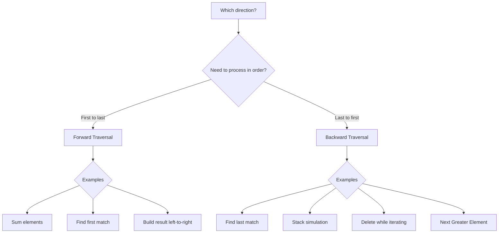

# 1.3 Array Traversal

> **Master iteration patterns before tackling algorithms**  
> **Foundation for:** Two Pointers, Sliding Window, Matrix Traversal

---

## Overview

**Traversal** is visiting each element of an array systematically. Different problems require different traversal patterns. Mastering these patterns is essential for solving array problems efficiently.

---

## 🔄 Basic Traversal Patterns

### Forward Traversal (Left to Right)

The most common pattern. Visit elements from index 0 to n-1.

```python
arr = [10, 20, 30, 40, 50]

# Method 1: By index (when you need the index)
for i in range(len(arr)):
    print(f"Index {i}: {arr[i]}")

# Method 2: By element (when index not needed)
for element in arr:
    print(element)

# Method 3: Both index and element
for i, element in enumerate(arr):
    print(f"Index {i}: {element}")
```

```javascript
const arr = [10, 20, 30, 40, 50];

// Method 1: Traditional for loop
for (let i = 0; i < arr.length; i++) {
    console.log(`Index ${i}: ${arr[i]}`);
}

// Method 2: for...of (element only)
for (const element of arr) {
    console.log(element);
}

// Method 3: forEach with index
arr.forEach((element, i) => {
    console.log(`Index ${i}: ${element}`);
});

// Method 4: entries() for both
for (const [i, element] of arr.entries()) {
    console.log(`Index ${i}: ${element}`);
}
```

### Backward Traversal (Right to Left)

Visit elements from index n-1 to 0. Useful for stack simulation, finding last occurrence.

```python
arr = [10, 20, 30, 40, 50]

# Method 1: By index (decrementing)
for i in range(len(arr) - 1, -1, -1):
    print(f"Index {i}: {arr[i]}")

# Method 2: Using reversed()
for element in reversed(arr):
    print(element)

# Method 3: Using negative indices
for i in range(-1, -len(arr) - 1, -1):
    print(arr[i])

# Method 4: Slice (creates new list)
for element in arr[::-1]:
    print(element)
```

```javascript
const arr = [10, 20, 30, 40, 50];

// Method 1: Decrementing index
for (let i = arr.length - 1; i >= 0; i--) {
    console.log(`Index ${i}: ${arr[i]}`);
}

// Method 2: Using reverse() (mutates original!)
[...arr].reverse().forEach(el => console.log(el));

// Method 3: reduceRight
arr.reduceRight((_, el) => console.log(el), null);
```

---

## 📐 When to Use Each Direction



---

## 🔢 Traversal with Multiple Indices

### Two Pointers Traversal

```python
# Opposite direction (converging)
left, right = 0, len(arr) - 1
while left < right:
    # Process arr[left] and arr[right]
    left += 1
    right -= 1

# Same direction (fast-slow)
slow = fast = 0
while fast < len(arr):
    # Process based on condition
    fast += 1
```

### Skip Elements

```python
arr = [1, 2, 3, 4, 5, 6, 7, 8, 9, 10]

# Every other element (even indices)
for i in range(0, len(arr), 2):
    print(arr[i])  # 1, 3, 5, 7, 9

# Every third element
for i in range(0, len(arr), 3):
    print(arr[i])  # 1, 4, 7, 10
```

```javascript
const arr = [1, 2, 3, 4, 5, 6, 7, 8, 9, 10];

// Every other element
for (let i = 0; i < arr.length; i += 2) {
    console.log(arr[i]);  // 1, 3, 5, 7, 9
}

// Using filter
arr.filter((_, i) => i % 2 === 0);  // [1, 3, 5, 7, 9]
```

---

## 📊 2D Array (Matrix) Traversal

### Row-wise Traversal

```python
matrix = [
    [1, 2, 3],
    [4, 5, 6],
    [7, 8, 9]
]

# Visit: 1, 2, 3, 4, 5, 6, 7, 8, 9
for row in range(len(matrix)):
    for col in range(len(matrix[0])):
        print(matrix[row][col], end=" ")
    print()  # New line after each row
```

```javascript
const matrix = [
    [1, 2, 3],
    [4, 5, 6],
    [7, 8, 9]
];

for (let row = 0; row < matrix.length; row++) {
    for (let col = 0; col < matrix[0].length; col++) {
        console.log(matrix[row][col]);
    }
}
```

### Column-wise Traversal

```python
# Visit: 1, 4, 7, 2, 5, 8, 3, 6, 9
for col in range(len(matrix[0])):
    for row in range(len(matrix)):
        print(matrix[row][col], end=" ")
    print()
```

### Diagonal Traversal (Primary Diagonal)

```python
# Primary diagonal: 1, 5, 9
for i in range(len(matrix)):
    print(matrix[i][i])

# Anti-diagonal: 3, 5, 7
n = len(matrix)
for i in range(n):
    print(matrix[i][n - 1 - i])
```

### Spiral Traversal

```python
def spiral_order(matrix: list[list[int]]) -> list[int]:
    """Traverse matrix in spiral order.
    
    Time: O(m*n), Space: O(1) excluding output
    """
    if not matrix:
        return []
    
    result = []
    top, bottom = 0, len(matrix) - 1
    left, right = 0, len(matrix[0]) - 1
    
    while top <= bottom and left <= right:
        # Right →
        for col in range(left, right + 1):
            result.append(matrix[top][col])
        top += 1
        
        # Down ↓
        for row in range(top, bottom + 1):
            result.append(matrix[row][right])
        right -= 1
        
        # Left ← (if rows remain)
        if top <= bottom:
            for col in range(right, left - 1, -1):
                result.append(matrix[bottom][col])
            bottom -= 1
        
        # Up ↑ (if columns remain)
        if left <= right:
            for row in range(bottom, top - 1, -1):
                result.append(matrix[row][left])
            left += 1
    
    return result

# Example
matrix = [
    [1, 2, 3],
    [4, 5, 6],
    [7, 8, 9]
]
print(spiral_order(matrix))  # [1, 2, 3, 6, 9, 8, 7, 4, 5]
```

### Visualization: Spiral Traversal

```
Matrix:
┌───┬───┬───┐
│ 1 │ 2 │ 3 │  → → →
├───┼───┼───┤        ↓
│ 4 │ 5 │ 6 │        ↓
├───┼───┼───┤        ↓
│ 7 │ 8 │ 9 │  ← ← ←
└───┴───┴───┘
↑
│← ← (then spiral inward to 5)

Order: 1 → 2 → 3 → 6 → 9 → 8 → 7 → 4 → 5
```

### Boundary Traversal

```python
def boundary_traversal(matrix: list[list[int]]) -> list[int]:
    """Traverse only the boundary of matrix."""
    if not matrix:
        return []
    
    rows, cols = len(matrix), len(matrix[0])
    result = []
    
    # Top row
    for col in range(cols):
        result.append(matrix[0][col])
    
    # Right column (excluding corners)
    for row in range(1, rows):
        result.append(matrix[row][cols - 1])
    
    # Bottom row (excluding corners, if more than 1 row)
    if rows > 1:
        for col in range(cols - 2, -1, -1):
            result.append(matrix[rows - 1][col])
    
    # Left column (excluding corners, if more than 1 column)
    if cols > 1:
        for row in range(rows - 2, 0, -1):
            result.append(matrix[row][0])
    
    return result
```

---

## 🔄 Traversal Patterns Comparison

| Pattern | Use Case | Time | Example Problem |
|---------|----------|------|-----------------|
| Forward | Sum, find first |" O(n) "| Maximum element |
| Backward | Find last, stack |" O(n) "| Next greater element |
| Two pointers | Pairs, palindrome |" O(n) "| Two Sum (sorted) |
| Skip (step > 1) | Sample, partition |" O(n/k) "| Every kth element |
| Row-wise | Matrix processing |" O(m*n) "| Row sums |
| Column-wise | Column operations |" O(m*n) "| Column sums |
| Diagonal | Matrix diagonals |" O(min(m,n)) "| Diagonal sum |
| Spiral | Matrix to array |" O(m*n) "| Spiral Matrix |
| Boundary | Edge elements |" O(m+n) "| Border elements |

---

## ⚠️ Common Mistakes

### 1. Modifying Array While Iterating

❌ **Wrong:**
```python
arr = [1, 2, 3, 4, 5]
for i, x in enumerate(arr):
    if x % 2 == 0:
        arr.remove(x)  # Modifies array, skips elements!
```

✅ **Correct:**
```python
# Option 1: Iterate backwards
for i in range(len(arr) - 1, -1, -1):
    if arr[i] % 2 == 0:
        arr.pop(i)

# Option 2: Create new list
arr = [x for x in arr if x % 2 != 0]

# Option 3: Use filter
arr = list(filter(lambda x: x % 2 != 0, arr))
```

### 2. Off-by-One Errors

❌ **Wrong:**
```python
for i in range(len(arr)):
    print(arr[i + 1])  # IndexError at last iteration!
```

✅ **Correct:**
```python
for i in range(len(arr) - 1):  # Stop one early
    print(arr[i + 1])
```

### 3. Using Wrong Loop Variable

❌ **Wrong:**
```python
for i in arr:  # i is the element, not index!
    arr[i] = i * 2  # Using element as index!
```

✅ **Correct:**
```python
for i in range(len(arr)):  # i is the index
    arr[i] = arr[i] * 2
```

---

## 🎯 Pattern Recognition

<details>
<summary><strong>How to Choose Traversal Pattern</strong></summary>

**Look for these signals:**
- "Find first/last occurrence" → Forward/Backward
- "Compare from both ends" → Two Pointers
- "Process in specific order" → Custom traversal
- "Matrix/grid" → 2D traversal patterns

**Keywords in problem statement:**
- "reverse", "from end" → Backward traversal
- "pair", "opposite ends" → Two Pointers
- "spiral", "diagonal" → Matrix patterns
- "layer by layer" → BFS-like or boundary traversal

</details>

---

## 🔗 Concept Map

<details>
<summary><strong>Prerequisites & Next Steps</strong></summary>

**Before this, you should know:**
- [Array Basics](./1.1-Array-Basics.md) - Indexing, memory layout
- [Basic Operations](./1.2-Basic-Operations.md) - Access complexity

**After mastering this:**
- [Two Pointers](./1.4-Common-Techniques/01-Two-Pointers.md) - Advanced traversal
- [Sliding Window](./1.4-Common-Techniques/02-Sliding-Window.md) - Window-based traversal
- [Matrix Problems](../../10-Graphs.md) - Graph-based traversal (BFS/DFS)

**Connects to:**
- **Binary Search** - Halving traversal
- **Spiral Matrix** - Boundary-based traversal
- **Tree Traversal** - Similar patterns on trees

</details>

---

## 🔄 Variations

| Pattern | Description | Example Problem |
|---------|-------------|-----------------|
| Forward | Left to right, index 0 to n-1 | Find first occurrence |
| Backward | Right to left, index n-1 to 0 | Find last occurrence |
| Two Pointers | Both ends toward center | Palindrome check |
| Skip elements | Every k-th element | Sample array |
| Zigzag | Alternating direction | Zigzag traversal |
| Spiral | Outside to inside | Spiral Matrix |
| Diagonal | Corner to corner | Matrix diagonal sum |
| Layer/Boundary | Outer ring first | Rotate Image |

---

## 📝 Practice Problems

| Problem | Difficulty | Pattern | LeetCode |
|---------|------------|---------|----------|
| Reverse String | Easy | Two pointers | [LC 344](https://leetcode.com/problems/reverse-string/) |
| Rotate Array | Medium | Multiple passes | [LC 189](https://leetcode.com/problems/rotate-array/) |
| Spiral Matrix | Medium | Boundary traversal | [LC 54](https://leetcode.com/problems/spiral-matrix/) |
| Diagonal Traverse | Medium | Diagonal pattern | [LC 498](https://leetcode.com/problems/diagonal-traverse/) |
| Set Matrix Zeroes | Medium | Row/col marking | [LC 73](https://leetcode.com/problems/set-matrix-zeroes/) |
| Rotate Image | Medium | Layer rotation | [LC 48](https://leetcode.com/problems/rotate-image/) |

<details>
<summary><strong>🧠 Spaced Repetition Schedule</strong></summary>

After learning traversal patterns:
- **Day 1:** Implement forward, backward, two-pointer traversals
- **Day 3:** Solve Spiral Matrix from scratch
- **Day 7:** Explain when to use each pattern
- **Day 14:** Implement diagonal traversal both directions
- **Day 30:** Solve Rotate Image in O(1) space

</details>

---

## 🎤 Interview Context

<details>
<summary><strong>What Interviewers Expect</strong></summary>

**Must-know patterns:**
- Forward and backward iteration syntax
- Two-pointer traversal for palindrome/reversal
- 2D matrix row-wise and column-wise access

**Common interview scenarios:**
| Problem Type | Expected Pattern |
|--------------|------------------|
| String palindrome | Two pointers |
| Rotate array | Reverse thrice trick |
| Spiral matrix | Boundary shrinking |
| Matrix search | Row-wise + binary search |

**Company focus:**
| Company | Traversal Focus |
|---------|----------------|
| Amazon | Matrix problems, spiral traversal |
| Google | Diagonal patterns, complex 2D |
| Meta | Clean iteration, edge cases |
| Microsoft | Basic patterns, clear logic |

</details>

---

## ⏱️ Time Estimates

| Activity | Time | Notes |
|----------|------|-------|
| Learn basic traversals | 30 min | Forward, backward, enumerate |
| Master 2D patterns | 60 min | Row, column, diagonal |
| Spiral matrix pattern | 45 min | Complex boundary tracking |
| Practice problems | 20-30 min each | Medium difficulty |

---

## 🔗 Related

- [Array Basics](./1.1-Array-Basics.md) - Foundation concepts
- [Basic Operations](./1.2-Basic-Operations.md) - Access, insert, delete
- [Two Pointers](./1.4-Common-Techniques/01-Two-Pointers.md) - Advanced traversal

---

> **💡 Key Insight:** The traversal pattern you choose depends on what you're looking for. Forward for first occurrence, backward for last occurrence, two pointers for pairs, spiral for matrix serialization. Master the patterns, not just the code.
