# Array Techniques Overview

> **Master reference for choosing the right technique**  
> **Read this first before diving into individual patterns**

---

## 🎯 Master Pattern Recognition Flowchart

```mermaid
flowchart TD
    A[Array/String Problem] --> B{What are you looking for?}
    
    B -->|Pair with target sum/property| C{Array sorted?}
    C -->|Yes| D[✅ Two Pointers]
    C -->|No| E{Can sort without losing info?}
    E -->|Yes| F[Sort + Two Pointers]
    E -->|No, need indices| G[✅ Hash Map]
    
    B -->|Contiguous subarray| H{Fixed or variable size?}
    H -->|Fixed size k| I[✅ Fixed Sliding Window]
    H -->|Find optimal size| J{Shrinkable condition?}
    J -->|Yes| K[✅ Variable Sliding Window]
    J -->|No| L[Consider DP]
    
    B -->|Range sum queries| M{Multiple queries?}
    M -->|Yes, static array| N[✅ Prefix Sum]
    M -->|Yes, with updates| O[Fenwick/Segment Tree]
    M -->|No, single query| P["Direct sum O(n)"]
    
    B -->|Maximum/minimum subarray| Q{Contains negatives?}
    Q -->|Yes, contiguous| R[✅ Kadane's Algorithm]
    Q -->|No, all positive| S[Sum entire array]
    
    B -->|Frequency/counting| T[✅ Hash Map]
    B -->|Duplicates/seen before| U[✅ Hash Set]
    B -->|Anagram/permutation| V[✅ Frequency Array/Map]
    
    style D fill:#90EE90
    style G fill:#87CEEB
    style I fill:#FFD700
    style K fill:#FFD700
    style N fill:#DDA0DD
    style R fill:#F0E68C
    style T fill:#87CEEB
    style U fill:#87CEEB
    style V fill:#87CEEB
```



---

## ⚡ Complexity Comparison Table

| Technique | Time | Space | Best For | Requires |
|-----------|------|-------|----------|----------|
| **Two Pointers** |" O(n) "| O(1) | Pairs in sorted arrays, palindromes, partitioning | Sorted data or sortable |
| **Sliding Window (Fixed)** |" O(n) "| O(1) or O(k) | Max/min sum of k elements, fixed substring | Contiguous, known size |
| **Sliding Window (Variable)** |" O(n) "| O(k) | Longest/shortest subarray with condition | Contiguous, shrinkable condition |
| **Prefix Sum** |" O(n) build, O(1) query "| O(n) | Multiple range sum queries | Static array |
| **Kadane's Algorithm** |" O(n) "| O(1) | Maximum subarray sum with negatives | Contiguous, can reset |
| **Hash Map** |" O(n) "| O(n) |" O(1) lookup, frequency, complement finding "| Can afford O(n) space |

### When to Choose What

| Problem Signal | Technique | Why |
|----------------|-----------|-----|
| "Sorted array" + "find pair" | Two Pointers |" O(1) space, exploit sorted order "|
| "Unsorted" + "find pair" + "return indices" | Hash Map | Can't sort (lose indices) |
| "Subarray of size k" | Fixed Sliding Window | Known window size |
| "Longest/shortest subarray with..." | Variable Sliding Window | Dynamic window size |
| "Sum between indices i and j" | Prefix Sum |" O(1) per query "|
| "Maximum sum subarray" | Kadane's | Handles negatives elegantly |
| "Count frequency" / "seen before" | Hash Map/Set |" O(1) lookup "|

---

## 📋 Code Templates (Memorize These!)

### 1️⃣ Two Pointers - Opposite Direction

```python
def two_pointers_opposite(arr, target):
    """Template: Find pair with target sum in sorted array."""
    left, right = 0, len(arr) - 1
    
    while left < right:
        current = arr[left] + arr[right]  # or other condition
        
        if current == target:
            return [left, right]  # Found!
        elif current < target:
            left += 1   # Need larger
        else:
            right -= 1  # Need smaller
    
    return [-1, -1]  # Not found
```

```javascript
function twoPointersOpposite(arr, target) {
    let left = 0, right = arr.length - 1;
    
    while (left < right) {
        const current = arr[left] + arr[right];
        
        if (current === target) return [left, right];
        else if (current < target) left++;
        else right--;
    }
    
    return [-1, -1];
}
```

### 2️⃣ Two Pointers - Same Direction (Fast-Slow)

```python
def two_pointers_same(arr):
    """Template: In-place modification (e.g., remove duplicates)."""
    if not arr:
        return 0
    
    slow = 0  # Position to write
    
    for fast in range(1, len(arr)):
        if arr[fast] != arr[slow]:  # Condition to keep
            slow += 1
            arr[slow] = arr[fast]
    
    return slow + 1  # New length
```

```javascript
function twoPointersSame(arr) {
    if (arr.length === 0) return 0;
    
    let slow = 0;
    
    for (let fast = 1; fast < arr.length; fast++) {
        if (arr[fast] !== arr[slow]) {
            slow++;
            arr[slow] = arr[fast];
        }
    }
    
    return slow + 1;
}
```

### 3️⃣ Sliding Window - Fixed Size

```python
def sliding_window_fixed(arr, k):
    """Template: Max/min of all windows of size k."""
    if len(arr) < k:
        return 0
    
    # Initialize first window
    window_sum = sum(arr[:k])
    result = window_sum
    
    # Slide: remove left, add right
    for i in range(k, len(arr)):
        window_sum = window_sum - arr[i - k] + arr[i]
        result = max(result, window_sum)  # or min, or other
    
    return result
```

```javascript
function slidingWindowFixed(arr, k) {
    if (arr.length < k) return 0;
    
    let windowSum = 0;
    for (let i = 0; i < k; i++) windowSum += arr[i];
    let result = windowSum;
    
    for (let i = k; i < arr.length; i++) {
        windowSum = windowSum - arr[i - k] + arr[i];
        result = Math.max(result, windowSum);
    }
    
    return result;
}
```

### 4️⃣ Sliding Window - Variable Size

```python
def sliding_window_variable(arr, target):
    """Template: Shortest subarray with sum >= target."""
    min_length = float('inf')
    window_sum = 0
    left = 0
    
    for right in range(len(arr)):
        # Expand: add right element
        window_sum += arr[right]
        
        # Shrink: while condition satisfied
        while window_sum >= target:
            min_length = min(min_length, right - left + 1)
            window_sum -= arr[left]
            left += 1
    
    return min_length if min_length != float('inf') else 0
```

```javascript
function slidingWindowVariable(arr, target) {
    let minLength = Infinity;
    let windowSum = 0;
    let left = 0;
    
    for (let right = 0; right < arr.length; right++) {
        windowSum += arr[right];
        
        while (windowSum >= target) {
            minLength = Math.min(minLength, right - left + 1);
            windowSum -= arr[left];
            left++;
        }
    }
    
    return minLength === Infinity ? 0 : minLength;
}
```

### 5️⃣ Prefix Sum

```python
def build_prefix_sum(arr):
    """Template: Build prefix sum for range queries."""
    prefix = [0] * (len(arr) + 1)
    
    for i in range(len(arr)):
        prefix[i + 1] = prefix[i] + arr[i]
    
    return prefix

def range_sum(prefix, left, right):
    """Get sum from index left to right (inclusive)."""
    return prefix[right + 1] - prefix[left]
```

```javascript
function buildPrefixSum(arr) {
    const prefix = new Array(arr.length + 1).fill(0);
    
    for (let i = 0; i < arr.length; i++) {
        prefix[i + 1] = prefix[i] + arr[i];
    }
    
    return prefix;
}

function rangeSum(prefix, left, right) {
    return prefix[right + 1] - prefix[left];
}
```

### 6️⃣ Prefix Sum + Hash Map (Count Subarrays with Sum K)

```python
def subarray_sum_equals_k(arr, k):
    """Template: Count subarrays with sum equal to k."""
    count = 0
    prefix_sum = 0
    prefix_count = {0: 1}  # Base case: empty prefix
    
    for num in arr:
        prefix_sum += num
        
        # Check if (prefix_sum - k) exists
        count += prefix_count.get(prefix_sum - k, 0)
        
        # Store current prefix sum
        prefix_count[prefix_sum] = prefix_count.get(prefix_sum, 0) + 1
    
    return count
```

```javascript
function subarraySumEqualsK(arr, k) {
    let count = 0;
    let prefixSum = 0;
    const prefixCount = new Map([[0, 1]]);
    
    for (const num of arr) {
        prefixSum += num;
        
        count += prefixCount.get(prefixSum - k) || 0;
        prefixCount.set(prefixSum, (prefixCount.get(prefixSum) || 0) + 1);
    }
    
    return count;
}
```

### 7️⃣ Kadane's Algorithm

```python
def kadanes_algorithm(arr):
    """Template: Maximum subarray sum."""
    if not arr:
        return 0
    
    max_ending_here = arr[0]
    max_so_far = arr[0]
    
    for i in range(1, len(arr)):
        # Extend current subarray or start fresh?
        max_ending_here = max(arr[i], max_ending_here + arr[i])
        max_so_far = max(max_so_far, max_ending_here)
    
    return max_so_far
```

```javascript
function kadanesAlgorithm(arr) {
    if (arr.length === 0) return 0;
    
    let maxEndingHere = arr[0];
    let maxSoFar = arr[0];
    
    for (let i = 1; i < arr.length; i++) {
        maxEndingHere = Math.max(arr[i], maxEndingHere + arr[i]);
        maxSoFar = Math.max(maxSoFar, maxEndingHere);
    }
    
    return maxSoFar;
}
```

### 8️⃣ Hash Map - Two Sum Pattern

```python
def two_sum_hash(nums, target):
    """Template: Find pair with target sum (unsorted)."""
    seen = {}  # value -> index
    
    for i, num in enumerate(nums):
        complement = target - num
        
        if complement in seen:
            return [seen[complement], i]
        
        seen[num] = i
    
    return [-1, -1]
```

```javascript
function twoSumHash(nums, target) {
    const seen = new Map();
    
    for (let i = 0; i < nums.length; i++) {
        const complement = target - nums[i];
        
        if (seen.has(complement)) {
            return [seen.get(complement), i];
        }
        
        seen.set(nums[i], i);
    }
    
    return [-1, -1];
}
```

### 9️⃣ Hash Map - Frequency Counting

```python
def frequency_count(arr):
    """Template: Count occurrences of each element."""
    from collections import Counter
    return Counter(arr)

# Manual version
def frequency_count_manual(arr):
    freq = {}
    for item in arr:
        freq[item] = freq.get(item, 0) + 1
    return freq
```

```javascript
function frequencyCount(arr) {
    const freq = new Map();
    for (const item of arr) {
        freq.set(item, (freq.get(item) || 0) + 1);
    }
    return freq;
}
```

---

## 🧠 Quick Decision Guide

Ask yourself these questions in order:

1. **Is the data sorted?**
   - Yes → Consider Two Pointers
   - No → Consider Hash Map or sort first

2. **Do I need a contiguous subarray/substring?**
   - Yes, fixed size → Fixed Sliding Window
   - Yes, find optimal → Variable Sliding Window
   - No → Other techniques

3. **Do I need multiple range sum queries?**
   - Yes → Prefix Sum

4. **Is it a maximum subarray with negatives?**
   - Yes → Kadane's Algorithm

5. **Do I need O(1) lookup for existence/frequency?**
   - Yes → Hash Map or Hash Set

---

## 📊 Problem Type → Technique Mapping

| Problem Type | Primary Technique | Alternative |
|--------------|-------------------|-------------|
| Two Sum (sorted) | Two Pointers | - |
| Two Sum (unsorted) | Hash Map | Sort + Two Pointers |
| Three Sum | Sort + Two Pointers | - |
| Palindrome check | Two Pointers | - |
| Remove duplicates (sorted) | Two Pointers (same direction) | - |
| Max sum of k elements | Fixed Sliding Window | - |
| Longest substring without repeat | Variable Sliding Window + Hash Map | - |
| Min subarray with sum ≥ target | Variable Sliding Window | - |
| Range sum queries | Prefix Sum | - |
| Count subarrays with sum k | Prefix Sum + Hash Map | - |
| Maximum subarray sum | Kadane's Algorithm | - |
| Maximum product subarray | Modified Kadane's (track min too) | - |
| Anagram check | Frequency Array/Map | Sort and compare |
| Group anagrams | Hash Map (sorted key) | - |
| Contains duplicate | Hash Set | Sort |
| First unique character | Frequency Map | - |

---

## 🎤 Interview Quick Reference

### Time to Identify Pattern: < 30 seconds

| If you see... | Think... |
|---------------|----------|
| "sorted array" + "pair" | Two Pointers |
| "subarray of size k" | Sliding Window (fixed) |
| "longest/shortest with condition" | Sliding Window (variable) |
| "sum between i and j" | Prefix Sum |
| "maximum contiguous" | Kadane's |
| "count occurrences" | Hash Map |
| "have I seen this?" | Hash Set |

### Space-Time Tradeoffs

| Want | Use | Trade |
|------|-----|-------|
|" O(1) space "| Two Pointers | Need sorted data |
|" O(1) space "| Kadane's | Only for max subarray |
|" O(n) time unsorted "| Hash Map |" O(n) space "|
|" O(1) queries "| Prefix Sum |" O(n) preprocessing "|

---

> **💡 Key Insight:** Most array problems can be solved with just these 5-6 techniques. The skill is recognizing WHICH technique applies. Use this flowchart until pattern recognition becomes automatic.

---

**Next:** [01-Two-Pointers.md](./01-Two-Pointers.md)
