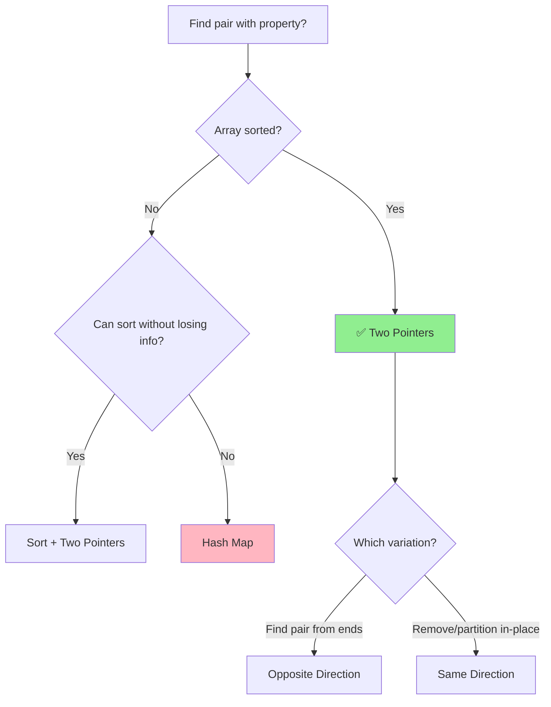

# Two Pointers Technique

> **Grokking Pattern #2** | **ROI: ⭐⭐⭐⭐⭐ (~25% of interview problems)**
>
> 📚 *Master this pattern first - it's the foundation for Sliding Window and many other techniques*

---

## Overview

- [ ] Two Pointer technique
  - Same direction
  - Opposite direction

**Two Pointers** is a technique where two pointers iterate through a data structure (usually an array or string) until one or both pointers meet a certain condition. This reduces time complexity from O(n²) to O(n) by eliminating redundant comparisons.

---

## 🎯 Pattern Recognition

<details>
<summary><strong>How to Identify This Pattern</strong></summary>

**Look for these signals:**
- Problem involves a **sorted array** or **linked list**
- Need to find a **pair** with specific properties (sum, difference)
- Need to compare elements from **both ends**
- Searching for a **subarray** or **subsequence**
- Need to **partition** or **rearrange** elements in-place
- Problem asks for O(n) time with O(1) space

**Keywords in problem statement:**
- "sorted array", "find pair", "two numbers"
- "target sum", "closest to target"
- "remove duplicates", "in-place"
- "palindrome", "reverse"
- "partition", "rearrange"

**Common problem types:**
- Two Sum (sorted)
- Three Sum / Four Sum
- Container with Most Water
- Remove Duplicates
- Palindrome Check
- Dutch National Flag

</details>

---

## ✅ When to Use

- **Sorted array/list** - pointers can make informed moves
- **Finding pairs** with target sum, difference, or product
- **Comparing from both ends** - palindrome, container problems
- **In-place operations** - when O(1) space is required
- **Partitioning data** - separating elements by condition
- **Merging sorted arrays** - two pointers, one per array

## ❌ When NOT to Use

| Situation | Why | Use Instead |
|-----------|-----|-------------|
| Unsorted data (can't sort) | Pointers can't make informed moves |" Hash Map O(n) "|
| Need ALL pairs, not just one | Two pointers finds one match | Nested loops / Backtracking |
| Non-contiguous elements | Gap between elements matters | Dynamic Programming |
| Frequent insertions/deletions | Array reindexing is costly | Linked List |
| Need to preserve original order | Sorting destroys order | Hash Map |

### 🔀 Decision Flowchart



---

## 🔗 Concept Map

<details>
<summary><strong>Prerequisites & Next Steps</strong></summary>

**Before this, you should know:**
- [Array Basics](../1.1-Array-Basics.md) - indexing, traversal
- [Time Complexity](../../00-Prerequisites.md) - Big O notation
- [Sorting basics](../../03-Sorting-Searching.md) - why sorted helps

**After mastering this:**
- [Sliding Window](./02-Sliding-Window.md) - extension for subarrays
- [Fast & Slow Pointers](../../04-Linked-Lists.md) - for linked lists, cycle detection
- [Three Pointers](./01-Two-Pointers.md#variations) - extension for triplets (3Sum)
- [Binary Search](../../03-Sorting-Searching.md) - similar divide approach

**Combines with:**
- **Sorting** - sort first, then apply two pointers
- **Binary Search** - one pointer + binary search
- **Hash Map** - unsorted variant of two sum

</details>

---

## 📐 How It Works

### Two Variations

#### 1. Opposite Direction (Most Common)
Pointers start at **opposite ends** and move toward each other.

```
Array: [1, 3, 5, 7, 9]  Target: 8

Step 1: L=0, R=4  → arr[0]+arr[4] = 1+9 = 10 > 8
        [1, 3, 5, 7, 9]
         L           R     Move R left (need smaller sum)

Step 2: L=0, R=3  → arr[0]+arr[3] = 1+7 = 8 = target ✓
        [1, 3, 5, 7, 9]
         L        R        Found!
```

#### 2. Same Direction
Both pointers start at the **same end** (usually left) and move in the same direction.

```
Array: [0, 0, 1, 1, 2, 2]  Remove duplicates

Step 1: slow=0, fast=1
        [0, 0, 1, 1, 2, 2]
         S  F              arr[S] == arr[F], move F only

Step 2: slow=0, fast=2
        [0, 0, 1, 1, 2, 2]
         S     F           arr[S] != arr[F], copy & move both

Step 3: slow=1, fast=3
        [0, 1, 1, 1, 2, 2]
            S     F        Continue...

Result: [0, 1, 2, _, _, _]  Length = slow + 1 = 3
```

---

## 💻 Code Implementation

### Opposite Direction - Two Sum (Sorted)

**Python:**
```python
def two_sum_sorted(arr: list[int], target: int) -> list[int]:
    """
    Find two numbers that sum to target in a sorted array.
    
    Pattern: Two Pointers (opposite direction)
    Time: O(n), Space: O(1)
    
    Args:
        arr: Sorted array of integers
        target: Target sum to find
    
    Returns:
        Indices of the two numbers, or [-1, -1] if not found
    """
    left, right = 0, len(arr) - 1
    
    while left < right:
        current_sum = arr[left] + arr[right]
        
        if current_sum == target:
            return [left, right]
        elif current_sum < target:
            left += 1   # Need larger sum, move left pointer right
        else:
            right -= 1  # Need smaller sum, move right pointer left
    
    return [-1, -1]  # No pair found


# Example usage
arr = [1, 3, 5, 7, 9]
print(two_sum_sorted(arr, 8))   # Output: [0, 3] → 1 + 7 = 8
print(two_sum_sorted(arr, 100)) # Output: [-1, -1]
```

**JavaScript:**
```javascript
/**
 * Find two numbers that sum to target in a sorted array.
 * Pattern: Two Pointers (opposite direction)
 * Time: O(n), Space: O(1)
 * 
 * @param {number[]} arr - Sorted array of integers
 * @param {number} target - Target sum to find
 * @returns {number[]} Indices of two numbers, or [-1, -1] if not found
 */
function twoSumSorted(arr, target) {
    let left = 0;
    let right = arr.length - 1;
    
    while (left < right) {
        const currentSum = arr[left] + arr[right];
        
        if (currentSum === target) {
            return [left, right];
        } else if (currentSum < target) {
            left++;   // Need larger sum
        } else {
            right--;  // Need smaller sum
        }
    }
    
    return [-1, -1];  // No pair found
}

// Example usage
const arr = [1, 3, 5, 7, 9];
console.log(twoSumSorted(arr, 8));   // Output: [0, 3]
console.log(twoSumSorted(arr, 100)); // Output: [-1, -1]
```

---

### Same Direction - Remove Duplicates

**Python:**
```python
def remove_duplicates(arr: list[int]) -> int:
    """
    Remove duplicates from sorted array in-place.
    
    Pattern: Two Pointers (same direction)
    Time: O(n), Space: O(1)
    
    Args:
        arr: Sorted array (modified in-place)
    
    Returns:
        Length of array after removing duplicates
    """
    if not arr:
        return 0
    
    # slow: position to place next unique element
    # fast: scans for unique elements
    slow = 0
    
    for fast in range(1, len(arr)):
        if arr[fast] != arr[slow]:
            slow += 1
            arr[slow] = arr[fast]
    
    return slow + 1  # Length = last index + 1


# Example usage
arr = [0, 0, 1, 1, 2, 2, 3]
length = remove_duplicates(arr)
print(f"Length: {length}, Array: {arr[:length]}")
# Output: Length: 4, Array: [0, 1, 2, 3]
```

**JavaScript:**
```javascript
/**
 * Remove duplicates from sorted array in-place.
 * Pattern: Two Pointers (same direction)
 * Time: O(n), Space: O(1)
 * 
 * @param {number[]} arr - Sorted array (modified in-place)
 * @returns {number} Length after removing duplicates
 */
function removeDuplicates(arr) {
    if (arr.length === 0) return 0;
    
    let slow = 0;
    
    for (let fast = 1; fast < arr.length; fast++) {
        if (arr[fast] !== arr[slow]) {
            slow++;
            arr[slow] = arr[fast];
        }
    }
    
    return slow + 1;
}

// Example usage
const arr = [0, 0, 1, 1, 2, 2, 3];
const length = removeDuplicates(arr);
console.log(`Length: ${length}, Array: ${arr.slice(0, length)}`);
// Output: Length: 4, Array: [0, 1, 2, 3]
```

---

## ⚡ Complexity Analysis

| Case | Time | Space | Notes |
|------|------|-------|-------|
| Best |" O(1) "| O(1) | Target found at initial positions |
| Average |" O(n) "| O(1) | Typical traversal |
| Worst |" O(n) "| O(1) | Target near middle or not found |

**Why O(n) Time:**
- Each pointer moves at most n times
- Each pointer moves only in one direction (never backtracks)
- Total operations: at most 2n → O(n)

**Why O(1) Space:**
- Only two integer variables (left, right)
- No additional data structures
- Works in-place on the input array

**Comparison with Brute Force:**

| Approach | Time | Space | Notes |
|----------|------|-------|-------|
| Brute Force (nested loops) |" O(n²) "| O(1) | Check every pair |
| Hash Map |" O(n) "| O(n) | Trade space for time |
| **Two Pointers** |" **O(n)** "| **O(1)** | Best of both! |

---

## 🔄 Variations

| Variation | Difference | When to Use | Example Problem |
|-----------|------------|-------------|-----------------|
| **Opposite Direction** | Start at ends, move inward | Sorted array, target sum | Two Sum II |
| **Same Direction** | Both start at 0, different speeds | In-place modification | Remove Duplicates |
| **Three Pointers** | Fix one, two-pointer on rest | Triplet problems | 3Sum |
| **Multiple Arrays** | One pointer per array | Merging | Merge Sorted Arrays |
| **Circular** | Wrap around at ends | Circular arrays | Circular Array Loop |

### Three Pointers (3Sum)

```python
def three_sum(arr: list[int]) -> list[list[int]]:
    """Find all unique triplets that sum to zero."""
    arr.sort()  # Must sort first!
    result = []
    
    for i in range(len(arr) - 2):
        # Skip duplicates for first element
        if i > 0 and arr[i] == arr[i - 1]:
            continue
        
        # Two pointers for remaining two elements
        left, right = i + 1, len(arr) - 1
        target = -arr[i]
        
        while left < right:
            current = arr[left] + arr[right]
            if current == target:
                result.append([arr[i], arr[left], arr[right]])
                # Skip duplicates
                while left < right and arr[left] == arr[left + 1]:
                    left += 1
                while left < right and arr[right] == arr[right - 1]:
                    right -= 1
                left += 1
                right -= 1
            elif current < target:
                left += 1
            else:
                right -= 1
    
    return result
```

---

## ⚠️ Common Mistakes

### 1. **Forgetting the sorted requirement**
```python
# ❌ WRONG: Applying to unsorted array
arr = [9, 1, 5, 3, 7]
two_sum_sorted(arr, 8)  # Won't work correctly!

# ✅ CORRECT: Sort first or use Hash Map
arr.sort()  # Now [1, 3, 5, 7, 9]
two_sum_sorted(arr, 8)  # Works: [0, 3]
```

### 2. **Off-by-one in while condition**
```python
# ❌ WRONG: May use same element twice
while left <= right:  # When left == right, same element!
    if arr[left] + arr[right] == target:
        return [left, right]

# ✅ CORRECT: Strict inequality
while left < right:  # Ensures different elements
    if arr[left] + arr[right] == target:
        return [left, right]
```

### 3. **Not handling duplicates in 3Sum**
```python
# ❌ WRONG: Returns duplicate triplets
# Input: [-1, -1, 0, 1, 1]
# Output: [[-1, 0, 1], [-1, 0, 1]]  # Duplicates!

# ✅ CORRECT: Skip duplicates
if i > 0 and arr[i] == arr[i - 1]:
    continue  # Skip duplicate first element
```

### 4. **Wrong pointer movement logic**
```python
# ❌ WRONG: Moving wrong pointer
if current_sum < target:
    right -= 1  # Making sum even smaller!

# ✅ CORRECT: Think about what you need
if current_sum < target:
    left += 1   # Need larger sum, move to larger element
```

### 5. **Not checking for empty array**
```python
# ❌ WRONG: Crashes on empty input
def two_sum(arr, target):
    left, right = 0, len(arr) - 1  # right = -1 for empty!

# ✅ CORRECT: Handle edge case
def two_sum(arr, target):
    if len(arr) < 2:
        return [-1, -1]
    left, right = 0, len(arr) - 1
```

---

## 📝 Practice Problems (Progressive)

### Easy (Learn the pattern)
- [ ] [Two Sum II - Sorted](https://leetcode.com/problems/two-sum-ii-input-array-is-sorted/) - Classic opposite direction
- [ ] [Valid Palindrome](https://leetcode.com/problems/valid-palindrome/) - Compare from both ends
- [ ] [Remove Duplicates from Sorted Array](https://leetcode.com/problems/remove-duplicates-from-sorted-array/) - Same direction
- [ ] [Move Zeroes](https://leetcode.com/problems/move-zeroes/) - Partition in-place
- [ ] [Squares of a Sorted Array](https://leetcode.com/problems/squares-of-a-sorted-array/) - Opposite direction, merge

### Medium (Apply variations)
- [ ] [3Sum](https://leetcode.com/problems/3sum/) - Three pointers, handle duplicates
- [ ] [Container With Most Water](https://leetcode.com/problems/container-with-most-water/) - Greedy pointer movement
- [ ] [Sort Colors](https://leetcode.com/problems/sort-colors/) - Dutch National Flag
- [ ] [Longest Substring Without Repeating](https://leetcode.com/problems/longest-substring-without-repeating-characters/) - Same direction + hash
- [ ] [4Sum](https://leetcode.com/problems/4sum/) - Four pointers

### Hard (Master edge cases)
- [ ] [Trapping Rain Water](https://leetcode.com/problems/trapping-rain-water/) - Two pointers or stack
- [ ] [Minimum Window Substring](https://leetcode.com/problems/minimum-window-substring/) - Sliding window variant

<details>
<summary><strong>🧠 Spaced Repetition Schedule</strong></summary>

After solving each problem, schedule reviews:

| Day | Activity |
|-----|----------|
| **Day 1** | Redo without looking at solution |
| **Day 3** | Explain the approach out loud (rubber duck) |
| **Day 7** | Solve a similar problem from the list |
| **Day 14** | Teach the pattern to someone else |
| **Day 30** | Revisit if you struggled at Day 14 |

**Pattern mastery checklist:**
- [ ] Can identify Two Pointers problems in < 30 seconds
- [ ] Can write Opposite Direction code from memory
- [ ] Can write Same Direction code from memory
- [ ] Can explain why it's O(n) time
- [ ] Can handle duplicates correctly
- [ ] Know when to use Hash Map instead

</details>

---

## 🎤 Interview Context

<details>
<summary><strong>How to Communicate This in Interviews</strong></summary>

### Step 1: Recognize and State the Pattern

> "I notice this is a **sorted array** problem where we need to find a **pair with target sum**. This is a classic Two Pointers pattern."

### Step 2: Explain Why Two Pointers

> "Since the array is sorted, I can use two pointers from opposite ends. If the sum is too large, I move the right pointer left. If too small, I move the left pointer right. This gives us O(n) time and O(1) space."

### Step 3: Discuss Trade-offs

| Interviewer Question | Your Response |
|---------------------|---------------|
| "Why not use a hash map?" |" "Hash map works but uses O(n) space. Since the array is sorted, Two Pointers achieves O(n) time with O(1) space." "|
| "What if array is unsorted?" |" "Two options: sort first for O(n log n), or use Hash Map for O(n) time but O(n) space." "|
| "Can you optimize further?" |" "For this problem, O(n) is optimal since we must check each element at least once." "|

### Step 4: Handle Edge Cases Proactively

> "Before coding, let me consider edge cases: empty array, single element, no valid pair, duplicates, and negative numbers."

</details>

### Company Focus

| Company | Frequency | Notes |
|---------|-----------|-------|
| **Amazon** | ⭐⭐⭐ High | Classic problems, expect Two Sum II, 3Sum |
| **Meta** | ⭐⭐⭐ High | Bug-free coding valued, handle edge cases |
| **Google** | ⭐⭐ Medium | May combine with other patterns |
| **Microsoft** | ⭐⭐⭐ High | Standard DSA, expect classic problems |
| **Apple** | ⭐⭐ Medium | Clean code, clear explanations |

---

## ⏱️ Time Estimates

| Activity | Time | Notes |
|----------|------|-------|
| Learn concept | 30-45 min | First read-through |
| Understand visualizations | 15-20 min | Trace through examples |
| Solve first Easy | 15-20 min | Two Sum II |
| Solve second Easy | 10-15 min | Pattern recognition faster |
| Solve first Medium | 25-35 min | 3Sum - handle duplicates |
| Master pattern | 3-4 hours | 5-7 problems total |
| Each spaced review | 10-15 min | Quick re-solve |

**Interview timing:**
- Easy: Target **15 minutes** (include explanation)
- Medium: Target **25 minutes** (include explanation)
- Hard: Target **40 minutes** (include explanation)

---

> **💡 Key Insight:** Two Pointers works because moving one pointer eliminates an entire row/column of possibilities. In a sorted array, if `arr[L] + arr[R] > target`, then `arr[L] + arr[R-1]`, `arr[L] + arr[R-2]`, etc. are ALL less than the current sum, so we only need to try `arr[L] + arr[R-1]`. This reduces O(n²) to O(n).

> **🔗 Related:** [Sliding Window](./02-Sliding-Window.md) | [Binary Search](../../03-Sorting-Searching.md) | [Fast & Slow Pointers](../../04-Linked-Lists.md)

---

**Previous:** [1.3 Array Traversal](../1.3-Array-Traversal.md)
**Next:** [02 Sliding Window](./02-Sliding-Window.md)
