# Sliding Window Technique

> **Grokking Pattern #3** | **ROI: ⭐⭐⭐⭐⭐ (~15% of interview problems)**
>
> 📚 *Extension of Two Pointers - essential for subarray/substring problems*

---

## Overview

- [ ] Sliding Window technique
  - Fixed-size window
  - Variable-size window (shrinking/expanding)

**Sliding Window** is a technique for performing operations on a specific window (contiguous subset) of an array or string. Instead of recalculating from scratch for each position, we "slide" the window by adding a new element and removing an old one, reducing time complexity from O(n*k) to O(n).

---

## 🎯 Pattern Recognition

<details>
<summary><strong>How to Identify This Pattern</strong></summary>

**Look for these signals:**
- Problem involves **contiguous subarray** or **substring**
- Need to find **maximum/minimum** sum, length, or count
- Asked about "window of size k" or "subarray of length k"
- Keywords like "longest", "shortest", "maximum sum"
- Need to track something that **changes incrementally**

**Keywords in problem statement:**
- "subarray", "substring", "contiguous"
- "maximum sum of k elements"
- "longest substring with..."
- "shortest subarray with..."
- "window", "sliding", "consecutive"

**Common problem types:**
- Maximum Sum Subarray of Size K
- Longest Substring Without Repeating Characters
- Minimum Size Subarray Sum
- Longest Substring with K Distinct Characters
- Fruit Into Baskets
- Permutation in String

</details>

---

## ✅ When to Use

- **Contiguous subarray/substring** - elements must be adjacent
- **Fixed window size** - "find max sum of k consecutive elements"
- **Variable window with condition** - "shortest subarray with sum ≥ target"
- **Counting/tracking elements** - with a hash map inside the window
- **Finding optimal subarray** - max/min length or value

## ❌ When NOT to Use

### 🔀 Decision Flowchart

```mermaid
flowchart TD
    A[Subarray/Substring problem?] --> B{Contiguous elements?}
    B -->|No| C[❌ Not Sliding Window]
    B -->|Yes| D{Window size known?}
    D -->|Fixed K| E[✅ Fixed Sliding Window]
    D -->|Find optimal| F{Shrinkable condition?}
    F -->|Yes| G[✅ Variable Sliding Window]
    F -->|No| H[Consider Two Pointers/DP]
    
    style E fill:#90EE90
    style G fill:#90EE90
    style C fill:#FFB6C1
```



| Situation | Why | Use Instead |
| Non-contiguous elements needed | Window only works on adjacent elements | Dynamic Programming |
| Need ALL subarrays | Window finds one optimal answer | Brute force with pruning |
| Order doesn't matter | Window is position-dependent | Sorting + Two Pointers |
| Single elements, not ranges | Overkill for point queries | Direct access |
| Complex dependencies | Window state too complicated | DP or different approach |

---

## 🔗 Concept Map

<details>
<summary><strong>Prerequisites & Next Steps</strong></summary>

**Before this, you should know:**
- [Two Pointers](./01-Two-Pointers.md) - same direction variant
- [Array Basics](../1.1-Array-Basics.md) - indexing, traversal
- [Hash Maps](../../09-Hashing.md) - for tracking elements in window

**After mastering this:**
- [Monotonic Queue](../../05-Stacks-Queues.md) - for sliding window maximum
- [Deque](../../05-Stacks-Queues.md) - efficient add/remove from both ends
- [Prefix Sum](./03-Prefix-Sum.md) - alternative for range sum queries

**Combines with:**
- **Hash Map** - track character counts in window
- **Two Pointers** - variable window uses left/right pointers
- **Monotonic Stack/Queue** - for min/max in window

</details>

---

## 📐 How It Works

### Two Types of Sliding Window

#### 1. Fixed-Size Window
Window size `k` is constant. Slide one element at a time.

```
Array: [1, 3, 2, 6, -1, 4, 1, 8, 2]  Window size k=3

Step 1: [1, 3, 2] 6, -1, 4, 1, 8, 2   sum = 6
         └──k=3──┘

Step 2:  1 [3, 2, 6] -1, 4, 1, 8, 2   sum = 6 - 1 + 6 = 11
            └──k=3──┘                  (remove 1, add 6)

Step 3:  1, 3 [2, 6, -1] 4, 1, 8, 2   sum = 11 - 3 + (-1) = 7
               └──k=3──┘

... continue sliding ...

Maximum sum = 11 (window [3, 2, 6])
```

#### 2. Variable-Size Window
Window expands and shrinks based on a condition.

```
Array: [2, 1, 5, 2, 3, 2]  Target: sum ≥ 7

Step 1: [2] → sum=2 < 7, expand
Step 2: [2, 1] → sum=3 < 7, expand
Step 3: [2, 1, 5] → sum=8 ≥ 7 ✓ length=3, try shrinking
Step 4: [1, 5] → sum=6 < 7, expand
Step 5: [1, 5, 2] → sum=8 ≥ 7 ✓ length=3, try shrinking
Step 6: [5, 2] → sum=7 ≥ 7 ✓ length=2, try shrinking
Step 7: [2] → sum=2 < 7, expand
Step 8: [2, 3] → sum=5 < 7, expand
Step 9: [2, 3, 2] → sum=7 ≥ 7 ✓ length=3

Minimum length = 2 (window [5, 2])
```

---

## 💻 Code Implementation

### Fixed-Size Window - Maximum Sum

**Python:**
```python
def max_sum_subarray(arr: list[int], k: int) -> int:
    """
    Find maximum sum of any contiguous subarray of size k.
    
    Pattern: Fixed-size Sliding Window
    Time: O(n), Space: O(1)
    
    Args:
        arr: Array of integers
        k: Window size
    
    Returns:
        Maximum sum of k consecutive elements
    """
    if len(arr) < k:
        return 0
    
    # Calculate sum of first window
    window_sum = sum(arr[:k])
    max_sum = window_sum
    
    # Slide the window: remove left element, add right element
    for i in range(k, len(arr)):
        window_sum = window_sum - arr[i - k] + arr[i]
        max_sum = max(max_sum, window_sum)
    
    return max_sum


# Example usage
arr = [1, 3, 2, 6, -1, 4, 1, 8, 2]
print(max_sum_subarray(arr, 3))  # Output: 11 (subarray [6, -1, 4] or [1, 8, 2]? Let's trace: [3,2,6]=11)
```

**JavaScript:**
```javascript
/**
 * Find maximum sum of any contiguous subarray of size k.
 * Pattern: Fixed-size Sliding Window
 * Time: O(n), Space: O(1)
 * 
 * @param {number[]} arr - Array of integers
 * @param {number} k - Window size
 * @returns {number} Maximum sum of k consecutive elements
 */
function maxSumSubarray(arr, k) {
    if (arr.length < k) return 0;
    
    // Calculate sum of first window
    let windowSum = 0;
    for (let i = 0; i < k; i++) {
        windowSum += arr[i];
    }
    let maxSum = windowSum;
    
    // Slide the window
    for (let i = k; i < arr.length; i++) {
        windowSum = windowSum - arr[i - k] + arr[i];
        maxSum = Math.max(maxSum, windowSum);
    }
    
    return maxSum;
}

// Example usage
const arr = [1, 3, 2, 6, -1, 4, 1, 8, 2];
console.log(maxSumSubarray(arr, 3));  // Output: 11
```

---

### Variable-Size Window - Minimum Size Subarray Sum

**Python:**
```python
def min_subarray_len(target: int, arr: list[int]) -> int:
    """
    Find minimum length subarray with sum >= target.
    
    Pattern: Variable-size Sliding Window
    Time: O(n), Space: O(1)
    
    Args:
        target: Minimum sum required
        arr: Array of positive integers
    
    Returns:
        Minimum length, or 0 if no valid subarray exists
    """
    min_length = float('inf')
    window_sum = 0
    left = 0
    
    for right in range(len(arr)):
        # Expand window by adding right element
        window_sum += arr[right]
        
        # Shrink window while condition is satisfied
        while window_sum >= target:
            min_length = min(min_length, right - left + 1)
            window_sum -= arr[left]
            left += 1
    
    return min_length if min_length != float('inf') else 0


# Example usage
arr = [2, 1, 5, 2, 3, 2]
print(min_subarray_len(7, arr))  # Output: 2 (subarray [5, 2])
```

**JavaScript:**
```javascript
/**
 * Find minimum length subarray with sum >= target.
 * Pattern: Variable-size Sliding Window
 * Time: O(n), Space: O(1)
 * 
 * @param {number} target - Minimum sum required
 * @param {number[]} arr - Array of positive integers
 * @returns {number} Minimum length, or 0 if not found
 */
function minSubarrayLen(target, arr) {
    let minLength = Infinity;
    let windowSum = 0;
    let left = 0;
    
    for (let right = 0; right < arr.length; right++) {
        // Expand window
        windowSum += arr[right];
        
        // Shrink while condition satisfied
        while (windowSum >= target) {
            minLength = Math.min(minLength, right - left + 1);
            windowSum -= arr[left];
            left++;
        }
    }
    
    return minLength === Infinity ? 0 : minLength;
}

// Example usage
const arr = [2, 1, 5, 2, 3, 2];
console.log(minSubarrayLen(7, arr));  // Output: 2
```

---

### Variable Window with Hash Map - Longest Substring Without Repeating

**Python:**
```python
def length_of_longest_substring(s: str) -> int:
    """
    Find length of longest substring without repeating characters.
    
    Pattern: Variable-size Sliding Window + Hash Map
    Time: O(n), Space: O(min(n, alphabet_size))
    
    Args:
        s: Input string
    
    Returns:
        Length of longest substring without repeats
    """
    char_index = {}  # char -> last seen index
    max_length = 0
    left = 0
    
    for right, char in enumerate(s):
        # If char seen and within current window, shrink
        if char in char_index and char_index[char] >= left:
            left = char_index[char] + 1
        
        # Update character's last seen position
        char_index[char] = right
        
        # Update max length
        max_length = max(max_length, right - left + 1)
    
    return max_length


# Example usage
print(length_of_longest_substring("abcabcbb"))  # Output: 3 ("abc")
print(length_of_longest_substring("bbbbb"))     # Output: 1 ("b")
print(length_of_longest_substring("pwwkew"))    # Output: 3 ("wke")
```

**JavaScript:**
```javascript
/**
 * Find length of longest substring without repeating characters.
 * Pattern: Variable-size Sliding Window + Hash Map
 * Time: O(n), Space: O(min(n, alphabet_size))
 * 
 * @param {string} s - Input string
 * @returns {number} Length of longest substring without repeats
 */
function lengthOfLongestSubstring(s) {
    const charIndex = new Map();
    let maxLength = 0;
    let left = 0;
    
    for (let right = 0; right < s.length; right++) {
        const char = s[right];
        
        // If char seen and within current window, shrink
        if (charIndex.has(char) && charIndex.get(char) >= left) {
            left = charIndex.get(char) + 1;
        }
        
        // Update character's last seen position
        charIndex.set(char, right);
        
        // Update max length
        maxLength = Math.max(maxLength, right - left + 1);
    }
    
    return maxLength;
}

// Example usage
console.log(lengthOfLongestSubstring("abcabcbb"));  // Output: 3
console.log(lengthOfLongestSubstring("bbbbb"));     // Output: 1
console.log(lengthOfLongestSubstring("pwwkew"));    // Output: 3
```

---

## ⚡ Complexity Analysis

### Fixed-Size Window

| Case | Time | Space | Notes |
|------|------|-------|-------|
| All cases |" O(n) "| O(1) | Single pass through array |

### Variable-Size Window

| Case | Time | Space | Notes |
|------|------|-------|-------|
| All cases |" O(n) "| O(1) or O(k)* | Each element added/removed at most once |

*O(k) space when using hash map to track k distinct elements

**Why O(n) Time (not O(n²)):**
- **Fixed window:** Each element is visited exactly once
- **Variable window:** Each element is added once and removed at most once
- The inner while loop doesn't make it O(n²) because `left` only moves forward

```
Total operations = elements added + elements removed
                 = n + (at most n)
                 = O(n)
```

**Visual proof for variable window:**
```
[2, 1, 5, 2, 3, 2]
 L              R   Each pointer moves right only!
    L           R   Left never goes backward
       L        R   Total moves: L moves n times, R moves n times
          L     R   = O(2n) = O(n)
```

---

## 🔄 Variations

| Variation | Window Type | Key Feature | Example Problem |
|-----------|-------------|-------------|-----------------|
| **Fixed Sum** | Fixed | Calculate sum once, slide | Max Sum of K Elements |
| **Fixed Average** | Fixed | Track sum, divide by k | Max Average Subarray |
| **Min Length** | Variable | Shrink when condition met | Min Size Subarray Sum |
| **Max Length** | Variable | Expand while valid | Longest Substring |
| **With Counter** | Variable | Hash map for counts | K Distinct Characters |
| **With Deque** | Fixed | Track min/max efficiently | Sliding Window Maximum |

### Template: Variable Window with Counter

```python
def longest_with_k_distinct(s: str, k: int) -> int:
    """Longest substring with at most k distinct characters."""
    from collections import defaultdict
    
    char_count = defaultdict(int)
    max_length = 0
    left = 0
    
    for right, char in enumerate(s):
        # Add to window
        char_count[char] += 1
        
        # Shrink while invalid (too many distinct)
        while len(char_count) > k:
            left_char = s[left]
            char_count[left_char] -= 1
            if char_count[left_char] == 0:
                del char_count[left_char]
            left += 1
        
        # Update answer
        max_length = max(max_length, right - left + 1)
    
    return max_length
```

---

## ⚠️ Common Mistakes

### 1. **Confusing fixed vs variable window**
```python
# ❌ WRONG: Using variable logic for fixed window
for right in range(len(arr)):
    window_sum += arr[right]
    while right - left + 1 > k:  # Unnecessary for fixed!
        window_sum -= arr[left]
        left += 1

# ✅ CORRECT: Fixed window is simpler
window_sum = sum(arr[:k])
for i in range(k, len(arr)):
    window_sum = window_sum - arr[i - k] + arr[i]
```

### 2. **Off-by-one in window size calculation**
```python
# ❌ WRONG: Forgetting +1 for inclusive range
length = right - left  # Missing +1!

# ✅ CORRECT: Both ends are inclusive
length = right - left + 1
```

### 3. **Not handling empty or small arrays**
```python
# ❌ WRONG: Crashes when len(arr) < k
window_sum = sum(arr[:k])  # What if k > len(arr)?

# ✅ CORRECT: Check first
if len(arr) < k:
    return 0  # or appropriate default
window_sum = sum(arr[:k])
```

### 4. **Shrinking before checking the condition**
```python
# ❌ WRONG: Shrink first, might miss valid window
while window_sum >= target:
    window_sum -= arr[left]
    left += 1
    min_length = min(min_length, right - left + 1)

# ✅ CORRECT: Check and record before shrinking
while window_sum >= target:
    min_length = min(min_length, right - left + 1)  # Record FIRST
    window_sum -= arr[left]
    left += 1
```

### 5. **Forgetting to update hash map when shrinking**
```python
# ❌ WRONG: Just move pointer, forget to update counts
left += 1

# ✅ CORRECT: Update tracking data structure
char_count[s[left]] -= 1
if char_count[s[left]] == 0:
    del char_count[s[left]]  # Remove to keep count accurate
left += 1
```

---

## 📝 Practice Problems (Progressive)

### Easy (Learn the pattern)
- [ ] [Maximum Average Subarray I](https://leetcode.com/problems/maximum-average-subarray-i/) - Fixed window, basic
- [ ] [Contains Duplicate II](https://leetcode.com/problems/contains-duplicate-ii/) - Fixed window + hash set

### Medium (Apply variations)
- [ ] [Minimum Size Subarray Sum](https://leetcode.com/problems/minimum-size-subarray-sum/) - Variable, shrinking
- [ ] [Longest Substring Without Repeating](https://leetcode.com/problems/longest-substring-without-repeating-characters/) - Variable + hash map
- [ ] [Longest Repeating Character Replacement](https://leetcode.com/problems/longest-repeating-character-replacement/) - Tricky condition
- [ ] [Fruit Into Baskets](https://leetcode.com/problems/fruit-into-baskets/) - K distinct (k=2)
- [ ] [Permutation in String](https://leetcode.com/problems/permutation-in-string/) - Fixed + frequency match
- [ ] [Find All Anagrams in String](https://leetcode.com/problems/find-all-anagrams-in-a-string/) - Fixed + frequency match
- [ ] [Max Consecutive Ones III](https://leetcode.com/problems/max-consecutive-ones-iii/) - Variable with k flips

### Hard (Master edge cases)
- [ ] [Minimum Window Substring](https://leetcode.com/problems/minimum-window-substring/) - Variable + complex condition
- [ ] [Sliding Window Maximum](https://leetcode.com/problems/sliding-window-maximum/) - Fixed + monotonic deque
- [ ] [Substring with Concatenation of All Words](https://leetcode.com/problems/substring-with-concatenation-of-all-words/) - Complex matching

<details>
<summary><strong>🧠 Spaced Repetition Schedule</strong></summary>

| Day | Activity |
|-----|----------|
| **Day 1** | Redo without looking at solution |
| **Day 3** | Solve a different problem of same type |
| **Day 7** | Solve problem combining with hash map |
| **Day 14** | Teach fixed vs variable difference |
| **Day 30** | Attempt hard problem cold |

**Pattern mastery checklist:**
- [ ] Can write fixed-size window from memory
- [ ] Can write variable-size window from memory
- [ ] Know when to use hash map vs simple counter
- [ ] Can trace through shrinking logic step-by-step
- [ ] Understand why it's O(n) not O(n²)

</details>

---

## 🎤 Interview Context

<details>
<summary><strong>How to Communicate This in Interviews</strong></summary>

### Recognize and Verbalize

> "This problem asks for the [longest/shortest/maximum] [substring/subarray] with [condition]. This is a classic Sliding Window pattern."

### Decide Fixed vs Variable

> "Since the window size [is fixed at k / depends on the condition], I'll use a [fixed / variable]-size sliding window."

### Explain the Approach

For **fixed window:**
> "I'll calculate the initial window of size k, then slide by removing the leftmost and adding the rightmost element."

For **variable window:**
> "I'll expand the window by moving right. When the condition is [met/violated], I'll shrink from the left until [valid/invalid] again."

### Common Interviewer Questions

| Question | Response |
|----------|----------|
| "What's the time complexity?" |" "O(n) - each element is added once and removed at most once" "|
| "Why use a hash map?" |" "To track element counts/positions in O(1) time per operation" "|
| "What about empty input?" | "Good catch - I'll handle that edge case first" |

</details>

### Company Focus

| Company | Frequency | Focus Areas |
|---------|-----------|-------------|
| **Amazon** | ⭐⭐⭐ High | Longest Substring, Minimum Window |
| **Meta** | ⭐⭐⭐ High | String problems, edge cases |
| **Google** | ⭐⭐⭐ High | Often combined with other patterns |
| **Microsoft** | ⭐⭐ Medium | Basic to medium difficulty |
| **Apple** | ⭐⭐ Medium | Clean implementation |

---

## ⏱️ Time Estimates

| Activity | Time | Notes |
|----------|------|-------|
| Learn fixed window | 20-30 min | Simpler, do first |
| Learn variable window | 30-45 min | Trickier shrink logic |
| Solve first Easy | 15-20 min | Max Average Subarray |
| Solve first Medium | 25-35 min | Minimum Size Subarray Sum |
| Solve Longest Substring | 30-40 min | Classic interview problem |
| Master pattern | 4-6 hours | 8-10 problems total |

**Interview timing:**
- Fixed window Easy: **10-15 minutes**
- Variable window Medium: **20-25 minutes**
- Complex Hard: **35-45 minutes**

---

> **💡 Key Insight:** Sliding Window transforms O(n*k) to O(n) by reusing computation. Instead of recalculating the entire window, we only add what enters and remove what leaves. The variable window is O(n) because each element enters once and exits at most once—the inner while loop doesn't multiply the complexity.

> **🔗 Related:** [Two Pointers](./01-Two-Pointers.md) | [Prefix Sum](./03-Prefix-Sum.md) | [Monotonic Queue](../../05-Stacks-Queues.md)

---

**Previous:** [01 Two Pointers](./01-Two-Pointers.md)
**Next:** [03 Prefix Sum](./03-Prefix-Sum.md)
