# Prefix Sum Technique

> **Grokking Pattern #27** | **ROI: ⭐⭐⭐⭐ (Common in range query problems)**
>
> 📚 *Essential for O(1) range sum queries - building block for advanced techniques*

---

## Overview

- [ ] Prefix Sum technique
  - 1D prefix sum
  - 2D prefix sum (submatrix queries)
  - Difference arrays (range updates)

**Prefix Sum** (also called cumulative sum) is a preprocessing technique where we build an array of running totals. This allows answering range sum queries in O(1) time after O(n) preprocessing. It's the foundation for many advanced techniques.

---

## 🎯 Pattern Recognition

<details>
<summary><strong>How to Identify This Pattern</strong></summary>

**Look for these signals:**
- **Multiple range sum queries** on the same array
- "Sum of elements between index i and j"
- Need to find subarrays with **specific sum**
- **Count subarrays** with sum equal to k
- Problem involves **cumulative** properties
- Need **O(1) per query** after preprocessing

**Keywords in problem statement:**
- "range sum", "subarray sum"
- "sum between indices"
- "count subarrays with sum k"
- "sum equals", "sum divisible by"
- "continuous subarray"

**Common problem types:**
- Range Sum Query
- Subarray Sum Equals K
- Contiguous Array (0s and 1s)
- Product of Array Except Self
- Find Pivot Index
- Subarray Sum Divisible by K

</details>

---

## ✅ When to Use

- **Multiple range sum queries** - preprocess once, query many
- **Subarray with target sum** - combined with hash map
- **Count subarrays by sum** - prefix[j] - prefix[i] = target
- **2D matrix sum queries** - extends to 2D prefix sum
- **Range updates** - difference array variant

## ❌ When NOT to Use

### 🔀 Decision Flowchart

```mermaid
flowchart TD
    A[Range sum queries?] --> B{Multiple queries?}
    B -->|No, just one| C["❌ Direct sum O(n)"]
    B -->|Yes, many| D{Array static?}
    D -->|Yes| E[✅ Prefix Sum]
    D -->|No, updates happen| F{Point updates?}
    F -->|Yes| G[Fenwick Tree / Segment Tree]
    F -->|Range updates| H[Difference Array]
    
    style E fill:#90EE90
    style C fill:#FFB6C1
```



| Situation | Why | Use Instead |
|-----------|-----|-------------|
| Single query only |" O(n) preprocessing not worth it "| Direct sum O(n) |
| Array gets modified | Prefix sum becomes invalid | Segment Tree / Fenwick Tree |
| Need min/max not sum | Prefix sum only works for sum | Sparse Table / Segment Tree |
| Memory constrained |" Needs O(n) extra space "| Sliding window if applicable |
| Non-commutative operation | Can't "subtract" to get range | Different approach |

---

## 🔗 Concept Map

<details>
<summary><strong>Prerequisites & Next Steps</strong></summary>

**Before this, you should know:**
- [Array Basics](../1.1-Array-Basics.md) - indexing
- [Hash Maps](../../09-Hashing.md) - for subarray sum equals k
- [Basic Math](../../00-Prerequisites.md) - arithmetic operations

**After mastering this:**
- [Difference Arrays](./03-Prefix-Sum.md#difference-arrays) - for range updates
- [2D Prefix Sum](./03-Prefix-Sum.md#2d-prefix-sum) - matrix queries
- [Fenwick Tree](../../14-Advanced-Data-Structures.md) - dynamic updates + queries
- [Segment Tree](../../14-Advanced-Data-Structures.md) - range queries with updates

**Combines with:**
- **Hash Map** - for "subarray sum equals k"
- **Modulo arithmetic** - for "sum divisible by k"
- **Binary Search** - for "smallest subarray with sum ≥ k"

</details>

---

## 📐 How It Works

### Core Concept

**Build:** Create prefix array where `prefix[i]` = sum of elements from index 0 to i-1.

**Query:** Sum from index `l` to `r` = `prefix[r+1] - prefix[l]`

```
Original:  [3, 1, 4, 1, 5, 9]
           idx: 0  1  2  3  4  5

Prefix:    [0, 3, 4, 8, 9, 14, 23]
           idx: 0  1  2  3  4   5   6
                ↑
                Extra 0 at start makes formulas cleaner

Query: Sum from index 1 to 3?
       = prefix[4] - prefix[1]
       = 9 - 3
       = 6
       
Verify: arr[1] + arr[2] + arr[3] = 1 + 4 + 1 = 6 ✓
```

### Visual: Why It Works

```
prefix[4] = arr[0] + arr[1] + arr[2] + arr[3]
            ├───────excluded────────┤
            
prefix[1] = arr[0]
            ├──┤

Difference = arr[1] + arr[2] + arr[3]  ← What we want!
```

---

## 💻 Code Implementation

### Basic Prefix Sum

**Python:**
```python
def build_prefix_sum(arr: list[int]) -> list[int]:
    """
    Build prefix sum array for range sum queries.
    
    Pattern: Prefix Sum
    Time: O(n) build, O(1) query
    Space: O(n)
    
    Args:
        arr: Original array
    
    Returns:
        Prefix sum array (length n+1, starts with 0)
    """
    n = len(arr)
    prefix = [0] * (n + 1)  # Extra element for easier indexing
    
    for i in range(n):
        prefix[i + 1] = prefix[i] + arr[i]
    
    return prefix


def range_sum(prefix: list[int], left: int, right: int) -> int:
    """
    Get sum of elements from index left to right (inclusive).
    
    Time: O(1)
    """
    return prefix[right + 1] - prefix[left]


# Example usage
arr = [3, 1, 4, 1, 5, 9]
prefix = build_prefix_sum(arr)
print(f"Prefix: {prefix}")  # [0, 3, 4, 8, 9, 14, 23]

print(range_sum(prefix, 1, 3))  # 6 (1+4+1)
print(range_sum(prefix, 0, 5))  # 23 (entire array)
print(range_sum(prefix, 2, 2))  # 4 (single element)
```

**JavaScript:**
```javascript
/**
 * Build prefix sum array for range sum queries.
 * Pattern: Prefix Sum
 * Time: O(n) build, O(1) query
 * Space: O(n)
 * 
 * @param {number[]} arr - Original array
 * @returns {number[]} Prefix sum array (length n+1)
 */
function buildPrefixSum(arr) {
    const n = arr.length;
    const prefix = new Array(n + 1).fill(0);
    
    for (let i = 0; i < n; i++) {
        prefix[i + 1] = prefix[i] + arr[i];
    }
    
    return prefix;
}

/**
 * Get sum of elements from index left to right (inclusive).
 * Time: O(1)
 */
function rangeSum(prefix, left, right) {
    return prefix[right + 1] - prefix[left];
}

// Example usage
const arr = [3, 1, 4, 1, 5, 9];
const prefix = buildPrefixSum(arr);
console.log("Prefix:", prefix);  // [0, 3, 4, 8, 9, 14, 23]

console.log(rangeSum(prefix, 1, 3));  // 6
console.log(rangeSum(prefix, 0, 5));  // 23
```

---

### Subarray Sum Equals K (with Hash Map)

**Python:**
```python
def subarray_sum_equals_k(arr: list[int], k: int) -> int:
    """
    Count number of subarrays with sum equal to k.
    
    Pattern: Prefix Sum + Hash Map
    Time: O(n), Space: O(n)
    
    Key insight: If prefix[j] - prefix[i] = k, 
                 then subarray from i to j-1 sums to k.
                 So we look for prefix[i] = prefix[j] - k
    """
    from collections import defaultdict
    
    count = 0
    prefix_sum = 0
    prefix_count = defaultdict(int)
    prefix_count[0] = 1  # Empty prefix (for subarrays starting at index 0)
    
    for num in arr:
        prefix_sum += num
        
        # How many times have we seen (prefix_sum - k)?
        # Each occurrence means a valid subarray ending here
        count += prefix_count[prefix_sum - k]
        
        # Record this prefix sum
        prefix_count[prefix_sum] += 1
    
    return count


# Example usage
arr = [1, 1, 1]
print(subarray_sum_equals_k(arr, 2))  # Output: 2 ([1,1] appears twice)

arr = [1, 2, 3]
print(subarray_sum_equals_k(arr, 3))  # Output: 2 ([1,2] and [3])
```

**JavaScript:**
```javascript
/**
 * Count number of subarrays with sum equal to k.
 * Pattern: Prefix Sum + Hash Map
 * Time: O(n), Space: O(n)
 */
function subarraySumEqualsK(arr, k) {
    let count = 0;
    let prefixSum = 0;
    const prefixCount = new Map();
    prefixCount.set(0, 1);  // Empty prefix
    
    for (const num of arr) {
        prefixSum += num;
        
        // Count valid subarrays ending here
        count += prefixCount.get(prefixSum - k) || 0;
        
        // Record this prefix sum
        prefixCount.set(prefixSum, (prefixCount.get(prefixSum) || 0) + 1);
    }
    
    return count;
}

// Example usage
console.log(subarraySumEqualsK([1, 1, 1], 2));  // 2
console.log(subarraySumEqualsK([1, 2, 3], 3));  // 2
```

---

### 2D Prefix Sum (Matrix)

**Python:**
```python
def build_2d_prefix_sum(matrix: list[list[int]]) -> list[list[int]]:
    """
    Build 2D prefix sum for submatrix sum queries.
    
    Time: O(m*n) build, O(1) query
    Space: O(m*n)
    """
    if not matrix or not matrix[0]:
        return [[]]
    
    m, n = len(matrix), len(matrix[0])
    prefix = [[0] * (n + 1) for _ in range(m + 1)]
    
    for i in range(1, m + 1):
        for j in range(1, n + 1):
            prefix[i][j] = (matrix[i-1][j-1] 
                          + prefix[i-1][j] 
                          + prefix[i][j-1] 
                          - prefix[i-1][j-1])
    
    return prefix


def submatrix_sum(prefix: list[list[int]], 
                  r1: int, c1: int, r2: int, c2: int) -> int:
    """
    Get sum of submatrix from (r1,c1) to (r2,c2) inclusive.
    
    Uses inclusion-exclusion principle.
    Time: O(1)
    """
    return (prefix[r2+1][c2+1] 
          - prefix[r1][c2+1] 
          - prefix[r2+1][c1] 
          + prefix[r1][c1])


# Example usage
matrix = [
    [1, 2, 3],
    [4, 5, 6],
    [7, 8, 9]
]
prefix = build_2d_prefix_sum(matrix)

# Sum of entire matrix
print(submatrix_sum(prefix, 0, 0, 2, 2))  # 45

# Sum of bottom-right 2x2
print(submatrix_sum(prefix, 1, 1, 2, 2))  # 5+6+8+9 = 28
```

---

### Difference Array (Range Updates)

**Python:**
```python
def range_update(diff: list[int], left: int, right: int, val: int) -> None:
    """
    Add val to all elements from left to right (inclusive).
    
    Time: O(1) per update!
    """
    diff[left] += val
    if right + 1 < len(diff):
        diff[right + 1] -= val


def build_final_array(diff: list[int]) -> list[int]:
    """
    Convert difference array back to actual values.
    
    Time: O(n)
    """
    result = [0] * len(diff)
    result[0] = diff[0]
    
    for i in range(1, len(diff)):
        result[i] = result[i-1] + diff[i]
    
    return result


# Example: Multiple range updates
n = 5
diff = [0] * n  # Start with all zeros

# Add 2 to indices 1-3
range_update(diff, 1, 3, 2)

# Add 3 to indices 2-4
range_update(diff, 2, 4, 3)

result = build_final_array(diff)
print(result)  # [0, 2, 5, 5, 3]
#                 0+0=0, 0+2=2, 2+3=5, 5+0=5, 5-2=3
```

---

## ⚡ Complexity Analysis

### 1D Prefix Sum

| Operation | Time | Space | Notes |
|-----------|------|-------|-------|
| Build |" O(n) "| O(n) | Single pass |
| Query |" O(1) "| O(1) | Just subtraction |
| m queries (brute) |" O(m*n) "| O(1) | Without prefix sum |
| m queries (prefix) |" O(n + m) "| O(n) | With prefix sum |

**Break-even point:** Prefix sum is worth it when queries > 1.

### 2D Prefix Sum

| Operation | Time | Space |
|-----------|------|-------|
| Build |" O(m*n) "| O(m*n) |
| Query |" O(1) "| O(1) |

### Difference Array

| Operation | Time | Notes |
|-----------|------|-------|
| Each update |" O(1) "| Just two operations |
| Final build |" O(n) "| Once at the end |
| k updates (brute) |" O(k*n) "| Without difference array |
| k updates (diff) |" O(k + n) "| With difference array |

---

## 🔄 Variations

| Variation | Use Case | Key Insight |
|-----------|----------|-------------|
| **1D Prefix Sum** | Range sum queries | `prefix[r+1] - prefix[l]` |
| **Prefix Product** | Range product queries | Use log to convert to sum |
| **Prefix XOR** | Range XOR queries | XOR is self-inverse |
| **2D Prefix Sum** | Submatrix queries | Inclusion-exclusion |
| **Difference Array** | Range updates | Opposite of prefix sum |
| **Prefix + Hash Map** | Count subarrays with sum k | Look for complement |

### Prefix XOR

```python
def range_xor(arr: list[int], left: int, right: int) -> int:
    """XOR of elements from left to right."""
    # Build prefix XOR
    prefix = [0] * (len(arr) + 1)
    for i in range(len(arr)):
        prefix[i + 1] = prefix[i] ^ arr[i]
    
    # Query: XOR is self-inverse (a ^ a = 0)
    return prefix[right + 1] ^ prefix[left]
```

---

## ⚠️ Common Mistakes

### 1. **Off-by-one errors in query formula**
```python
# ❌ WRONG: Forgetting the +1 offset
def range_sum_wrong(prefix, left, right):
    return prefix[right] - prefix[left]  # Off by one!

# ✅ CORRECT: prefix has extra element at start
def range_sum(prefix, left, right):
    return prefix[right + 1] - prefix[left]
```

### 2. **Forgetting to initialize prefix[0] = 0**
```python
# ❌ WRONG: No base case
prefix = []
for i in range(n):
    prefix.append(prefix[-1] + arr[i])  # Error on first iteration!

# ✅ CORRECT: Start with 0
prefix = [0]
for i in range(n):
    prefix.append(prefix[-1] + arr[i])
```

### 3. **Not handling empty subarray in "sum equals k"**
```python
# ❌ WRONG: Missing base case
prefix_count = {}

# ✅ CORRECT: Empty prefix (sum = 0) exists once
prefix_count = {0: 1}  # Handles subarrays starting at index 0
```

### 4. **Using prefix sum when array is modified**
```python
# ❌ WRONG: Array changes invalidate prefix sum
prefix = build_prefix_sum(arr)
arr[2] = 100  # Prefix sum is now wrong!
range_sum(prefix, 0, 3)  # Wrong answer!

# ✅ CORRECT: Rebuild or use Fenwick Tree / Segment Tree
# For frequent updates, use dynamic data structures
```

### 5. **Integer overflow in 2D prefix sum**
```python
# ❌ RISKY: Large matrices can overflow
prefix[i][j] = prefix[i-1][j] + prefix[i][j-1] + matrix[i-1][j-1] - prefix[i-1][j-1]

# ✅ SAFER: Use appropriate data types
# In Python, integers auto-expand
# In Java/C++, use long instead of int for large matrices
```

---

## 📝 Practice Problems (Progressive)

### Easy (Learn the pattern)
- [ ] [Range Sum Query - Immutable](https://leetcode.com/problems/range-sum-query-immutable/) - Basic prefix sum
- [ ] [Running Sum of 1d Array](https://leetcode.com/problems/running-sum-of-1d-array/) - Building prefix
- [ ] [Find Pivot Index](https://leetcode.com/problems/find-pivot-index/) - Left sum = right sum

### Medium (Apply variations)
- [ ] [Subarray Sum Equals K](https://leetcode.com/problems/subarray-sum-equals-k/) - Prefix + hash map
- [ ] [Contiguous Array](https://leetcode.com/problems/contiguous-array/) - Transform 0→-1, prefix sum
- [ ] [Range Sum Query 2D - Immutable](https://leetcode.com/problems/range-sum-query-2d-immutable/) - 2D prefix
- [ ] [Product of Array Except Self](https://leetcode.com/problems/product-of-array-except-self/) - Prefix + suffix
- [ ] [Subarray Sums Divisible by K](https://leetcode.com/problems/subarray-sums-divisible-by-k/) - Prefix + modulo
- [ ] [Continuous Subarray Sum](https://leetcode.com/problems/continuous-subarray-sum/) - Prefix + modulo + hash

### Hard (Master edge cases)
- [ ] [Maximum Sum Rectangle](https://leetcode.com/problems/max-sum-of-rectangle-no-larger-than-k/) - 2D + Kadane's
- [ ] [Number of Submatrices That Sum to Target](https://leetcode.com/problems/number-of-submatrices-that-sum-to-target/) - 2D prefix + hash

<details>
<summary><strong>🧠 Spaced Repetition Schedule</strong></summary>

| Day | Activity |
|-----|----------|
| **Day 1** | Redo Range Sum Query without solution |
| **Day 3** | Solve Subarray Sum Equals K |
| **Day 7** | Implement 2D prefix sum from memory |
| **Day 14** | Explain the hash map optimization |
| **Day 30** | Solve a new prefix sum problem cold |

**Pattern mastery checklist:**
- [ ] Can write 1D prefix sum from memory
- [ ] Understand the `prefix[r+1] - prefix[l]` formula
- [ ] Can combine with hash map for "sum equals k"
- [ ] Understand 2D prefix sum inclusion-exclusion
- [ ] Know when to use difference array vs prefix sum

</details>

---

## 🎤 Interview Context

<details>
<summary><strong>How to Communicate This in Interviews</strong></summary>

### Recognize the Pattern

> "This problem involves multiple range sum queries, so I'll use prefix sum to preprocess the array. This gives O(n) preprocessing and O(1) per query."

### For "Subarray Sum Equals K"

> "I'll combine prefix sum with a hash map. The key insight is: if `prefix[j] - prefix[i] = k`, then the subarray from i to j-1 sums to k. So I track how many times each prefix sum has occurred."

### Discuss Trade-offs

| Question | Response |
|----------|----------|
| "What if the array is updated?" | "Prefix sum needs rebuild. For frequent updates, I'd use a Fenwick Tree or Segment Tree." |
|" "Why O(n) space?" "| "We store one prefix value per element. For memory constraints, we could compute on-the-fly if queries are sequential." |
| "What about 2D?" | "Same concept extends to 2D using inclusion-exclusion principle." |

</details>

### Company Focus

| Company | Frequency | Common Problems |
|---------|-----------|-----------------|
| **Amazon** | ⭐⭐⭐ High | Subarray Sum Equals K |
| **Meta** | ⭐⭐ Medium | Range sum, 2D queries |
| **Google** | ⭐⭐⭐ High | Combined with other patterns |
| **Microsoft** | ⭐⭐ Medium | Basic prefix sum |

---

## ⏱️ Time Estimates

| Activity | Time | Notes |
|----------|------|-------|
| Learn 1D prefix sum | 20-30 min | Core concept |
| Learn prefix + hash map | 30-40 min | Important combination |
| Learn 2D prefix sum | 30-40 min | Inclusion-exclusion |
| Solve Range Sum Query | 10-15 min | Basic application |
| Solve Subarray Sum K | 25-35 min | Hash map combo |
| Master pattern | 3-4 hours | 6-8 problems |

**Interview timing:**
- Basic prefix sum: **10-15 minutes**
- With hash map: **20-25 minutes**
- 2D prefix sum: **25-30 minutes**

---

> **💡 Key Insight:** Prefix sum transforms range queries from O(n) to O(1) by precomputing cumulative sums. The formula `prefix[r+1] - prefix[l]` works because we're subtracting the "before" portion from the "up to" portion. Combined with a hash map, it enables counting subarrays with specific sums in O(n) time.

> **🔗 Related:** [Sliding Window](./02-Sliding-Window.md) | [Kadane's Algorithm](./04-Kadanes-Algorithm.md) | [Fenwick Tree](../../14-Advanced-Data-Structures.md)

---

**Previous:** [02 Sliding Window](./02-Sliding-Window.md)
**Next:** [04 Kadane's Algorithm](./04-Kadanes-Algorithm.md)
