# Kadane's Algorithm

> **Classic DP Pattern** | **ROI: ⭐⭐⭐⭐ (Frequently asked, easy to master)**
>
> 📚 *The elegant O(n) solution for Maximum Subarray - a gateway to Dynamic Programming*

---

## Overview

- [ ] Kadane's Algorithm
  - Maximum subarray sum
  - Minimum subarray sum
  - Maximum product subarray
  - Circular array variant

**Kadane's Algorithm** finds the maximum (or minimum) sum of a contiguous subarray in O(n) time. It's a foundational dynamic programming pattern that demonstrates how to optimize from O(n²) to O(n) by making local decisions that lead to a global optimum.

---

## 🎯 Pattern Recognition

<details>
<summary><strong>How to Identify This Pattern</strong></summary>

**Look for these signals:**
- **Maximum/minimum contiguous subarray** sum/product
- "Find the subarray with largest sum"
- Need to handle **negative numbers** in subarray problems
- Can **reset** the running computation when it becomes unfavorable
- Optimization problem on **contiguous** elements

**Keywords in problem statement:**
- "maximum subarray", "largest sum"
- "contiguous subarray"
- "maximum sum of consecutive elements"
- "best time to buy and sell" (related pattern)

**Common problem types:**
- Maximum Subarray Sum
- Maximum Product Subarray
- Maximum Sum Circular Subarray
- Best Time to Buy and Sell Stock
- Longest Turbulent Subarray

</details>

---

## ✅ When to Use

- **Maximum/minimum contiguous subarray** - the classic use case
- **Array contains negative numbers** - where simple sliding window fails
- **Can "reset" the solution** - start fresh when current sum hurts
- **Need O(n) time, O(1) space** - optimal efficiency required
- **Subarray, not subsequence** - elements must be adjacent

## ❌ When NOT to Use

### 🔀 Decision Flowchart

```mermaid
flowchart TD
    A[Maximum subarray sum?] --> B{Contiguous required?}
    B -->|No, subsequence| C[❌ DP / Backtracking]
    B -->|Yes| D{Array has negatives?}
    D -->|No, all positive| E[Sum entire array]
    D -->|Yes| F{Circular array?}
    F -->|No| G[✅ Kadane's Algorithm]
    F -->|Yes| H[Kadane's + Total - MinSubarray]
    
    style G fill:#90EE90
    style C fill:#FFB6C1
```



| Situation | Why | Use Instead |
|-----------|-----|-------------|
| Subsequence (non-contiguous) | Kadane's requires adjacency | DP / Backtracking |
| All positive numbers | Already optimal to take all | Simple sum or Sliding Window |
| Need the actual subarray | Kadane's finds only the sum | Track indices separately |
| Multiple non-overlapping subarrays | One subarray only | DP with state |
| Circular array (max crossing ends) | Needs modification | Kadane's + total - min |

---

## 🔗 Concept Map

<details>
<summary><strong>Prerequisites & Next Steps</strong></summary>

**Before this, you should know:**
- [Array Basics](../1.1-Array-Basics.md) - traversal
- [Prefix Sum](./03-Prefix-Sum.md) - understanding cumulative sums
- [Basic DP concept](../../11-Dynamic-Programming.md) - optimal substructure

**After mastering this:**
- [Maximum Product Subarray](./04-Kadanes-Algorithm.md#variations) - handle negatives * negatives
- [Circular Array](./04-Kadanes-Algorithm.md#circular-variant) - wrap-around case
- [2D Kadane's](../../11-Dynamic-Programming.md) - maximum sum rectangle

**Combines with:**
- **Divide and Conquer** - alternative O(n log n) approach
- **Prefix Sum** - for related problems
- **Sliding Window** - when constraint is on window size, not sum

</details>

---

## 📐 How It Works

### The Core Insight

At each position, we make a choice:
1. **Extend** the current subarray (add current element)
2. **Start fresh** from current element (if extending would hurt)

```
Array: [-2, 1, -3, 4, -1, 2, 1, -5, 4]

Position 0: max_ending_here = max(-2, 0 + (-2)) = -2
            Start: -2 (forced, first element)
            
Position 1: max_ending_here = max(1, -2 + 1) = max(1, -1) = 1
            Better to start fresh! [1]
            
Position 2: max_ending_here = max(-3, 1 + (-3)) = max(-3, -2) = -2
            Extend: [1, -3]
            
Position 3: max_ending_here = max(4, -2 + 4) = max(4, 2) = 4
            Start fresh! [4]
            
Position 4: max_ending_here = max(-1, 4 + (-1)) = max(-1, 3) = 3
            Extend: [4, -1]
            
Position 5: max_ending_here = max(2, 3 + 2) = max(2, 5) = 5
            Extend: [4, -1, 2]
            
Position 6: max_ending_here = max(1, 5 + 1) = max(1, 6) = 6
            Extend: [4, -1, 2, 1] ← Maximum!

Global maximum = 6
```

### Visual Decision Tree

```
For each element, ask:
┌─────────────────────────────────────┐
│  current_sum + arr[i]  vs  arr[i]  │
└─────────────────────────────────────┘
        │                    │
        ▼                    ▼
    Extend              Start Fresh
    (keep going)        (reset)
        
Decision: Take the LARGER value
```

---

## 💻 Code Implementation

### Basic Kadane's Algorithm

**Python:**
```python
def max_subarray_sum(arr: list[int]) -> int:
    """
    Find maximum sum of any contiguous subarray.
    
    Pattern: Kadane's Algorithm (Dynamic Programming)
    Time: O(n), Space: O(1)
    
    Args:
        arr: Array of integers (can contain negatives)
    
    Returns:
        Maximum subarray sum
    """
    if not arr:
        return 0
    
    max_ending_here = arr[0]  # Max sum ending at current position
    max_so_far = arr[0]       # Global maximum found
    
    for i in range(1, len(arr)):
        # Choice: extend current subarray OR start new from here
        max_ending_here = max(arr[i], max_ending_here + arr[i])
        
        # Update global maximum
        max_so_far = max(max_so_far, max_ending_here)
    
    return max_so_far


# Example usage
arr = [-2, 1, -3, 4, -1, 2, 1, -5, 4]
print(max_subarray_sum(arr))  # Output: 6 (subarray [4, -1, 2, 1])

arr = [-1, -2, -3]
print(max_subarray_sum(arr))  # Output: -1 (best single element)
```

**JavaScript:**
```javascript
/**
 * Find maximum sum of any contiguous subarray.
 * Pattern: Kadane's Algorithm
 * Time: O(n), Space: O(1)
 * 
 * @param {number[]} arr - Array of integers
 * @returns {number} Maximum subarray sum
 */
function maxSubarraySum(arr) {
    if (arr.length === 0) return 0;
    
    let maxEndingHere = arr[0];
    let maxSoFar = arr[0];
    
    for (let i = 1; i < arr.length; i++) {
        // Extend or start fresh?
        maxEndingHere = Math.max(arr[i], maxEndingHere + arr[i]);
        maxSoFar = Math.max(maxSoFar, maxEndingHere);
    }
    
    return maxSoFar;
}

// Example usage
console.log(maxSubarraySum([-2, 1, -3, 4, -1, 2, 1, -5, 4]));  // 6
console.log(maxSubarraySum([-1, -2, -3]));  // -1
```

---

### With Subarray Indices

**Python:**
```python
def max_subarray_with_indices(arr: list[int]) -> tuple[int, int, int]:
    """
    Find maximum subarray sum along with its start and end indices.
    
    Returns:
        (max_sum, start_index, end_index)
    """
    if not arr:
        return (0, -1, -1)
    
    max_ending_here = arr[0]
    max_so_far = arr[0]
    
    start = 0          # Start of current subarray
    temp_start = 0     # Potential new start
    end = 0            # End of maximum subarray
    
    for i in range(1, len(arr)):
        if arr[i] > max_ending_here + arr[i]:
            # Start fresh - new subarray begins here
            max_ending_here = arr[i]
            temp_start = i
        else:
            # Extend current subarray
            max_ending_here = max_ending_here + arr[i]
        
        if max_ending_here > max_so_far:
            max_so_far = max_ending_here
            start = temp_start
            end = i
    
    return (max_so_far, start, end)


# Example usage
arr = [-2, 1, -3, 4, -1, 2, 1, -5, 4]
max_sum, start, end = max_subarray_with_indices(arr)
print(f"Max sum: {max_sum}")              # 6
print(f"Subarray: {arr[start:end+1]}")    # [4, -1, 2, 1]
print(f"Indices: {start} to {end}")        # 3 to 6
```

---

### Maximum Product Subarray

**Python:**
```python
def max_product_subarray(arr: list[int]) -> int:
    """
    Find maximum product of any contiguous subarray.
    
    Key insight: Track both max AND min because
    negative * negative = positive (min can become max!)
    
    Time: O(n), Space: O(1)
    """
    if not arr:
        return 0
    
    max_prod = arr[0]
    min_prod = arr[0]  # Track min for negative * negative case
    result = arr[0]
    
    for i in range(1, len(arr)):
        num = arr[i]
        
        # When multiplying by negative, max becomes min and vice versa
        if num < 0:
            max_prod, min_prod = min_prod, max_prod
        
        # Extend or start fresh
        max_prod = max(num, max_prod * num)
        min_prod = min(num, min_prod * num)
        
        result = max(result, max_prod)
    
    return result


# Example usage
print(max_product_subarray([2, 3, -2, 4]))     # 6 (2*3)
print(max_product_subarray([-2, 0, -1]))       # 0
print(max_product_subarray([-2, 3, -4]))       # 24 (-2*3*-4)
```

**JavaScript:**
```javascript
/**
 * Find maximum product of any contiguous subarray.
 * Track both max and min (negative * negative = positive)
 */
function maxProductSubarray(arr) {
    if (arr.length === 0) return 0;
    
    let maxProd = arr[0];
    let minProd = arr[0];
    let result = arr[0];
    
    for (let i = 1; i < arr.length; i++) {
        const num = arr[i];
        
        // Swap when multiplying by negative
        if (num < 0) {
            [maxProd, minProd] = [minProd, maxProd];
        }
        
        maxProd = Math.max(num, maxProd * num);
        minProd = Math.min(num, minProd * num);
        
        result = Math.max(result, maxProd);
    }
    
    return result;
}
```

---

### Circular Array Variant

**Python:**
```python
def max_subarray_circular(arr: list[int]) -> int:
    """
    Find maximum subarray sum in a circular array.
    
    Key insight: Max circular = Total - Min subarray
    
    Answer = max(normal Kadane's, total - min subarray)
    
    Edge case: If all negative, min subarray = entire array,
               total - min = 0, which is wrong. Use normal Kadane's.
    """
    if not arr:
        return 0
    
    # Normal Kadane's for max subarray
    max_sum = arr[0]
    current_max = arr[0]
    
    # Kadane's for min subarray
    min_sum = arr[0]
    current_min = arr[0]
    
    total = arr[0]
    
    for i in range(1, len(arr)):
        total += arr[i]
        
        # Max subarray
        current_max = max(arr[i], current_max + arr[i])
        max_sum = max(max_sum, current_max)
        
        # Min subarray
        current_min = min(arr[i], current_min + arr[i])
        min_sum = min(min_sum, current_min)
    
    # If all elements are negative, max_sum is the answer
    # (circular case would give 0, which is wrong)
    if max_sum < 0:
        return max_sum
    
    return max(max_sum, total - min_sum)


# Example usage
print(max_subarray_circular([1, -2, 3, -2]))      # 3 (just [3])
print(max_subarray_circular([5, -3, 5]))          # 10 ([5, 5] wrapping)
print(max_subarray_circular([3, -1, 2, -1]))      # 4 ([2, -1, 3] wrapping)
print(max_subarray_circular([-3, -2, -1]))        # -1 (all negative)
```

---

## ⚡ Complexity Analysis

| Variant | Time | Space | Notes |
|---------|------|-------|-------|
| Basic Kadane's |" O(n) "| O(1) | Single pass |
| With indices |" O(n) "| O(1) | Track extra variables |
| Max product |" O(n) "| O(1) | Track min and max |
| Circular |" O(n) "| O(1) | Two Kadane's in one pass |

**Why O(n) Time:**
- Single pass through array
- Each element processed exactly once
- All operations inside loop are O(1)

**Why O(1) Space:**
- Only tracking running values (max_ending_here, max_so_far)
- No additional arrays or data structures
- Indices (if needed) are just a few extra variables

**Comparison with Alternatives:**

| Approach | Time | Space | Notes |
|----------|------|-------|-------|
| Brute Force |" O(n³) "| O(1) | Check all subarrays |
| Prefix Sum |" O(n²) "| O(n) | For each i, find min prefix before it |
| Divide & Conquer |" O(n log n) "| O(log n) | Split and combine |
| **Kadane's** |" **O(n)** "| **O(1)** | Optimal! |

---

## 🔄 Variations

| Variation | Difference | Key Modification |
|-----------|------------|------------------|
| **Min subarray sum** | Find minimum instead | Flip signs or swap min/max |
| **Max product** | Multiplication not addition | Track both min and max |
| **Circular array** | Can wrap around | Total - min subarray |
| **With indices** | Need actual subarray | Track start/end pointers |
| **K concatenations** | Array repeated k times | Math + circular logic |
| **2D max rectangle** | Matrix not array | Compress to 1D, apply Kadane's |

### Minimum Subarray Sum

```python
def min_subarray_sum(arr: list[int]) -> int:
    """Find minimum sum of any contiguous subarray."""
    if not arr:
        return 0
    
    min_ending_here = arr[0]
    min_so_far = arr[0]
    
    for i in range(1, len(arr)):
        min_ending_here = min(arr[i], min_ending_here + arr[i])
        min_so_far = min(min_so_far, min_ending_here)
    
    return min_so_far
```

---

## ⚠️ Common Mistakes

### 1. **Initializing with 0 instead of first element**
```python
# ❌ WRONG: Fails for all-negative arrays
max_ending_here = 0
max_so_far = 0

# For [-3, -2, -1], returns 0 instead of -1!

# ✅ CORRECT: Start with first element
max_ending_here = arr[0]
max_so_far = arr[0]
```

### 2. **Not handling empty array**
```python
# ❌ WRONG: Index error on empty array
max_ending_here = arr[0]

# ✅ CORRECT: Check first
if not arr:
    return 0
max_ending_here = arr[0]
```

### 3. **Forgetting to track minimum for product**
```python
# ❌ WRONG: Misses negative * negative = positive
max_prod = max(num, max_prod * num)

# For [-2, -3], returns -2 instead of 6!

# ✅ CORRECT: Track both min and max
if num < 0:
    max_prod, min_prod = min_prod, max_prod
max_prod = max(num, max_prod * num)
min_prod = min(num, min_prod * num)
```

### 4. **Circular: Not handling all-negative case**
```python
# ❌ WRONG: Returns 0 for all-negative array
return max(max_sum, total - min_sum)

# For [-3, -2, -1], total - min = -6 - (-6) = 0. Wrong!

# ✅ CORRECT: Check if all negative
if max_sum < 0:
    return max_sum  # Use normal Kadane's result
return max(max_sum, total - min_sum)
```

### 5. **Index tracking: Updating start at wrong time**
```python
# ❌ WRONG: Updates start even when extending
if arr[i] > max_ending_here + arr[i]:
    temp_start = i
start = temp_start  # Wrong! Updates even on extend

# ✅ CORRECT: Update final start only when new max found
if max_ending_here > max_so_far:
    start = temp_start  # Only when we have a new global max
```

---

## 📝 Practice Problems (Progressive)

### Easy (Learn the pattern)
- [ ] [Maximum Subarray](https://leetcode.com/problems/maximum-subarray/) - The classic problem
- [ ] [Best Time to Buy and Sell Stock](https://leetcode.com/problems/best-time-to-buy-and-sell-stock/) - Related pattern

### Medium (Apply variations)
- [ ] [Maximum Product Subarray](https://leetcode.com/problems/maximum-product-subarray/) - Track min and max
- [ ] [Maximum Sum Circular Subarray](https://leetcode.com/problems/maximum-sum-circular-subarray/) - Circular variant
- [ ] [Longest Turbulent Subarray](https://leetcode.com/problems/longest-turbulent-subarray/) - Alternating comparison
- [ ] [Maximum Absolute Sum of Any Subarray](https://leetcode.com/problems/maximum-absolute-sum-of-any-subarray/) - Max of |sum|

### Hard (Master edge cases)
- [ ] [Max Sum of Rectangle No Larger Than K](https://leetcode.com/problems/max-sum-of-rectangle-no-larger-than-k/) - 2D + BST
- [ ] [K-Concatenation Maximum Sum](https://leetcode.com/problems/k-concatenation-maximum-sum/) - Repeated array

<details>
<summary><strong>🧠 Spaced Repetition Schedule</strong></summary>

| Day | Activity |
|-----|----------|
| **Day 1** | Solve Maximum Subarray without looking |
| **Day 3** | Implement with index tracking |
| **Day 7** | Solve Maximum Product Subarray |
| **Day 14** |" Explain why O(n) and the "extend vs reset" insight "|
| **Day 30** | Solve circular variant cold |

**Pattern mastery checklist:**
- [ ] Can write basic Kadane's from memory
- [ ] Understand the "extend or start fresh" decision
- [ ] Can modify for minimum instead of maximum
- [ ] Can handle products (tracking min and max)
- [ ] Know the circular array trick
- [ ] Can track indices of the maximum subarray

</details>

---

## 🎤 Interview Context

<details>
<summary><strong>How to Communicate This in Interviews</strong></summary>

### Explain the Insight

> "At each position, I have two choices: extend the current subarray or start a new one from here. I always pick whichever gives a larger sum. This greedy choice works because a negative running sum can only hurt future elements."

### Walk Through an Example

> "For [-2, 1, -3, 4], let me trace through:
> - Start with -2 (have to take it)
> - At 1: max(1, -2+1) = max(1, -1) = 1. Start fresh.
> - At -3: max(-3, 1-3) = max(-3, -2) = -2. Extend.
> - At 4: max(4, -2+4) = max(4, 2) = 4. Start fresh.
> Maximum found: 4."

### Handle Follow-ups

| Question | Response |
|----------|----------|
| "What about all negatives?" | "We still find the least negative element. Initialize with arr[0], not 0." |
| "Can you return the indices?" | "Yes, I track temp_start when resetting and update final start/end when we find a new max." |
| "What about a circular array?" | "Max circular = total - min subarray. I run Kadane's for both max and min in one pass." |

</details>

### Company Focus

| Company | Frequency | Notes |
|---------|-----------|-------|
| **Amazon** | ⭐⭐⭐ High | Classic interview question |
| **Meta** | ⭐⭐ Medium | Often as warm-up |
| **Google** | ⭐⭐ Medium | May extend to 2D |
| **Microsoft** | ⭐⭐⭐ High | Fundamental DP |
| **All Companies** | ⭐⭐⭐ | Must-know algorithm |

---

## ⏱️ Time Estimates

| Activity | Time | Notes |
|----------|------|-------|
| Learn basic Kadane's | 20-30 min | Core algorithm |
| Understand the insight | 15-20 min | "Extend vs reset" |
| Solve Maximum Subarray | 10-15 min | Should be quick |
| Learn product variant | 20-30 min | Min/max tracking |
| Learn circular variant | 25-35 min | Trickier concept |
| Master pattern | 2-3 hours | 5-6 problems |

**Interview timing:**
- Basic Kadane's: **10 minutes** (must be fast)
- With indices: **15 minutes**
- Product variant: **20-25 minutes**
- Circular variant: **25-30 minutes**

---

> **💡 Key Insight:** Kadane's Algorithm works because of a simple truth: if the sum of elements before position i is negative, those elements can only hurt the subarray sum. We're better off starting fresh. The algorithm makes this local decision at each step, and the greedy choices lead to the global optimum.

> **🔗 Related:** [Prefix Sum](./03-Prefix-Sum.md) | [Sliding Window](./02-Sliding-Window.md) | [Dynamic Programming](../../11-Dynamic-Programming.md)

---

**Previous:** [03 Prefix Sum](./03-Prefix-Sum.md)
**Next:** [05 Hash Map Technique](./05-Hash-Map-Technique.md)
