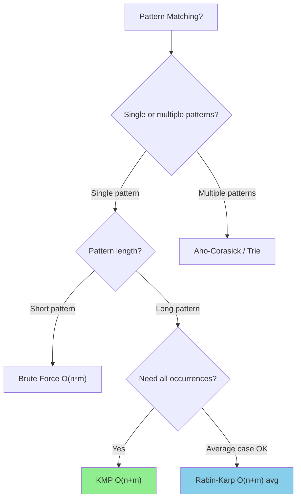

# 2.5 String Pattern Matching

> **Advanced algorithms for finding patterns in text**  
> **Interview Frequency:** Medium - Asked at Google, Amazon for string-heavy roles

---

## Overview

**Pattern matching** is finding occurrences of a pattern string `P` (length m) within a text string `T` (length n). While brute force is O(n*m), advanced algorithms achieve O(n+m).

---

## 🎯 When to Use Each Algorithm



| Algorithm | Time (Worst) | Time (Avg) | Space | Best For |
|-----------|-------------|------------|-------|----------|
| Brute Force |" O(n*m) "| O(n*m) |" O(1) "| Short patterns, simple cases |
| KMP |" O(n+m) "| O(n+m) |" O(m) "| Guaranteed linear, repeated patterns |
| Rabin-Karp |" O(n*m) "| O(n+m) |" O(1) "| Multiple pattern search, plagiarism |
| Z-Algorithm |" O(n+m) "| O(n+m) |" O(n+m) "| Alternative to KMP |

---

## 1️⃣ Brute Force - O(n*m)

Check every position in text as potential pattern start.

```python
def brute_force_search(text: str, pattern: str) -> list[int]:
    """Find all occurrences of pattern in text.
    
    Time: O(n*m), Space: O(1)
    """
    n, m = len(text), len(pattern)
    result = []
    
    for i in range(n - m + 1):
        match = True
        for j in range(m):
            if text[i + j] != pattern[j]:
                match = False
                break
        if match:
            result.append(i)
    
    return result


# Example
text = "AABAACAADAABAAABAA"
pattern = "AABA"
print(brute_force_search(text, pattern))  # [0, 9, 13]
```

```javascript
function bruteForceSearch(text, pattern) {
    const n = text.length, m = pattern.length;
    const result = [];
    
    for (let i = 0; i <= n - m; i++) {
        let match = true;
        for (let j = 0; j < m; j++) {
            if (text[i + j] !== pattern[j]) {
                match = false;
                break;
            }
        }
        if (match) result.push(i);
    }
    
    return result;
}
```

### Visualization

```
Text:    A A B A A C A A D A A B A A A B A A
Pattern: A A B A
         ✓ ✓ ✓ ✓  → Match at index 0

         Move pattern by 1:
Text:    A A B A A C A A D A A B A A A B A A
           A A B A
           ✗        → No match, continue...
```

**Problem:** When mismatch occurs, we only move pattern by 1, even if we could skip further.

---

## 2️⃣ KMP (Knuth-Morris-Pratt) - O(n+m)

**Key Insight:** When a mismatch occurs, we already know what's in the text (we just matched it). Use this information to skip ahead.

### The LPS (Longest Proper Prefix-Suffix) Array

For pattern `P`, `lps[i]` = length of longest proper prefix of `P[0..i]` that is also a suffix.

```
Pattern: A B A B C A B A B
Index:   0 1 2 3 4 5 6 7 8
LPS:     0 0 1 2 0 1 2 3 4

Explanation:
- lps[0] = 0 (by definition, single char has no proper prefix)
- lps[1] = 0 ("AB" - no matching prefix/suffix)
- lps[2] = 1 ("ABA" - "A" is both prefix and suffix)
- lps[3] = 2 ("ABAB" - "AB" is both prefix and suffix)
- lps[4] = 0 ("ABABC" - no match)
- lps[5] = 1 ("ABABCA" - "A")
- lps[6] = 2 ("ABABCAB" - "AB")
- lps[7] = 3 ("ABABCABA" - "ABA")
- lps[8] = 4 ("ABABCABAB" - "ABAB")
```

### Implementation

```python
def compute_lps(pattern: str) -> list[int]:
    """Compute Longest Proper Prefix-Suffix array.
    
    Time: O(m), Space: O(m)
    """
    m = len(pattern)
    lps = [0] * m
    
    length = 0  # Length of previous longest prefix suffix
    i = 1
    
    while i < m:
        if pattern[i] == pattern[length]:
            length += 1
            lps[i] = length
            i += 1
        else:
            if length != 0:
                # Use previously computed LPS
                length = lps[length - 1]
            else:
                lps[i] = 0
                i += 1
    
    return lps


def kmp_search(text: str, pattern: str) -> list[int]:
    """Find all occurrences using KMP algorithm.
    
    Time: O(n+m), Space: O(m)
    """
    n, m = len(text), len(pattern)
    
    if m == 0:
        return []
    
    lps = compute_lps(pattern)
    result = []
    
    i = 0  # Index for text
    j = 0  # Index for pattern
    
    while i < n:
        if text[i] == pattern[j]:
            i += 1
            j += 1
            
            if j == m:
                result.append(i - j)  # Found match
                j = lps[j - 1]  # Continue searching
        else:
            if j != 0:
                j = lps[j - 1]  # Skip ahead using LPS
            else:
                i += 1
    
    return result


# Example
text = "ABABDABACDABABCABAB"
pattern = "ABABCABAB"
print(kmp_search(text, pattern))  # [10]
```

```javascript
function computeLPS(pattern) {
    const m = pattern.length;
    const lps = new Array(m).fill(0);
    
    let length = 0;
    let i = 1;
    
    while (i < m) {
        if (pattern[i] === pattern[length]) {
            length++;
            lps[i] = length;
            i++;
        } else {
            if (length !== 0) {
                length = lps[length - 1];
            } else {
                lps[i] = 0;
                i++;
            }
        }
    }
    
    return lps;
}

function kmpSearch(text, pattern) {
    const n = text.length, m = pattern.length;
    if (m === 0) return [];
    
    const lps = computeLPS(pattern);
    const result = [];
    
    let i = 0, j = 0;
    
    while (i < n) {
        if (text[i] === pattern[j]) {
            i++;
            j++;
            
            if (j === m) {
                result.push(i - j);
                j = lps[j - 1];
            }
        } else {
            if (j !== 0) {
                j = lps[j - 1];
            } else {
                i++;
            }
        }
    }
    
    return result;
}
```

### Why KMP is O(n+m)

- LPS computation: O(m)
- Search: Each character in text is visited at most twice (once when matching, once when failing)
- Total: O(n + m)

---

## 3️⃣ Rabin-Karp - O(n+m) Average

**Key Insight:** Instead of comparing characters, compare hash values. Only compare characters when hashes match.

### Rolling Hash

Use a polynomial hash that can be updated in O(1) when sliding window:

```
hash("abc") = a*p² + b*p¹ + c*p⁰

When sliding from "abc" to "bcd":
hash("bcd") = (hash("abc") - a*p²) * p + d*p⁰
```

### Implementation

```python
def rabin_karp_search(text: str, pattern: str) -> list[int]:
    """Find all occurrences using Rabin-Karp algorithm.
    
    Time: O(n+m) average, O(n*m) worst
    Space: O(1)
    """
    n, m = len(text), len(pattern)
    
    if m > n:
        return []
    
    # Constants for hash
    base = 256  # Number of characters in alphabet
    mod = 10**9 + 7  # Large prime to avoid overflow
    
    # Calculate hash for pattern and first window
    pattern_hash = 0
    window_hash = 0
    h = pow(base, m - 1, mod)  # base^(m-1) for rolling
    
    for i in range(m):
        pattern_hash = (pattern_hash * base + ord(pattern[i])) % mod
        window_hash = (window_hash * base + ord(text[i])) % mod
    
    result = []
    
    for i in range(n - m + 1):
        # Check hash match
        if pattern_hash == window_hash:
            # Verify with actual comparison (avoid false positives)
            if text[i:i + m] == pattern:
                result.append(i)
        
        # Calculate hash for next window
        if i < n - m:
            window_hash = (window_hash - ord(text[i]) * h) % mod
            window_hash = (window_hash * base + ord(text[i + m])) % mod
            window_hash = (window_hash + mod) % mod  # Ensure positive
    
    return result


# Example
text = "GEEKS FOR GEEKS"
pattern = "GEEK"
print(rabin_karp_search(text, pattern))  # [0, 10]
```

```javascript
function rabinKarpSearch(text, pattern) {
    const n = text.length, m = pattern.length;
    if (m > n) return [];
    
    const base = 256;
    const mod = 1e9 + 7;
    
    let patternHash = 0;
    let windowHash = 0;
    let h = 1;
    
    // Calculate h = base^(m-1) % mod
    for (let i = 0; i < m - 1; i++) {
        h = (h * base) % mod;
    }
    
    // Calculate initial hashes
    for (let i = 0; i < m; i++) {
        patternHash = (patternHash * base + pattern.charCodeAt(i)) % mod;
        windowHash = (windowHash * base + text.charCodeAt(i)) % mod;
    }
    
    const result = [];
    
    for (let i = 0; i <= n - m; i++) {
        if (patternHash === windowHash) {
            if (text.substring(i, i + m) === pattern) {
                result.push(i);
            }
        }
        
        if (i < n - m) {
            windowHash = (windowHash - text.charCodeAt(i) * h) % mod;
            windowHash = (windowHash * base + text.charCodeAt(i + m)) % mod;
            windowHash = ((windowHash % mod) + mod) % mod;
        }
    }
    
    return result;
}
```

### Rabin-Karp: Best Use Cases

- **Multiple pattern search:** Hash each pattern, check all simultaneously
- **Plagiarism detection:** Find similar substrings
- **2D pattern matching:** Extend to matrices

---

## 4️⃣ Z-Algorithm - O(n+m)

**Key Insight:** Build Z-array where `Z[i]` = length of longest substring starting at i that matches a prefix of the string.

```
String: a a b c a a b x a a a z
Z-array: - 1 0 0 3 1 0 0 2 2 1 0

Z[4] = 3 because "aab" starting at index 4 matches "aab" prefix
```

### Implementation

```python
def z_algorithm(s: str) -> list[int]:
    """Compute Z-array for string.
    
    Time: O(n), Space: O(n)
    """
    n = len(s)
    z = [0] * n
    
    l, r = 0, 0  # Z-box boundaries
    
    for i in range(1, n):
        if i < r:
            # Inside Z-box, use previously computed values
            z[i] = min(r - i, z[i - l])
        
        # Try to extend
        while i + z[i] < n and s[z[i]] == s[i + z[i]]:
            z[i] += 1
        
        # Update Z-box
        if i + z[i] > r:
            l, r = i, i + z[i]
    
    return z


def z_search(text: str, pattern: str) -> list[int]:
    """Find all occurrences using Z-algorithm.
    
    Time: O(n+m), Space: O(n+m)
    """
    # Concatenate: pattern + separator + text
    concat = pattern + '$' + text
    z = z_algorithm(concat)
    
    result = []
    m = len(pattern)
    
    for i in range(m + 1, len(concat)):
        if z[i] == m:
            result.append(i - m - 1)  # Adjust for separator
    
    return result


# Example
text = "GEEKS FOR GEEKS"
pattern = "GEEK"
print(z_search(text, pattern))  # [0, 10]
```

---

## ⚖️ Algorithm Comparison

| Feature | Brute Force | KMP | Rabin-Karp | Z-Algorithm |
|---------|-------------|-----|------------|-------------|
| **Worst Time** |" O(n*m) "| O(n+m) |" O(n*m) "| O(n+m) |
| **Avg Time** |" O(n*m) "| O(n+m) |" O(n+m) "| O(n+m) |
| **Space** |" O(1) "| O(m) |" O(1) "| O(n+m) |
| **Preprocessing** | None | LPS array | Hash | Z-array |
| **Best For** | Simple cases | Repeated patterns | Multiple patterns | Simple implementation |

---

## ⚠️ Common Mistakes

### 1. Hash Collision (Rabin-Karp)

❌ **Wrong:** Assuming hash match = string match
```python
if pattern_hash == window_hash:
    result.append(i)  # FALSE POSITIVE possible!
```

✅ **Correct:** Always verify with string comparison
```python
if pattern_hash == window_hash:
    if text[i:i+m] == pattern:  # Verify!
        result.append(i)
```

### 2. Off-by-One in KMP

❌ **Wrong:** Using `lps[j]` instead of `lps[j-1]`
```python
if j == m:
    result.append(i - j)
    j = lps[j]  # Wrong! j is out of bounds
```

✅ **Correct:**
```python
if j == m:
    result.append(i - j)
    j = lps[j - 1]  # Use last valid LPS
```

### 3. Negative Hash Values

❌ **Wrong:** Not handling negative modulo
```python
window_hash = (window_hash - ord(text[i]) * h) % mod  # Can be negative!
```

✅ **Correct:**
```python
window_hash = ((window_hash - ord(text[i]) * h) % mod + mod) % mod
```

---

## ✅ When to Use Pattern Matching Algorithms

- **Long patterns** in long texts → KMP, Z-Algorithm
- **Multiple pattern search** → Rabin-Karp, Aho-Corasick
- **Guaranteed linear time** → KMP, Z-Algorithm
- **Plagiarism detection** → Rabin-Karp (rolling hash)
- **DNA sequence matching** → KMP, suffix arrays

## ❌ When NOT to Use

| Situation | Why | Use Instead |
|-----------|-----|-------------|
| Short pattern (< 5 chars) | Overhead not worth it | Brute force |
| Single search | Built-in is optimized | `str.find()` / `indexOf()` |
| Fuzzy matching | Exact match only | Edit distance / regex |
| Prefix search on many strings | Different problem | Trie |

---

## 🔗 Concept Map

<details>
<summary><strong>Prerequisites & Next Steps</strong></summary>

**Before this, you should know:**
- [String Basics](./2.1-String-Basics.md) - String fundamentals
- [String Techniques](./2.4-String-Techniques.md) - Basic string patterns
- Hash function basics (for Rabin-Karp)

**After mastering this:**
- [Tries](../../13-Tries.md) - Prefix-based matching
- [Suffix Arrays](../../14-Advanced-Data-Structures.md) - Advanced string matching
- Aho-Corasick - Multiple pattern search

**Combines with:**
- **Rolling Hash** - For Rabin-Karp
- **Preprocessing** - LPS/Z arrays

</details>

---

## 🔄 Variations

| Algorithm | Variation | Use Case |
|-----------|-----------|----------|
| KMP | Standard |" Single pattern, guaranteed O(n+m) "|
| KMP | Failure function reuse | Multiple searches, same pattern |
| Rabin-Karp | Single pattern |" Average O(n+m), simple to code "|
| Rabin-Karp | Multiple patterns | Check multiple patterns simultaneously |
| Z-Algorithm | Standard | Alternative to KMP |
| Z-Algorithm | Longest common prefix | String similarity |

---

## ⚡ Complexity Analysis

| Algorithm | Preprocess | Search | Space | Notes |
|-----------|------------|--------|-------|-------|
| Brute Force |" O(1) "| O(n*m) |" O(1) "| No preprocessing |
| KMP |" O(m) "| O(n) |" O(m) "| LPS array |
| Rabin-Karp |" O(m) "| O(n) avg |" O(1) "| Hash comparison |
| Z-Algorithm |" O(n+m) "| O(n+m) |" O(n+m) "| Z-array for concat |

**Why KMP is O(n+m):**
- Each text character compared at most twice
- LPS array prevents redundant comparisons

**Why Rabin-Karp worst case is O(n*m):**
- Many hash collisions require character verification
- Average case with good hash is O(n+m)

---

## 📝 Practice Problems

| Problem | Difficulty | Algorithm | LeetCode |
|---------|------------|-----------|----------|
| Implement strStr() | Easy | KMP / Z | [LC 28](https://leetcode.com/problems/find-the-index-of-the-first-occurrence-in-a-string/) |
| Repeated Substring Pattern | Easy | KMP / Z | [LC 459](https://leetcode.com/problems/repeated-substring-pattern/) |
| Longest Happy Prefix | Hard | KMP / Z | [LC 1392](https://leetcode.com/problems/longest-happy-prefix/) |
| Shortest Palindrome | Hard | KMP | [LC 214](https://leetcode.com/problems/shortest-palindrome/) |

<details>
<summary><strong>🧠 Spaced Repetition Schedule</strong></summary>

After learning pattern matching:
- **Day 1:** Implement brute force and explain its limitation
- **Day 3:** Implement KMP with LPS array from scratch
- **Day 7:** Explain LPS concept without looking at code
- **Day 14:** Implement Rabin-Karp with rolling hash
- **Day 30:** Solve Shortest Palindrome using KMP insight

</details>

---

## 🎤 Interview Context

<details>
<summary><strong>What Interviewers Expect</strong></summary>

**When pattern matching is asked:**
- Start with brute force to show understanding
- Know why O(n*m) is the limitation
- Explain KMP/Z optimization conceptually
- Implement if specifically asked

**Communication template:**
1. "Brute force would check each position, giving O(n*m)"
2. "We can optimize using KMP which preprocesses the pattern"
3. "The LPS array tells us how far to skip on mismatch"
4. "This gives us O(n+m) time with O(m) space"

**Company focus:**
| Company | Pattern Matching Focus |
|---------|----------------------|
| Google | May ask KMP implementation |
| Amazon | Rarely asked, know concepts |
| Meta | Concepts more than code |
| Startups | Usually use built-in |

</details>

---

## ⏱️ Time Estimates

| Activity | Time | Notes |
|----------|------|-------|
| Understand brute force | 15 min | Foundation |
| Learn KMP concept | 45 min | LPS is tricky |
| Implement KMP | 30 min | Practice needed |
| Learn Rabin-Karp | 30 min | Rolling hash |
| Master pattern | 3-4 problems | Until confident |

---

## 🔗 Related

- [String Basics](./2.1-String-Basics.md) - String fundamentals
- [String Techniques](./2.4-String-Techniques.md) - Two Pointers, Sliding Window
- [Tries](../../13-Tries.md) - For prefix matching
- [Hash Maps](../03-Hashing/3.1-Hash-Maps.md) - Hashing concepts

---

> **💡 Key Insight:** Pattern matching algorithms trade preprocessing time and space for faster search. KMP preprocesses the pattern (O(m)), Rabin-Karp uses rolling hash (O(1) space), and Z-algorithm preprocesses the concatenated string. For interviews, know KMP conceptually; for production, use built-in methods.
