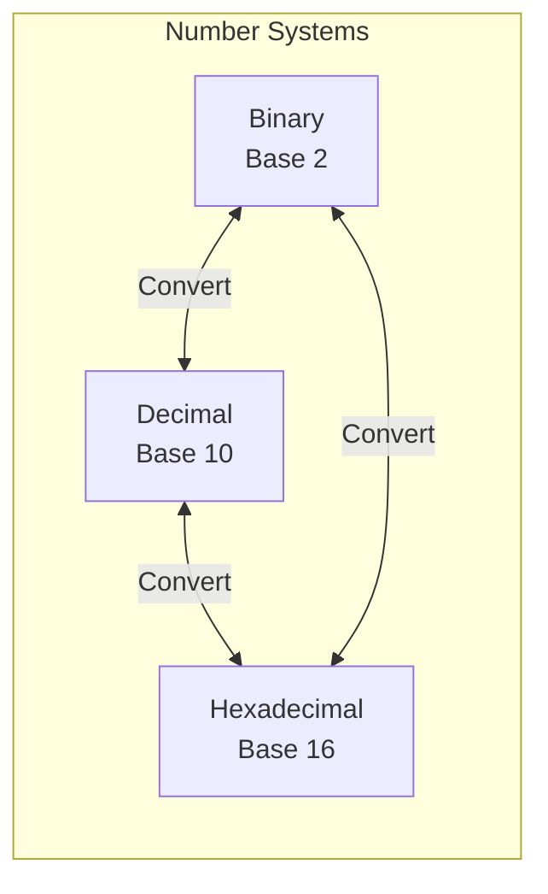

# Binary Number Basics

> **The foundation of all bit manipulation.**
>
> Understanding binary representation unlocks every bit trick and pattern.

---

## 🎯 Why Binary Matters

Computers store everything in binary (0s and 1s). Understanding this representation is essential for:

- **Bit manipulation** - XOR tricks, masks, counting
- **Low-level optimization** - O(1) space operations
- **Interview problems** - Quick mental math with powers of 2
- **Memory efficiency** - Storing multiple flags in one integer

---

## 📐 Number Systems Overview



| System | Base | Digits | Example (13) | Prefix |
|--------|------|--------|--------------|--------|
| **Decimal** | 10 | 0-9 | 13 | none |
| **Binary** | 2 | 0-1 | 1101 | `0b` |
| **Hexadecimal** | 16 | 0-9, A-F | D | `0x` |
| **Octal** | 8 | 0-7 | 15 | `0o` |

---

## 🔢 Binary Representation

### Place Values (Powers of 2)

Each bit position represents a power of 2:

```
Bit Position:  7    6    5    4    3    2    1    0
Power of 2:   128   64   32   16   8    4    2    1
              2^7  2^6  2^5  2^4  2^3  2^2  2^1  2^0
```

### Example: 13 in Binary

```
13 = 8 + 4 + 1
   = 2^3 + 2^2 + 2^0
   = 1101 (binary)

Position:  3  2  1  0
Bit:       1  1  0  1
Value:     8  4  0  1  → Sum = 13
```

### Quick Mental Conversions

| Decimal | Binary | Pattern |
|---------|--------|---------|
| 1 | 0001 | 2^0 |
| 2 | 0010 | 2^1 |
| 4 | 0100 | 2^2 |
| 8 | 1000 | 2^3 |
| 16 | 10000 | 2^4 |
| 7 | 0111 | 2^3 - 1 |
| 15 | 1111 | 2^4 - 1 |
| 31 | 11111 | 2^5 - 1 |

**Pattern:** 2^n - 1 = n ones in binary (e.g., 15 = 1111)

---

## 💻 Binary in Python and JavaScript

### Python

```python
# Binary literals
n = 0b1101  # 13

# Conversion functions
bin(13)     # '0b1101' - decimal to binary string
int('1101', 2)  # 13 - binary string to decimal

# Format without prefix
format(13, 'b')   # '1101'
format(13, '08b') # '00001101' - padded to 8 bits

# Useful for debugging
def show_bits(n, width=8):
    """Display number as binary with padding."""
    if n >= 0:
        return format(n, f'0{width}b')
    else:
        # Handle negative with 2's complement representation
        return format(n & ((1 << width) - 1), f'0{width}b')

print(show_bits(13))   # '00001101'
print(show_bits(-1, 8)) # '11111111'
```

### JavaScript

```javascript
// Binary literals (ES6+)
const n = 0b1101;  // 13

// Conversion
(13).toString(2);   // '1101' - decimal to binary
parseInt('1101', 2); // 13 - binary to decimal

// Padded binary
(13).toString(2).padStart(8, '0');  // '00001101'

// Utility function
function showBits(n, width = 8) {
    if (n >= 0) {
        return n.toString(2).padStart(width, '0');
    } else {
        // Handle negative (32-bit representation)
        return (n >>> 0).toString(2).slice(-width);
    }
}

console.log(showBits(13));   // '00001101'
console.log(showBits(-1, 8)); // '11111111'
```

---

## 🔄 Decimal ↔ Binary Conversion

### Decimal to Binary (Division Method)

```
Convert 13 to binary:

13 ÷ 2 = 6 remainder 1  ← LSB (rightmost)
 6 ÷ 2 = 3 remainder 0
 3 ÷ 2 = 1 remainder 1
 1 ÷ 2 = 0 remainder 1  ← MSB (leftmost)

Read remainders bottom to top: 1101
```

```python
def decimal_to_binary(n):
    """Convert decimal to binary string."""
    if n == 0:
        return '0'
    
    bits = []
    while n > 0:
        bits.append(str(n % 2))
        n //= 2
    
    return ''.join(reversed(bits))

print(decimal_to_binary(13))  # '1101'
```

### Binary to Decimal (Multiplication Method)

```
Convert 1101 to decimal:

1 × 2^3 = 8
1 × 2^2 = 4
0 × 2^1 = 0
1 × 2^0 = 1
         ___
         13
```

```python
def binary_to_decimal(binary_str):
    """Convert binary string to decimal."""
    result = 0
    for bit in binary_str:
        result = result * 2 + int(bit)
    return result

print(binary_to_decimal('1101'))  # 13
```

---

## 📊 Common Bit Widths

| Width | Range (Unsigned) | Range (Signed) | Use |
|-------|------------------|----------------|-----|
| 8-bit | 0 to 255 | -128 to 127 | byte |
| 16-bit | 0 to 65,535 | -32,768 to 32,767 | short |
| 32-bit | 0 to ~4 billion | ~-2B to ~2B | int |
| 64-bit | 0 to ~18 quintillion | ~-9Q to ~9Q | long |

### JavaScript's 32-bit Limitation

```javascript
// JavaScript bitwise ops use 32-bit signed integers
const big = 2 ** 40;
console.log(big);      // 1099511627776
console.log(big | 0);  // 0 (truncated!)

// Safe range for bit operations
const MAX_SAFE = 2 ** 31 - 1;  // 2147483647
const MIN_SAFE = -(2 ** 31);   // -2147483648
```

---

## 🎨 Visualizing Binary

### Bit Grid

```
Decimal 45 = Binary 00101101

┌───┬───┬───┬───┬───┬───┬───┬───┐
│ 0 │ 0 │ 1 │ 0 │ 1 │ 1 │ 0 │ 1 │
├───┼───┼───┼───┼───┼───┼───┼───┤
│128│ 64│ 32│ 16│ 8 │ 4 │ 2 │ 1 │
└───┴───┴───┴───┴───┴───┴───┴───┘
         ↓       ↓   ↓       ↓
        32   +   8 + 4   +   1 = 45
```

### Bit Manipulation Visualization

```python
def visualize_operation(a, b, operation):
    """Visualize a binary operation."""
    ops = {
        '&': lambda x, y: x & y,
        '|': lambda x, y: x | y,
        '^': lambda x, y: x ^ y,
    }
    result = ops[operation](a, b)
    
    print(f"  {a:08b}  ({a})")
    print(f"{operation} {b:08b}  ({b})")
    print(f"  --------")
    print(f"  {result:08b}  ({result})")

visualize_operation(13, 7, '&')
#   00001101  (13)
# & 00000111  (7)
#   --------
#   00000101  (5)
```

---

## ⚡ Key Facts to Memorize

### Powers of 2

| Power | Value | Noteworthy |
|-------|-------|------------|
| 2^0 | 1 | |
| 2^4 | 16 | Hex digit |
| 2^7 | 128 | Signed byte max |
| 2^8 | 256 | Byte values |
| 2^10 | 1,024 | ~1K |
| 2^16 | 65,536 | Short max |
| 2^20 | ~1 million | ~1MB |
| 2^30 | ~1 billion | ~1GB |
| 2^31 | ~2 billion | Int max |
| 2^32 | ~4 billion | Unsigned int max |

### Useful Patterns

| Pattern | Binary | Decimal | Use |
|---------|--------|---------|-----|
| All zeros | 00000000 | 0 | Identity for OR |
| All ones (8-bit) | 11111111 | 255 | Identity for AND |
| Single bit set | 00001000 | 8 | Bit mask |
| Alternating | 01010101 | 85 | Power of 4 check |

---

## 📝 Practice Problems

| Problem | Difficulty | Focus |
|---------|------------|-------|
| [Number Complement](https://leetcode.com/problems/number-complement/) | Easy | Bit flipping |
| [Convert Binary to Integer](https://leetcode.com/problems/convert-binary-number-in-a-linked-list-to-integer/) | Easy | Binary conversion |
| [Add Binary](https://leetcode.com/problems/add-binary/) | Easy | Binary arithmetic |

---

## 🎤 Interview Communication

When asked about binary:

> "Binary is base-2 representation where each position is a power of 2. For example, 13 is 1101 because it's 8 + 4 + 1."

> "I'll think about which bits are set. The number 13 has bits set at positions 0, 2, and 3."

---

> **💡 Key Insight:** Every positive integer can be uniquely represented as a sum of distinct powers of 2. This is why binary works!

> **🔗 Related:** [Bitwise Operators →](./1.2-Bitwise-Operators.md) | [Two's Complement](./1.3-Twos-Complement.md)
