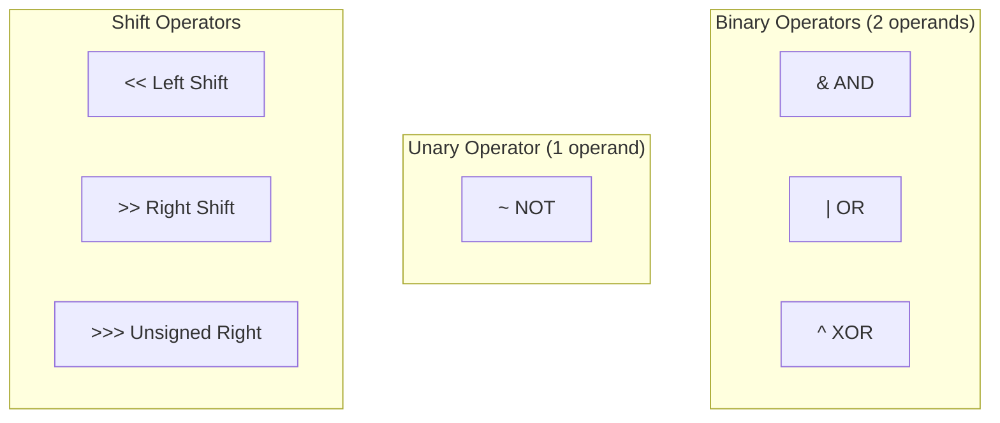

# Bitwise Operators

> **The six fundamental operations on bits.**
>
> Master these operators to unlock all bit manipulation patterns.

---

## 🎯 Overview



---

## 🔧 AND Operator (`&`)

**Rule:** Returns 1 only if **both** bits are 1.

```
  1 0 1 1  (11)
& 1 1 0 1  (13)
  -------
  1 0 0 1  (9)
```

### Truth Table

| A | B | A & B |
|---|---|-------|
| 0 | 0 | 0 |
| 0 | 1 | 0 |
| 1 | 0 | 0 |
| 1 | 1 | 1 |

### Use Cases

```python
# Check if a bit is set
n = 13  # 1101
bit_position = 2
is_set = (n & (1 << bit_position)) != 0  # True (bit 2 is set)

# Clear bits (mask off unwanted bits)
n = 0xFF  # 11111111
mask = 0x0F  # 00001111
lower_nibble = n & mask  # 00001111 = 15

# Check if number is even
is_even = (n & 1) == 0
```

```javascript
// Check if bit is set
const n = 13;  // 1101
const bitPosition = 2;
const isSet = (n & (1 << bitPosition)) !== 0;  // true

// Clear upper bits
const lower4 = n & 0xF;  // Keep only lower 4 bits

// Check even
const isEven = (n & 1) === 0;
```

---

## 🔧 OR Operator (`|`)

**Rule:** Returns 1 if **either** bit is 1.

```
  1 0 1 1  (11)
| 1 1 0 1  (13)
  -------
  1 1 1 1  (15)
```

### Truth Table

| A | B | A \| B |
|---|---|--------|
| 0 | 0 | 0 |
| 0 | 1 | 1 |
| 1 | 0 | 1 |
| 1 | 1 | 1 |

### Use Cases

```python
# Set a specific bit
n = 8  # 1000
bit_position = 1
n = n | (1 << bit_position)  # 1010 = 10

# Combine flags
READ = 0b001
WRITE = 0b010
EXECUTE = 0b100
permissions = READ | WRITE  # 0b011 = 3

# Force a bit to 1
n = n | 1  # Ensure LSB is 1 (makes odd)
```

```javascript
// Set a bit
let n = 8;  // 1000
n = n | (1 << 1);  // 1010 = 10

// Combine flags
const READ = 0b001;
const WRITE = 0b010;
const permissions = READ | WRITE;  // 3
```

---

## 🔧 XOR Operator (`^`)

**Rule:** Returns 1 if bits are **different**.

```
  1 0 1 1  (11)
^ 1 1 0 1  (13)
  -------
  0 1 1 0  (6)
```

### Truth Table

| A | B | A ^ B |
|---|---|-------|
| 0 | 0 | 0 |
| 0 | 1 | 1 |
| 1 | 0 | 1 |
| 1 | 1 | 0 |

### Key Properties

| Property | Formula | Example |
|----------|---------|---------|
| Self-inverse | a ^ a = 0 | 5 ^ 5 = 0 |
| Identity | a ^ 0 = a | 5 ^ 0 = 5 |
| Commutative | a ^ b = b ^ a | 3 ^ 5 = 5 ^ 3 |
| Associative | (a ^ b) ^ c = a ^ (b ^ c) | |

### Use Cases

```python
# Toggle a bit
n = 13  # 1101
bit_position = 1
n = n ^ (1 << bit_position)  # 1111 = 15

# Swap without temp variable
a, b = 5, 3
a ^= b  # a = 5 ^ 3 = 6
b ^= a  # b = 3 ^ 6 = 5
a ^= b  # a = 6 ^ 5 = 3
# Now a=3, b=5

# Find single unique element
nums = [1, 2, 1, 2, 3]
unique = 0
for n in nums:
    unique ^= n  # 3
```

```javascript
// Toggle bit
let n = 13;
n = n ^ (1 << 1);  // 15

// Find unique
const nums = [1, 2, 1, 2, 3];
const unique = nums.reduce((acc, n) => acc ^ n, 0);  // 3
```

---

## 🔧 NOT Operator (`~`)

**Rule:** Flips all bits (0 → 1, 1 → 0).

```
~ 0000 1101  (13)
  ---------
  1111 0010  (-14 in two's complement)
```

### Key Formula

```
~n = -(n + 1)
```

| n | ~n |
|---|-----|
| 0 | -1 |
| 1 | -2 |
| 5 | -6 |
| -1 | 0 |

### Use Cases

```python
# Flip all bits
n = 13
flipped = ~n  # -14

# Find two's complement
twos_complement = ~n + 1  # -13

# Useful identity
# ~n + 1 = -n (negation via bit operations)
```

```javascript
// NOT operator
const n = 13;
console.log(~n);  // -14
console.log(~n + 1);  // -13 (negation)

// Double NOT for floor
console.log(~~3.7);  // 3 (faster Math.floor for positive)
```

---

## 🔧 Left Shift Operator (`<<`)

**Rule:** Shift bits left, fill with zeros. Each shift **multiplies by 2**.

```
  0000 0101  (5)
<< 2
  0001 0100  (20)

5 << 2 = 5 × 2² = 20
```

### Formula

```
n << k = n × 2^k
```

### Use Cases

```python
# Multiply by power of 2
n = 5
doubled = n << 1  # 10
quadrupled = n << 2  # 20

# Create bit mask
mask = 1 << 3  # 0b1000 = 8 (bit 3 set)

# Create mask of k ones
k = 4
all_ones = (1 << k) - 1  # 0b1111 = 15
```

```javascript
// Multiply by 2
const n = 5;
console.log(n << 1);  // 10
console.log(n << 3);  // 40

// Create bit mask
const mask = 1 << 3;  // 8

// ⚠️ Warning: 32-bit limit!
console.log(1 << 31);  // -2147483648 (sign bit!)
```

---

## 🔧 Right Shift Operator (`>>`)

**Rule:** Shift bits right. Each shift **divides by 2** (floors result).

```
  0001 0100  (20)
>> 2
  0000 0101  (5)

20 >> 2 = 20 ÷ 2² = 5
```

### Formula

```
n >> k = ⌊n / 2^k⌋
```

### Signed vs Unsigned Right Shift

```python
# Python: >> is arithmetic shift (preserves sign)
-8 >> 1  # -4 (sign bit preserved)

# Python doesn't have unsigned shift, but you can simulate:
def unsigned_right_shift(n, k, bits=32):
    return (n & ((1 << bits) - 1)) >> k

print(unsigned_right_shift(-1, 1, 8))  # 127
```

```javascript
// >> is arithmetic (sign-preserving)
console.log(-8 >> 1);  // -4

// >>> is logical (fills with zeros)
console.log(-8 >>> 1);  // 2147483644

// Use >>> 0 to convert to unsigned 32-bit
console.log((-1) >>> 0);  // 4294967295
```

### Use Cases

```python
# Divide by power of 2
n = 100
half = n >> 1  # 50
quarter = n >> 2  # 25

# Get bit at position k
n = 13  # 1101
k = 2
bit_value = (n >> k) & 1  # 1 (bit 2 is set)

# Count bits (with other ops)
count = 0
while n:
    count += n & 1
    n >>= 1
```

---

## 📊 Operator Summary

| Operator | Symbol | Description | Example |
|----------|--------|-------------|---------|
| AND | `&` | 1 if both 1 | 5 & 3 = 1 |
| OR | `\|` | 1 if either 1 | 5 \| 3 = 7 |
| XOR | `^` | 1 if different | 5 ^ 3 = 6 |
| NOT | `~` | Flip all bits | ~5 = -6 |
| Left Shift | `<<` | Multiply by 2^k | 5 << 2 = 20 |
| Right Shift | `>>` | Divide by 2^k | 20 >> 2 = 5 |

---

## ⚠️ Common Mistakes

### 1. Operator Precedence

```python
# ❌ WRONG - Comparison has higher precedence
if n & 1 == 0:  # Parsed as n & (1 == 0) = n & False
    print("even")

# ✅ CORRECT - Use parentheses
if (n & 1) == 0:
    print("even")
```

### 2. Confusing Logical and Bitwise

```python
# Bitwise operators (work on bits)
a & b, a | b, a ^ b, ~a

# Logical operators (work on booleans)
a and b, a or b, not a

# They are NOT interchangeable!
True & False  # 0 (bitwise, treats as 1 & 0)
True and False  # False (logical)
```

### 3. JavaScript 32-bit Truncation

```javascript
// ⚠️ JS bitwise ops truncate to 32 bits
const big = 2 ** 40;
console.log(big | 0);  // 0 (truncated!)

// ⚠️ Sign bit issues
console.log(1 << 31);  // -2147483648

// ✅ Use >>> 0 to get unsigned
console.log((1 << 31) >>> 0);  // 2147483648
```

---

## 💡 Quick Reference

```python
# Essential operations in one place
n = 13  # 1101

# Check bit k
is_set = (n >> k) & 1  # or: n & (1 << k) != 0

# Set bit k
n |= (1 << k)

# Clear bit k
n &= ~(1 << k)

# Toggle bit k
n ^= (1 << k)

# Get rightmost 1
rightmost = n & (-n)

# Clear rightmost 1
cleared = n & (n - 1)

# Check power of 2
is_pow2 = n > 0 and (n & (n - 1)) == 0
```

---

## 📝 Practice Problems

| Problem | Difficulty | Operators Used |
|---------|------------|----------------|
| [Number of 1 Bits](https://leetcode.com/problems/number-of-1-bits/) | Easy | &, >> |
| [Reverse Bits](https://leetcode.com/problems/reverse-bits/) | Easy | &, \|, <<, >> |
| [Single Number](https://leetcode.com/problems/single-number/) | Easy | ^ |
| [Power of Two](https://leetcode.com/problems/power-of-two/) | Easy | & |

---

> **💡 Key Insight:** Most bit manipulation problems use just 2-3 operators. XOR for finding unique elements, AND for checking/clearing bits, and shifts for moving bits around.

> **🔗 Related:** [Binary Basics ←](./1.1-Binary-Basics.md) | [Two's Complement →](./1.3-Twos-Complement.md) | [Essential Tricks](../02-Bit-Tricks/2.1-Essential-Tricks.md)
