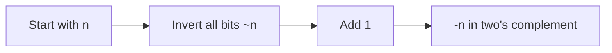

# Two's Complement

> **How computers represent negative numbers.**
>
> Understanding two's complement unlocks negative number handling in bit manipulation.

---

## 🎯 Why Two's Complement?

Computers need a way to represent negative numbers using only 0s and 1s. Two's complement is the standard because:

- **Single representation of zero** (unlike sign-magnitude)
- **Addition works naturally** for both positive and negative
- **Subtraction = addition of negative** (simplifies hardware)
- **Most significant bit is the sign bit** (easy to check)

---

## 📐 How It Works

### For Positive Numbers

Positive numbers are represented normally in binary:

```
+5 in 8-bit:  00000101
+13 in 8-bit: 00001101
```

### For Negative Numbers

To get the two's complement (negative) of a number:



**Step-by-step example: Convert +5 to -5 in 8-bit:**

```
+5:     00000101
Step 1: 11111010  (invert all bits)
Step 2: 11111011  (add 1)
Result: -5 = 11111011
```

### Formula

```
-n = ~n + 1
```

Or equivalently:

```
-n = ~(n - 1)
```

---

## 🔢 8-bit Two's Complement Range

| Binary | Unsigned | Signed (Two's Complement) |
|--------|----------|---------------------------|
| 00000000 | 0 | 0 |
| 00000001 | 1 | +1 |
| 01111111 | 127 | +127 (max positive) |
| 10000000 | 128 | -128 (min negative) |
| 10000001 | 129 | -127 |
| 11111110 | 254 | -2 |
| 11111111 | 255 | -1 |

### Range Formula

For n-bit two's complement:
- **Minimum:** -2^(n-1)
- **Maximum:** 2^(n-1) - 1

| Bits | Min | Max |
|------|-----|-----|
| 8 | -128 | +127 |
| 16 | -32,768 | +32,767 |
| 32 | -2,147,483,648 | +2,147,483,647 |

---

## 💻 Code Examples

### Visualizing Two's Complement

```python
def show_twos_complement(n, bits=8):
    """Show two's complement representation."""
    if n >= 0:
        binary = format(n, f'0{bits}b')
    else:
        # Mask to get the two's complement representation
        binary = format(n & ((1 << bits) - 1), f'0{bits}b')
    
    return binary

# Positive numbers
print(show_twos_complement(5))    # 00000101
print(show_twos_complement(127))  # 01111111

# Negative numbers
print(show_twos_complement(-1))   # 11111111
print(show_twos_complement(-5))   # 11111011
print(show_twos_complement(-128)) # 10000000
```

### Converting to Negative

```python
def negate(n):
    """Negate using two's complement."""
    return ~n + 1

print(negate(5))   # -5
print(negate(-5))  # 5

# This is equivalent to Python's negation:
print(-5)  # -5
```

### JavaScript Two's Complement

```javascript
function showTwosComplement(n, bits = 8) {
    // Use unsigned right shift to get unsigned representation
    const mask = (1 << bits) - 1;
    return (n & mask).toString(2).padStart(bits, '0');
}

console.log(showTwosComplement(5));    // 00000101
console.log(showTwosComplement(-1));   // 11111111
console.log(showTwosComplement(-5));   // 11111011

// JavaScript 32-bit signed integers
console.log((-1) >>> 0);  // 4294967295 (unsigned view)
console.log((1 << 31));   // -2147483648 (sign bit set)
```

---

## 🔄 Two's Complement Operations

### Addition Works Naturally

```
  5 + (-3) = 2

  00000101  (+5)
+ 11111101  (-3)
  --------
1 00000010  (+2, ignore overflow bit)
```

### Subtraction = Addition of Negative

```
  5 - 3 = 5 + (-3) = 2
```

### Sign Detection

```python
# Check if negative (sign bit is 1)
def is_negative(n, bits=32):
    return (n & (1 << (bits - 1))) != 0

# In Python, just check n < 0
# But for bit patterns:
print(is_negative(0b10000000, 8))  # True (this is -128)
print(is_negative(0b01111111, 8))  # False (this is +127)
```

---

## ⚠️ Edge Cases

### The Asymmetry Problem

Two's complement has one more negative number than positive:

```
8-bit: -128 to +127 (not +128!)

-(-128) = ~(-128) + 1
        = ~10000000 + 1
        = 01111111 + 1
        = 10000000  (overflow! still -128)
```

**-128 cannot be negated to +128 in 8 bits!**

```python
# In Python, this isn't a problem (arbitrary precision)
print(-(-128))  # 128

# But in 8-bit systems or when masking:
def negate_8bit(n):
    result = (~n + 1) & 0xFF
    # Convert back to signed interpretation
    if result >= 128:
        result -= 256
    return result

print(negate_8bit(-128))  # -128 (unchanged!)
```

### Python's Infinite Precision

Python integers have arbitrary precision, so negative numbers conceptually have infinite leading 1s:

```python
bin(-1)   # '-0b1' (represents ...11111111)
bin(-5)   # '-0b101' (represents ...11111011)

# To see the actual bit pattern, mask to a width:
print(format(-1 & 0xFF, '08b'))  # 11111111
print(format(-5 & 0xFF, '08b'))  # 11111011
```

---

## 🎯 Practical Applications

### 1. Isolate Rightmost Set Bit

```python
# n & (-n) isolates the rightmost 1 bit
n = 12     # 1100
print(n & (-n))  # 4 (0100)

# Why it works:
#  12 = 00001100
# -12 = 11110100 (two's complement)
# AND = 00000100 = 4
```

### 2. Check if Power of Two

```python
def is_power_of_two(n):
    return n > 0 and (n & (n - 1)) == 0

# Alternative using two's complement:
def is_power_of_two_alt(n):
    return n > 0 and (n & (-n)) == n
```

### 3. Absolute Value with Bits

```python
def abs_bit(n, bits=32):
    """Absolute value using bit manipulation."""
    mask = n >> (bits - 1)  # -1 if negative, 0 if positive
    return (n + mask) ^ mask

print(abs_bit(5))   # 5
print(abs_bit(-5))  # 5
```

---

## 📊 Comparison of Representations

| Representation | +5 | -5 | Zero | Issue |
|----------------|-----|-----|------|-------|
| **Sign-Magnitude** | 0101 | 1101 | +0, -0 | Two zeros |
| **One's Complement** | 0101 | 1010 | +0, -0 | Two zeros |
| **Two's Complement** | 0101 | 1011 | 0000 | Asymmetric range |

Two's complement is used because:
- Only one zero
- Simple addition/subtraction circuits
- Sign bit naturally falls out

---

## 💡 Quick Reference

```python
# Two's complement operations

# Negate
-n  # or: ~n + 1

# Check if negative
n < 0  # or: (n >> 31) & 1 for 32-bit

# Get sign (-1, 0, or 1)
sign = (n > 0) - (n < 0)

# Isolate rightmost 1 bit
rightmost = n & (-n)

# Clear rightmost 1 bit
cleared = n & (n - 1)

# Conditional negation (if flag is True)
def cond_negate(n, flag):
    return (n ^ -flag) + flag
```

---

## 📝 Practice Problems

| Problem | Difficulty | Two's Complement Use |
|---------|------------|---------------------|
| [Sum of Two Integers](https://leetcode.com/problems/sum-of-two-integers/) | Medium | Handle negative addition |
| [Single Number III](https://leetcode.com/problems/single-number-iii/) | Medium | Isolate bit with n & (-n) |
| [Divide Two Integers](https://leetcode.com/problems/divide-two-integers/) | Medium | Handle INT_MIN edge case |

---

> **💡 Key Insight:** Two's complement makes `n & (-n)` isolate the rightmost 1 bit because `-n = ~n + 1` flips all bits then adds 1, creating a "meeting point" at the rightmost 1.

> **🔗 Related:** [Binary Basics ←](./1.1-Binary-Basics.md) | [Bitwise Operators ←](./1.2-Bitwise-Operators.md) | [XOR Properties](../03-XOR-Patterns/3.1-XOR-Properties.md)
