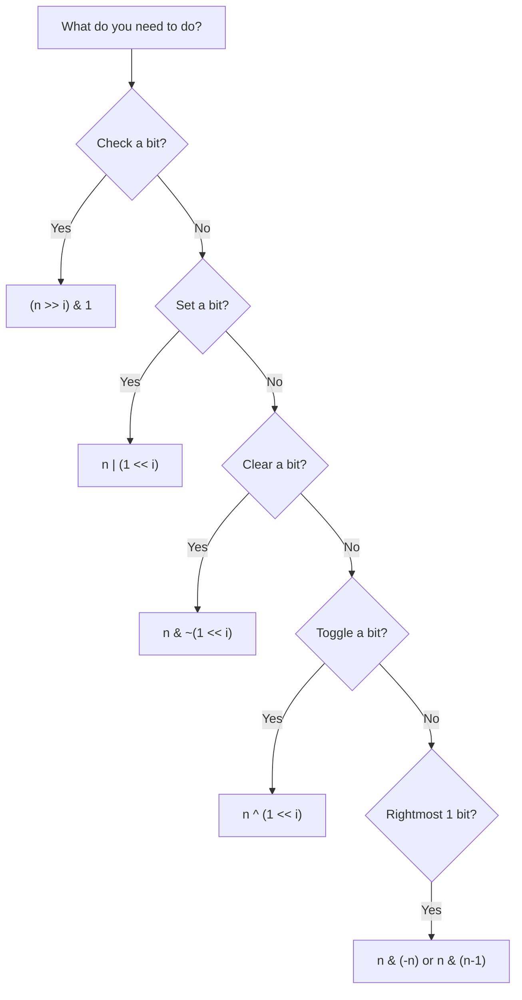

# Essential Bit Tricks

> **The core bit manipulation operations every developer must know.**
>
> These tricks form the building blocks for all bit manipulation problems.

---

## 🎯 Pattern Recognition

<details>
<summary><strong>Which Trick to Use</strong></summary>



</details>

---

## 📐 The Six Essential Operations

### 1. Check if Bit is Set

**Formula:** `(n >> i) & 1` or `(n & (1 << i)) != 0`

```python
def is_bit_set(n: int, i: int) -> bool:
    """Check if bit at position i is set (1)."""
    return (n >> i) & 1 == 1
    # Alternative: return (n & (1 << i)) != 0


# Examples
n = 10  # Binary: 1010
print(is_bit_set(n, 0))  # False (bit 0 is 0)
print(is_bit_set(n, 1))  # True  (bit 1 is 1)
print(is_bit_set(n, 2))  # False (bit 2 is 0)
print(is_bit_set(n, 3))  # True  (bit 3 is 1)
```

```javascript
function isBitSet(n, i) {
    return ((n >> i) & 1) === 1;
}

// Test
const n = 10;  // Binary: 1010
console.log(isBitSet(n, 1));  // true
console.log(isBitSet(n, 2));  // false
```

**How it works:**
```
n = 10 = 1010
Check bit 1:
  n >> 1 = 101
  101 & 1 = 1 ✓ (bit is set)

Check bit 2:
  n >> 2 = 10
  10 & 1 = 0 ✗ (bit is not set)
```

---

### 2. Set a Bit (Turn ON)

**Formula:** `n | (1 << i)`

```python
def set_bit(n: int, i: int) -> int:
    """Set bit at position i to 1."""
    return n | (1 << i)


# Example
n = 10   # Binary: 1010
result = set_bit(n, 2)
print(bin(result))  # 0b1110 = 14

# Setting bit 0:
# 1010 | 0001 = 1011 = 11
```

```javascript
function setBit(n, i) {
    return n | (1 << i);
}

console.log(setBit(10, 2));  // 14 (1110)
```

**How it works:**
```
n = 10 = 1010
Set bit 2:
  1 << 2 = 0100
  1010 | 0100 = 1110 = 14
```

---

### 3. Clear a Bit (Turn OFF)

**Formula:** `n & ~(1 << i)`

```python
def clear_bit(n: int, i: int) -> int:
    """Clear bit at position i (set to 0)."""
    return n & ~(1 << i)


# Example
n = 14   # Binary: 1110
result = clear_bit(n, 2)
print(bin(result))  # 0b1010 = 10
```

```javascript
function clearBit(n, i) {
    return n & ~(1 << i);
}

console.log(clearBit(14, 2));  // 10 (1010)
```

**How it works:**
```
n = 14 = 1110
Clear bit 2:
  1 << 2 = 0100
  ~0100 = 1011 (inverted)
  1110 & 1011 = 1010 = 10
```

---

### 4. Toggle a Bit (Flip)

**Formula:** `n ^ (1 << i)`

```python
def toggle_bit(n: int, i: int) -> int:
    """Toggle bit at position i (0→1 or 1→0)."""
    return n ^ (1 << i)


# Example
n = 10   # Binary: 1010
print(bin(toggle_bit(n, 1)))  # 0b1000 = 8 (1→0)
print(bin(toggle_bit(n, 0)))  # 0b1011 = 11 (0→1)
```

```javascript
function toggleBit(n, i) {
    return n ^ (1 << i);
}

console.log(toggleBit(10, 1));  // 8
console.log(toggleBit(10, 0));  // 11
```

---

### 5. Clear Rightmost Set Bit

**Formula:** `n & (n - 1)`

This is **THE MOST IMPORTANT** bit trick for interviews!

```python
def clear_rightmost_one(n: int) -> int:
    """Clear the rightmost 1 bit."""
    return n & (n - 1)


# Examples
print(bin(clear_rightmost_one(12)))  # 12=1100 → 8=1000
print(bin(clear_rightmost_one(10)))  # 10=1010 → 8=1000
print(bin(clear_rightmost_one(8)))   # 8=1000 → 0=0000
```

```javascript
function clearRightmostOne(n) {
    return n & (n - 1);
}

console.log(clearRightmostOne(12));  // 8
```

**How it works:**
```
n   = 12 = 1100
n-1 = 11 = 1011 (borrows from rightmost 1)
n & (n-1) = 1100 & 1011 = 1000 = 8
```

**Applications:**
- Count set bits (Brian Kernighan's algorithm)
- Check if power of 2: `n & (n-1) == 0`

---

### 6. Isolate Rightmost Set Bit

**Formula:** `n & (-n)`

```python
def isolate_rightmost_one(n: int) -> int:
    """Get the value of the rightmost 1 bit."""
    return n & (-n)


# Examples
print(isolate_rightmost_one(12))  # 12=1100 → 4 (0100)
print(isolate_rightmost_one(10))  # 10=1010 → 2 (0010)
print(isolate_rightmost_one(8))   # 8=1000 → 8 (1000)
```

```javascript
function isolateRightmostOne(n) {
    return n & (-n);
}

console.log(isolateRightmostOne(12));  // 4
```

**How it works:**
```
n  = 12 = 01100
-n = -12 = 10100 (two's complement)
n & (-n) = 01100 & 10100 = 00100 = 4
```

**Applications:**
- Split array by bit (Single Number III)
- Binary Indexed Tree (Fenwick Tree)

---

## 💻 Complete Bit Manipulation Class

**Python:**
```python
class BitManipulation:
    """Comprehensive bit manipulation utilities."""
    
    @staticmethod
    def check_bit(n: int, i: int) -> bool:
        """Check if bit i is set."""
        return (n >> i) & 1 == 1
    
    @staticmethod
    def set_bit(n: int, i: int) -> int:
        """Set bit i to 1."""
        return n | (1 << i)
    
    @staticmethod
    def clear_bit(n: int, i: int) -> int:
        """Clear bit i (set to 0)."""
        return n & ~(1 << i)
    
    @staticmethod
    def toggle_bit(n: int, i: int) -> int:
        """Toggle bit i."""
        return n ^ (1 << i)
    
    @staticmethod
    def clear_rightmost_one(n: int) -> int:
        """Clear rightmost set bit."""
        return n & (n - 1)
    
    @staticmethod
    def isolate_rightmost_one(n: int) -> int:
        """Get rightmost set bit."""
        return n & (-n)
    
    @staticmethod
    def count_set_bits(n: int) -> int:
        """Count number of 1 bits (Brian Kernighan)."""
        count = 0
        while n:
            n &= n - 1
            count += 1
        return count
    
    @staticmethod
    def is_power_of_two(n: int) -> bool:
        """Check if n is a power of 2."""
        return n > 0 and (n & (n - 1)) == 0
    
    @staticmethod
    def get_bit_length(n: int) -> int:
        """Get number of bits needed to represent n."""
        if n == 0:
            return 1
        length = 0
        while n:
            n >>= 1
            length += 1
        return length


# Test
bm = BitManipulation()
print(bm.count_set_bits(7))      # 3
print(bm.is_power_of_two(16))    # True
print(bm.get_bit_length(15))     # 4
```

**JavaScript:**
```javascript
class BitManipulation {
    static checkBit(n, i) {
        return ((n >> i) & 1) === 1;
    }
    
    static setBit(n, i) {
        return n | (1 << i);
    }
    
    static clearBit(n, i) {
        return n & ~(1 << i);
    }
    
    static toggleBit(n, i) {
        return n ^ (1 << i);
    }
    
    static clearRightmostOne(n) {
        return n & (n - 1);
    }
    
    static isolateRightmostOne(n) {
        return n & (-n);
    }
    
    static countSetBits(n) {
        let count = 0;
        while (n) {
            n &= n - 1;
            count++;
        }
        return count;
    }
    
    static isPowerOfTwo(n) {
        return n > 0 && (n & (n - 1)) === 0;
    }
}

// Test
console.log(BitManipulation.countSetBits(7));     // 3
console.log(BitManipulation.isPowerOfTwo(16));    // true
```

---

## ⚡ Quick Reference Table

| Operation | Formula | Example |
|-----------|---------|---------|
| Check bit i | `(n >> i) & 1` | (10 >> 1) & 1 = 1 |
| Set bit i | `n \| (1 << i)` | 10 \| 4 = 14 |
| Clear bit i | `n & ~(1 << i)` | 14 & ~4 = 10 |
| Toggle bit i | `n ^ (1 << i)` | 10 ^ 2 = 8 |
| Clear rightmost 1 | `n & (n-1)` | 12 & 11 = 8 |
| Isolate rightmost 1 | `n & (-n)` | 12 & -12 = 4 |
| Is power of 2? | `n & (n-1) == 0` | 8 & 7 = 0 ✓ |
| Is even? | `(n & 1) == 0` | 10 & 1 = 0 ✓ |

---

## ⚠️ Common Mistakes

### Mistake 1: Wrong Operator Precedence

```python
# ❌ WRONG - bitwise operators have LOW precedence!
if n & 1 == 0:  # Parsed as: n & (1 == 0) = n & False = 0
    print("even")

# ✅ CORRECT - use parentheses
if (n & 1) == 0:
    print("even")
```

### Mistake 2: Confusing n-1 and -n

```python
# Clear rightmost 1: use n-1
n & (n - 1)  # Clears rightmost 1

# Isolate rightmost 1: use -n
n & (-n)     # Isolates rightmost 1

# Don't mix them up!
```

### Mistake 3: Forgetting 0-Indexing

```python
# Bit positions are 0-indexed from the RIGHT
n = 8  # Binary: 1000

# Bit 3 is set (not bit 4!)
is_bit_set(8, 3)  # True
is_bit_set(8, 4)  # False
```

### Mistake 4: Overflow in JavaScript

```javascript
// ❌ JavaScript uses 32-bit signed integers for bitwise ops
const n = 2147483648;  // 2^31
console.log(n >> 0);   // -2147483648 (sign bit issue!)

// ✅ Use unsigned shift for positive results
console.log(n >>> 0);  // 2147483648
```

---

## 📝 Practice Problems

| Problem | Difficulty | Key Trick | Link |
|---------|------------|-----------|------|
| Number of 1 Bits | 🟢 Easy | n & (n-1) | [LC #191](https://leetcode.com/problems/number-of-1-bits/) |
| Power of Two | 🟢 Easy | n & (n-1) == 0 | [LC #231](https://leetcode.com/problems/power-of-two/) |
| Reverse Bits | 🟢 Easy | Check + Set | [LC #190](https://leetcode.com/problems/reverse-bits/) |
| Single Number III | 🟡 Medium | n & (-n) | [LC #260](https://leetcode.com/problems/single-number-iii/) |

---

## 🧠 Spaced Repetition

<details>
<summary><strong>Review Schedule</strong></summary>

**Day 1:** Write all 6 formulas from memory
**Day 3:** Implement BitManipulation class
**Day 7:** Solve Number of 1 Bits
**Day 14:** Explain n & (n-1) vs n & (-n)

</details>

---

## 🎤 Interview Context

<details>
<summary><strong>How to Communicate</strong></summary>

**When asked about bit tricks:**
> "I'll use n & (n-1) to clear the rightmost set bit. This works because n-1 flips all bits from the rightmost 1 to the end."

**Key formulas to memorize:**
1. Check bit: `(n >> i) & 1`
2. Clear rightmost 1: `n & (n-1)`
3. Isolate rightmost 1: `n & (-n)`
4. Power of 2: `n & (n-1) == 0`

</details>

---

## ⏱️ Time Estimates

| Activity | Time |
|----------|------|
| Learn all 6 operations | 30 min |
| Understand n & (n-1) deeply | 15 min |
| Solve practice problems | 30 min |
| Master all tricks | 1-2 hours |

---

> **💡 Key Insight:** The two most important tricks are `n & (n-1)` (clear rightmost 1) and `n & (-n)` (isolate rightmost 1). Master these and you can solve most bit manipulation problems.

> **🔗 Related:** [Counting Bits →](./2.2-Counting-Bits.md) | [Power of Two →](./2.3-Power-Of-Two.md) | [XOR Properties](../03-XOR-Patterns/3.1-XOR-Properties.md)
