# Counting Bits

> **Multiple approaches to count set bits - from basic to Brian Kernighan's algorithm.**
>
> Bit counting is a fundamental operation used in many problems.

---

## 🎯 Pattern Recognition

<details>
<summary><strong>When Bit Counting is Needed</strong></summary>

**Direct problems:**
- "Count number of 1 bits" (Hamming Weight)
- "Count set bits for all numbers 0 to n"
- "Hamming distance between two numbers"

**Indirect applications:**
- Checking if power of 2 (exactly one bit set)
- Determining parity (odd/even count of 1s)
- Population count in bitmasks

</details>

---

## 📐 Approach 1: Basic Loop

**Shift and count each bit.**

```python
def count_bits_basic(n: int) -> int:
    """
    Count set bits by checking each position.
    
    Time: O(32) = O(1) for 32-bit integers
    Space: O(1)
    """
    count = 0
    while n:
        count += n & 1  # Check rightmost bit
        n >>= 1         # Shift right
    return count


# Test
print(count_bits_basic(11))  # 11 = 1011 → 3
print(count_bits_basic(128)) # 128 = 10000000 → 1
```

```javascript
function countBitsBasic(n) {
    let count = 0;
    while (n) {
        count += n & 1;
        n >>>= 1;  // Use unsigned shift
    }
    return count;
}

console.log(countBitsBasic(11));  // 3
```

**Drawback:** Always iterates 32 times for 32-bit numbers, even if only 1 bit is set.

---

## 📐 Approach 2: Brian Kernighan's Algorithm ⭐

**Clear one bit at a time - only loops for number of set bits!**

```mermaid
flowchart LR
    A["n = 12 (1100)"] --> B["n & (n-1)"]
    B --> C["12 & 11 = 8 (1000)"]
    C --> D["count = 1"]
    D --> E["n & (n-1)"]
    E --> F["8 & 7 = 0"]
    F --> G["count = 2 ✓"]
```



**Python:**
```python
def count_bits_kernighan(n: int) -> int:
    """
    Brian Kernighan's Algorithm
    
    n & (n-1) clears the rightmost set bit.
    Count how many times until n becomes 0.
    
    Time: O(number of 1 bits) - optimal!
    Space: O(1)
    """
    count = 0
    while n:
        n &= n - 1  # Clear rightmost 1
        count += 1
    return count


# Test
print(count_bits_kernighan(11))   # 3
print(count_bits_kernighan(128))  # 1 (only 1 iteration!)
print(count_bits_kernighan(255))  # 8
```

**JavaScript:**
```javascript
function countBitsKernighan(n) {
    /**
     * Brian Kernighan's Algorithm
     * Time: O(set bits)
     */
    let count = 0;
    while (n) {
        n &= n - 1;
        count++;
    }
    return count;
}

console.log(countBitsKernighan(11));   // 3
console.log(countBitsKernighan(128));  // 1
```

### Why It's Better

| Number | Binary | Basic (iterations) | Kernighan (iterations) |
|--------|--------|--------------------|-----------------------|
| 128 | 10000000 | 8 | **1** |
| 255 | 11111111 | 8 | 8 |
| 256 | 100000000 | 9 | **1** |

For sparse bit patterns, Kernighan is much faster.

---

## 📐 Approach 3: Built-in Functions

**Use language-provided optimized functions.**

**Python:**
```python
# Method 1: bit_count() - Python 3.10+
n = 11
print(n.bit_count())  # 3

# Method 2: bin() + count()
print(bin(n).count('1'))  # 3

# Method 3: popcount (ctypes, for 32-bit)
import ctypes
def popcount32(n):
    return bin(ctypes.c_uint32(n).value).count('1')
```

**JavaScript:**
```javascript
// No direct built-in, but can use:
function countBitsBuiltin(n) {
    return n.toString(2).split('0').join('').length;
}

// Or more readable:
function countBitsBuiltin2(n) {
    return n.toString(2).replace(/0/g, '').length;
}
```

---

## 📐 LC 191: Number of 1 Bits

> Write a function that returns the number of '1' bits in a 32-bit unsigned integer.

**Python:**
```python
def hammingWeight(n: int) -> int:
    """
    LC 191: Number of 1 Bits (Hamming Weight)
    
    Time: O(1) - at most 32 bits
    Space: O(1)
    """
    count = 0
    while n:
        n &= n - 1
        count += 1
    return count


# Test
print(hammingWeight(11))   # 3 (1011)
print(hammingWeight(128))  # 1 (10000000)
print(hammingWeight(2147483645))  # 30
```

**JavaScript:**
```javascript
function hammingWeight(n) {
    let count = 0;
    while (n) {
        n &= n - 1;
        count++;
    }
    return count;
}

// Alternative using >>> for unsigned
function hammingWeightShift(n) {
    let count = 0;
    while (n) {
        count += n & 1;
        n >>>= 1;
    }
    return count;
}
```

---

## 📐 LC 338: Counting Bits

> Return an array where ans[i] is the number of 1's in the binary representation of i.

### DP Solution Using n & (n-1)

```mermaid
flowchart TD
    A["dp[i] = ?"] --> B["i & (i-1) removes one bit"]
    B --> C["So dp[i] = dp[i & (i-1)] + 1"]
    C --> D["Example: dp[12] = dp[12 & 11] + 1"]
    D --> E["= dp[8] + 1 = 1 + 1 = 2 ✓"]
```



**Python:**
```python
def countBits(n: int) -> list[int]:
    """
    LC 338: Counting Bits
    
    DP relation: dp[i] = dp[i & (i-1)] + 1
    Because i & (i-1) is i with one less 1-bit.
    
    Time: O(n)
    Space: O(n) for result
    """
    dp = [0] * (n + 1)
    
    for i in range(1, n + 1):
        dp[i] = dp[i & (i - 1)] + 1
    
    return dp


# Test
print(countBits(5))   # [0, 1, 1, 2, 1, 2]
print(countBits(2))   # [0, 1, 1]
```

**JavaScript:**
```javascript
function countBits(n) {
    const dp = new Array(n + 1).fill(0);
    
    for (let i = 1; i <= n; i++) {
        dp[i] = dp[i & (i - 1)] + 1;
    }
    
    return dp;
}

console.log(countBits(5));  // [0, 1, 1, 2, 1, 2]
```

### Alternative DP: Using Right Shift

```python
def countBits_shift(n: int) -> list[int]:
    """
    DP relation: dp[i] = dp[i >> 1] + (i & 1)
    
    Because i >> 1 is i with last bit removed.
    Add 1 if last bit was 1.
    """
    dp = [0] * (n + 1)
    
    for i in range(1, n + 1):
        dp[i] = dp[i >> 1] + (i & 1)
    
    return dp


# Trace for i = 5 (101):
# dp[5] = dp[5 >> 1] + (5 & 1)
#       = dp[2] + 1
#       = 1 + 1 = 2 ✓
```

### Comparison of DP Approaches

| Approach | Formula | Intuition |
|----------|---------|-----------|
| n & (n-1) | `dp[i] = dp[i & (i-1)] + 1` | Remove one bit, add 1 |
| Right shift | `dp[i] = dp[i >> 1] + (i & 1)` | Remove last bit, add if it was 1 |

Both are O(n) time and O(n) space.

---

## 📐 Counting Bits in a Range

```python
def count_bits_in_range(left: int, right: int) -> int:
    """Count total 1 bits in all numbers from left to right."""
    total = 0
    for num in range(left, right + 1):
        count = 0
        n = num
        while n:
            n &= n - 1
            count += 1
        total += count
    return total


# More efficient: precompute with countBits
def count_bits_in_range_dp(left: int, right: int) -> int:
    dp = [0] * (right + 1)
    for i in range(1, right + 1):
        dp[i] = dp[i & (i - 1)] + 1
    return sum(dp[left:right + 1])
```

---

## ⚡ Complexity Comparison

| Method | Time | Space | Best For |
|--------|------|-------|----------|
| Basic loop | O(32) | O(1) | Simple, always works |
| Kernighan | O(set bits) | O(1) | Sparse numbers |
| Built-in | O(1)* | O(1) | Production code |
| DP (countBits) | O(n) | O(n) | Range of numbers |

*Built-in may use lookup tables or CPU instructions.

---

## ⚠️ Common Mistakes

### Mistake 1: Infinite Loop with Negative Numbers

```python
# ❌ WRONG - negative numbers have infinite 1s in Python
def wrong(n):
    count = 0
    while n:
        count += n & 1
        n >>= 1  # Sign bit is preserved!
    return count  # Infinite loop for n < 0

# ✅ CORRECT - handle as unsigned
def correct(n):
    if n < 0:
        n = n & 0xFFFFFFFF  # Mask to 32 bits
    count = 0
    while n:
        n &= n - 1
        count += 1
    return count
```

### Mistake 2: Wrong DP Base Case

```python
# ❌ WRONG - forgot dp[0] = 0
dp = [0] * (n + 1)
for i in range(n + 1):  # Starting from 0, which is already 0
    dp[i] = dp[i >> 1] + (i & 1)
# This causes issues because dp[0 >> 1] = dp[0] is used

# ✅ CORRECT - start from 1
for i in range(1, n + 1):
    dp[i] = dp[i >> 1] + (i & 1)
```

---

## 📝 Practice Problems

| Problem | Difficulty | Pattern | Link |
|---------|------------|---------|------|
| Number of 1 Bits | 🟢 Easy | Kernighan | [LC #191](https://leetcode.com/problems/number-of-1-bits/) |
| Counting Bits | 🟢 Easy | DP | [LC #338](https://leetcode.com/problems/counting-bits/) |
| Hamming Distance | 🟢 Easy | XOR + count | [LC #461](https://leetcode.com/problems/hamming-distance/) |
| Total Hamming Distance | 🟡 Medium | Bit position count | [LC #477](https://leetcode.com/problems/total-hamming-distance/) |

---

## 🧠 Spaced Repetition

<details>
<summary><strong>Review Schedule</strong></summary>

**Day 1:** Implement Kernighan from memory
**Day 3:** Solve Counting Bits with both DP methods
**Day 7:** Explain why Kernighan is O(set bits)
**Day 14:** Implement all three approaches

</details>

---

## 🎤 Interview Context

<details>
<summary><strong>How to Communicate</strong></summary>

**When asked for bit counting:**
> "I'll use Brian Kernighan's algorithm. n & (n-1) clears the rightmost set bit, so I count how many clears it takes to reach zero. This is O(number of set bits) which is optimal for sparse numbers."

**For Counting Bits (range):**
> "I'll use DP. Since i & (i-1) has exactly one less set bit than i, dp[i] = dp[i & (i-1)] + 1."

</details>

---

## ⏱️ Time Estimates

| Activity | Time |
|----------|------|
| Learn basic approach | 5 min |
| Understand Kernighan | 10 min |
| Solve LC 191 | 5 min |
| Solve LC 338 | 10 min |
| Master both DPs | 20 min |

---

> **💡 Key Insight:** `n & (n-1)` is the Swiss army knife of bit counting. It's used in Kernighan's algorithm, the DP for counting bits, and checking for power of 2.

> **🔗 Related:** [Essential Tricks ←](./2.1-Essential-Tricks.md) | [Power of Two →](./2.3-Power-Of-Two.md)
