# Power of Two & Power of Four

> **Using bit patterns to detect powers of 2 and 4.**
>
> Powers of 2 have a unique binary pattern that makes detection trivial with bit manipulation.

---

## 🎯 Pattern Recognition

<details>
<summary><strong>When to Use This Pattern</strong></summary>

**Direct problems:**
- "Is n a power of 2?"
- "Is n a power of 4?"
- "Find next/previous power of 2"

**Indirect applications:**
- Optimizing algorithms (power of 2 sizes)
- Memory alignment checks
- Binary tree level calculations

</details>

---

## 📐 Power of Two: The Key Insight

**A power of 2 has exactly ONE bit set.**

```
1 = 0001 ✓ (2^0)
2 = 0010 ✓ (2^1)
4 = 0100 ✓ (2^2)
8 = 1000 ✓ (2^3)

3 = 0011 ✗ (two bits set)
5 = 0101 ✗ (two bits set)
6 = 0110 ✗ (two bits set)
```

### The n & (n-1) Trick

```mermaid
flowchart LR
    A["n = 8 (1000)"] --> B["n - 1 = 7 (0111)"]
    B --> C["n & (n-1) = 0"]
    C --> D["Zero → Power of 2! ✓"]
    
    E["n = 6 (0110)"] --> F["n - 1 = 5 (0101)"]
    F --> G["n & (n-1) = 4"]
    G --> H["Not zero → Not power of 2"]
```



**Why it works:**
- For power of 2: only one bit is set
- n-1 flips that bit and all bits to the right become 1
- AND produces 0 because no bits overlap

---

## 💻 LC 231: Power of Two

**Python:**
```python
def isPowerOfTwo(n: int) -> bool:
    """
    LC 231: Power of Two
    
    Power of 2 has exactly one bit set.
    n & (n-1) clears that bit → result is 0.
    
    Time: O(1)
    Space: O(1)
    """
    return n > 0 and (n & (n - 1)) == 0


# Alternative: check if only one bit set
def isPowerOfTwo_count(n: int) -> bool:
    if n <= 0:
        return False
    count = 0
    while n:
        count += n & 1
        n >>= 1
    return count == 1


# Test
print(isPowerOfTwo(1))    # True (2^0)
print(isPowerOfTwo(16))   # True (2^4)
print(isPowerOfTwo(3))    # False
print(isPowerOfTwo(0))    # False
print(isPowerOfTwo(-16))  # False
```

**JavaScript:**
```javascript
function isPowerOfTwo(n) {
    /**
     * LC 231: Power of Two
     * Time: O(1), Space: O(1)
     */
    return n > 0 && (n & (n - 1)) === 0;
}

// Test
console.log(isPowerOfTwo(1));   // true
console.log(isPowerOfTwo(16));  // true
console.log(isPowerOfTwo(3));   // false
```

### Edge Cases

| Input | Expected | Reasoning |
|-------|----------|-----------|
| 0 | false | 0 is not 2^k for any k |
| 1 | true | 1 = 2^0 |
| -16 | false | Negative numbers are not powers of 2 |
| 2^31 | true | Largest power of 2 in 32-bit signed |

---

## 📐 Power of Four: Additional Constraint

**Power of 4 = Power of 2 at EVEN bit positions (0, 2, 4, 6...)**

```
1  = 0001 (bit 0) ✓ 4^0
4  = 0100 (bit 2) ✓ 4^1
16 = 10000 (bit 4) ✓ 4^2
64 = 1000000 (bit 6) ✓ 4^3

2  = 0010 (bit 1) ✗ Power of 2, not 4
8  = 1000 (bit 3) ✗ Power of 2, not 4
32 = 100000 (bit 5) ✗ Power of 2, not 4
```

### The Magic Mask: 0x55555555

```
0x55555555 = 01010101010101010101010101010101 (binary)
            = bits set at positions 0, 2, 4, 6, 8... (even positions)
```

**Power of 4 check:**
1. Must be > 0
2. Must be power of 2: `n & (n-1) == 0`
3. The single bit must be at even position: `n & 0x55555555 != 0`

---

## 💻 LC 342: Power of Four

**Python:**
```python
def isPowerOfFour(n: int) -> bool:
    """
    LC 342: Power of Four
    
    Must satisfy:
    1. n > 0
    2. Power of 2: n & (n-1) == 0
    3. Bit at even position: n & 0x55555555 != 0
    
    Time: O(1)
    Space: O(1)
    """
    return (n > 0 and 
            (n & (n - 1)) == 0 and 
            (n & 0x55555555) != 0)


# Alternative: using math
def isPowerOfFour_math(n: int) -> bool:
    import math
    if n <= 0:
        return False
    log = math.log2(n)
    return log == int(log) and int(log) % 2 == 0


# Alternative: power of 2 and mod 3
def isPowerOfFour_mod(n: int) -> bool:
    """
    Observation: 4^k ≡ 1 (mod 3) for all k ≥ 0
    But 2^(2k+1) ≡ 2 (mod 3)
    So power of 4 = power of 2 AND n % 3 == 1
    """
    return n > 0 and (n & (n - 1)) == 0 and n % 3 == 1


# Test
print(isPowerOfFour(16))  # True (4^2)
print(isPowerOfFour(5))   # False
print(isPowerOfFour(1))   # True (4^0)
print(isPowerOfFour(8))   # False (power of 2, not 4)
```

**JavaScript:**
```javascript
function isPowerOfFour(n) {
    /**
     * LC 342: Power of Four
     * Time: O(1), Space: O(1)
     */
    return n > 0 && 
           (n & (n - 1)) === 0 && 
           (n & 0x55555555) !== 0;
}

// Alternative with mod 3
function isPowerOfFourMod(n) {
    return n > 0 && (n & (n - 1)) === 0 && n % 3 === 1;
}

// Test
console.log(isPowerOfFour(16));  // true
console.log(isPowerOfFour(8));   // false
```

### Why 0x55555555?

```
Position:  31 30 29 28 ... 7 6 5 4 3 2 1 0
0x555...=   0  1  0  1 ... 0 1 0 1 0 1 0 1
                            ↑   ↑   ↑   ↑
                            Powers of 4 are here (even positions)

1  = bit 0 → AND with mask → non-zero ✓
4  = bit 2 → AND with mask → non-zero ✓
2  = bit 1 → AND with mask → ZERO ✗
8  = bit 3 → AND with mask → ZERO ✗
```

---

## 📐 Related Problems

### Next Power of Two

```python
def next_power_of_two(n: int) -> int:
    """Find smallest power of 2 >= n."""
    if n <= 0:
        return 1
    if (n & (n - 1)) == 0:
        return n  # Already power of 2
    
    # Set all bits after the highest set bit, then add 1
    n -= 1
    n |= n >> 1
    n |= n >> 2
    n |= n >> 4
    n |= n >> 8
    n |= n >> 16
    return n + 1


# Test
print(next_power_of_two(5))   # 8
print(next_power_of_two(17))  # 32
print(next_power_of_two(16))  # 16
```

### Previous Power of Two

```python
def prev_power_of_two(n: int) -> int:
    """Find largest power of 2 <= n."""
    if n <= 0:
        return 0
    
    # Get highest set bit
    n |= n >> 1
    n |= n >> 2
    n |= n >> 4
    n |= n >> 8
    n |= n >> 16
    return (n + 1) >> 1


# Test
print(prev_power_of_two(5))   # 4
print(prev_power_of_two(17))  # 16
print(prev_power_of_two(16))  # 16
```

### Count Powers of Two in Range

```python
def count_powers_in_range(left: int, right: int) -> int:
    """Count powers of 2 in [left, right]."""
    count = 0
    power = 1
    while power <= right:
        if power >= left:
            count += 1
        power *= 2
    return count


# Test
print(count_powers_in_range(1, 16))   # 5 (1, 2, 4, 8, 16)
print(count_powers_in_range(3, 100))  # 5 (4, 8, 16, 32, 64)
```

---

## 📊 Comparison Table

| Check | Formula | Examples |
|-------|---------|----------|
| Power of 2 | `n > 0 && n & (n-1) == 0` | 1, 2, 4, 8, 16 |
| Power of 4 | Above + `n & 0x55555555 != 0` | 1, 4, 16, 64 |
| Power of 4 (alt) | Above + `n % 3 == 1` | 1, 4, 16, 64 |
| Power of 8 | Power of 2 + bit at 0,3,6,9... | 1, 8, 64, 512 |

---

## ⚠️ Common Mistakes

### Mistake 1: Forgetting n > 0 Check

```python
# ❌ WRONG - 0 passes the bit check!
def wrong(n):
    return (n & (n - 1)) == 0
# wrong(0) returns True!

# ✅ CORRECT
def correct(n):
    return n > 0 and (n & (n - 1)) == 0
```

### Mistake 2: Using Wrong Mask for Power of 4

```python
# ❌ WRONG - this is 0xAAAAAAAA (odd positions)
mask = 0xAAAAAAAA  # 10101010...

# ✅ CORRECT - 0x55555555 (even positions)
mask = 0x55555555  # 01010101...
```

### Mistake 3: Overflow in Next Power of Two

```python
# ❌ WRONG - can overflow for large n
def wrong(n):
    power = 1
    while power < n:
        power *= 2
    return power  # Infinite loop if n > 2^31

# ✅ CORRECT - use bit manipulation with bounds
def correct(n):
    if n > 2**30:
        return 2**31 if n <= 2**31 else None
    # ... bit manipulation approach
```

---

## 📝 Practice Problems

| Problem | Difficulty | Key Trick | Link |
|---------|------------|-----------|------|
| Power of Two | 🟢 Easy | n & (n-1) | [LC #231](https://leetcode.com/problems/power-of-two/) |
| Power of Four | 🟢 Easy | Mask 0x55555555 | [LC #342](https://leetcode.com/problems/power-of-four/) |
| Power of Three | 🟢 Easy | Math/loop | [LC #326](https://leetcode.com/problems/power-of-three/) |

---

## 🧠 Spaced Repetition

<details>
<summary><strong>Review Schedule</strong></summary>

**Day 1:** Memorize power of 2 formula
**Day 3:** Explain why n & (n-1) works
**Day 7:** Implement power of 4 with mask
**Day 14:** Explain the 0x55555555 pattern

</details>

---

## 🎤 Interview Context

<details>
<summary><strong>How to Communicate</strong></summary>

**For Power of Two:**
> "A power of 2 has exactly one bit set. When we do n & (n-1), we clear that single bit, resulting in 0. So I check n > 0 and n & (n-1) == 0."

**For Power of Four:**
> "First I check if it's a power of 2. Then I verify the single set bit is at an even position using the mask 0x55555555, which has bits set at positions 0, 2, 4, etc."

**Follow-up: Why not use loops?**
> "The bit manipulation approach is O(1) constant time, while a loop would be O(log n). For a single check, both are fast, but bit manipulation is more elegant and shows understanding of binary representation."

</details>

---

## ⏱️ Time Estimates

| Activity | Time |
|----------|------|
| Learn power of 2 check | 10 min |
| Understand the mask trick | 10 min |
| Solve LC 231 | 5 min |
| Solve LC 342 | 10 min |

---

> **💡 Key Insight:** Powers of 2 have exactly one bit set. The formula `n & (n-1) == 0` leverages this by clearing that single bit. For powers of 4, add a position check with 0x55555555.

> **🔗 Related:** [Essential Tricks ←](./2.1-Essential-Tricks.md) | [Counting Bits ←](./2.2-Counting-Bits.md) | [Subset Generation →](../04-Bitmask-Patterns/4.1-Subset-Generation.md)
