# XOR Properties

> **The foundation of bit manipulation problem solving.**
>
> XOR (exclusive or) is the most powerful bitwise operator for interviews.
> Understanding its properties unlocks solutions to many "impossible" problems.

---

## 🎯 Pattern Recognition

<details>
<summary><strong>How to Identify XOR Problems</strong></summary>

**Look for these signals:**
- "Find the unique/single element"
- "All elements appear twice except one"
- "Find missing number in sequence"
- "Swap without temporary variable"
- "Toggle or flip bits"

**Keywords in problem statement:**
- "appears once", "appears twice", "odd one out"
- "missing number", "find duplicate"
- "without extra space", "O(1) space"

</details>

---

## 📐 The Four Core XOR Properties

### Property 1: Self-Cancellation

```
a ^ a = 0
```

**Any number XOR with itself equals zero.**

```python
# Example
5 ^ 5 = 0
# Binary: 0101 ^ 0101 = 0000

# This is WHY Single Number works!
# [4, 1, 2, 1, 2] → 4^1^2^1^2 = 4^(1^1)^(2^2) = 4^0^0 = 4
```

---

### Property 2: Identity

```
a ^ 0 = a
```

**Any number XOR with zero equals itself.**

```python
# Example
5 ^ 0 = 5
# Binary: 0101 ^ 0000 = 0101

# Useful for initializing XOR accumulator
result = 0
for num in nums:
    result ^= num  # Works because result starts at 0
```

---

### Property 3: Commutative

```
a ^ b = b ^ a
```

**Order doesn't matter.**

```python
# Example
5 ^ 3 = 3 ^ 5 = 6
# Binary: 0101 ^ 0011 = 0011 ^ 0101 = 0110

# This means we can XOR elements in ANY order
# [1, 2, 3] → 1^2^3 = 3^1^2 = 2^3^1 = same result
```

---

### Property 4: Associative

```
(a ^ b) ^ c = a ^ (b ^ c)
```

**Grouping doesn't matter.**

```python
# Example
(5 ^ 3) ^ 7 = 5 ^ (3 ^ 7) = 1
# (0101 ^ 0011) ^ 0111 = 0101 ^ (0011 ^ 0111)
# 0110 ^ 0111 = 0101 ^ 0100
# 0001 = 0001 ✓

# Combined with commutative, we can rearrange freely:
# a ^ b ^ a = a ^ a ^ b = 0 ^ b = b
```

---

## 🔄 How XOR Works Bit-by-Bit

```mermaid
flowchart LR
    subgraph "XOR Truth Table"
        A["0 ^ 0 = 0"]
        B["0 ^ 1 = 1"]
        C["1 ^ 0 = 1"]
        D["1 ^ 1 = 0"]
    end
    
    subgraph "Rule"
        E["Same bits → 0"]
        F["Different bits → 1"]
    end
    
    A --> E
    D --> E
    B --> F
    C --> F
```



**Mental Model:** XOR returns 1 only when bits are DIFFERENT.

---

## 💻 Code Implementation

### Python: XOR Basics

```python
def xor_demo():
    """Demonstrate XOR properties."""
    
    # Property 1: Self-cancellation
    assert 5 ^ 5 == 0
    assert 42 ^ 42 == 0
    
    # Property 2: Identity
    assert 5 ^ 0 == 5
    assert 0 ^ 42 == 42
    
    # Property 3: Commutative
    assert 5 ^ 3 == 3 ^ 5
    
    # Property 4: Associative
    assert (5 ^ 3) ^ 7 == 5 ^ (3 ^ 7)
    
    # Combined: pairs cancel out
    assert 1 ^ 2 ^ 1 == 2  # 1s cancel
    assert 5 ^ 3 ^ 5 ^ 3 == 0  # All pairs cancel
    
    print("All XOR properties verified! ✓")


def find_unique(nums: list[int]) -> int:
    """
    Find the element that appears only once.
    All other elements appear exactly twice.
    
    Time: O(n)
    Space: O(1)
    """
    result = 0
    for num in nums:
        result ^= num
    return result


# Test
print(find_unique([4, 1, 2, 1, 2]))  # 4
print(find_unique([2, 2, 1]))        # 1
```

### JavaScript: XOR Basics

```javascript
function xorDemo() {
    // Property 1: Self-cancellation
    console.log(5 ^ 5);  // 0
    
    // Property 2: Identity
    console.log(5 ^ 0);  // 5
    
    // Property 3: Commutative
    console.log(5 ^ 3 === 3 ^ 5);  // true
    
    // Property 4: Associative
    console.log((5 ^ 3) ^ 7 === 5 ^ (3 ^ 7));  // true
}

function findUnique(nums) {
    /**
     * Find the element that appears only once.
     * Time: O(n), Space: O(1)
     */
    return nums.reduce((acc, num) => acc ^ num, 0);
}

// Test
console.log(findUnique([4, 1, 2, 1, 2]));  // 4
console.log(findUnique([2, 2, 1]));        // 1
```

---

## ⚡ Complexity Analysis

| Operation | Time | Space | Notes |
|-----------|------|-------|-------|
| Single XOR | O(1) | O(1) | Constant time CPU operation |
| XOR n numbers | O(n) | O(1) | Linear scan, no extra space |
| Find unique | O(n) | O(1) | **This is why XOR is powerful!** |

**Why O(1) space matters:**
- Hash set approach: O(n) space
- Sorting approach: O(n log n) time or O(n) space
- XOR approach: O(n) time, O(1) space ← **Optimal!**

---

## ✅ When to Use XOR

- Finding unique/single elements among duplicates
- Missing number in a sequence
- Detecting differences between two values
- Swapping values without temp variable
- Toggling bits at specific positions

## ❌ When NOT to Use XOR

| Scenario | Why Not | Alternative |
|----------|---------|-------------|
| Elements appear 3+ times | XOR doesn't cancel properly | Bit counting / Hash map |
| Need to find multiple uniques | More complex handling needed | XOR + bit separation |
| Need to preserve original values | XOR modifies in-place | Copy first |
| Floating point numbers | Bit representation issues | Math operations |

---

## 🔗 Concept Map

<details>
<summary><strong>Prerequisites & Next Steps</strong></summary>

**Before this, you should know:**
- [Binary Basics](../01-Fundamentals/1.1-Binary-Basics.md)
- [Bitwise Operators](../01-Fundamentals/1.2-Bitwise-Operators.md)

**After mastering this:**
- [Single Number Variants](./3.2-Single-Number-Variants.md) - Apply XOR to real problems
- [XOR Applications](./3.3-XOR-Applications.md) - Advanced uses

**Combines with:**
- Array traversal for finding unique elements
- Bit manipulation for isolating differences

</details>

---

## ⚠️ Common Mistakes

### Mistake 1: Forgetting XOR Only Works for Pairs

```python
# ❌ WRONG - This doesn't work when elements appear 3 times!
def find_unique_wrong(nums):  # [1, 1, 1, 2, 2, 2, 3]
    result = 0
    for num in nums:
        result ^= num
    return result  # Returns 1^2^3 = 0, NOT 3!

# ✅ For elements appearing 3 times, use bit counting
def find_unique_mod3(nums):
    result = 0
    for i in range(32):
        bit_sum = sum((num >> i) & 1 for num in nums)
        if bit_sum % 3:
            result |= (1 << i)
    return result
```

### Mistake 2: Not Initializing to Zero

```python
# ❌ WRONG - result is undefined
result = nums[0]
for num in nums[1:]:
    result ^= num
# This skips nums[0] in the XOR!

# ✅ CORRECT - always start with 0
result = 0
for num in nums:
    result ^= num
```

### Mistake 3: XOR Order Confusion in Swaps

```python
# ❌ WRONG - self XOR when a and b reference same location
a = b = 5
a ^= b  # a = 0
b ^= a  # b = 0
a ^= b  # a = 0... both are now 0!

# ✅ CORRECT - only use when a and b are different variables
a, b = 5, 3
a ^= b  # a = 6
b ^= a  # b = 5
a ^= b  # a = 3
# Now a=3, b=5 (swapped!)
```

---

## 📝 Practice Problems

| Problem | Difficulty | Pattern | Link |
|---------|------------|---------|------|
| Single Number | 🟢 Easy | XOR all | [LeetCode #136](https://leetcode.com/problems/single-number/) |
| Missing Number | 🟢 Easy | XOR with indices | [LeetCode #268](https://leetcode.com/problems/missing-number/) |
| Single Number III | 🟡 Medium | XOR + split | [LeetCode #260](https://leetcode.com/problems/single-number-iii/) |

---

## 🧠 Spaced Repetition

<details>
<summary><strong>Review Schedule</strong></summary>

**Day 1:** Write XOR properties from memory
**Day 3:** Solve Single Number without looking
**Day 7:** Explain why XOR works for duplicates
**Day 14:** Solve Missing Number
**Day 30:** Teach XOR properties to someone

</details>

---

## 🎤 Interview Context

<details>
<summary><strong>How to Communicate in Interviews</strong></summary>

**Opening statement:**
> "I notice all elements appear twice except one. This is a classic XOR pattern - since a ^ a = 0, all pairs will cancel out, leaving only the unique element."

**When explaining your approach:**
1. State the XOR property you're using
2. Show a small example (3-4 numbers)
3. Explain why it's O(1) space

**What interviewers evaluate:**
- ✅ Knowing XOR properties by heart
- ✅ Recognizing when XOR applies
- ✅ Clean implementation
- ✅ Correct complexity analysis

</details>

---

## ⏱️ Time Estimates

| Activity | Time |
|----------|------|
| Learn XOR properties | 15 min |
| Understand Self-Cancellation | 10 min |
| Solve Single Number | 5 min |
| Master all 4 properties | 30 min |

---

> **💡 Key Insight:** XOR is the "cancellation operator" - pairs disappear, leaving only the unique elements. This O(1) space trick is interview gold.

> **🔗 Related:** [Single Number Variants →](./3.2-Single-Number-Variants.md) | [Bit Tricks](../02-Bit-Tricks/2.1-Essential-Tricks.md)
