# Single Number Variants

> **The most common XOR interview problems - master all three.**
>
> Single Number I, II, and III are classic interview questions that test your understanding of bit manipulation.

---

## 🎯 Pattern Recognition

<details>
<summary><strong>How to Identify Single Number Problems</strong></summary>

**Look for these signals:**
- "All elements appear K times except one"
- "Find the element that appears only once"
- "O(1) extra space required"
- "Linear time complexity"

**Variant Detection:**
| Condition | Variant | Approach |
|-----------|---------|----------|
| Others appear **twice** | Single Number I | Simple XOR |
| Others appear **three times** | Single Number II | Bit counting mod 3 |
| **Two** unique elements | Single Number III | XOR + bit separation |

</details>

---

## 📐 Single Number I (LC 136)

> Every element appears **twice** except one. Find the unique element.

### Why XOR Works

```mermaid
flowchart LR
    A["[4, 1, 2, 1, 2]"] --> B["4 ^ 1 ^ 2 ^ 1 ^ 2"]
    B --> C["4 ^ (1^1) ^ (2^2)"]
    C --> D["4 ^ 0 ^ 0"]
    D --> E["4 ✓"]
```



### Implementation

**Python:**
```python
def singleNumber(nums: list[int]) -> int:
    """
    LC 136: Single Number
    
    All elements appear twice except one.
    XOR all elements - pairs cancel, unique remains.
    
    Time: O(n)
    Space: O(1)
    """
    result = 0
    for num in nums:
        result ^= num
    return result


# One-liner version
def singleNumber_oneliner(nums: list[int]) -> int:
    from functools import reduce
    return reduce(lambda a, b: a ^ b, nums)


# Test cases
print(singleNumber([2, 2, 1]))           # 1
print(singleNumber([4, 1, 2, 1, 2]))     # 4
print(singleNumber([1]))                  # 1
```

**JavaScript:**
```javascript
function singleNumber(nums) {
    /**
     * LC 136: Single Number
     * Time: O(n), Space: O(1)
     */
    return nums.reduce((acc, num) => acc ^ num, 0);
}

// Explicit loop version
function singleNumberLoop(nums) {
    let result = 0;
    for (const num of nums) {
        result ^= num;
    }
    return result;
}

// Test
console.log(singleNumber([2, 2, 1]));        // 1
console.log(singleNumber([4, 1, 2, 1, 2]));  // 4
```

---

## 📐 Single Number II (LC 137)

> Every element appears **three times** except one. Find the unique element.

### Why Simple XOR Fails

```python
# XOR doesn't work for triples!
# a ^ a ^ a = a (not 0!)
# [2, 2, 2, 3] → 2 ^ 2 ^ 2 ^ 3 = 2 ^ 3 = 1 ❌ (should be 3)
```

### Solution: Bit Counting Mod 3

**Key Insight:** For each bit position, count how many numbers have that bit set. If the count % 3 != 0, that bit belongs to the unique number.


**Python:**
```python
def singleNumber2(nums: list[int]) -> int:
    """
    LC 137: Single Number II
    
    All elements appear 3 times except one.
    Count bits at each position, mod 3 reveals unique.
    
    Time: O(32n) = O(n)
    Space: O(1)
    """
    result = 0
    
    for i in range(32):
        # Count how many numbers have bit i set
        bit_sum = 0
        for num in nums:
            bit_sum += (num >> i) & 1
        
        # If count % 3 != 0, unique number has this bit
        if bit_sum % 3:
            result |= (1 << i)
    
    # Handle negative numbers in Python (arbitrary precision)
    if result >= 2**31:
        result -= 2**32
    
    return result


# Alternative: State Machine Approach (more efficient)
def singleNumber2_state(nums: list[int]) -> int:
    """
    State machine: track counts mod 3 using two variables.
    
    ones: bits that have appeared 1 mod 3 times
    twos: bits that have appeared 2 mod 3 times
    """
    ones = twos = 0
    
    for num in nums:
        # ones keeps bits appearing once, unless they're in twos
        ones = (ones ^ num) & ~twos
        # twos keeps bits appearing twice, unless they're in ones
        twos = (twos ^ num) & ~ones
    
    return ones


# Test
print(singleNumber2([2, 2, 3, 2]))      # 3
print(singleNumber2([0, 1, 0, 1, 0, 1, 99]))  # 99
```

**JavaScript:**
```javascript
function singleNumber2(nums) {
    /**
     * LC 137: Single Number II
     * Bit counting approach.
     * Time: O(n), Space: O(1)
     */
    let result = 0;
    
    for (let i = 0; i < 32; i++) {
        let bitSum = 0;
        for (const num of nums) {
            bitSum += (num >> i) & 1;
        }
        if (bitSum % 3) {
            result |= (1 << i);
        }
    }
    
    // Handle sign bit for 32-bit integers
    return result | 0;  // Convert to signed 32-bit
}

// State machine approach
function singleNumber2State(nums) {
    let ones = 0, twos = 0;
    
    for (const num of nums) {
        ones = (ones ^ num) & ~twos;
        twos = (twos ^ num) & ~ones;
    }
    
    return ones;
}

// Test
console.log(singleNumber2([2, 2, 3, 2]));  // 3
```

### Detailed Trace: Bit Counting

```
nums = [2, 2, 3, 2]
Binary: 2 = 10, 3 = 11

Bit position 0 (rightmost):
  2 has bit 0? No (0)
  2 has bit 0? No (0)
  3 has bit 0? Yes (1)
  2 has bit 0? No (0)
  Sum = 1, 1 % 3 = 1 → Set bit 0 in result

Bit position 1:
  2 has bit 1? Yes (1)
  2 has bit 1? Yes (1)
  3 has bit 1? Yes (1)
  2 has bit 1? Yes (1)
  Sum = 4, 4 % 3 = 1 → Set bit 1 in result

Result = bit1 + bit0 = 10 + 01 = 11 = 3 ✓
```

---

## 📐 Single Number III (LC 260)

> **Two** elements appear once, all others appear twice. Find both.

### The Challenge

Simple XOR gives `a ^ b`, but we need `a` and `b` separately.

### Solution: Split by Differing Bit

**Key Insight:** `a ^ b` tells us which bits are DIFFERENT between a and b. Use the rightmost differing bit to split the array into two groups.

```mermaid
flowchart TD
    A["nums = [1, 2, 1, 3, 2, 5]"] --> B["XOR all: 1^2^1^3^2^5 = 3^5 = 6 (110)"]
    B --> C["Find rightmost set bit: 6 & -6 = 2 (010)"]
    C --> D["Split into two groups"]
    D --> E["Group 1: bit set<br/>2, 2, 3 → XOR = 3"]
    D --> F["Group 2: bit not set<br/>1, 1, 5 → XOR = 5"]
    E --> G["Result: [3, 5]"]
    F --> G
```



**Python:**
```python
def singleNumber3(nums: list[int]) -> list[int]:
    """
    LC 260: Single Number III
    
    Two elements appear once, others twice.
    
    Approach:
    1. XOR all → get a ^ b
    2. Find rightmost differing bit
    3. Split array by that bit
    4. XOR each group separately
    
    Time: O(n)
    Space: O(1)
    """
    # Step 1: XOR all to get a ^ b
    xor_all = 0
    for num in nums:
        xor_all ^= num
    
    # Step 2: Find rightmost set bit (where a and b differ)
    # n & (-n) isolates the rightmost 1 bit
    diff_bit = xor_all & (-xor_all)
    
    # Step 3 & 4: Split and XOR each group
    a = b = 0
    for num in nums:
        if num & diff_bit:
            a ^= num  # Group where this bit is set
        else:
            b ^= num  # Group where this bit is not set
    
    return [a, b]


# Test
print(singleNumber3([1, 2, 1, 3, 2, 5]))  # [3, 5] or [5, 3]
print(singleNumber3([-1, 0]))              # [-1, 0] or [0, -1]
print(singleNumber3([0, 1]))               # [0, 1] or [1, 0]
```

**JavaScript:**
```javascript
function singleNumber3(nums) {
    /**
     * LC 260: Single Number III
     * Time: O(n), Space: O(1)
     */
    // Step 1: XOR all to get a ^ b
    let xorAll = 0;
    for (const num of nums) {
        xorAll ^= num;
    }
    
    // Step 2: Find rightmost set bit
    // Use >>> 0 to handle potential overflow
    const diffBit = xorAll & (-xorAll);
    
    // Step 3 & 4: Split and XOR
    let a = 0, b = 0;
    for (const num of nums) {
        if (num & diffBit) {
            a ^= num;
        } else {
            b ^= num;
        }
    }
    
    return [a, b];
}

// Test
console.log(singleNumber3([1, 2, 1, 3, 2, 5]));  // [3, 5]
```

### Why the Split Works

```
a = 3 = 011
b = 5 = 101
a ^ b = 110 (rightmost bit where they differ is position 1)

diff_bit = 010 (isolate bit 1)

Split by bit 1:
  - Bit 1 SET: 2(10), 2(10), 3(11) → pairs cancel → 3
  - Bit 1 NOT SET: 1(01), 1(01), 5(101) → pairs cancel → 5
```

---

## ⚡ Complexity Summary

| Problem | Time | Space | Approach |
|---------|------|-------|----------|
| Single Number I | O(n) | O(1) | XOR all |
| Single Number II | O(n) | O(1) | Bit count mod 3 |
| Single Number III | O(n) | O(1) | XOR + split by bit |

---

## 🔄 Comparison Table

| Aspect | I | II | III |
|--------|---|----|----|
| Others appear | 2 times | 3 times | 2 times |
| Unique elements | 1 | 1 | 2 |
| Core technique | XOR all | Bit count mod K | XOR + split |
| Difficulty | 🟢 Easy | 🟡 Medium | 🟡 Medium |

---

## ⚠️ Common Mistakes

### Mistake 1: Using XOR for Triple Appearances

```python
# ❌ WRONG
def wrong(nums):  # [2, 2, 2, 3]
    result = 0
    for num in nums:
        result ^= num
    return result  # Returns 1, not 3!

# ✅ CORRECT - use bit counting
```

### Mistake 2: Forgetting Negative Number Handling

```python
# ❌ WRONG - Python integers can be arbitrarily large
def wrong(nums):
    result = 0
    for i in range(32):
        bit_sum = sum((num >> i) & 1 for num in nums)
        if bit_sum % 3:
            result |= (1 << i)
    return result  # Wrong for negative numbers!

# ✅ CORRECT - handle sign bit
if result >= 2**31:
    result -= 2**32
```

### Mistake 3: Wrong Bit Isolation in III

```python
# ❌ WRONG - using wrong formula
diff_bit = xor_all & (xor_all - 1)  # This CLEARS rightmost bit!

# ✅ CORRECT - use n & (-n) to ISOLATE rightmost bit
diff_bit = xor_all & (-xor_all)
```

---

## 📝 Practice Problems

| Problem | Difficulty | Link |
|---------|------------|------|
| Single Number | 🟢 Easy | [LeetCode #136](https://leetcode.com/problems/single-number/) |
| Single Number II | 🟡 Medium | [LeetCode #137](https://leetcode.com/problems/single-number-ii/) |
| Single Number III | 🟡 Medium | [LeetCode #260](https://leetcode.com/problems/single-number-iii/) |

---

## 🧠 Spaced Repetition

<details>
<summary><strong>Review Schedule</strong></summary>

**Day 1:** Solve all three from memory
**Day 3:** Focus on Single Number II (hardest)
**Day 7:** Explain the split technique in III
**Day 14:** Do all three in 15 minutes total

</details>

---

## 🎤 Interview Context

<details>
<summary><strong>How to Communicate</strong></summary>

**For Single Number I:**
> "Since pairs cancel with XOR, I'll XOR all elements. The unique one remains."

**For Single Number II:**
> "XOR doesn't work for triples, so I'll count bits at each position. If count mod 3 isn't zero, that bit belongs to the unique number."

**For Single Number III:**
> "First I'll XOR all to get a^b. Then I'll find a bit where they differ and split the array into two groups. Each group now has one unique element."

**Company Frequency:**
| Company | Frequency |
|---------|-----------|
| Amazon | ⭐⭐⭐⭐ |
| Google | ⭐⭐⭐ |
| Meta | ⭐⭐⭐ |
| Microsoft | ⭐⭐⭐ |

</details>

---

## ⏱️ Time Estimates

| Activity | Time |
|----------|------|
| Learn Single Number I | 10 min |
| Learn Single Number II | 25 min |
| Learn Single Number III | 20 min |
| Solve all three | 20 min |
| Master pattern | 1-2 hours |

---

> **💡 Key Insight:** The Single Number series teaches three levels of bit manipulation: simple XOR (I), bit counting (II), and XOR with splitting (III). Master all three for complete interview readiness.

> **🔗 Related:** [XOR Properties ←](./3.1-XOR-Properties.md) | [XOR Applications →](./3.3-XOR-Applications.md)
