# XOR Applications

> **Beyond Single Number: practical XOR applications for interviews.**
>
> XOR solves several common problems with O(1) space elegance.

---

## 🎯 Pattern Recognition

<details>
<summary><strong>When to Apply XOR</strong></summary>

**XOR is perfect for:**
- Finding missing numbers in sequences
- Detecting differences between values
- Swapping without temporary variables
- Hamming distance calculations
- Finding duplicate elements

</details>

---

## 📐 Application 1: Missing Number (LC 268)

> Given array containing n distinct numbers from 0 to n, find the missing one.

### The XOR Solution

**Key Insight:** XOR expected numbers (0 to n) with actual numbers. Pairs cancel, missing number remains.

```mermaid
flowchart LR
    A["nums = [3, 0, 1]<br/>n = 3"] --> B["Expected: 0,1,2,3"]
    B --> C["XOR: 0^1^2^3 ^ 3^0^1"]
    C --> D["= (0^0)^(1^1)^(3^3)^2"]
    D --> E["= 0^0^0^2 = 2 ✓"]
```



**Python:**
```python
def missingNumber(nums: list[int]) -> int:
    """
    LC 268: Missing Number
    
    XOR all indices (0 to n) with all elements.
    Missing number = remaining value.
    
    Time: O(n)
    Space: O(1)
    """
    n = len(nums)
    result = n  # Start with n (the missing candidate at end)
    
    for i, num in enumerate(nums):
        result ^= i ^ num
    
    return result


# Alternative: XOR in two passes (clearer)
def missingNumber_twoPasses(nums: list[int]) -> int:
    n = len(nums)
    
    # XOR all expected values: 0 ^ 1 ^ 2 ^ ... ^ n
    expected = 0
    for i in range(n + 1):
        expected ^= i
    
    # XOR all actual values
    actual = 0
    for num in nums:
        actual ^= num
    
    # Missing = expected ^ actual
    return expected ^ actual


# Test
print(missingNumber([3, 0, 1]))      # 2
print(missingNumber([0, 1]))         # 2
print(missingNumber([9,6,4,2,3,5,7,0,1]))  # 8
```

**JavaScript:**
```javascript
function missingNumber(nums) {
    /**
     * LC 268: Missing Number
     * Time: O(n), Space: O(1)
     */
    let result = nums.length;
    
    for (let i = 0; i < nums.length; i++) {
        result ^= i ^ nums[i];
    }
    
    return result;
}

// Test
console.log(missingNumber([3, 0, 1]));  // 2
console.log(missingNumber([0, 1]));     // 2
```

### Why This Works

```
nums = [3, 0, 1], n = 3
Expected indices: 0, 1, 2, 3
Actual values: 3, 0, 1

result = 3 (start with n)
i=0: result ^= 0 ^ 3 = 3 ^ 0 ^ 3 = 0
i=1: result ^= 1 ^ 0 = 0 ^ 1 ^ 0 = 1
i=2: result ^= 2 ^ 1 = 1 ^ 2 ^ 1 = 2

Result = 2 ✓
```

---

## 📐 Application 2: Swap Without Temp Variable

> Swap two variables without using extra space.

**Python:**
```python
def swap_xor(a: int, b: int) -> tuple[int, int]:
    """
    Swap two integers using XOR.
    
    How it works:
    a ^= b → a now holds a^b
    b ^= a → b = b ^ (a^b) = a
    a ^= b → a = (a^b) ^ a = b
    """
    a ^= b
    b ^= a
    a ^= b
    return a, b


# Test
a, b = 5, 3
print(f"Before: a={a}, b={b}")
a, b = swap_xor(a, b)
print(f"After: a={a}, b={b}")
# Before: a=5, b=3
# After: a=3, b=5
```

**JavaScript:**
```javascript
function swapXor(a, b) {
    /**
     * Swap using XOR (for demonstration).
     * Note: In practice, use [a, b] = [b, a]
     */
    a ^= b;
    b ^= a;
    a ^= b;
    return [a, b];
}

let a = 5, b = 3;
[a, b] = swapXor(a, b);
console.log(a, b);  // 3, 5
```

### ⚠️ Warning: The Self-XOR Trap

```python
# ❌ DANGEROUS - fails when a and b reference same memory!
arr = [1, 2, 3]
i, j = 0, 0  # Both point to same index!

# This zeros out arr[0]!
arr[i] ^= arr[j]  # arr[0] = arr[0] ^ arr[0] = 0
arr[j] ^= arr[i]  # arr[0] = 0 ^ 0 = 0
arr[i] ^= arr[j]  # arr[0] = 0 ^ 0 = 0

# ✅ SAFE - always check i != j first
if i != j:
    arr[i] ^= arr[j]
    arr[j] ^= arr[i]
    arr[i] ^= arr[j]
```

---

## 📐 Application 3: Hamming Distance (LC 461)

> Count positions where corresponding bits differ between two integers.


**Python:**
```python
def hammingDistance(x: int, y: int) -> int:
    """
    LC 461: Hamming Distance
    
    XOR gives 1s where bits differ.
    Count those 1s.
    
    Time: O(1) - at most 32 iterations
    Space: O(1)
    """
    xor = x ^ y
    count = 0
    
    while xor:
        count += xor & 1
        xor >>= 1
    
    return count


# Using Brian Kernighan's algorithm
def hammingDistance_bk(x: int, y: int) -> int:
    xor = x ^ y
    count = 0
    
    while xor:
        xor &= xor - 1  # Clear rightmost 1
        count += 1
    
    return count


# One-liner (Python 3.10+)
def hammingDistance_builtin(x: int, y: int) -> int:
    return (x ^ y).bit_count()


# Test
print(hammingDistance(1, 4))  # 2
print(hammingDistance(3, 1))  # 1
```

**JavaScript:**
```javascript
function hammingDistance(x, y) {
    /**
     * LC 461: Hamming Distance
     * Time: O(1), Space: O(1)
     */
    let xor = x ^ y;
    let count = 0;
    
    while (xor) {
        count += xor & 1;
        xor >>>= 1;  // Use unsigned shift
    }
    
    return count;
}

// Brian Kernighan's approach
function hammingDistanceBK(x, y) {
    let xor = x ^ y;
    let count = 0;
    
    while (xor) {
        xor &= xor - 1;
        count++;
    }
    
    return count;
}

// Test
console.log(hammingDistance(1, 4));  // 2
```

---

## 📐 Application 4: Total Hamming Distance (LC 477)

> Sum of Hamming distances between ALL pairs in array.

### Brute Force vs Optimal

```python
# ❌ Brute force: O(n²)
def totalHammingDistance_brute(nums):
    total = 0
    for i in range(len(nums)):
        for j in range(i + 1, len(nums)):
            total += hammingDistance(nums[i], nums[j])
    return total
```

### Optimal: Count at Each Bit Position

**Key Insight:** For each bit position, if `c` numbers have that bit set and `(n-c)` don't, the contribution to total distance is `c * (n-c)`.

```mermaid
flowchart TD
    A["nums = [4, 14, 2]"] --> B["For each bit 0-31"]
    B --> C["Count how many have bit set"]
    C --> D["Contribution = ones × zeros"]
    D --> E["Sum all contributions"]
    E --> F["Total = 6"]
```



**Python:**
```python
def totalHammingDistance(nums: list[int]) -> int:
    """
    LC 477: Total Hamming Distance
    
    For each bit position:
    - Count numbers with bit set (ones)
    - zeros = n - ones
    - Contribution = ones * zeros
    
    Time: O(32n) = O(n)
    Space: O(1)
    """
    n = len(nums)
    total = 0
    
    for bit in range(32):
        ones = sum((num >> bit) & 1 for num in nums)
        zeros = n - ones
        total += ones * zeros
    
    return total


# Test
print(totalHammingDistance([4, 14, 2]))  # 6
# Pairs: (4,14)=2, (4,2)=2, (14,2)=2 → total=6
```

**JavaScript:**
```javascript
function totalHammingDistance(nums) {
    /**
     * LC 477: Total Hamming Distance
     * Time: O(n), Space: O(1)
     */
    const n = nums.length;
    let total = 0;
    
    for (let bit = 0; bit < 32; bit++) {
        let ones = 0;
        for (const num of nums) {
            ones += (num >> bit) & 1;
        }
        total += ones * (n - ones);
    }
    
    return total;
}

// Test
console.log(totalHammingDistance([4, 14, 2]));  // 6
```

---

## 📐 Application 5: Find the Duplicate Number

> Array has n+1 integers in range [1, n], one duplicate. Find it.

### XOR Approach (when exactly one duplicate)

```python
def findDuplicate_xor(nums: list[int]) -> int:
    """
    Find duplicate using XOR.
    
    Works when there's exactly ONE extra duplicate.
    XOR all values with all expected (1 to n).
    
    Note: This only works for specific constraint.
    For general case, use Floyd's cycle detection.
    """
    n = len(nums) - 1
    result = 0
    
    # XOR all expected values 1 to n
    for i in range(1, n + 1):
        result ^= i
    
    # XOR all actual values
    for num in nums:
        result ^= num
    
    return result


# Test (only works when duplicate appears exactly twice)
# For LC 287, use Floyd's algorithm instead
```

---

## 📐 Application 6: Bitwise AND of Range (LC 201)

> Find bitwise AND of all numbers in range [m, n].

### Key Insight: Find Common Prefix

**Why?** AND operation: if ANY number has 0 at a position, result is 0. Only common prefix bits survive.

```python
def rangeBitwiseAnd(left: int, right: int) -> int:
    """
    LC 201: Bitwise AND of Numbers Range
    
    Find common prefix of left and right.
    All varying bits become 0 in the AND.
    
    Time: O(log n)
    Space: O(1)
    """
    shift = 0
    
    # Shift until left == right (common prefix found)
    while left < right:
        left >>= 1
        right >>= 1
        shift += 1
    
    # Shift back to restore prefix
    return left << shift


# Test
print(rangeBitwiseAnd(5, 7))    # 4 (100)
print(rangeBitwiseAnd(0, 0))    # 0
print(rangeBitwiseAnd(1, 2147483647))  # 0
```

**JavaScript:**
```javascript
function rangeBitwiseAnd(left, right) {
    /**
     * LC 201: Bitwise AND of Numbers Range
     * Time: O(log n), Space: O(1)
     */
    let shift = 0;
    
    while (left < right) {
        left >>= 1;
        right >>= 1;
        shift++;
    }
    
    return left << shift;
}

// Test
console.log(rangeBitwiseAnd(5, 7));  // 4
```

---

## ⚡ Complexity Summary

| Application | Time | Space |
|-------------|------|-------|
| Missing Number | O(n) | O(1) |
| Swap Variables | O(1) | O(1) |
| Hamming Distance | O(1) | O(1) |
| Total Hamming Distance | O(n) | O(1) |
| Range Bitwise AND | O(log n) | O(1) |

---

## ⚠️ Common Mistakes

### Mistake 1: Wrong Initialization for Missing Number

```python
# ❌ WRONG - starts at 0, misses case when 0 is missing
result = 0
for i, num in enumerate(nums):
    result ^= i ^ num
# If n=3, we never XOR with 3!

# ✅ CORRECT - start with n
result = len(nums)  # This is n
for i, num in enumerate(nums):
    result ^= i ^ num
```

### Mistake 2: Not Handling Self-XOR in Swap

```python
# ❌ WRONG - i and j might be same
def swap_wrong(arr, i, j):
    arr[i] ^= arr[j]
    arr[j] ^= arr[i]
    arr[i] ^= arr[j]

# ✅ CORRECT - check first
def swap_safe(arr, i, j):
    if i != j:
        arr[i] ^= arr[j]
        arr[j] ^= arr[i]
        arr[i] ^= arr[j]
```

---

## 📝 Practice Problems

| Problem | Difficulty | Pattern | Link |
|---------|------------|---------|------|
| Missing Number | 🟢 Easy | XOR indices | [LC #268](https://leetcode.com/problems/missing-number/) |
| Hamming Distance | 🟢 Easy | XOR + count | [LC #461](https://leetcode.com/problems/hamming-distance/) |
| Total Hamming Distance | 🟡 Medium | Bit counting | [LC #477](https://leetcode.com/problems/total-hamming-distance/) |
| Bitwise AND of Range | 🟡 Medium | Common prefix | [LC #201](https://leetcode.com/problems/bitwise-and-of-numbers-range/) |

---

## 🧠 Spaced Repetition

<details>
<summary><strong>Review Schedule</strong></summary>

**Day 1:** Solve Missing Number
**Day 3:** Implement Hamming Distance
**Day 7:** Total Hamming Distance optimization
**Day 14:** Bitwise AND of Range

</details>

---

## ⏱️ Time Estimates

| Activity | Time |
|----------|------|
| Missing Number | 10 min |
| Hamming Distance | 10 min |
| Total Hamming Distance | 15 min |
| Range Bitwise AND | 15 min |

---

> **💡 Key Insight:** XOR with expected values reveals missing/extra elements. This pattern extends to many "find the difference" problems.

> **🔗 Related:** [XOR Properties ←](./3.1-XOR-Properties.md) | [Single Number Variants ←](./3.2-Single-Number-Variants.md) | [Essential Tricks →](../02-Bit-Tricks/2.1-Essential-Tricks.md)
