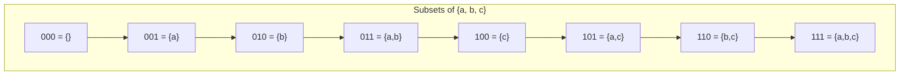

# Subset Generation with Bitmasks

> **Generate all 2^n subsets of a set using bit manipulation.**
>
> A fundamental technique that appears in many interview problems.

---

## 🎯 Pattern Recognition

**Use bitmask subset generation when:**

- Generate all subsets/combinations of a set
- Problem says "all possible combinations"
- Small constraint: n ≤ 20 (since 2^20 ≈ 1 million)
- Need to enumerate states or configurations

**Keywords:** "all subsets", "power set", "combinations", "configurations"

---

## 📐 How It Works

Each subset of n elements can be represented by an n-bit number where:
- **Bit i = 1** means include element i
- **Bit i = 0** means exclude element i



### Visual Representation

```
Elements: [a, b, c]
Index:     0  1  2

Mask  Binary  Elements Selected
0     000     {} (empty)
1     001     {a}
2     010     {b}
3     011     {a, b}
4     100     {c}
5     101     {a, c}
6     110     {b, c}
7     111     {a, b, c}

Total: 2^3 = 8 subsets
```

---

## 💻 Code Implementation

### Basic Subset Generation

```python
def generate_subsets(arr):
    """
    Generate all 2^n subsets using bitmask.
    
    Time: O(n × 2^n) - iterate 2^n masks, O(n) per mask
    Space: O(n) - for current subset (O(n × 2^n) for all output)
    """
    n = len(arr)
    result = []
    
    # Iterate through all 2^n possible masks
    for mask in range(1 << n):  # 0 to 2^n - 1
        subset = []
        for i in range(n):
            # Check if bit i is set in mask
            if mask & (1 << i):
                subset.append(arr[i])
        result.append(subset)
    
    return result

# Example
print(generate_subsets(['a', 'b', 'c']))
# [[], ['a'], ['b'], ['a', 'b'], ['c'], ['a', 'c'], ['b', 'c'], ['a', 'b', 'c']]
```

```javascript
function generateSubsets(arr) {
    const n = arr.length;
    const result = [];
    
    for (let mask = 0; mask < (1 << n); mask++) {
        const subset = [];
        for (let i = 0; i < n; i++) {
            if (mask & (1 << i)) {
                subset.push(arr[i]);
            }
        }
        result.push(subset);
    }
    
    return result;
}

console.log(generateSubsets(['a', 'b', 'c']));
```

### Generator Version (Memory Efficient)

```python
def subset_generator(arr):
    """
    Generator that yields subsets one at a time.
    Memory efficient for large outputs.
    """
    n = len(arr)
    for mask in range(1 << n):
        yield [arr[i] for i in range(n) if mask & (1 << i)]

# Use in a loop
for subset in subset_generator([1, 2, 3]):
    print(subset)
```

---

## 🎯 LeetCode 78: Subsets

```python
def subsets(nums):
    """
    Given distinct integers, return all subsets.
    https://leetcode.com/problems/subsets/
    """
    n = len(nums)
    result = []
    
    for mask in range(1 << n):
        subset = []
        for i in range(n):
            if mask & (1 << i):
                subset.append(nums[i])
        result.append(subset)
    
    return result

# Example
print(subsets([1, 2, 3]))
# [[], [1], [2], [1,2], [3], [1,3], [2,3], [1,2,3]]
```

---

## 🔄 Handling Duplicates (LeetCode 90: Subsets II)

When the input contains duplicates, we need extra logic:

```python
def subsets_with_dup(nums):
    """
    Return all subsets, avoiding duplicates.
    https://leetcode.com/problems/subsets-ii/
    
    Approach: Sort first, then skip duplicate subsets.
    """
    nums.sort()  # Sort to group duplicates
    n = len(nums)
    result = []
    seen = set()
    
    for mask in range(1 << n):
        subset = tuple(nums[i] for i in range(n) if mask & (1 << i))
        if subset not in seen:
            seen.add(subset)
            result.append(list(subset))
    
    return result

# Alternative: Use sorted tuple as key
def subsets_with_dup_v2(nums):
    """More memory-efficient for small n."""
    nums.sort()
    n = len(nums)
    seen = set()
    result = []
    
    for mask in range(1 << n):
        subset = []
        for i in range(n):
            if mask & (1 << i):
                subset.append(nums[i])
        
        key = tuple(subset)
        if key not in seen:
            seen.add(key)
            result.append(subset)
    
    return result

print(subsets_with_dup([1, 2, 2]))
# [[], [1], [2], [1, 2], [2, 2], [1, 2, 2]]
```

---

## 🔧 Useful Subset Operations

### Iterate Over Submasks of a Mask

```python
def iterate_submasks(mask):
    """
    Iterate through all submasks of a given mask.
    
    Example: mask = 5 (101)
    Submasks: 5 (101), 4 (100), 1 (001), 0 (000)
    """
    submask = mask
    while submask:
        yield submask
        submask = (submask - 1) & mask
    yield 0  # Empty submask

# Example
print(list(iterate_submasks(5)))  # [5, 4, 1, 0]
print(list(iterate_submasks(7)))  # [7, 6, 5, 4, 3, 2, 1, 0]
```

### Count Subsets with Given Properties

```python
def count_subsets_with_sum(arr, target):
    """
    Count subsets that sum to target.
    """
    n = len(arr)
    count = 0
    
    for mask in range(1 << n):
        subset_sum = sum(arr[i] for i in range(n) if mask & (1 << i))
        if subset_sum == target:
            count += 1
    
    return count

print(count_subsets_with_sum([1, 2, 3, 4], 5))  # 2: {2,3}, {1,4}
```

### Subsets of Specific Size

```python
def subsets_of_size(arr, k):
    """
    Generate all subsets of exactly size k.
    This is equivalent to C(n, k) combinations.
    """
    n = len(arr)
    result = []
    
    for mask in range(1 << n):
        # Count set bits (popcount)
        if bin(mask).count('1') == k:
            subset = [arr[i] for i in range(n) if mask & (1 << i)]
            result.append(subset)
    
    return result

print(subsets_of_size([1, 2, 3, 4], 2))
# [[1, 2], [1, 3], [2, 3], [1, 4], [2, 4], [3, 4]]
```

---

## ⚡ Complexity Analysis

| Operation | Time | Space |
|-----------|------|-------|
| Generate all subsets | O(n × 2^n) | O(n × 2^n) |
| Check if element in subset | O(1) | O(1) |
| Union of two subsets | O(1) | O(1) |
| Intersection of subsets | O(1) | O(1) |
| Iterate submasks of mask | O(3^n) total | O(1) |

**Why O(n × 2^n)?**
- 2^n subsets to enumerate
- O(n) to build each subset

---

## 🔄 Bitmask Operations for Subsets

```python
# Set operations using bitmasks

a = 0b1010  # {1, 3}
b = 0b1100  # {2, 3}

# Union (elements in A OR B)
union = a | b  # 0b1110 = {1, 2, 3}

# Intersection (elements in A AND B)
intersect = a & b  # 0b1000 = {3}

# Difference (elements in A but not B)
diff = a & ~b  # 0b0010 = {1}

# Symmetric difference (in A or B but not both)
sym_diff = a ^ b  # 0b0110 = {1, 2}

# Complement (not in A)
complement = ~a & 0xF  # Mask to 4 bits = {0, 2}

# Check if B is subset of A
is_subset = (b & a) == b  # False for this example

# Check if A and B are disjoint
is_disjoint = (a & b) == 0  # False
```

---

## ⚠️ Common Mistakes

### 1. Forgetting Constraint Limit

```python
# ❌ WRONG - n=30 would create 2^30 ≈ 1 billion iterations!
def subsets_wrong(arr):
    n = len(arr)  # What if n = 30?
    for mask in range(1 << n):  # TOO SLOW!
        ...

# ✅ CORRECT - Check constraint first
def subsets_safe(arr):
    n = len(arr)
    if n > 20:  # 2^20 ≈ 1 million is reasonable limit
        raise ValueError("Input too large for bitmask approach")
    ...
```

### 2. Wrong Bit Check

```python
# ❌ WRONG - Checking if mask contains i
if mask & i:  # Wrong! This ANDs mask with value i

# ✅ CORRECT - Check if bit i is set
if mask & (1 << i):  # Right! Creates bit at position i
```

### 3. Overflow in JavaScript

```javascript
// ❌ WRONG - JavaScript bitwise ops are 32-bit
const n = 35;
const total = 1 << n;  // Overflows!

// ✅ CORRECT - Use BigInt for large n
const total = BigInt(1) << BigInt(n);
```

---

## 📝 Practice Problems

| Problem | Difficulty | Key Insight |
|---------|------------|-------------|
| [Subsets](https://leetcode.com/problems/subsets/) | Medium | Basic bitmask |
| [Subsets II](https://leetcode.com/problems/subsets-ii/) | Medium | Handle duplicates |
| [Maximum Product of Word Lengths](https://leetcode.com/problems/maximum-product-of-word-lengths/) | Medium | Char masks for comparison |
| [Partition to K Equal Sum Subsets](https://leetcode.com/problems/partition-to-k-equal-sum-subsets/) | Medium | Bitmask + backtracking |

---

## 🎤 Interview Communication

When explaining the bitmask approach:

> "Since we need all subsets and n is small (n ≤ 20), I'll use bitmasks. Each number from 0 to 2^n - 1 represents a subset where bit i indicates whether element i is included."

> "The time complexity is O(n × 2^n) - we have 2^n subsets and spend O(n) building each one."

> "For set operations like union and intersection, bitmasks give O(1) performance."

---

> **💡 Key Insight:** A bitmask naturally represents a subset - bit i being 1 means element i is included. This gives O(1) set operations (union = OR, intersection = AND).

> **🔗 Related:** [State Compression →](./4.2-State-Compression.md) | [Bitmask DP →](./4.3-Bitmask-DP.md) | [Subsets Pattern](../../02-Recursion-Backtracking/02-Backtracking/2.3-Core-Patterns/01-Subsets-Pattern.md)
