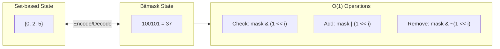

# State Compression with Bitmasks

> **Represent complex states in a single integer for efficient manipulation.**
>
> Essential for visited states, feature flags, and dynamic programming.

---

## 🎯 Pattern Recognition

**Use state compression when:**

- Tracking visited/used elements (up to ~20-25 elements)
- Representing yes/no states for multiple features
- Need O(1) state comparison and hashing
- Setting up for bitmask DP

**Keywords:** "visited", "used", "selected", "state", "subset", "configuration"

---

## 📐 How It Works

Instead of using a set or array to track state, encode everything in a single integer:

```
Traditional: visited = {0, 2, 5}  # Set of visited nodes
Compressed:  visited = 0b100101   # Bits 0, 2, 5 are set = 37
```



---

## 💻 State Operations

### Basic State Management

```python
class StateMask:
    """
    Utility class for bitmask state operations.
    """
    
    @staticmethod
    def is_set(state, i):
        """Check if element i is in state."""
        return (state & (1 << i)) != 0
    
    @staticmethod
    def add(state, i):
        """Add element i to state."""
        return state | (1 << i)
    
    @staticmethod
    def remove(state, i):
        """Remove element i from state."""
        return state & ~(1 << i)
    
    @staticmethod
    def toggle(state, i):
        """Toggle element i in state."""
        return state ^ (1 << i)
    
    @staticmethod
    def count(state):
        """Count elements in state."""
        return bin(state).count('1')
    
    @staticmethod
    def to_set(state, n):
        """Convert state to set of indices."""
        return {i for i in range(n) if state & (1 << i)}
    
    @staticmethod
    def from_set(indices):
        """Convert set of indices to state."""
        state = 0
        for i in indices:
            state |= (1 << i)
        return state

# Example usage
state = 0
state = StateMask.add(state, 0)      # 0b001
state = StateMask.add(state, 2)      # 0b101
print(StateMask.is_set(state, 1))    # False
print(StateMask.to_set(state, 5))    # {0, 2}
```

```javascript
const StateMask = {
    isSet: (state, i) => (state & (1 << i)) !== 0,
    add: (state, i) => state | (1 << i),
    remove: (state, i) => state & ~(1 << i),
    toggle: (state, i) => state ^ (1 << i),
    count: (state) => state.toString(2).split('1').length - 1,
    toSet: (state, n) => {
        const result = [];
        for (let i = 0; i < n; i++) {
            if (state & (1 << i)) result.push(i);
        }
        return result;
    },
    fromSet: (indices) => indices.reduce((s, i) => s | (1 << i), 0)
};

let state = 0;
state = StateMask.add(state, 0);     // 1
state = StateMask.add(state, 2);     // 5
console.log(StateMask.isSet(state, 1)); // false
console.log(StateMask.toSet(state, 5)); // [0, 2]
```

---

## 🔧 Common Applications

### 1. Visited Tracking in BFS/DFS

```python
def can_visit_all_rooms(rooms):
    """
    LeetCode 841: Keys and Rooms
    Check if we can visit all rooms starting from room 0.
    """
    n = len(rooms)
    all_visited = (1 << n) - 1  # All bits set = all rooms visited
    
    visited = 0
    stack = [0]  # Start from room 0
    
    while stack:
        room = stack.pop()
        
        if visited & (1 << room):
            continue  # Already visited
        
        visited |= (1 << room)  # Mark as visited
        
        for key in rooms[room]:
            if not (visited & (1 << key)):
                stack.append(key)
    
    return visited == all_visited

# Example
print(can_visit_all_rooms([[1], [2], [3], []]))  # True
print(can_visit_all_rooms([[1, 3], [3, 0, 1], [2], [0]]))  # False
```

### 2. Character Set Comparison

```python
def max_product_word_lengths(words):
    """
    LeetCode 318: Maximum Product of Word Lengths
    Find max product of lengths of two words with no common letters.
    """
    n = len(words)
    
    # Encode each word as a bitmask (a=0, b=1, ..., z=25)
    masks = []
    for word in words:
        mask = 0
        for char in word:
            mask |= (1 << (ord(char) - ord('a')))
        masks.append(mask)
    
    max_product = 0
    for i in range(n):
        for j in range(i + 1, n):
            # No common letters if AND is 0
            if masks[i] & masks[j] == 0:
                max_product = max(max_product, len(words[i]) * len(words[j]))
    
    return max_product

print(max_product_word_lengths(["abc", "def", "abcd"]))  # 9 (3 * 3)
```

### 3. Feature Flags / Permissions

```python
# Permission system using bitmasks
class Permissions:
    NONE    = 0b0000
    READ    = 0b0001
    WRITE   = 0b0010
    EXECUTE = 0b0100
    ADMIN   = 0b1000
    ALL     = 0b1111
    
    @staticmethod
    def has_permission(user_perms, required):
        return (user_perms & required) == required
    
    @staticmethod
    def grant(user_perms, new_perm):
        return user_perms | new_perm
    
    @staticmethod
    def revoke(user_perms, perm):
        return user_perms & ~perm

# Example
user = Permissions.READ | Permissions.WRITE  # 0b0011
print(Permissions.has_permission(user, Permissions.READ))   # True
print(Permissions.has_permission(user, Permissions.ADMIN))  # False

user = Permissions.grant(user, Permissions.EXECUTE)  # 0b0111
user = Permissions.revoke(user, Permissions.WRITE)   # 0b0101
```

---

## 📊 Comparison: Set vs Bitmask

| Operation | Set | Bitmask |
|-----------|-----|---------|
| Check membership | O(1) avg | O(1) |
| Add element | O(1) avg | O(1) |
| Remove element | O(1) avg | O(1) |
| Union | O(n) | O(1) |
| Intersection | O(min(n,m)) | O(1) |
| Hash/Compare | O(n) | O(1) |
| Space | O(n) | O(1) |
| Max elements | Unlimited | ~60 (64-bit) |

**Use bitmask when:**
- n ≤ 20-25 elements
- Need O(1) set operations
- Using as DP state key

**Use set when:**
- n > 60 elements
- Elements aren't 0 to n-1
- Memory not critical

---

## 🔄 State Transitions

### Enumerate All Transitions

```python
def enumerate_transitions(state, n):
    """
    For each position, show state if we add/remove it.
    Useful for BFS/DFS state exploration.
    """
    for i in range(n):
        if state & (1 << i):
            # Can remove
            new_state = state & ~(1 << i)
            print(f"Remove {i}: {bin(state)} → {bin(new_state)}")
        else:
            # Can add
            new_state = state | (1 << i)
            print(f"Add {i}: {bin(state)} → {bin(new_state)}")

enumerate_transitions(0b101, 4)
# Add 1: 0b101 → 0b111
# Add 3: 0b101 → 0b1101
# Remove 0: 0b101 → 0b100
# Remove 2: 0b101 → 0b1
```

### BFS with State Compression

```python
from collections import deque

def bfs_with_state(start_state, target_state, n, transitions):
    """
    BFS where each state is a bitmask.
    
    Args:
        start_state: Initial bitmask state
        target_state: Goal bitmask state
        n: Number of bits/elements
        transitions: Function(state) -> list of next states
    """
    visited = set()
    queue = deque([(start_state, 0)])  # (state, steps)
    visited.add(start_state)
    
    while queue:
        state, steps = queue.popleft()
        
        if state == target_state:
            return steps
        
        for next_state in transitions(state, n):
            if next_state not in visited:
                visited.add(next_state)
                queue.append((next_state, steps + 1))
    
    return -1  # Not reachable
```

---

## ⚡ Optimization Tips

### 1. Precompute Popcount

```python
# For counting bits frequently, precompute
popcount = [bin(i).count('1') for i in range(1 << 16)]

def fast_popcount(n):
    """Count bits using lookup table."""
    return popcount[n & 0xFFFF] + popcount[(n >> 16) & 0xFFFF]
```

### 2. Iterate Set Bits Only

```python
def iterate_set_bits(mask):
    """Visit only the set bits, not all n positions."""
    while mask:
        rightmost = mask & (-mask)  # Isolate rightmost 1
        position = (rightmost - 1).bit_length()  # Get position
        yield position
        mask &= mask - 1  # Clear rightmost 1

# Example
print(list(iterate_set_bits(0b10101)))  # [0, 2, 4]
```

### 3. Use Python's Built-in Methods

```python
n = 13
n.bit_count()  # Python 3.10+: Count set bits
n.bit_length()  # Number of bits needed to represent n
```

---

## ⚠️ Common Mistakes

### 1. Overflow with Large n

```python
# ❌ WRONG - Will be slow/overflow for large n
def generate_states(n):  # n = 30
    for state in range(1 << n):  # 2^30 = 1 billion!
        ...

# ✅ CORRECT - Check constraint first
def generate_states_safe(n):
    if n > 20:
        raise ValueError("Too many elements for bitmask")
    for state in range(1 << n):
        ...
```

### 2. Using State Without Hashing

```python
# ❌ WRONG - Lists aren't hashable
visited = set()
visited.add([1, 0, 1, 0])  # Error!

# ✅ CORRECT - Use tuple or bitmask
visited = set()
visited.add((1, 0, 1, 0))  # Tuple works
visited.add(0b1010)         # Bitmask is even better
```

### 3. Forgetting Full State Check

```python
# ❌ WRONG - Only checking bits, not the full state
if state & (1 << n):  # This isn't "visited all"

# ✅ CORRECT - Check all n bits are set
all_visited = (1 << n) - 1
if state == all_visited:  # Now it's correct
```

---

## 📝 Practice Problems

| Problem | Difficulty | Key Insight |
|---------|------------|-------------|
| [Keys and Rooms](https://leetcode.com/problems/keys-and-rooms/) | Medium | Visited tracking |
| [Maximum Product of Word Lengths](https://leetcode.com/problems/maximum-product-of-word-lengths/) | Medium | Character masks |
| [Shortest Path Visiting All Nodes](https://leetcode.com/problems/shortest-path-visiting-all-nodes/) | Hard | BFS + state mask |
| [Can I Win](https://leetcode.com/problems/can-i-win/) | Medium | Game theory + state |

---

## 🎤 Interview Communication

> "I'll use bitmask state compression since n is small. Each bit represents whether element i is used/visited."

> "This gives O(1) state operations and O(1) hashing, making our DP/BFS efficient."

> "The total number of states is 2^n, which is manageable for n ≤ 20."

---

> **💡 Key Insight:** State compression trades memory for time - a 32-bit integer can represent any subset of 32 elements, enabling O(1) operations that would be O(n) with sets.

> **🔗 Related:** [Subset Generation ←](./4.1-Subset-Generation.md) | [Bitmask DP →](./4.3-Bitmask-DP.md) | [Graph BFS](../../10-Graphs.md)
