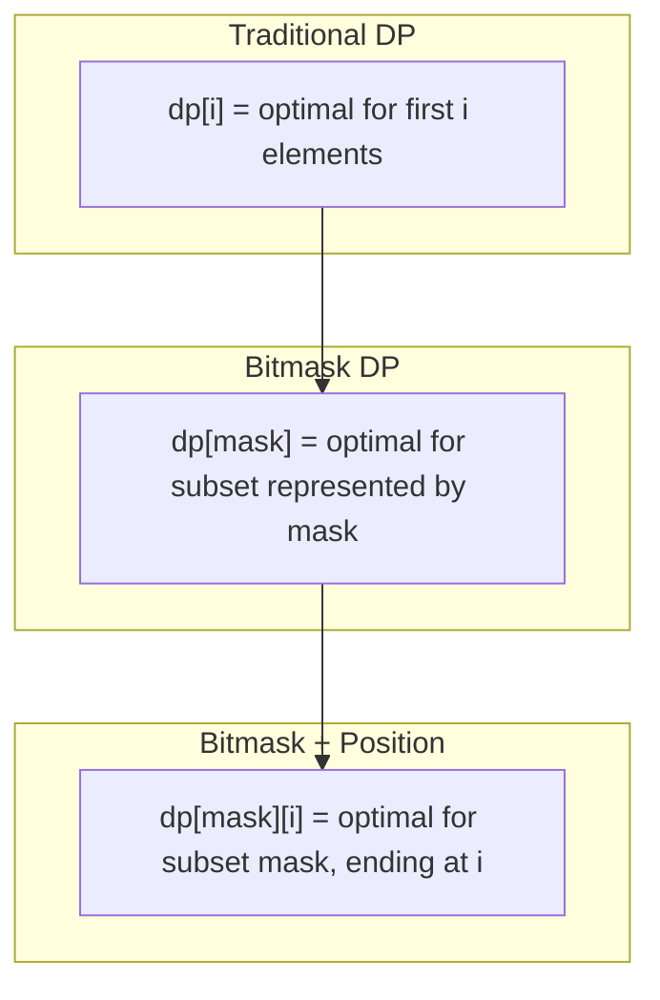

# Bitmask Dynamic Programming

> **Combine state compression with DP for exponential state spaces.**
>
> Essential for problems where states are subsets of elements.

---

## 🎯 Pattern Recognition

**Use Bitmask DP when:**

- State involves which elements are "used" or "visited"
- Need to track subset selections
- n is small (typically ≤ 20)
- Optimal substructure exists over subsets

**Classic problems:** Traveling Salesman (TSP), Assignment Problem, Subset Sum variants

**Keywords:** "visit all", "use each once", "subset", "minimum cost to complete"

---

## 📐 How It Works



### Key Idea

Instead of `dp[i]` for linear progression, use:
- `dp[mask]` where `mask` represents a subset
- Often combined: `dp[mask][j]` = optimal for subset `mask` ending at element `j`

---

## 💻 Template: Basic Bitmask DP

```python
def bitmask_dp_template(n, cost_function):
    """
    Template for bitmask DP.
    
    dp[mask] = optimal value for using elements in mask
    
    Time: O(n × 2^n)
    Space: O(2^n)
    """
    # Initialize
    INF = float('inf')
    dp = [INF] * (1 << n)
    dp[0] = 0  # Base case: empty set
    
    # Fill DP table
    for mask in range(1 << n):
        if dp[mask] == INF:
            continue
        
        # Try adding each unused element
        for i in range(n):
            if not (mask & (1 << i)):  # If i not in mask
                new_mask = mask | (1 << i)
                dp[new_mask] = min(dp[new_mask], dp[mask] + cost_function(mask, i))
    
    all_used = (1 << n) - 1
    return dp[all_used]
```

---

## 🎯 Classic Problem: Traveling Salesman (TSP)

```python
def traveling_salesman(dist):
    """
    Find minimum cost to visit all cities starting and ending at city 0.
    
    dist[i][j] = distance from city i to city j
    
    State: dp[mask][i] = min cost to visit cities in mask, ending at i
    Transition: dp[mask][i] = min(dp[mask ^ (1<<i)][j] + dist[j][i])
    
    Time: O(n^2 × 2^n)
    Space: O(n × 2^n)
    """
    n = len(dist)
    INF = float('inf')
    
    # dp[mask][i] = min cost to reach city i with visited set = mask
    dp = [[INF] * n for _ in range(1 << n)]
    dp[1][0] = 0  # Start at city 0, only city 0 visited
    
    for mask in range(1 << n):
        for last in range(n):
            if dp[mask][last] == INF:
                continue
            if not (mask & (1 << last)):
                continue  # last must be in mask
            
            # Try visiting unvisited city
            for next_city in range(n):
                if mask & (1 << next_city):
                    continue  # Already visited
                
                new_mask = mask | (1 << next_city)
                dp[new_mask][next_city] = min(
                    dp[new_mask][next_city],
                    dp[mask][last] + dist[last][next_city]
                )
    
    # Return to start
    all_visited = (1 << n) - 1
    result = INF
    for last in range(n):
        if dist[last][0] > 0:  # Can return to 0
            result = min(result, dp[all_visited][last] + dist[last][0])
    
    return result if result != INF else -1

# Example
dist = [
    [0, 10, 15, 20],
    [10, 0, 35, 25],
    [15, 35, 0, 30],
    [20, 25, 30, 0]
]
print(traveling_salesman(dist))  # 80
```

```javascript
function travelingSalesman(dist) {
    const n = dist.length;
    const INF = Infinity;
    
    // dp[mask][i] = min cost to reach city i with visited = mask
    const dp = Array.from({length: 1 << n}, () => 
        Array(n).fill(INF)
    );
    dp[1][0] = 0;  // Start at city 0
    
    for (let mask = 1; mask < (1 << n); mask++) {
        for (let last = 0; last < n; last++) {
            if (dp[mask][last] === INF) continue;
            if (!(mask & (1 << last))) continue;
            
            for (let next = 0; next < n; next++) {
                if (mask & (1 << next)) continue;
                
                const newMask = mask | (1 << next);
                dp[newMask][next] = Math.min(
                    dp[newMask][next],
                    dp[mask][last] + dist[last][next]
                );
            }
        }
    }
    
    const allVisited = (1 << n) - 1;
    let result = INF;
    for (let last = 1; last < n; last++) {
        result = Math.min(result, dp[allVisited][last] + dist[last][0]);
    }
    
    return result === INF ? -1 : result;
}
```

---

## 🎯 LeetCode 698: Partition to K Equal Sum Subsets

```python
def can_partition_k_subsets(nums, k):
    """
    Check if array can be partitioned into k subsets of equal sum.
    
    State: dp[mask] = (possible, remaining sum in current group)
    
    Time: O(n × 2^n)
    Space: O(2^n)
    """
    total = sum(nums)
    if total % k != 0:
        return False
    
    target = total // k
    n = len(nums)
    nums.sort(reverse=True)  # Optimization: try larger first
    
    if nums[0] > target:
        return False
    
    # dp[mask] = remaining sum needed in current bucket
    # -1 means impossible
    dp = [-1] * (1 << n)
    dp[0] = 0  # Empty set needs 0 to complete current bucket
    
    for mask in range(1 << n):
        if dp[mask] == -1:
            continue
        
        for i in range(n):
            if mask & (1 << i):  # Already used
                continue
            
            if dp[mask] + nums[i] <= target:
                new_mask = mask | (1 << i)
                new_remainder = (dp[mask] + nums[i]) % target
                # Keep the better option (closer to 0 means bucket complete)
                dp[new_mask] = max(dp[new_mask], new_remainder)
    
    return dp[(1 << n) - 1] == 0

print(can_partition_k_subsets([4, 3, 2, 3, 5, 2, 1], 4))  # True
```

---

## 🎯 LeetCode 847: Shortest Path Visiting All Nodes

```python
from collections import deque

def shortest_path_visiting_all_nodes(graph):
    """
    Find shortest path that visits all nodes (can revisit).
    
    State: (current_node, visited_mask)
    BFS since all edges have weight 1.
    
    Time: O(n × 2^n)
    Space: O(n × 2^n)
    """
    n = len(graph)
    all_visited = (1 << n) - 1
    
    # BFS: (node, visited_mask, distance)
    # Start from every node
    queue = deque()
    visited = set()
    
    for i in range(n):
        mask = 1 << i
        queue.append((i, mask, 0))
        visited.add((i, mask))
    
    while queue:
        node, mask, dist = queue.popleft()
        
        if mask == all_visited:
            return dist
        
        for neighbor in graph[node]:
            new_mask = mask | (1 << neighbor)
            state = (neighbor, new_mask)
            
            if state not in visited:
                visited.add(state)
                queue.append((neighbor, new_mask, dist + 1))
    
    return -1

# Example: graph[i] = neighbors of node i
print(shortest_path_visiting_all_nodes([[1, 2, 3], [0], [0], [0]]))  # 4
```

---

## 🔄 Common Transitions

### Subset Sum Variant

```python
def count_subsets_with_sum(nums, target):
    """Count subsets summing to target."""
    n = len(nums)
    count = 0
    
    for mask in range(1 << n):
        subset_sum = 0
        for i in range(n):
            if mask & (1 << i):
                subset_sum += nums[i]
        if subset_sum == target:
            count += 1
    
    return count
```

### Assignment Problem

```python
def min_cost_assignment(cost):
    """
    Assign n workers to n jobs with minimum cost.
    cost[i][j] = cost of worker i doing job j.
    
    dp[mask] = min cost to assign jobs in mask to first popcount(mask) workers
    """
    n = len(cost)
    INF = float('inf')
    dp = [INF] * (1 << n)
    dp[0] = 0
    
    for mask in range(1 << n):
        if dp[mask] == INF:
            continue
        
        worker = bin(mask).count('1')  # Next worker to assign
        if worker >= n:
            continue
        
        for job in range(n):
            if mask & (1 << job):  # Job already assigned
                continue
            
            new_mask = mask | (1 << job)
            dp[new_mask] = min(dp[new_mask], dp[mask] + cost[worker][job])
    
    return dp[(1 << n) - 1]
```

---

## ⚡ Complexity Analysis

| Component | Complexity | Notes |
|-----------|------------|-------|
| States | O(2^n) or O(n × 2^n) | Subsets × position |
| Transitions | O(n) per state | Try each unused element |
| Total | O(n × 2^n) or O(n² × 2^n) | Depends on structure |
| Space | O(2^n) or O(n × 2^n) | DP table size |

**Practical limits:**
- n ≤ 15: Very fast (< 1 second)
- n ≤ 20: Acceptable (few seconds)
- n > 25: Usually too slow

---

## 🔧 Optimization Techniques

### 1. Iterate Submasks

```python
def iterate_submasks(mask):
    """Iterate all submasks of a given mask."""
    submask = mask
    while submask:
        yield submask
        submask = (submask - 1) & mask
    yield 0

# Useful for "split mask into two parts" problems
for submask in iterate_submasks(0b111):
    complement = 0b111 ^ submask
    print(f"{bin(submask)} + {bin(complement)}")
```

### 2. Popcount Ordering

```python
def solve_by_popcount_order(n):
    """Process masks by number of set bits."""
    # Group masks by popcount
    from collections import defaultdict
    groups = defaultdict(list)
    
    for mask in range(1 << n):
        groups[bin(mask).count('1')].append(mask)
    
    # Process in order
    for count in range(n + 1):
        for mask in groups[count]:
            # Process mask (all submasks already processed)
            pass
```

### 3. Memoization with Bitmask

```python
from functools import lru_cache

def solve_with_memo(nums, target):
    n = len(nums)
    
    @lru_cache(maxsize=None)
    def dp(mask, remaining):
        if remaining == 0:
            return True
        if remaining < 0:
            return False
        
        for i in range(n):
            if mask & (1 << i):
                continue
            if dp(mask | (1 << i), remaining - nums[i]):
                return True
        
        return False
    
    return dp(0, target)
```

---

## ⚠️ Common Mistakes

### 1. Wrong Base Case

```python
# ❌ WRONG - Didn't initialize empty set
dp = [float('inf')] * (1 << n)
# Missing: dp[0] = 0

# ✅ CORRECT
dp = [float('inf')] * (1 << n)
dp[0] = 0  # Base case!
```

### 2. Not Checking Element in Mask

```python
# ❌ WRONG - Processing dp[mask][i] when i not in mask
for mask in range(1 << n):
    for i in range(n):
        process(dp[mask][i])  # i might not be in mask!

# ✅ CORRECT - Verify i is in mask
for mask in range(1 << n):
    for i in range(n):
        if mask & (1 << i):  # i must be in mask
            process(dp[mask][i])
```

### 3. Overflow in Transition

```python
# ❌ WRONG - new_mask might overflow for large n
new_mask = mask | (1 << i)

# ✅ CORRECT for n > 30 in Python (use explicit check)
if n > 30:
    # Consider using different approach
    pass
```

---

## 📝 Practice Problems

| Problem | Difficulty | Pattern |
|---------|------------|---------|
| [Partition to K Equal Sum Subsets](https://leetcode.com/problems/partition-to-k-equal-sum-subsets/) | Medium | Subset DP |
| [Shortest Path Visiting All Nodes](https://leetcode.com/problems/shortest-path-visiting-all-nodes/) | Hard | BFS + mask |
| [Can I Win](https://leetcode.com/problems/can-i-win/) | Medium | Game theory |
| [Smallest Sufficient Team](https://leetcode.com/problems/smallest-sufficient-team/) | Hard | Set cover |
| [Number of Ways to Wear Different Hats](https://leetcode.com/problems/number-of-ways-to-wear-different-hats-to-each-other/) | Hard | Assignment |

---

## 🎤 Interview Communication

> "Since n is small (≤ 15), I'll use bitmask DP where each state represents a subset of used elements."

> "The time complexity is O(n × 2^n) - we have 2^n subsets and process O(n) transitions each."

> "I'll use `dp[mask]` to represent the optimal answer for the subset encoded by `mask`."

---

> **💡 Key Insight:** Bitmask DP works when the problem's state can be described by "which elements are used" and n is small. The bitmask serves as both the state representation and an efficient hash key.

> **🔗 Related:** [State Compression ←](./4.2-State-Compression.md) | [Subset Generation ←](./4.1-Subset-Generation.md) | [Dynamic Programming](../../11-Dynamic-Programming.md)
