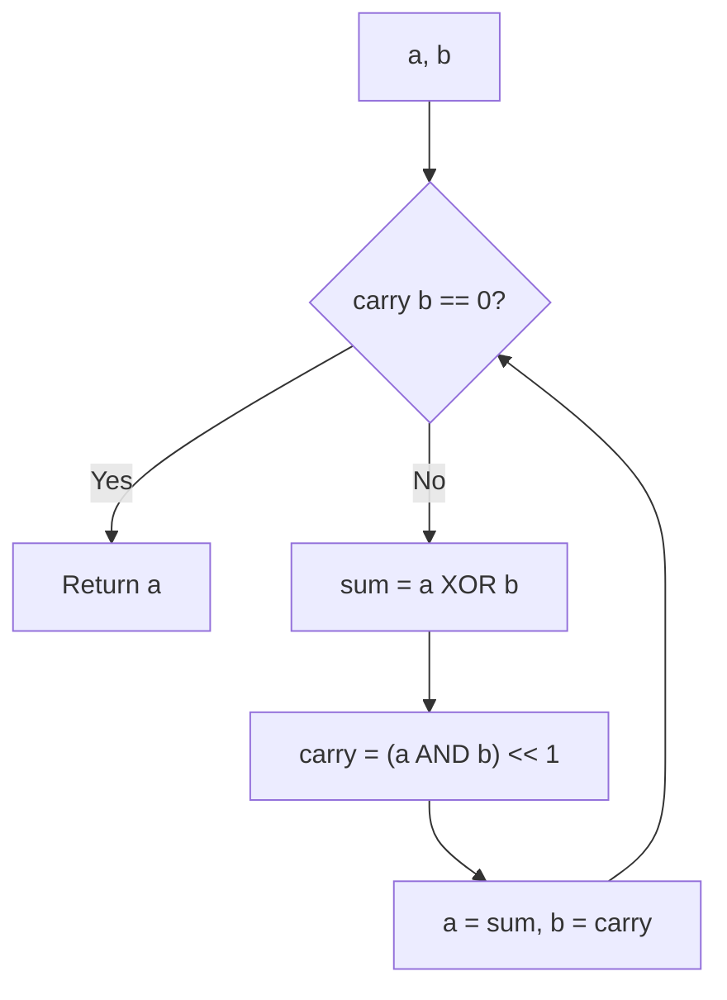

# Addition Without Plus Operator

> **Add two integers using only bitwise operations.**
>
> A classic interview problem that reveals deep understanding of binary arithmetic.

---

## 🎯 Pattern Recognition

**Use this technique when:**

- Asked to add/subtract without `+` or `-`
- Need to understand binary arithmetic fundamentals
- Implementing low-level arithmetic operations

**LeetCode 371: Sum of Two Integers**

---

## 📐 How It Works

Addition can be broken into two parts:
1. **XOR** gives the sum without carrying
2. **AND + Left Shift** gives the carry

```
   5: 0101
+  3: 0011
----------
   
XOR (no carry): 0101 ^ 0011 = 0110 (6)
Carry:          (0101 & 0011) << 1 = 0010 (2)

Then add 6 + 2:
XOR:  0110 ^ 0010 = 0100 (4)
Carry: (0110 & 0010) << 1 = 0100 (4)

Then add 4 + 4:
XOR:  0100 ^ 0100 = 0000 (0)
Carry: (0100 & 0100) << 1 = 1000 (8)

Then add 0 + 8:
XOR:  0000 ^ 1000 = 1000 (8)
Carry: (0000 & 1000) << 1 = 0 (done!)

Result: 8 ✓
```



---

## 💻 Code Implementation

### Python Version (Handles Negative Numbers)

```python
def get_sum(a, b):
    """
    Add two integers without using + or -.
    
    Key insight:
    - XOR gives sum without carry
    - AND gives carry positions
    - Shift carry left and repeat until no carry
    
    Time: O(1) - at most 32 iterations
    Space: O(1)
    """
    # Mask to get 32-bit integer
    MASK = 0xFFFFFFFF
    MAX_INT = 0x7FFFFFFF
    
    while b != 0:
        # Calculate sum and carry
        sum_without_carry = (a ^ b) & MASK
        carry = ((a & b) << 1) & MASK
        
        a = sum_without_carry
        b = carry
    
    # Handle negative numbers
    # If a > MAX_INT, it's negative in 32-bit
    return a if a <= MAX_INT else ~(a ^ MASK)

# Test cases
print(get_sum(5, 3))    # 8
print(get_sum(-2, 3))   # 1
print(get_sum(-1, -1))  # -2
```

### JavaScript Version

```javascript
function getSum(a, b) {
    /**
     * Add without + operator.
     * JavaScript uses 32-bit signed integers for bitwise ops.
     */
    while (b !== 0) {
        const carry = (a & b) << 1;
        a = a ^ b;
        b = carry;
    }
    return a;
}

console.log(getSum(5, 3));    // 8
console.log(getSum(-2, 3));   // 1
console.log(getSum(-1, -1));  // -2
```

### Recursive Version

```python
def get_sum_recursive(a, b):
    """Recursive approach - cleaner but may hit stack limit."""
    if b == 0:
        return a
    
    MASK = 0xFFFFFFFF
    MAX_INT = 0x7FFFFFFF
    
    sum_val = (a ^ b) & MASK
    carry = ((a & b) << 1) & MASK
    
    result = get_sum_recursive(sum_val, carry)
    return result if result <= MAX_INT else ~(result ^ MASK)
```

---

## 🔄 Step-by-Step Trace

### Example: 5 + 3

```
Initial: a = 5 (0101), b = 3 (0011)

Iteration 1:
  a XOR b  = 0101 ^ 0011 = 0110 (6)   ← sum without carry
  a AND b  = 0101 & 0011 = 0001       ← carry bits
  carry    = 0001 << 1   = 0010 (2)   ← shifted carry
  
  a = 6, b = 2

Iteration 2:
  a XOR b  = 0110 ^ 0010 = 0100 (4)
  a AND b  = 0110 & 0010 = 0010
  carry    = 0010 << 1   = 0100 (4)
  
  a = 4, b = 4

Iteration 3:
  a XOR b  = 0100 ^ 0100 = 0000 (0)
  a AND b  = 0100 & 0100 = 0100
  carry    = 0100 << 1   = 1000 (8)
  
  a = 0, b = 8

Iteration 4:
  a XOR b  = 0000 ^ 1000 = 1000 (8)
  a AND b  = 0000 & 1000 = 0000
  carry    = 0000 << 1   = 0000 (0)
  
  a = 8, b = 0 → DONE!

Result: 8 ✓
```

---

## ⚠️ Handling Negative Numbers

### The Python Challenge

Python integers have arbitrary precision (no fixed bit width), so negative numbers have conceptually infinite leading 1s:

```python
# In Python, -1 is ...11111111 (infinite 1s)
# We need to simulate 32-bit arithmetic

# Without masking:
a, b = -1, 1
while b:
    a, b = a ^ b, (a & b) << 1
    # This will NEVER terminate because b grows infinitely!
```

### Solution: 32-bit Masking

```python
MASK = 0xFFFFFFFF      # 32 ones: limits to 32 bits
MAX_INT = 0x7FFFFFFF   # Largest positive 32-bit int

# Mask every operation
a = (a ^ b) & MASK
b = ((a & b) << 1) & MASK

# At the end, convert back if negative
if a > MAX_INT:
    a = ~(a ^ MASK)  # Convert from unsigned to signed
```

### Why the Final Conversion?

```python
# If a = 0xFFFFFFFF (all 1s), it represents -1 in 32-bit signed
# But Python sees it as 4294967295 (positive)

a = 0xFFFFFFFF
print(a)  # 4294967295

# To get -1, we need to "sign extend"
print(~(a ^ MASK))  # -1

# This works because:
# a ^ MASK = 0xFFFFFFFF ^ 0xFFFFFFFF = 0
# ~0 = -1
```

---

## 🔧 Related Operations

### Subtraction Without Minus

```python
def subtract(a, b):
    """
    Subtract b from a: a - b = a + (-b)
    -b = ~b + 1 (two's complement)
    """
    def get_sum(x, y):
        MASK = 0xFFFFFFFF
        MAX_INT = 0x7FFFFFFF
        while y:
            x, y = (x ^ y) & MASK, ((x & y) << 1) & MASK
        return x if x <= MAX_INT else ~(x ^ MASK)
    
    # Negate b and add
    neg_b = get_sum(~b, 1)  # -b = ~b + 1
    return get_sum(a, neg_b)

print(subtract(5, 3))   # 2
print(subtract(3, 5))   # -2
```

### Negate Without Minus

```python
def negate(n):
    """Negate n without using minus."""
    MASK = 0xFFFFFFFF
    MAX_INT = 0x7FFFFFFF
    
    # -n = ~n + 1
    result = ~n
    
    # Add 1
    carry = 1
    while carry:
        result, carry = (result ^ carry) & MASK, ((result & carry) << 1) & MASK
    
    return result if result <= MAX_INT else ~(result ^ MASK)

print(negate(5))   # -5
print(negate(-3))  # 3
```

```javascript
/**
 * Subtraction without minus operator
 * a - b = a + (-b) = a + (~b + 1)
 */
function subtract(a, b) {
    // Negate b: -b = ~b + 1
    const negB = getSum(~b, 1);
    return getSum(a, negB);
}

/**
 * Negate without minus operator
 * -n = ~n + 1 (two's complement)
 */
function negate(n) {
    return getSum(~n, 1);
}

// Test subtraction
console.log(subtract(5, 3));   // 2
console.log(subtract(3, 5));   // -2
console.log(negate(5));        // -5
console.log(negate(-3));       // 3
```

---

## ⚡ Complexity Analysis

| Metric | Value | Explanation |
|--------|-------|-------------|
| Time | O(1) | At most 32 iterations (carry propagates one bit per iteration) |
| Space | O(1) | Only a few variables |

**Why at most 32 iterations?**
- Each iteration, the carry shifts left by 1
- After at most 32 shifts, carry becomes 0 (or overflows out)

---

## ⚠️ Common Mistakes

### 1. Infinite Loop in Python

```python
# ❌ WRONG - Will loop forever for negative numbers
def get_sum_wrong(a, b):
    while b:
        a, b = a ^ b, (a & b) << 1  # No masking!
    return a

# ✅ CORRECT - Mask to 32 bits
def get_sum_correct(a, b):
    MASK = 0xFFFFFFFF
    while b:
        a, b = (a ^ b) & MASK, ((a & b) << 1) & MASK
    # ... handle negative result
```

### 2. Forgetting to Handle Result Sign

```python
# ❌ WRONG - Returns large positive for negative result
return a  # If a = 0xFFFFFFFF, returns 4294967295

# ✅ CORRECT - Check if result is negative in 32-bit
MAX_INT = 0x7FFFFFFF
return a if a <= MAX_INT else ~(a ^ MASK)
```

### 3. Order of Operations

```python
# ❌ WRONG - Modifying a before using it for carry
a = a ^ b
b = (a & b) << 1  # Uses new a, not original!

# ✅ CORRECT - Calculate both at once
sum_val = a ^ b
carry = (a & b) << 1
a, b = sum_val, carry
```

---

## 📝 Practice Problems

| Problem | Difficulty | Builds On |
|---------|------------|-----------|
| [Sum of Two Integers](https://leetcode.com/problems/sum-of-two-integers/) | Medium | This technique |
| [Add Binary](https://leetcode.com/problems/add-binary/) | Easy | Binary addition |
| [Subtract the Product and Sum](https://leetcode.com/problems/subtract-the-product-and-sum-of-digits-of-an-integer/) | Easy | Digit manipulation |

---

## 🎤 Interview Communication

> "I'll use the fact that XOR gives addition without carry, and AND with left shift gives the carry. I'll iterate until there's no carry."

> "For negative numbers in Python, I need to mask to 32 bits to simulate fixed-width arithmetic."

> "Time complexity is O(1) since carry propagates at most 32 bits."

**Common follow-up: "Why does XOR give the sum?"**

> "XOR is like binary addition without carrying: 0+0=0, 0+1=1, 1+0=1, 1+1=0. The 1+1 case gives 0 because the carry goes to the next bit, which we handle separately with AND."

---

> **💡 Key Insight:** Binary addition = XOR (sum bits) + AND<<1 (carry bits). Repeat until no carry remains. This is exactly what hardware adders do!

> **🔗 Related:** [Division With Shifts →](./5.2-Division-With-Shifts.md) | [Two's Complement](../01-Fundamentals/1.3-Twos-Complement.md) | [XOR Properties](../03-XOR-Patterns/3.1-XOR-Properties.md)
