# Division With Bit Shifts

> **Divide integers using only bit operations.**
>
> A challenging problem that appears in system-level interviews.

---

## 🎯 Pattern Recognition

**Use this technique when:**

- Asked to divide without `/`, `*`, `%`
- Implementing integer division at low level
- Understanding how division works in hardware

**LeetCode 29: Divide Two Integers**

---

## 📐 How It Works

**Key Insight:** Division is repeated subtraction. But naive subtraction is O(dividend/divisor) which is too slow.

**Optimization:** Use doubling - subtract the largest power-of-2 multiple of divisor possible.

```mermaid
flowchart TD
    A["dividend = 43, divisor = 5"] --> B["Find largest 2^k where divisor×2^k ≤ dividend"]
    B --> C["5×8=40 ≤ 43, so subtract 40, add 8 to quotient"]
    C --> D["dividend = 3, quotient = 8"]
    D --> E["3 < 5, done"]
    E --> F["Result: 43 ÷ 5 = 8"]
```



### Example: 43 ÷ 5

```
dividend = 43, divisor = 5, quotient = 0

Step 1: Find how many times we can double 5
  5 << 0 = 5   ≤ 43 ✓
  5 << 1 = 10  ≤ 43 ✓
  5 << 2 = 20  ≤ 43 ✓
  5 << 3 = 40  ≤ 43 ✓
  5 << 4 = 80  > 43 ✗
  
  Use 40 (= 5 << 3)
  dividend = 43 - 40 = 3
  quotient = 0 + 8 = 8  (because 2^3 = 8)

Step 2: 3 < 5, can't subtract anymore

Result: 43 ÷ 5 = 8 (remainder 3)
```

---

## 💻 Code Implementation

### Python Version

```python
def divide(dividend, divisor):
    """
    Divide two integers without using *, /, %.
    
    Algorithm: Repeated subtraction with doubling
    For each bit position, check if divisor<<k fits
    
    Time: O(log^2 n) - outer loop O(log n), inner finding O(log n)
    Space: O(1)
    """
    # Handle edge case: overflow
    INT_MIN, INT_MAX = -2**31, 2**31 - 1
    if dividend == INT_MIN and divisor == -1:
        return INT_MAX  # Overflow case
    
    # Determine sign
    negative = (dividend < 0) != (divisor < 0)
    
    # Work with absolute values
    dividend, divisor = abs(dividend), abs(divisor)
    quotient = 0
    
    while dividend >= divisor:
        # Find the largest doubling of divisor that fits
        temp, multiple = divisor, 1
        
        while dividend >= (temp << 1):
            temp <<= 1
            multiple <<= 1
        
        # Subtract and add to quotient
        dividend -= temp
        quotient += multiple
    
    return -quotient if negative else quotient

# Test cases
print(divide(43, 5))    # 8
print(divide(10, 3))    # 3
print(divide(7, -3))    # -2
print(divide(-2147483648, -1))  # 2147483647 (clamped)
```

### JavaScript Version

```javascript
function divide(dividend, divisor) {
    /**
     * Divide without * / % operators.
     * Handle 32-bit integer overflow.
     */
    const INT_MIN = -(2 ** 31);
    const INT_MAX = 2 ** 31 - 1;
    
    // Handle overflow
    if (dividend === INT_MIN && divisor === -1) {
        return INT_MAX;
    }
    
    // Determine sign
    const negative = (dividend < 0) !== (divisor < 0);
    
    // Work with absolute values
    let dvd = Math.abs(dividend);
    const dvs = Math.abs(divisor);
    let quotient = 0;
    
    while (dvd >= dvs) {
        let temp = dvs;
        let multiple = 1;
        
        // Double until too big
        while (dvd >= temp + temp && temp + temp > 0) {
            temp += temp;  // temp <<= 1 but avoid overflow
            multiple += multiple;
        }
        
        dvd -= temp;
        quotient += multiple;
    }
    
    return negative ? -quotient : quotient;
}

console.log(divide(43, 5));   // 8
console.log(divide(10, 3));   // 3
console.log(divide(-7, 3));   // -2
```

### Bit-by-bit Version

```python
def divide_bitwise(dividend, divisor):
    """
    Alternative: Process one bit at a time from MSB to LSB.
    More like how long division works.
    """
    INT_MIN, INT_MAX = -2**31, 2**31 - 1
    if dividend == INT_MIN and divisor == -1:
        return INT_MAX
    
    negative = (dividend < 0) != (divisor < 0)
    dividend, divisor = abs(dividend), abs(divisor)
    
    quotient = 0
    
    # Start from highest bit that could contribute
    for i in range(31, -1, -1):
        # Check if divisor << i fits in remaining dividend
        if (divisor << i) <= dividend:
            dividend -= (divisor << i)
            quotient |= (1 << i)
    
    return -quotient if negative else quotient

print(divide_bitwise(43, 5))  # 8
```

```javascript
/**
 * Bit-by-bit division (cleaner approach)
 * Process from MSB to LSB like long division
 */
function divideBitwise(dividend, divisor) {
    const INT_MIN = -(2 ** 31);
    const INT_MAX = 2 ** 31 - 1;
    
    // Handle overflow
    if (dividend === INT_MIN && divisor === -1) {
        return INT_MAX;
    }
    
    const negative = (dividend < 0) !== (divisor < 0);
    let dvd = Math.abs(dividend);
    const dvs = Math.abs(divisor);
    let quotient = 0;
    
    // Process bit by bit from position 31 down to 0
    for (let i = 31; i >= 0; i--) {
        // Check if divisor << i fits in remaining dividend
        // Use >>> 0 to handle as unsigned and prevent overflow
        if ((dvs << i) >>> 0 <= dvd) {
            dvd -= (dvs << i) >>> 0;
            quotient |= (1 << i);
        }
    }
    
    return negative ? -quotient : quotient;
}

// Test
console.log(divideBitwise(43, 5));    // 8
console.log(divideBitwise(10, 3));    // 3
console.log(divideBitwise(-7, 3));    // -2
console.log(divideBitwise(100, 10));  // 10
```

---

## 🔄 Step-by-Step Trace

### Example: 43 ÷ 5

```
dividend = 43, divisor = 5

Bit-by-bit approach (from bit 31 down to 0):

i=31: 5 << 31 = huge > 43, skip
...
i=4:  5 << 4 = 80 > 43, skip
i=3:  5 << 3 = 40 ≤ 43 ✓
      dividend = 43 - 40 = 3
      quotient = 0 | (1 << 3) = 8

i=2:  5 << 2 = 20 > 3, skip
i=1:  5 << 1 = 10 > 3, skip
i=0:  5 << 0 = 5 > 3, skip

Final: quotient = 8, remainder = 3
```

---

## ⚠️ Edge Cases

### Overflow Case

```python
# -2^31 ÷ -1 = 2^31, but max 32-bit signed is 2^31 - 1
dividend = -2147483648  # INT_MIN
divisor = -1

# Result would be 2147483648, which overflows
# Return INT_MAX = 2147483647 instead
```

### Division by 1

```python
# Optimization: skip the loop
if divisor == 1:
    return dividend
if divisor == -1:
    return -dividend  # (check overflow first)
```

### Divisor is Power of 2

```python
# Can use right shift instead of loop
def divide_power_of_2(dividend, power):
    """Divide by 2^power using shift."""
    if dividend >= 0:
        return dividend >> power
    else:
        # Handle rounding toward zero for negatives
        return -((-dividend) >> power)
```

---

## ⚡ Complexity Analysis

| Approach | Time | Space |
|----------|------|-------|
| Naive subtraction | O(dividend/divisor) | O(1) |
| Doubling | O(log² n) | O(1) |
| Bit-by-bit | O(32) = O(1) | O(1) |

**Why O(log² n) for doubling?**
- Outer loop: O(log n) iterations (quotient has log n bits)
- Inner loop: O(log n) to find doubling limit
- Total: O(log n × log n) = O(log² n)

**Bit-by-bit is O(32) = O(1)** because we check each bit position once.

---

## 🔧 Optimizations

### Early Exit for Common Cases

```python
def divide_optimized(dividend, divisor):
    # Quick returns
    if dividend == 0:
        return 0
    if divisor == 1:
        return dividend
    if divisor == -1:
        if dividend == -2**31:
            return 2**31 - 1  # Overflow
        return -dividend
    if dividend == divisor:
        return 1
    if dividend == -divisor:
        return -1
    
    # ... rest of algorithm
```

### Avoid Overflow in Doubling

```python
# ❌ WRONG - (temp << 1) might overflow
while dividend >= (temp << 1):
    temp <<= 1

# ✅ CORRECT - Check before shifting
while temp <= (dividend >> 1):  # Equivalent but safe
    temp <<= 1
```

---

## ⚠️ Common Mistakes

### 1. Missing Overflow Check

```python
# ❌ WRONG - Doesn't handle -2^31 ÷ -1
def divide_wrong(dividend, divisor):
    negative = (dividend < 0) != (divisor < 0)
    result = do_division(abs(dividend), abs(divisor))
    return -result if negative else result

# ✅ CORRECT - Check first
def divide_correct(dividend, divisor):
    if dividend == -2**31 and divisor == -1:
        return 2**31 - 1  # Clamp to max
    # ... rest
```

### 2. Wrong Sign Handling

```python
# ❌ WRONG - XOR on booleans might not work as expected
negative = (dividend < 0) ^ (divisor < 0)  # Works in Python

# ✅ CLEARER - Use != for clarity
negative = (dividend < 0) != (divisor < 0)
```

### 3. Infinite Loop with INT_MIN

```python
# ❌ WRONG - abs(INT_MIN) overflows in some languages
dividend = abs(dividend)  # In C/Java, abs(-2^31) = -2^31!

# ✅ CORRECT - Check and handle specially
if dividend == INT_MIN:
    if divisor == 1:
        return INT_MIN
    if divisor == -1:
        return INT_MAX
    # Or work with long/BigInt
```

---

## 📝 Practice Problems

| Problem | Difficulty | Notes |
|---------|------------|-------|
| [Divide Two Integers](https://leetcode.com/problems/divide-two-integers/) | Medium | This technique |
| [Pow(x, n)](https://leetcode.com/problems/powx-n/) | Medium | Binary exponentiation |
| [Sqrt(x)](https://leetcode.com/problems/sqrtx/) | Easy | Binary search or bit-by-bit |

---

## 🎤 Interview Communication

> "Since I can't use division, I'll use repeated subtraction. To optimize from O(n) to O(log n), I'll subtract the largest power-of-2 multiple of the divisor that fits."

> "I need to handle the edge case where -2^31 ÷ -1 overflows."

> "The time complexity is O(log² n) for the doubling approach, or O(32) = O(1) for the bit-by-bit approach."

**Common follow-up: "Why not just subtract repeatedly?"**

> "Naive subtraction is O(dividend/divisor), which could be 2^31 iterations. Doubling reduces this to O(log n) iterations."

---

> **💡 Key Insight:** Division is repeated subtraction, but we can subtract 2^k × divisor at once to speed it up exponentially. This is essentially binary search for the quotient.

> **🔗 Related:** [Addition Without Plus ←](./5.1-Addition-Without-Plus.md) | [Multiplication/Division →](./5.3-Multiplication-Division.md) | [Binary Search](../../03-Sorting-Searching.md)
