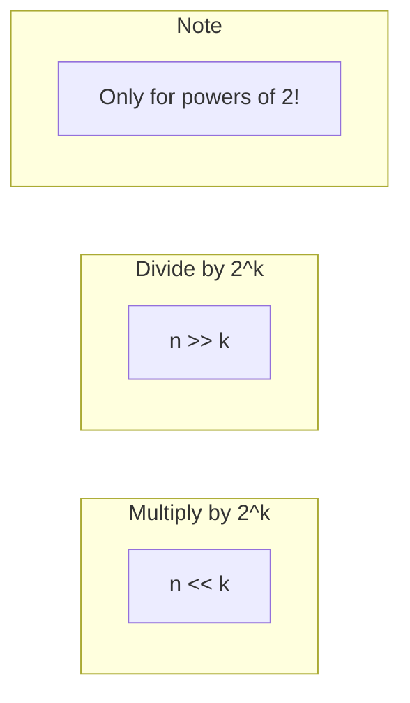

# Multiplication and Division with Shifts

> **Use bit shifts for fast multiplication and division by powers of 2.**
>
> A fundamental optimization used in systems programming and competitive coding.

---

## 🎯 Pattern Recognition

**Use shift operations when:**

- Multiplying or dividing by powers of 2
- Optimizing arithmetic in tight loops
- Implementing fast algorithms without multiplication hardware
- Working with binary data structures

---

## 📐 Core Concepts

### Left Shift = Multiply by 2

```
n << k = n × 2^k

Example: 5 << 3 = 5 × 8 = 40

Binary trace:
5 = 00000101
5 << 1 = 00001010 = 10  (×2)
5 << 2 = 00010100 = 20  (×4)
5 << 3 = 00101000 = 40  (×8)
```

### Right Shift = Divide by 2

```
n >> k = ⌊n / 2^k⌋  (for positive n)

Example: 40 >> 3 = 40 / 8 = 5

Binary trace:
40 = 00101000
40 >> 1 = 00010100 = 20  (÷2)
40 >> 2 = 00001010 = 10  (÷4)
40 >> 3 = 00000101 = 5   (÷8)
```



---

## 💻 Basic Operations

### Multiply by Power of 2

```python
def multiply_by_power_of_2(n, power):
    """Multiply n by 2^power using left shift."""
    return n << power

# Examples
print(multiply_by_power_of_2(5, 3))   # 5 × 8 = 40
print(multiply_by_power_of_2(7, 4))   # 7 × 16 = 112
print(multiply_by_power_of_2(1, 10))  # 1 × 1024 = 1024
```

```javascript
function multiplyByPowerOf2(n, power) {
    // Warning: overflow for large shifts in JS (32-bit)
    return n << power;
}

console.log(multiplyByPowerOf2(5, 3));   // 40
console.log(multiplyByPowerOf2(7, 4));   // 112
```

### Divide by Power of 2

```python
def divide_by_power_of_2(n, power):
    """
    Divide n by 2^power using right shift.
    Note: For negative numbers, right shift floors toward negative infinity.
    """
    return n >> power

# Examples
print(divide_by_power_of_2(40, 3))    # 40 / 8 = 5
print(divide_by_power_of_2(100, 2))   # 100 / 4 = 25
print(divide_by_power_of_2(15, 2))    # 15 / 4 = 3 (floored)

# Negative numbers
print(divide_by_power_of_2(-8, 2))    # -2 (floored toward -∞)
print(divide_by_power_of_2(-7, 2))    # -2 (Python floors to -2, not -1)
```

---

## 🔧 Multiply by Any Constant

### Decompose into Powers of 2

```python
def multiply_by_constant(n, constant):
    """
    Multiply n by constant using only shifts and adds.
    Decompose constant into sum of powers of 2.
    
    Example: n × 10 = n × (8 + 2) = (n << 3) + (n << 1)
    """
    result = 0
    power = 0
    
    while constant:
        if constant & 1:  # If current bit is set
            result += n << power
        constant >>= 1
        power += 1
    
    return result

print(multiply_by_constant(7, 10))   # 70
print(multiply_by_constant(5, 13))   # 65 (13 = 8 + 4 + 1)
```

### Optimized Common Multipliers

```python
# Multiply by 3: n + (n << 1) = n + 2n = 3n
def multiply_by_3(n):
    return n + (n << 1)

# Multiply by 5: n + (n << 2) = n + 4n = 5n
def multiply_by_5(n):
    return n + (n << 2)

# Multiply by 7: (n << 3) - n = 8n - n = 7n
def multiply_by_7(n):
    return (n << 3) - n

# Multiply by 9: (n << 3) + n = 8n + n = 9n
def multiply_by_9(n):
    return (n << 3) + n

# Multiply by 10: (n << 3) + (n << 1) = 8n + 2n = 10n
def multiply_by_10(n):
    return (n << 3) + (n << 1)

# Multiply by 15: (n << 4) - n = 16n - n = 15n
def multiply_by_15(n):
    return (n << 4) - n

# Test
print(multiply_by_10(7))  # 70
print(multiply_by_7(8))   # 56
```

---

## 🎯 Binary Exponentiation

### Fast Power: O(log n)

```python
def power(base, exponent):
    """
    Calculate base^exponent using binary exponentiation.
    
    Idea: x^10 = x^8 × x^2 (10 = 1010 in binary)
    
    Time: O(log exponent)
    Space: O(1)
    """
    result = 1
    
    while exponent > 0:
        if exponent & 1:  # If current bit is 1
            result *= base
        base *= base  # Square the base
        exponent >>= 1  # Move to next bit
    
    return result

print(power(2, 10))   # 1024
print(power(3, 5))    # 243
```

### Modular Exponentiation

```python
def power_mod(base, exponent, mod):
    """
    Calculate (base^exponent) % mod efficiently.
    
    Essential for cryptography and large number problems.
    """
    result = 1
    base %= mod
    
    while exponent > 0:
        if exponent & 1:
            result = (result * base) % mod
        base = (base * base) % mod
        exponent >>= 1
    
    return result

print(power_mod(2, 100, 1000000007))  # 976371285
```

### Matrix Exponentiation (Fibonacci)

```python
def matrix_mult(A, B, mod):
    """Multiply two 2×2 matrices."""
    return [
        [(A[0][0]*B[0][0] + A[0][1]*B[1][0]) % mod,
         (A[0][0]*B[0][1] + A[0][1]*B[1][1]) % mod],
        [(A[1][0]*B[0][0] + A[1][1]*B[1][0]) % mod,
         (A[1][0]*B[0][1] + A[1][1]*B[1][1]) % mod]
    ]

def fibonacci(n, mod=10**9 + 7):
    """
    Calculate nth Fibonacci number in O(log n).
    Uses matrix exponentiation.
    """
    if n <= 1:
        return n
    
    # [[F(n+1), F(n)], [F(n), F(n-1)]] = [[1,1],[1,0]]^n
    result = [[1, 0], [0, 1]]  # Identity matrix
    base = [[1, 1], [1, 0]]
    
    while n > 0:
        if n & 1:
            result = matrix_mult(result, base, mod)
        base = matrix_mult(base, base, mod)
        n >>= 1
    
    return result[0][1]

print(fibonacci(10))    # 55
print(fibonacci(100))   # 687995182 (mod 10^9+7)
```

---

## 🔢 Division without Division Operator

### Divide by Constant

```python
def divide_by_3(n):
    """
    Approximate division by 3 using bit tricks.
    Works for positive integers in certain ranges.
    """
    # This is an approximation technique used in compilers
    # For exact division, use the shift-subtract approach
    return (n * 0xAAAAAAAB) >> 33  # Magic number for ÷3

# Better: Use repeated subtraction with shifts
def exact_divide_by_3(n):
    """Exact integer division by 3."""
    quotient = 0
    remainder = n
    
    for shift in range(31, -1, -1):
        val = 3 << shift
        if remainder >= val:
            remainder -= val
            quotient |= (1 << shift)
    
    return quotient

print(exact_divide_by_3(100))  # 33
```

---

## ⚠️ Edge Cases and Gotchas

### Negative Number Shifts

```python
# Python: >> is arithmetic shift (preserves sign)
print(-8 >> 1)   # -4 (floors toward -∞)
print(-7 >> 1)   # -4 (floors toward -∞, not -3)

# For truncation toward zero (like integer division):
def divide_truncate(n, power):
    """Divide with truncation toward zero."""
    if n >= 0:
        return n >> power
    else:
        return -((-n) >> power)

print(divide_truncate(-7, 2))  # -1 (not -2)
```

### JavaScript Gotchas

```javascript
// JavaScript: >> is 32-bit signed arithmetic shift
console.log(-8 >> 1);   // -4

// >>> is unsigned shift (fills with 0s)
console.log(-8 >>> 1);  // 2147483644 (large positive!)

// Left shift can overflow
console.log(1 << 31);   // -2147483648 (sign bit!)
console.log((1 << 31) >>> 0);  // 2147483648 (unsigned view)
```

### Overflow Detection

```python
def safe_left_shift(n, k, bits=32):
    """Left shift with overflow check."""
    max_val = (1 << (bits - 1)) - 1
    min_val = -(1 << (bits - 1))
    
    result = n << k
    
    if result > max_val or result < min_val:
        raise OverflowError(f"Shift overflow: {n} << {k}")
    
    return result
```

---

## ⚡ Performance Comparison

| Operation | Shift Equivalent | Speed |
|-----------|------------------|-------|
| n × 2 | n << 1 | ~same (compiler optimizes) |
| n × 4 | n << 2 | ~same |
| n / 2 | n >> 1 | ~same for positive |
| n × 10 | (n << 3) + (n << 1) | Slightly faster |
| n / 3 | Complex | Slower (use division) |

**Note:** Modern compilers often optimize simple multiplications/divisions to shifts automatically. Manual shift optimization is mainly useful for:
- Embedded systems without hardware multiplication
- Performance-critical inner loops
- Competitive programming time limits

---

## 📝 Practice Problems

| Problem | Difficulty | Technique |
|---------|------------|-----------|
| [Pow(x, n)](https://leetcode.com/problems/powx-n/) | Medium | Binary exponentiation |
| [Super Pow](https://leetcode.com/problems/super-pow/) | Medium | Modular exponentiation |
| [Divide Two Integers](https://leetcode.com/problems/divide-two-integers/) | Medium | Shift-subtract |
| [Multiply Strings](https://leetcode.com/problems/multiply-strings/) | Medium | Decomposition |

---

## 🎤 Interview Communication

> "Left shift by k is equivalent to multiplying by 2^k, and right shift divides by 2^k. This lets us do fast arithmetic with powers of 2."

> "For multiplying by non-powers of 2, I decompose into shifts and adds. For example, n × 10 = n × 8 + n × 2 = (n << 3) + (n << 1)."

> "Binary exponentiation reduces x^n from O(n) multiplications to O(log n) by squaring and using the binary representation of the exponent."

---

## 💡 Quick Reference

```python
# Multiply by 2^k
n << k

# Divide by 2^k (floor)
n >> k

# Multiply by 3
n + (n << 1)

# Multiply by 5
n + (n << 2)

# Multiply by 10
(n << 3) + (n << 1)

# Check if divisible by 2^k
(n & ((1 << k) - 1)) == 0

# Round up division: ceil(a/b)
(a + b - 1) // b
# or with shifts for power of 2:
(n + (1 << k) - 1) >> k

# Average of two numbers (avoid overflow)
(a >> 1) + (b >> 1) + (a & b & 1)
```

---

> **💡 Key Insight:** Shifts are just multiplication/division by powers of 2. Any constant multiplier can be decomposed into shifts and adds, which is exactly what your CPU does internally.

> **🔗 Related:** [Addition Without Plus ←](./5.1-Addition-Without-Plus.md) | [Division With Shifts ←](./5.2-Division-With-Shifts.md) | [Binary Basics](../01-Fundamentals/1.1-Binary-Basics.md)
