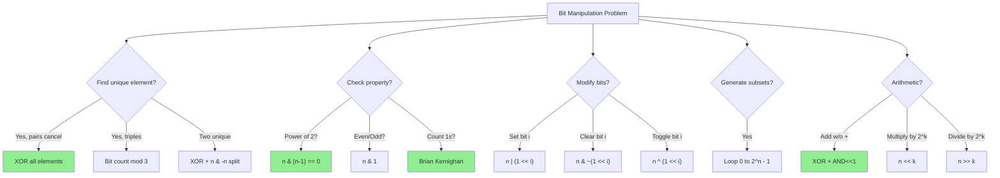

# Bit Manipulation Quick Reference

> **Cheat sheet for bit manipulation operations, formulas, and patterns.**
>
> Print this and keep it handy during practice.

---

## 🎯 Which Technique to Use?



---

## 📐 Bitwise Operators

| Operator | Symbol | Description | Example |
|----------|--------|-------------|---------|
| AND | `&` | 1 if both bits are 1 | `5 & 3 = 1` (0101 & 0011 = 0001) |
| OR | `\|` | 1 if at least one bit is 1 | `5 \| 3 = 7` (0101 \| 0011 = 0111) |
| XOR | `^` | 1 if bits are different | `5 ^ 3 = 6` (0101 ^ 0011 = 0110) |
| NOT | `~` | Flip all bits | `~5 = -6` |
| Left Shift | `<<` | Shift bits left | `5 << 1 = 10` (0101 → 1010) |
| Right Shift | `>>` | Shift bits right | `5 >> 1 = 2` (0101 → 0010) |
| Unsigned Right | `>>>` | JS only, fills with 0 | `-1 >>> 0 = 4294967295` |

---

## 🔧 Essential Bit Operations

| Operation | Formula | Example |
|-----------|---------|---------|
| Check bit i | `(n >> i) & 1` | `(10 >> 1) & 1 = 1` |
| Set bit i | `n \| (1 << i)` | `10 \| 4 = 14` |
| Clear bit i | `n & ~(1 << i)` | `14 & ~4 = 10` |
| Toggle bit i | `n ^ (1 << i)` | `10 ^ 2 = 8` |
| Clear rightmost 1 | `n & (n-1)` | `12 & 11 = 8` |
| Isolate rightmost 1 | `n & (-n)` | `12 & -12 = 4` |
| Set rightmost 0 | `n \| (n+1)` | `10 \| 11 = 11` |
| Clear all bits from i | `n & ((1 << i) - 1)` | Keep bits 0 to i-1 |

---

## 🧮 Math with Bits

| Operation | Bit Equivalent | Notes |
|-----------|----------------|-------|
| n × 2 | `n << 1` | Left shift = multiply |
| n ÷ 2 | `n >> 1` | Right shift = divide (floor) |
| n × 2^k | `n << k` | Fast multiplication |
| n ÷ 2^k | `n >> k` | Fast division |
| n % 2^k | `n & ((1 << k) - 1)` | Faster than modulo |
| n % 2 | `n & 1` | Check even/odd |
| 2^k | `1 << k` | Fast power of 2 |
| -n | `~n + 1` | Two's complement negation |

---

## ✅ Boolean Checks

| Check | Formula | Example |
|-------|---------|---------|
| Is even? | `(n & 1) == 0` | `10 & 1 = 0` ✓ |
| Is odd? | `(n & 1) == 1` | `11 & 1 = 1` ✓ |
| Is power of 2? | `n > 0 && (n & (n-1)) == 0` | `8 & 7 = 0` ✓ |
| Is power of 4? | `isPow2 && (n & 0x55555555)` | Extra mask check |
| Is bit i set? | `(n >> i) & 1` | Returns 0 or 1 |
| Are same sign? | `(a ^ b) >= 0` | Sign bit check |

---

## ⭐ XOR Properties

| Property | Formula | Use Case |
|----------|---------|----------|
| Self-cancel | `a ^ a = 0` | Find unique element |
| Identity | `a ^ 0 = a` | Initialize XOR loop |
| Commutative | `a ^ b = b ^ a` | Order doesn't matter |
| Associative | `(a^b)^c = a^(b^c)` | Group any way |
| Difference | `a ^ b` gives differing bits | Hamming distance |

---

## 🎯 Problem Pattern Quick Reference

| Problem Type | Key Formula | Complexity |
|--------------|-------------|------------|
| Single Number (twice) | XOR all | O(n), O(1) |
| Single Number (thrice) | Bit count mod 3 | O(n), O(1) |
| Two Single Numbers | XOR + n & (-n) split | O(n), O(1) |
| Missing Number | XOR indices + values | O(n), O(1) |
| Count Set Bits | `while n: n &= n-1` | O(bits) |
| Hamming Distance | `popcount(a ^ b)` | O(1) |
| Reverse Bits | Bit-by-bit swap | O(32) |
| Power of Two | `n & (n-1) == 0` | O(1) |
| Subsets | Iterate `0` to `2^n - 1` | O(2^n) |

---

## 🔢 Common Bit Patterns

| Pattern | Hex | Binary | Use |
|---------|-----|--------|-----|
| All 1s (32-bit) | `0xFFFFFFFF` | 11111111... | Mask for unsigned |
| Even positions | `0x55555555` | 01010101... | Power of 4 check |
| Odd positions | `0xAAAAAAAA` | 10101010... | Alternate check |
| Lower 16 bits | `0x0000FFFF` | 00..01111... | Split word |
| Upper 16 bits | `0xFFFF0000` | 11..10000... | Split word |
| Sign bit (32) | `0x80000000` | 10000000... | Check negative |

---

## 🐍 Python-Specific

```python
# Binary representations
bin(42)           # '0b101010'
int('101010', 2)  # 42

# Bit length
(42).bit_length()  # 6

# Count set bits (Python 3.10+)
(42).bit_count()   # 3

# Handle negative as unsigned 32-bit
n = -1
n & 0xFFFFFFFF    # 4294967295

# Arbitrary precision (no overflow!)
2 ** 1000         # Works fine
```

---

## 📜 JavaScript-Specific

```javascript
// Binary representations
(42).toString(2)       // '101010'
parseInt('101010', 2)  // 42

// Bitwise ops use 32-bit signed integers!
2147483647 << 1        // -2 (overflow!)

// Unsigned right shift
-1 >>> 0               // 4294967295

// Use BigInt for large numbers
BigInt(2) ** BigInt(100)  // Works
```

---

## ⚠️ Critical Gotchas

### 1. Operator Precedence
```python
# ❌ WRONG
if n & 1 == 0:  # Parsed as n & (1 == 0)

# ✅ CORRECT
if (n & 1) == 0:
```

### 2. JavaScript 32-bit Limit
```javascript
// Bitwise ops truncate to 32 bits
const big = 2 ** 32;
big | 0;  // 0 (truncated!)
```

### 3. Python Infinite Bits for Negatives
```python
# Python integers have arbitrary precision
# Negative numbers have infinite leading 1s
bin(-1)  # '-0b1' (conceptually ...11111111)

# Mask to 32 bits for consistency
(-1) & 0xFFFFFFFF  # 4294967295
```

### 4. n & (n-1) vs n & (-n)
```python
# CLEAR rightmost 1: n & (n-1)
12 & 11  # 8 (removes the 4)

# ISOLATE rightmost 1: n & (-n)
12 & -12  # 4 (keeps only the 4)
```

---

## 📋 Interview Quick Checklist

Before coding bit manipulation:

- [ ] Handle n = 0 edge case
- [ ] Handle negative numbers if needed
- [ ] Use parentheses for operator precedence
- [ ] Consider 32-bit vs 64-bit limits
- [ ] Know the difference between >> and >>> (JS)

---

## 🔗 Related Files

- [Essential Tricks](../02-Bit-Tricks/2.1-Essential-Tricks.md)
- [XOR Properties](../03-XOR-Patterns/3.1-XOR-Properties.md)
- [Counting Bits](../02-Bit-Tricks/2.2-Counting-Bits.md)
- [Common Mistakes →](./6.2-Common-Mistakes.md)
- [Practice Roadmap →](./6.3-Practice-Roadmap.md)
