# Common Bit Manipulation Mistakes

> **Avoid these pitfalls that trip up even experienced developers.**
>
> Learn from others' mistakes to write bug-free bit manipulation code.

---

## 🗺️ Mistake Categories Overview

```mermaid
flowchart TD
    A["Common Bit Mistakes"] --> B["Syntax Errors"]
    A --> C["Logic Errors"]
    A --> D["Edge Case Errors"]
    A --> E["Language-Specific"]
    
    B --> B1["1️⃣ Operator Precedence"]
    B --> B2["3️⃣ Off-by-One Positions"]
    
    C --> C1["2️⃣ n&(n-1) vs n&(-n)"]
    C --> C2["6️⃣ Self-XOR in Swaps"]
    C --> C3["7️⃣ Wrong Shift Direction"]
    C --> C4["8️⃣ XOR for Non-Pairs"]
    
    D --> D1["4️⃣ Zero Handling"]
    D --> D2["5️⃣ Negative Numbers"]
    D --> D3["🔟 Missing Init"]
    
    E --> E1["9️⃣ Overflow (JS 32-bit)"]
    E --> E2["Python Infinite Bits"]
    
    style B1 fill:#FFB6C1
    style C1 fill:#FFB6C1
    style D1 fill:#FFB6C1
    style E1 fill:#FFB6C1
```



---

## 1️⃣ Operator Precedence Errors

### The Classic Trap

Bitwise operators have **lower precedence** than comparison operators!

```python
# ❌ WRONG - This is parsed as: n & (1 == 0) = n & False = 0
if n & 1 == 0:
    print("even")

# ✅ CORRECT - Use parentheses
if (n & 1) == 0:
    print("even")
```

```javascript
// ❌ WRONG - Same issue in JavaScript
if (n & 1 == 0) {  // Parsed as n & (1 == 0)
    console.log("even");
}

// ✅ CORRECT
if ((n & 1) === 0) {
    console.log("even");
}
```

### Precedence Order (High to Low)

| Priority | Operators |
|----------|-----------|
| High | `()`, `[]`, `.` |
| | `~`, `!`, unary `-` |
| | `*`, `/`, `%` |
| | `+`, `-` |
| | `<<`, `>>`, `>>>` |
| | `<`, `<=`, `>`, `>=` |
| | `==`, `!=`, `===`, `!==` |
| | `&` (bitwise AND) |
| | `^` (XOR) |
| | `\|` (bitwise OR) |
| Low | `&&`, `\|\|` |

**Rule of thumb:** When in doubt, use parentheses!

---

## 2️⃣ Confusing n & (n-1) and n & (-n)

### The Difference

| Formula | What It Does | Example |
|---------|--------------|---------|
| `n & (n-1)` | **Clears** rightmost 1 | `12 & 11 = 8` |
| `n & (-n)` | **Isolates** rightmost 1 | `12 & -12 = 4` |

```python
n = 12  # Binary: 1100

# Clear rightmost 1
print(n & (n - 1))  # 12 & 11 = 1100 & 1011 = 1000 = 8

# Isolate rightmost 1
print(n & (-n))     # 12 & -12 = 1100 & 0100 = 0100 = 4
```

### When to Use Each

```python
# Count set bits → use n & (n-1) to clear bits one by one
def count_bits(n):
    count = 0
    while n:
        n &= n - 1  # Clear one bit
        count += 1
    return count

# Split array by bit → use n & (-n) to get the splitting bit
def split_by_bit(nums, xor_result):
    diff_bit = xor_result & (-xor_result)  # Isolate one bit
    # ... split into two groups
```

---

## 3️⃣ Off-by-One in Bit Positions

### Bit Positions are 0-Indexed from the Right

```
Number: 8 = 1000 (binary)

Position: 3 2 1 0  (RIGHT to LEFT, starting at 0)
Bits:     1 0 0 0

Bit 3 is set (not bit 4!)
Bit 0, 1, 2 are NOT set
```

```python
# ❌ WRONG - Checking bit 4 for value 8
n = 8
print((n >> 4) & 1)  # 0 (wrong bit!)

# ✅ CORRECT - Bit 3 is set in 8 = 1000
print((n >> 3) & 1)  # 1 (correct!)
```

### Common Off-by-One Bugs

```python
# ❌ WRONG - Setting bit 1 when you want position 0
n = 0
n |= (1 << 1)  # Sets bit at position 1, not 0
print(n)  # 2, not 1!

# ✅ CORRECT - Position 0 for the rightmost bit
n = 0
n |= (1 << 0)  # or just n |= 1
print(n)  # 1
```

---

## 4️⃣ Forgetting to Handle Zero

### Zero Breaks Many Bit Checks

```python
# ❌ WRONG - 0 passes the power of 2 check!
def is_power_of_two_wrong(n):
    return (n & (n - 1)) == 0
# 0 & (-1) = 0, so returns True!

# ✅ CORRECT - Explicitly check n > 0
def is_power_of_two(n):
    return n > 0 and (n & (n - 1)) == 0
```

### Zero Edge Cases by Problem

| Problem | Zero Handling |
|---------|---------------|
| Power of Two | `n > 0 and ...` |
| Count Set Bits | Returns 0 (correct) |
| Single Number | May return 0 if unique is 0 |
| Missing Number | May be 0 that's missing |

---

## 5️⃣ Negative Number Handling

### Python's Arbitrary Precision

Python integers have **infinite precision**, so negative numbers have conceptually infinite leading 1s.

```python
# Python: -1 has infinite 1s
bin(-1)  # '-0b1' (represents ...11111111)

# Shifting negative numbers in Python
-1 >> 1  # -1 (still -1 forever!)

# To treat as unsigned 32-bit:
n = -1
print(n & 0xFFFFFFFF)  # 4294967295
```

### JavaScript's 32-bit Signed

JavaScript bitwise operations use **32-bit signed integers**.

```javascript
// JavaScript truncates to 32 bits
const n = 2 ** 32;
console.log(n | 0);  // 0 (truncated!)

// Sign bit can cause issues
console.log(1 << 31);  // -2147483648 (not 2^31!)

// Use unsigned right shift to fix
console.log((1 << 31) >>> 0);  // 2147483648
```

---

## 6️⃣ XOR Self-Reference in Swaps

### The Dangerous Self-XOR

```python
# ❌ DANGEROUS - If i == j, this zeros out arr[i]!
def swap_in_array(arr, i, j):
    arr[i] ^= arr[j]
    arr[j] ^= arr[i]
    arr[i] ^= arr[j]

arr = [1, 2, 3]
swap_in_array(arr, 0, 0)  # Trying to "swap" same element
print(arr)  # [0, 2, 3] - arr[0] is now 0!

# ✅ SAFE - Check i != j first
def swap_in_array_safe(arr, i, j):
    if i != j:
        arr[i] ^= arr[j]
        arr[j] ^= arr[i]
        arr[i] ^= arr[j]
```

**Why it happens:**
```
i = j = 0, arr[0] = 5
arr[i] ^= arr[j]  → arr[0] = 5 ^ 5 = 0
arr[j] ^= arr[i]  → arr[0] = 0 ^ 0 = 0
arr[i] ^= arr[j]  → arr[0] = 0 ^ 0 = 0
```

---

## 7️⃣ Wrong Shift Direction

### Left Shift = Multiply, Right Shift = Divide

```python
# Multiply by 2
n << 1  # Shifts bits LEFT

# Divide by 2
n >> 1  # Shifts bits RIGHT

# ❌ COMMON MISTAKE - Reversing the direction
def double_wrong(n):
    return n >> 1  # This DIVIDES, not multiplies!

def halve_wrong(n):
    return n << 1  # This MULTIPLIES, not divides!
```

### Signed vs Unsigned Shift (JavaScript)

```javascript
// >> preserves sign bit (arithmetic shift)
console.log(-8 >> 1);  // -4

// >>> fills with zeros (logical shift)
console.log(-8 >>> 1);  // 2147483644 (large positive!)
```

---

## 8️⃣ XOR for Non-Pair Counts

### XOR Only Cancels Pairs

```python
# ❌ WRONG - XOR doesn't work when elements appear 3 times!
def find_unique_wrong(nums):  # [1, 1, 1, 2]
    result = 0
    for num in nums:
        result ^= num
    return result  # Returns 1 ^ 2 = 3, NOT 2!

# ✅ CORRECT for triples - use bit counting
def find_unique_triples(nums):
    result = 0
    for i in range(32):
        bit_sum = sum((num >> i) & 1 for num in nums)
        if bit_sum % 3:
            result |= (1 << i)
    return result
```

---

## 9️⃣ Overflow in Bit Operations

### Python: No Overflow (But May Need Masking)

```python
# Python handles large integers fine
print(1 << 100)  # Works!

# But for 32-bit compatibility, mask:
n = 1 << 35
n32 = n & 0xFFFFFFFF  # Simulate 32-bit
```

### JavaScript: 32-bit Overflow

```javascript
// Bitwise ops are 32-bit in JS
console.log(1 << 32);  // 1 (wrapped around!)
console.log(1 << 31);  // -2147483648 (sign bit!)

// For large numbers, use BigInt
console.log(BigInt(1) << BigInt(100));  // Works
```

---

## 🔟 Missing Initialization

### Forgetting to Initialize XOR Accumulator

```python
# ❌ WRONG - using first element as initial
result = nums[0]
for num in nums[1:]:
    result ^= num
# This doesn't XOR nums[0] with itself, so it "survives"

# ✅ CORRECT - always start with 0
result = 0
for num in nums:
    result ^= num
```

### Missing Number Edge Case

```python
# ❌ WRONG - missing n in the XOR
def missing_number_wrong(nums):
    result = 0
    for i, num in enumerate(nums):
        result ^= i ^ num
    return result  # Missing n!

# ✅ CORRECT - start with n
def missing_number(nums):
    n = len(nums)
    result = n  # Include n in XOR
    for i, num in enumerate(nums):
        result ^= i ^ num
    return result
```

---

## 📋 Pre-Submission Checklist

Before submitting any bit manipulation solution:

- [ ] **Parentheses:** All bitwise ops in comparisons have parentheses
- [ ] **Zero check:** Handled n = 0 edge case
- [ ] **Negative check:** Handled negative numbers if applicable
- [ ] **Formula check:** Used correct formula (n-1 vs -n)
- [ ] **Position check:** Bit positions are 0-indexed from right
- [ ] **XOR pairs:** XOR only cancels elements appearing even times
- [ ] **Self-XOR:** Swap checks i != j before XOR swap
- [ ] **Overflow:** Considered 32-bit limits (especially JS)
- [ ] **Init:** Accumulators initialized to 0

---

## 🎤 Interview Recovery

If you make a mistake during an interview:

> "Oh, I need parentheses here - bitwise operators have lower precedence than comparison."

> "Wait, I should check n > 0 first - zero would break this."

> "Let me verify - I want n & (n-1) to clear the bit, not n & (-n) to isolate it."

**Catching and fixing your own bugs shows awareness!**

---

> **💡 Key Insight:** Most bit manipulation bugs come from precedence, off-by-one, or forgetting edge cases. When in doubt: add parentheses, check for zero, and trace through with a small example.

> **🔗 Related:** [Quick Reference ←](./6.1-Quick-Reference.md) | [Practice Roadmap →](./6.3-Practice-Roadmap.md)
