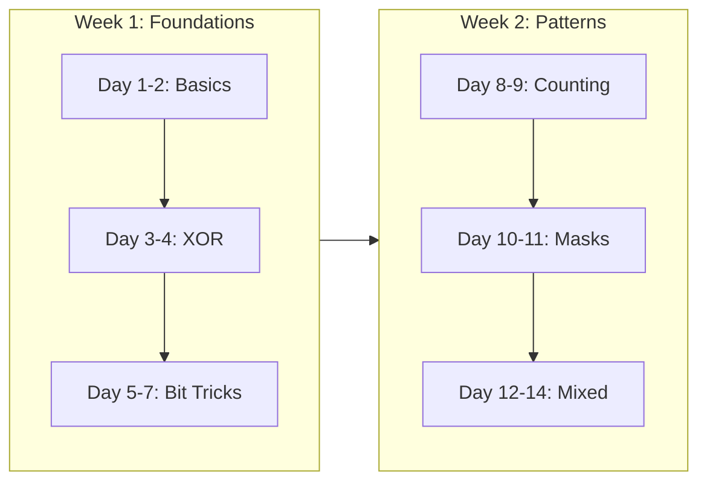
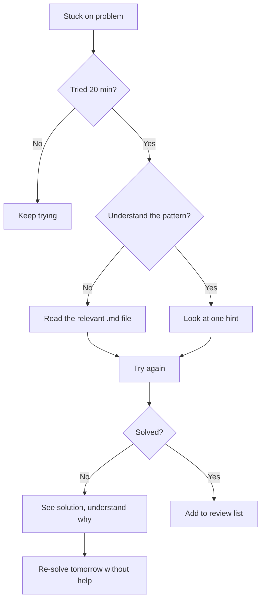

# Bit Manipulation Practice Roadmap

> **A structured path from zero to interview-ready in 2 weeks.**
>
> Follow this progression to build confidence with bit manipulation.

---

## 📊 Overall Strategy

---

## 📅 Week 1: Foundations & XOR

### Day 1-2: Binary Basics

**Goal:** Comfortable with binary representation and basic operations

**Learn:**
- [ ] Read [1.1-Binary-Basics.md](../01-Fundamentals/1.1-Binary-Basics.md)
- [ ] Read [1.2-Bitwise-Operators.md](../01-Fundamentals/1.2-Bitwise-Operators.md)

**Practice (Warm-up):**
| Problem | Difficulty | Focus | Time |
|---------|------------|-------|------|
| [Number of 1 Bits](https://leetcode.com/problems/number-of-1-bits/) | Easy | Basic bit counting | 10 min |
| [Reverse Bits](https://leetcode.com/problems/reverse-bits/) | Easy | Bit manipulation basics | 15 min |
| [Hamming Distance](https://leetcode.com/problems/hamming-distance/) | Easy | XOR + count | 10 min |

**Checkpoint:** Can you convert decimal ↔ binary mentally for small numbers?

---

### Day 3-4: XOR Mastery

**Goal:** Master XOR properties for interview patterns

**Learn:**
- [ ] Read [3.1-XOR-Properties.md](../03-XOR-Patterns/3.1-XOR-Properties.md)
- [ ] Read [3.2-Single-Number-Variants.md](../03-XOR-Patterns/3.2-Single-Number-Variants.md)

**Practice (Core XOR):**
| Problem | Difficulty | Pattern | Time |
|---------|------------|---------|------|
| [Single Number](https://leetcode.com/problems/single-number/) | Easy | Basic XOR | 5 min |
| [Missing Number](https://leetcode.com/problems/missing-number/) | Easy | XOR with indices | 10 min |
| [Single Number III](https://leetcode.com/problems/single-number-iii/) | Medium | XOR + bit split | 25 min |
| [Single Number II](https://leetcode.com/problems/single-number-ii/) | Medium | Bit counting | 25 min |

**Checkpoint:** Can you explain why XOR cancels pairs?

---

### Day 5-7: Essential Bit Tricks

**Goal:** Know the 6 essential operations by heart

**Learn:**
- [ ] Read [2.1-Essential-Tricks.md](../02-Bit-Tricks/2.1-Essential-Tricks.md)
- [ ] Read [2.2-Counting-Bits.md](../02-Bit-Tricks/2.2-Counting-Bits.md)
- [ ] Read [2.3-Power-Of-Two.md](../02-Bit-Tricks/2.3-Power-Of-Two.md)

**Practice (Bit Tricks):**
| Problem | Difficulty | Trick | Time |
|---------|------------|-------|------|
| [Power of Two](https://leetcode.com/problems/power-of-two/) | Easy | n & (n-1) | 5 min |
| [Power of Four](https://leetcode.com/problems/power-of-four/) | Easy | Mask pattern | 10 min |
| [Counting Bits](https://leetcode.com/problems/counting-bits/) | Easy | DP + bits | 15 min |
| [Bitwise AND of Numbers Range](https://leetcode.com/problems/bitwise-and-of-numbers-range/) | Medium | Common prefix | 20 min |

**Checkpoint:** Can you write `n & (n-1)` and explain what it does?

---

## 📅 Week 2: Advanced Patterns

### Day 8-9: Counting & Subsets

**Goal:** Use bits for subset generation and state representation

**Learn:**
- [ ] Read [4.1-Subset-Generation.md](../04-Bitmask-Patterns/4.1-Subset-Generation.md)
- [ ] Read [4.2-State-Compression.md](../04-Bitmask-Patterns/4.2-State-Compression.md)

**Practice (Bitmask):**
| Problem | Difficulty | Pattern | Time |
|---------|------------|---------|------|
| [Subsets](https://leetcode.com/problems/subsets/) | Medium | 2^n masks | 15 min |
| [Subsets II](https://leetcode.com/problems/subsets-ii/) | Medium | Dedup | 20 min |
| [Maximum Product of Word Lengths](https://leetcode.com/problems/maximum-product-of-word-lengths/) | Medium | Char mask | 25 min |

**Checkpoint:** Can you generate all 2^n subsets using a loop?

---

### Day 10-11: Arithmetic with Bits

**Goal:** Perform math without +, -, *, /

**Learn:**
- [ ] Read [5.1-Addition-Without-Plus.md](../05-Arithmetic-With-Bits/5.1-Addition-Without-Plus.md)
- [ ] Read [5.2-Division-With-Shifts.md](../05-Arithmetic-With-Bits/5.2-Division-With-Shifts.md)

**Practice (Math):**
| Problem | Difficulty | Operation | Time |
|---------|------------|-----------|------|
| [Sum of Two Integers](https://leetcode.com/problems/sum-of-two-integers/) | Medium | Add w/o + | 20 min |
| [Divide Two Integers](https://leetcode.com/problems/divide-two-integers/) | Medium | Divide w/o / | 30 min |
| [UTF-8 Validation](https://leetcode.com/problems/utf-8-validation/) | Medium | Bit parsing | 25 min |

**Checkpoint:** Can you add two numbers using only XOR and AND?

---

### Day 12-14: Mixed Practice & Review

**Goal:** Solve problems without hints, interview simulation

**Review:**
- [ ] Memorize [6.1-Quick-Reference.md](./6.1-Quick-Reference.md)
- [ ] Review [6.2-Common-Mistakes.md](./6.2-Common-Mistakes.md)

**Mixed Practice (No Hints):**
| Problem | Difficulty | Why It's Good | Time |
|---------|------------|---------------|------|
| [Total Hamming Distance](https://leetcode.com/problems/total-hamming-distance/) | Medium | Bit counting + math | 25 min |
| [Gray Code](https://leetcode.com/problems/gray-code/) | Medium | Bit pattern | 25 min |
| [Concatenation of Consecutive Binary Numbers](https://leetcode.com/problems/concatenation-of-consecutive-binary-numbers/) | Medium | Bit length | 25 min |
| [Minimum Flips to Make a OR b Equal to c](https://leetcode.com/problems/minimum-flips-to-make-a-or-b-equal-to-c/) | Medium | Bit comparison | 20 min |

**Mock Interview (45 min each):**
- Pick 1 Easy + 1 Medium, solve under time pressure
- Practice explaining your approach out loud

---

## 🏆 Mastery Checklist

### Must-Know for Interviews

| Concept | Can Explain? | Can Code? | Solved Problem? |
|---------|--------------|-----------|-----------------|
| XOR cancellation | [ ] | [ ] | [ ] Single Number |
| n & (n-1) clears bit | [ ] | [ ] | [ ] Power of Two |
| n & (-n) isolates bit | [ ] | [ ] | [ ] Single Number III |
| Brian Kernighan's | [ ] | [ ] | [ ] Number of 1 Bits |
| Subset with bitmask | [ ] | [ ] | [ ] Subsets |
| Add without + | [ ] | [ ] | [ ] Sum of Two Integers |

### Spaced Repetition Schedule

After completing the roadmap, maintain with this schedule:

| Day After | Activity | Duration |
|-----------|----------|----------|
| Day 1 | Re-solve favorite problem | 10 min |
| Day 3 | Review Quick Reference | 5 min |
| Day 7 | Solve 1 new problem | 20 min |
| Day 14 | Mixed practice (2 problems) | 40 min |
| Day 30 | Full review + 3 problems | 1 hour |

---

## 📈 Progress Tracker

### Week 1 Log

| Day | Date | Problems Solved | Notes |
|-----|------|-----------------|-------|
| 1 | ____ | [ ] [ ] [ ] | |
| 2 | ____ | [ ] [ ] [ ] | |
| 3 | ____ | [ ] [ ] [ ] | |
| 4 | ____ | [ ] [ ] [ ] | |
| 5 | ____ | [ ] [ ] [ ] | |
| 6 | ____ | [ ] [ ] [ ] | |
| 7 | ____ | [ ] [ ] [ ] | |

### Week 2 Log

| Day | Date | Problems Solved | Notes |
|-----|------|-----------------|-------|
| 8 | ____ | [ ] [ ] [ ] | |
| 9 | ____ | [ ] [ ] [ ] | |
| 10 | ____ | [ ] [ ] [ ] | |
| 11 | ____ | [ ] [ ] [ ] | |
| 12 | ____ | [ ] [ ] [ ] | |
| 13 | ____ | [ ] [ ] [ ] | |
| 14 | ____ | [ ] [ ] [ ] | |

---

## 🎯 Company-Specific Focus

### If Targeting Specific Companies

| Company | Focus Areas | Extra Problems |
|---------|-------------|----------------|
| **Amazon** | XOR, Power of Two | Single Number, Missing Number |
| **Google** | Arithmetic, Masks | Sum of Two Integers, Gray Code |
| **Meta** | Clean code, edge cases | Power of Four, Counting Bits |
| **Microsoft** | Fundamentals | Reverse Bits, Hamming Distance |

### Time Budget by Company Level

| Level | Bit Problems Expected | Prep Time |
|-------|----------------------|-----------|
| New Grad | 0-1 per loop | 1 week |
| L4/E4 | 0-1 per loop | 1 week |
| L5/E5+ | Rare, usually combined | 3-5 days |

---

## 💡 Study Tips

### Effective Practice

1. **Time yourself** - Use a timer for each problem
2. **Don't look at hints** - Struggle for 20 min before peeking
3. **Trace by hand** - Draw bits on paper for complex operations
4. **Explain out loud** - Practice the communication aspect
5. **Review mistakes** - Keep a log of bugs you made

### When Stuck

### Building Intuition

- **Binary visualization:** Write out bits for every operation
- **Pattern recognition:** Notice when XOR, masks, or n-1 tricks apply
- **Mental math:** Practice small conversions (13 = 1101, etc.)

---

> **💡 Key Insight:** Bit manipulation is a small topic (~15 problems). Two focused weeks can take you from beginner to interview-ready.

> **🔗 Related:** [Common Mistakes ←](./6.2-Common-Mistakes.md) | [Quick Reference](./6.1-Quick-Reference.md)
