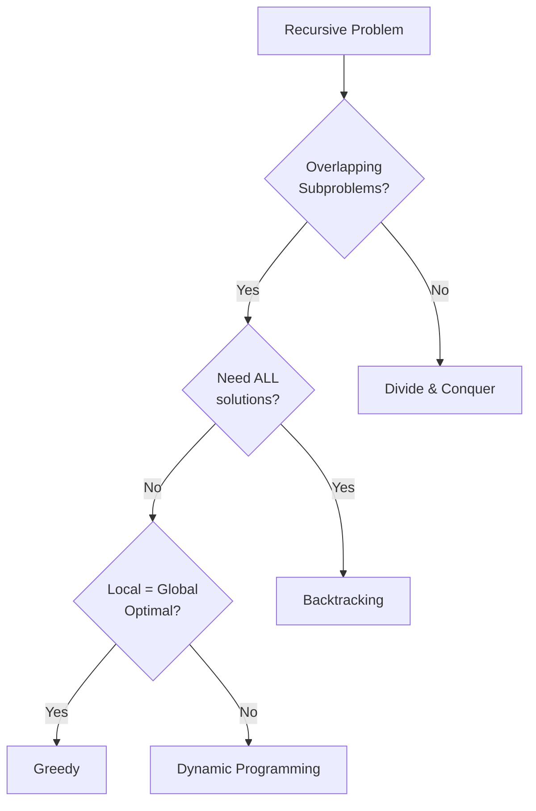

# 1.1 What Is Dynamic Programming?

> **Dynamic Programming (DP)** is an algorithmic technique that solves complex problems by breaking them into simpler overlapping subproblems, solving each subproblem only once, and storing the results to avoid redundant computation.

---

## 🎯 Pattern Recognition

<details>
<summary><strong>How to Identify a DP Problem</strong></summary>

**Look for these signals:**
- Problem asks for **optimal** value (min, max, longest, shortest)
- Problem asks to **count** the number of ways
- Problem asks if something is **possible** (true/false)
- Making a choice at each step affects future choices
- Same subproblem appears multiple times during recursion

**Keywords in problem statements:**
- "Find the minimum/maximum..."
- "Count the number of ways..."
- "Is it possible to..."
- "Find the longest/shortest..."
- "What is the probability..."

**Quick Recognition Test:**
1. Can I define a **state** that represents a subproblem?
2. Can I express the **solution** in terms of smaller subproblems?
3. Do the same subproblems appear **multiple times**?

If YES to all three → DP is likely applicable!

</details>

---

## ✅ Two Essential Properties

For DP to work, your problem MUST have these two properties:

### 1. Optimal Substructure

The optimal solution to the problem can be constructed from optimal solutions of its subproblems.

```
Example: Fibonacci(5)
         = Fibonacci(4) + Fibonacci(3)
         
         The answer to F(5) is built from answers to F(4) and F(3)
```

**Visualization:**
```
                    Fib(5) = 5
                   /         \
              Fib(4)=3    Fib(3)=2
              /    \       /    \
         Fib(3)=2  Fib(2)=1  Fib(2)=1  Fib(1)=1
         /    \      
    Fib(2)=1  Fib(1)=1
```

### 2. Overlapping Subproblems

The same subproblems are solved multiple times during the computation.

```
In Fibonacci(5):
- Fib(3) is computed 2 times
- Fib(2) is computed 3 times
- Fib(1) is computed 5 times

WITHOUT DP: Solve each occurrence → O(2^n) time
WITH DP: Solve once, reuse → O(n) time
```

---

## ❌ When NOT to Use DP

| Scenario | Why Not DP | Use Instead |
|----------|------------|-------------|
| No overlapping subproblems | Nothing to cache | Divide & Conquer |
| Local choice = global optimum | Simpler solution exists | Greedy |
| Need ALL solutions, not optimal | DP finds one optimal | Backtracking |
| Problem has no optimal substructure | Can't build from subproblems | Brute Force / Other |

**Example - When Greedy Works (NOT DP):**
```
Activity Selection: Pick most non-overlapping activities
→ Always pick the activity that ends earliest
→ Local optimal choice leads to global optimal
→ Use GREEDY, not DP
```

---

## 🔗 Concept Map

<details>
<summary><strong>Prerequisites & Next Steps</strong></summary>

**Before this, you should know:**
- [Recursion Basics](../../02-Recursion-Backtracking/01-Recursion/1.1-Recursion-Basics.md)
- [Time Complexity](../../00-Prerequisites.md)

**After mastering this:**
- [Memoization (Top-Down)](./2.1-Top-Down-Memoization.md)
- [Tabulation (Bottom-Up)](./2.2-Bottom-Up-Tabulation.md)

**Related Concepts:**
- Divide & Conquer (non-overlapping subproblems)
- Greedy Algorithms (local = global optimal)

</details>

---

## 📐 How DP Works: The Core Idea

### Step 1: Identify the Recursive Solution

Every DP problem starts as a recursive problem:

```python
def fib(n):
    """Naive recursive Fibonacci - O(2^n) time"""
    if n <= 1:
        return n
    return fib(n - 1) + fib(n - 2)
```

### Step 2: Observe the Redundancy

When we trace `fib(5)`:

```
                    fib(5)
                   /      \
              fib(4)      fib(3)      ← fib(3) computed here
              /    \       /    \
         fib(3)  fib(2)  fib(2)  fib(1)  ← fib(3), fib(2) AGAIN!
         /    \
    fib(2)  fib(1)                        ← fib(2) yet AGAIN!
```

**Problem:** We compute `fib(3)` twice, `fib(2)` three times!

### Step 3: Store & Reuse (The DP Magic)

```python
def fib_dp(n, memo={}):
    """DP Fibonacci - O(n) time, O(n) space"""
    if n in memo:
        return memo[n]  # Already computed!
    if n <= 1:
        return n
    
    memo[n] = fib_dp(n - 1, memo) + fib_dp(n - 2, memo)
    return memo[n]
```

**After DP:**
```
fib(5) → Check memo? No → Compute
  fib(4) → Check memo? No → Compute
    fib(3) → Check memo? No → Compute
      fib(2) → Check memo? No → Compute → Store memo[2]=1
      fib(1) → Return 1
    Store memo[3]=2
    fib(2) → Check memo? YES! → Return 1 (no recomputation)
  Store memo[4]=3
  fib(3) → Check memo? YES! → Return 2 (no recomputation)
Store memo[5]=5
```

---

## 💻 Code Implementation

### Python - Recursive vs DP Comparison

```python
import time

# ❌ Naive Recursion - O(2^n) time
def fib_naive(n: int) -> int:
    """Exponential time - DO NOT USE for large n."""
    if n <= 1:
        return n
    return fib_naive(n - 1) + fib_naive(n - 2)

# ✅ DP with Memoization - O(n) time, O(n) space
def fib_memo(n: int, memo: dict = None) -> int:
    """Linear time with memoization."""
    if memo is None:
        memo = {}
    
    if n in memo:
        return memo[n]
    if n <= 1:
        return n
    
    memo[n] = fib_memo(n - 1, memo) + fib_memo(n - 2, memo)
    return memo[n]

# ✅ DP with Tabulation - O(n) time, O(n) space
def fib_table(n: int) -> int:
    """Linear time with tabulation."""
    if n <= 1:
        return n
    
    dp = [0] * (n + 1)
    dp[0], dp[1] = 0, 1
    
    for i in range(2, n + 1):
        dp[i] = dp[i - 1] + dp[i - 2]
    
    return dp[n]

# ✅ Space Optimized - O(n) time, O(1) space
def fib_optimized(n: int) -> int:
    """Linear time, constant space."""
    if n <= 1:
        return n
    
    prev2, prev1 = 0, 1
    for _ in range(2, n + 1):
        curr = prev1 + prev2
        prev2, prev1 = prev1, curr
    
    return prev1
```

### JavaScript - Same Approaches

```javascript
// ❌ Naive Recursion - O(2^n)
function fibNaive(n) {
    if (n <= 1) return n;
    return fibNaive(n - 1) + fibNaive(n - 2);
}

// ✅ DP with Memoization - O(n)
function fibMemo(n, memo = {}) {
    if (n in memo) return memo[n];
    if (n <= 1) return n;
    
    memo[n] = fibMemo(n - 1, memo) + fibMemo(n - 2, memo);
    return memo[n];
}

// ✅ DP with Tabulation - O(n)
function fibTable(n) {
    if (n <= 1) return n;
    
    const dp = new Array(n + 1).fill(0);
    dp[1] = 1;
    
    for (let i = 2; i <= n; i++) {
        dp[i] = dp[i - 1] + dp[i - 2];
    }
    
    return dp[n];
}

// ✅ Space Optimized - O(1) space
function fibOptimized(n) {
    if (n <= 1) return n;
    
    let prev2 = 0, prev1 = 1;
    for (let i = 2; i <= n; i++) {
        const curr = prev1 + prev2;
        prev2 = prev1;
        prev1 = curr;
    }
    
    return prev1;
}
```

---

## ⚡ Complexity Analysis

| Approach | Time | Space | Notes |
|----------|------|-------|-------|
| Naive Recursion | O(2ⁿ) | O(n) | Call stack depth |
| Memoization (Top-Down) | O(n) | O(n) | memo + call stack |
| Tabulation (Bottom-Up) | O(n) | O(n) | dp array |
| Space Optimized | O(n) | O(1) | Only 2-3 variables |

**Why the dramatic improvement?**

```
Naive: Each call branches into 2 more → 2^n total calls
DP:    Each subproblem solved ONCE → n total computations

For n=50:
- Naive: 2^50 ≈ 10^15 operations (would take YEARS)
- DP:    50 operations (instant)
```

---

## 🔄 DP vs Related Techniques

| Technique | Key Characteristic | When to Use |
|-----------|-------------------|-------------|
| **DP** | Overlapping subproblems, cache results | Optimization, counting |
| **Divide & Conquer** | Non-overlapping subproblems | Merge Sort, Quick Sort |
| **Greedy** | Local optimal = global optimal | Interval scheduling |
| **Recursion** | Base technique for all above | Foundation |
| **Backtracking** | Explore all possibilities | Find ALL solutions |



---

## ⚠️ Common Mistakes

### 1. Using DP When Greedy Works

**❌ Wrong thinking:**
```
"This is an optimization problem, let me use DP"
```

**✅ Correct approach:**
```
First check: Does local optimal lead to global optimal?
If YES → Use Greedy (simpler)
If NO → Use DP
```

### 2. Missing Base Cases

**❌ Incomplete:**
```python
def fib(n, memo={}):
    if n in memo:
        return memo[n]
    # Missing base case for n <= 1!
    memo[n] = fib(n-1, memo) + fib(n-2, memo)
    return memo[n]
```

**✅ Complete:**
```python
def fib(n, memo={}):
    if n in memo:
        return memo[n]
    if n <= 1:  # Base case!
        return n
    memo[n] = fib(n-1, memo) + fib(n-2, memo)
    return memo[n]
```

### 3. Confusing DP with Memoization

**DP is the TECHNIQUE** (solving by subproblems + storing results)

**Memoization & Tabulation are IMPLEMENTATIONS** of DP:
- Memoization = Top-down (recursive)
- Tabulation = Bottom-up (iterative)

---

## 📝 Practice Problems (Progressive)

**Easy (Understand the concept):**
- [ ] [Climbing Stairs](https://leetcode.com/problems/climbing-stairs/) - Classic Fibonacci variant
- [ ] [Fibonacci Number](https://leetcode.com/problems/fibonacci-number/) - Direct implementation

**Medium (Apply the pattern):**
- [ ] [House Robber](https://leetcode.com/problems/house-robber/) - Decision at each step
- [ ] [Coin Change](https://leetcode.com/problems/coin-change/) - Classic DP

**Hard (Master the technique):**
- [ ] [Edit Distance](https://leetcode.com/problems/edit-distance/) - 2D DP

<details>
<summary><strong>🧠 Spaced Repetition Schedule</strong></summary>

After learning this concept:
- **Day 1:** Re-read, implement Fibonacci with memoization
- **Day 3:** Solve Climbing Stairs without looking at notes
- **Day 7:** Explain DP to someone (rubber duck)
- **Day 14:** Solve House Robber
- **Day 30:** Review if any concept feels fuzzy

</details>

---

## 🎤 Interview Context

<details>
<summary><strong>How to Communicate DP in Interviews</strong></summary>

**When you recognize a DP problem, say:**
> "This looks like a DP problem because I see overlapping subproblems - the same computation would happen multiple times in a naive recursive solution."

**The 4-Step Framework (explain this to interviewer):**
1. **Identify State:** "The state here is [what changes between subproblems]"
2. **Define Recurrence:** "The relationship is dp[i] = [formula]"
3. **Base Case:** "The smallest subproblem is when [condition]"
4. **Build Solution:** "I'll use [memoization/tabulation] because [reason]"

**Company Focus:**
| Company | DP Importance | Notes |
|---------|---------------|-------|
| Google | ⭐⭐⭐⭐⭐ | High frequency, complex variations |
| Amazon | ⭐⭐⭐ | Standard patterns |
| Meta | ⭐⭐⭐ | Grid and string DP |
| Microsoft | ⭐⭐⭐ | Standard patterns |

</details>

---

## ⏱️ Time Estimates

| Activity | Time | Notes |
|----------|------|-------|
| Understand concept | 30-45 min | Read + examples |
| Implement Fibonacci variants | 20-30 min | All 4 approaches |
| Solve first DP problem | 30-45 min | With guidance |
| Recognize DP patterns | 2-3 hours | Multiple problems |
| Master DP thinking | 2-4 weeks | Daily practice |

---

> **💡 Key Insight:** DP is not about memorizing solutions—it's about recognizing that you're solving the same subproblem multiple times and deciding to store the result instead of recomputing it. The magic is in identifying the **state** that defines each subproblem.

> **🔗 Related:** [Memoization (Top-Down)](./2.1-Top-Down-Memoization.md) | [Tabulation (Bottom-Up)](./2.2-Bottom-Up-Tabulation.md) | [Problem-Solving Framework](./3.0-DP-Problem-Solving-Framework.md)
