# 1.2 When to Use Dynamic Programming

> **Use DP when your problem has overlapping subproblems AND optimal substructure.** This section provides a systematic approach to recognize DP opportunities.

---

## 🎯 Pattern Recognition

<details>
<summary><strong>The DP Recognition Checklist</strong></summary>

Ask yourself these questions in order:

**1. What is the problem asking for?**
- ✅ Minimum/Maximum value → Likely DP
- ✅ Count number of ways → Likely DP
- ✅ Is it possible (true/false) → Likely DP
- ✅ Longest/Shortest sequence → Likely DP
- ❌ Find ALL solutions → Probably Backtracking
- ❌ Find ANY one solution → Could be Greedy

**2. Does making a choice affect future choices?**
- ✅ Yes, my current choice constrains what I can do next → DP
- ❌ No, each choice is independent → Greedy or simple iteration

**3. Are there overlapping subproblems?**
- ✅ Same calculation needed multiple times → DP
- ❌ Each subproblem is unique → Divide & Conquer

</details>

---

## ✅ When to Use DP

### Category 1: Optimization Problems

**Problem type:** Find the minimum or maximum of something.

| Keywords | Example Problems |
|----------|-----------------|
| "minimum cost" | Coin Change, Min Path Sum |
| "maximum profit" | House Robber, Stock Problems |
| "longest" | LIS, LCS, Longest Palindrome |
| "shortest" | Shortest Path (some variants) |

**Example Recognition:**
```
Problem: "Find the minimum number of coins to make amount X"

Analysis:
- Asking for MINIMUM → optimization ✓
- Choice at each step (which coin?) affects remaining amount ✓
- Same "remaining amount" subproblem appears multiple times ✓

Verdict: USE DP
```

### Category 2: Counting Problems

**Problem type:** Count the number of ways to do something.

| Keywords | Example Problems |
|----------|-----------------|
| "count ways" | Climbing Stairs, Decode Ways |
| "number of paths" | Unique Paths, Grid Paths |
| "how many" | Subset Sum Count, Coin Change II |

**Example Recognition:**
```
Problem: "Count the number of ways to reach the top of n stairs, 
          taking 1 or 2 steps at a time"

Analysis:
- Asking to COUNT → ✓
- Ways to reach stair n = (ways to reach n-1) + (ways to reach n-2) ✓
- Overlapping: ways(n-1) and ways(n-2) share subproblems ✓

Verdict: USE DP
```

### Category 3: Decision Problems (True/False)

**Problem type:** Determine if something is possible.

| Keywords | Example Problems |
|----------|-----------------|
| "is it possible" | Partition Equal Subset Sum |
| "can we" | Word Break, Jump Game |
| "does there exist" | Subset Sum |

**Example Recognition:**
```
Problem: "Can we partition array into two subsets with equal sum?"

Analysis:
- Asking if POSSIBLE → ✓
- Each element: include in subset1 or not? → decisions ✓
- Same "remaining sum" checked multiple times ✓

Verdict: USE DP
```

### Category 4: Sequence/String Problems

**Problem type:** Find patterns in sequences or strings.

| Keywords | Example Problems |
|----------|-----------------|
| "subsequence" | LCS, LIS, Distinct Subsequences |
| "substring" | Longest Palindromic Substring |
| "edit/transform" | Edit Distance, Word Ladder |

---

## ❌ When NOT to Use DP

### 1. Local Optimal = Global Optimal (Use Greedy Instead)

| Problem | Why Greedy Works | Not DP |
|---------|------------------|--------|
| Activity Selection | Always pick earliest end time | No overlapping subproblems |
| Fractional Knapsack | Always pick best value/weight ratio | Items divisible |
| Huffman Coding | Always combine two smallest | Greedy choice property |

**How to tell:** If you can make the locally best choice at each step without considering future consequences, use Greedy.

```python
# Greedy: Activity Selection
# Always pick activity that ends earliest
def activity_selection(activities):
    activities.sort(key=lambda x: x[1])  # Sort by end time
    result = [activities[0]]
    last_end = activities[0][1]
    
    for start, end in activities[1:]:
        if start >= last_end:  # No overlap
            result.append((start, end))
            last_end = end
    
    return result
# No need for DP - local choice is always optimal!
```

### 2. Non-Overlapping Subproblems (Use Divide & Conquer)

| Problem | Why D&C Works | Not DP |
|---------|---------------|--------|
| Merge Sort | Each half sorted independently | No overlap |
| Quick Sort | Partitions don't share elements | No overlap |
| Binary Search | Search space halved each time | No recomputation |

```python
# Divide & Conquer: Merge Sort
# Subproblems don't overlap - no benefit from caching
def merge_sort(arr):
    if len(arr) <= 1:
        return arr
    
    mid = len(arr) // 2
    left = merge_sort(arr[:mid])    # Left half - unique
    right = merge_sort(arr[mid:])   # Right half - unique
    
    return merge(left, right)
# Caching wouldn't help - each subproblem is unique!
```

### 3. Need ALL Solutions (Use Backtracking)

| Problem | Why Backtracking | Not DP |
|---------|------------------|--------|
| All Permutations | Need every arrangement | DP finds one optimal |
| N-Queens | Need all valid placements | Not optimization |
| Sudoku Solver | Need complete solution | Constraint satisfaction |

```python
# Backtracking: Generate all subsets
# DP can't help - we need EVERY subset, not an optimal one
def all_subsets(nums):
    result = []
    
    def backtrack(start, current):
        result.append(current[:])  # Store this subset
        for i in range(start, len(nums)):
            current.append(nums[i])
            backtrack(i + 1, current)
            current.pop()  # Backtrack
    
    backtrack(0, [])
    return result
```

---

## 🔗 Concept Map

```mermaid
flowchart TD
    A[Problem] --> B{Optimization,<br>Counting, or<br>True/False?}
    B -->|No| C[Not DP]
    B -->|Yes| D{Overlapping<br>Subproblems?}
    D -->|No| E{Subproblems<br>independent?}
    D -->|Yes| F{Local optimal<br>= Global?}
    E -->|Yes| G[Divide & Conquer]
    E -->|No| H[Brute Force/Other]
    F -->|Yes| I[Greedy]
    F -->|No| J[✅ Use DP]
```

<details>
<summary><strong>Decision Flowchart</strong></summary>



</details>

---

## 📐 The "Choice" Intuition

**DP problems always involve making choices:**

```
At each step, you face a DECISION:
- Include this element or skip it?
- Go left or go right?
- Use this coin or don't?
- Match these characters or skip one?

The key insight:
→ Each choice AFFECTS what choices remain
→ The same "remaining choice" appears multiple times
→ Store result to avoid recomputation
```

**Visualization - House Robber:**
```
Houses:  [2, 7, 9, 3, 1]

At house 0 (value=2):
├── Rob it → Can't rob house 1, move to house 2
│   └── Now solve: rob(houses[2:]) → subproblem!
└── Skip it → Can rob house 1
    └── Now solve: rob(houses[1:]) → subproblem!

rob([9,3,1]) appears in BOTH branches → OVERLAP → DP!
```

---

## 💻 Code: Recognizing DP vs Greedy

### Example: Coin Change

**DP Version (Minimum coins for ANY coin set):**
```python
def coin_change_dp(coins: list[int], amount: int) -> int:
    """
    DP needed because local best choice doesn't guarantee 
    global optimal.
    
    Example: coins=[1,3,4], amount=6
    Greedy: 4+1+1 = 3 coins (picks largest first)
    Optimal: 3+3 = 2 coins (DP finds this)
    """
    dp = [float('inf')] * (amount + 1)
    dp[0] = 0
    
    for i in range(1, amount + 1):
        for coin in coins:
            if coin <= i and dp[i - coin] + 1 < dp[i]:
                dp[i] = dp[i - coin] + 1
    
    return dp[amount] if dp[amount] != float('inf') else -1
```

**Greedy Works Here (Special coin systems):**
```python
def coin_change_greedy(coins: list[int], amount: int) -> int:
    """
    Only works for canonical coin systems like US coins
    [1, 5, 10, 25] where greedy is optimal.
    """
    coins.sort(reverse=True)
    count = 0
    
    for coin in coins:
        if amount >= coin:
            count += amount // coin
            amount %= coin
    
    return count if amount == 0 else -1

# US coins: Greedy works
print(coin_change_greedy([1, 5, 10, 25], 67))  # 25+25+10+5+1+1 = 6

# Non-canonical: Greedy fails
# coins=[1,3,4], amount=6
# Greedy: 4+1+1 = 3 coins
# Optimal: 3+3 = 2 coins → Need DP!
```

### JavaScript Equivalent

```javascript
// DP: Works for any coin system
function coinChangeDP(coins, amount) {
    const dp = new Array(amount + 1).fill(Infinity);
    dp[0] = 0;
    
    for (let i = 1; i <= amount; i++) {
        for (const coin of coins) {
            if (coin <= i && dp[i - coin] + 1 < dp[i]) {
                dp[i] = dp[i - coin] + 1;
            }
        }
    }
    
    return dp[amount] === Infinity ? -1 : dp[amount];
}

// Greedy: Only canonical systems
function coinChangeGreedy(coins, amount) {
    coins.sort((a, b) => b - a);
    let count = 0;
    
    for (const coin of coins) {
        if (amount >= coin) {
            count += Math.floor(amount / coin);
            amount %= coin;
        }
    }
    
    return amount === 0 ? count : -1;
}
```

---

## ⚡ Quick Reference Decision Table

| Problem Characteristic | Technique | Example |
|-----------------------|-----------|---------|
| Min/Max + overlapping subproblems | **DP** | Coin Change, LCS |
| Count ways + overlapping | **DP** | Climbing Stairs |
| Possible? + overlapping | **DP** | Subset Sum |
| Local best = Global best | Greedy | Activity Selection |
| Independent subproblems | Divide & Conquer | Merge Sort |
| Find ALL solutions | Backtracking | N-Queens |
| Graph traversal | BFS/DFS | Shortest Path (unweighted) |

---

## 🔄 Common Misidentifications

### Mistake 1: Using DP for Greedy Problems

**Problem:** "Maximum number of non-overlapping intervals"

**❌ DP approach (overkill):**
```python
# This works but is unnecessarily complex
def max_intervals_dp(intervals):
    intervals.sort(key=lambda x: x[1])
    n = len(intervals)
    dp = [1] * n  # Max intervals ending at i
    
    for i in range(1, n):
        dp[i] = 1
        for j in range(i):
            if intervals[j][1] <= intervals[i][0]:
                dp[i] = max(dp[i], dp[j] + 1)
    
    return max(dp)  # O(n²)
```

**✅ Greedy approach (correct & simpler):**
```python
def max_intervals_greedy(intervals):
    intervals.sort(key=lambda x: x[1])  # Sort by end time
    count = 1
    end = intervals[0][1]
    
    for i in range(1, len(intervals)):
        if intervals[i][0] >= end:  # No overlap
            count += 1
            end = intervals[i][1]
    
    return count  # O(n log n)
```

### Mistake 2: Missing the Overlap

**Problem:** "Maximum sum subarray" (Kadane's Algorithm)

**Analysis:**
```
Is this DP? Let's check:
- Optimization (max sum)? ✓
- Overlapping subproblems? 

Actually, we only need info from the PREVIOUS position!
Each subproblem is: "max sum ending at index i"
We only look at dp[i-1] to compute dp[i]

This is "linear DP" with no re-examined subproblems.
Still DP, but very simple!
```

```python
def max_subarray(nums):
    """
    Kadane's - a simple form of DP
    State: max_ending_here = max sum of subarray ending at current
    """
    max_ending_here = max_so_far = nums[0]
    
    for num in nums[1:]:
        max_ending_here = max(num, max_ending_here + num)
        max_so_far = max(max_so_far, max_ending_here)
    
    return max_so_far
```

---

## ⚠️ Common Mistakes

### 1. Forcing DP on Non-DP Problems

**❌ Wrong:**
```
"I see an array, I'll use DP"
```

**✅ Correct:**
```
"I see an array... is there overlapping computation? 
 Am I making choices that affect future choices?
 Is a local optimal choice always globally optimal?"
```

### 2. Not Recognizing DP Problems

**❌ Missing pattern:**
```
"This recursive solution is too slow... let me think of 
 a different algorithm entirely"
```

**✅ Recognize and optimize:**
```
"This recursive solution is slow because I'm recomputing 
 the same things. Let me add memoization!"
```

---

## 📝 Practice Problems by Type

### Optimization (Min/Max)
- [ ] [Coin Change](https://leetcode.com/problems/coin-change/) - Minimum coins
- [ ] [House Robber](https://leetcode.com/problems/house-robber/) - Maximum profit
- [ ] [Minimum Path Sum](https://leetcode.com/problems/minimum-path-sum/) - Grid min

### Counting
- [ ] [Climbing Stairs](https://leetcode.com/problems/climbing-stairs/) - Count ways
- [ ] [Unique Paths](https://leetcode.com/problems/unique-paths/) - Count paths
- [ ] [Coin Change II](https://leetcode.com/problems/coin-change-ii/) - Count combinations

### True/False (Boolean DP)
- [ ] [Partition Equal Subset Sum](https://leetcode.com/problems/partition-equal-subset-sum/)
- [ ] [Word Break](https://leetcode.com/problems/word-break/)
- [ ] [Jump Game](https://leetcode.com/problems/jump-game/)

<details>
<summary><strong>🧠 Spaced Repetition Schedule</strong></summary>

For "When to Use DP" recognition:
- **Day 1:** Read 3 problem statements, classify each as DP/Greedy/Other
- **Day 3:** Solve 1 problem from each category above
- **Day 7:** Given a new problem, write out the classification reasoning
- **Day 14:** Timed practice - classify 5 problems in 10 minutes

</details>

---

## 🎤 Interview Context

<details>
<summary><strong>Communicating Your Decision</strong></summary>

**When you decide to use DP, tell the interviewer:**
> "I'm going to use dynamic programming here because:
> 1. The problem asks for [min/max/count/possible]
> 2. I can break it into overlapping subproblems where [explain]
> 3. The same subproblem [which one] would be computed multiple times"

**When you decide NOT to use DP:**
> "I considered DP, but I think [Greedy/D&C] is better because [reason]. 
> For example, [show why local optimal works OR why subproblems don't overlap]."

**This shows:**
- You know multiple techniques
- You can analyze trade-offs
- You don't just memorize solutions

</details>

---

## ⏱️ Time Estimates

| Activity | Time | Notes |
|----------|------|-------|
| Learn recognition framework | 20-30 min | This document |
| Practice classification | 30-45 min | 10 problems, classify only |
| Verify with solutions | 15-20 min | Check your classifications |
| Build intuition | 1-2 weeks | See many problems |

---

> **💡 Key Insight:** The hardest part of DP isn't coding—it's recognizing when to use it. Train yourself to ask: "Am I solving the same subproblem multiple times?" If yes, DP can help. If no, look for a simpler approach.

> **🔗 Related:** [What Is DP](./1.1-What-Is-DP.md) | [DP vs Other Techniques](./1.3-DP-vs-Other-Techniques.md) | [Problem-Solving Framework](./3.0-DP-Problem-Solving-Framework.md)
