# 1.3 DP vs Other Techniques

> A quick reference for distinguishing Dynamic Programming from related algorithmic techniques. Knowing when NOT to use DP is as important as knowing when to use it.

---

## 🎯 Quick Comparison Table

| Technique | Key Property | Use When | Time Trade-off |
|-----------|-------------|----------|----------------|
| **Dynamic Programming** | Overlapping subproblems | Optimization, counting with reused computations | Cache saves exponential → polynomial |
| **Divide & Conquer** | Non-overlapping subproblems | Subproblems are independent | No benefit from caching |
| **Greedy** | Local optimal = Global optimal | Each choice is irrevocable and optimal | O(n) or O(n log n) usually |
| **Backtracking** | Explore all possibilities | Need ALL solutions, constraint satisfaction | Exponential (pruned) |
| **Recursion** | Self-referential structure | Base technique for all above | Foundation |

---

## ✅ Decision Flowchart

```mermaid
flowchart TD
    A[Problem] --> B{Optimization<br>or Counting?}
    B -->|No| C{Need ALL<br>solutions?}
    B -->|Yes| D{Overlapping<br>subproblems?}
    
    C -->|Yes| E[🔄 Backtracking]
    C -->|No| F[Simple Iteration<br>or Search]
    
    D -->|No| G{Subproblems<br>independent?}
    D -->|Yes| H{Local choice<br>always optimal?}
    
    G -->|Yes| I[🔀 Divide & Conquer]
    G -->|No| J[Brute Force]
    
    H -->|Yes| K[💚 Greedy]
    H -->|No| L[📊 DP]
```



---

## 📐 Side-by-Side Examples

### The Same Problem, Different Techniques

**Problem: Find optimal solution in an array**

```python
# =====================================
# RECURSION (Base technique)
# =====================================
def fib_recursive(n):
    """Pure recursion - no optimization"""
    if n <= 1:
        return n
    return fib_recursive(n-1) + fib_recursive(n-2)
# Time: O(2^n) - Exponential!
# Space: O(n) - Call stack

# =====================================
# DYNAMIC PROGRAMMING (Cache results)
# =====================================
def fib_dp(n, memo={}):
    """DP - cache overlapping subproblems"""
    if n in memo:
        return memo[n]
    if n <= 1:
        return n
    memo[n] = fib_dp(n-1, memo) + fib_dp(n-2, memo)
    return memo[n]
# Time: O(n) - Each subproblem once
# Space: O(n) - Memo + stack

# =====================================
# DIVIDE & CONQUER (Matrix exponentiation)
# =====================================
def fib_dc(n):
    """D&C - matrix power (no overlapping subproblems here)"""
    def matrix_mult(A, B):
        return [
            [A[0][0]*B[0][0] + A[0][1]*B[1][0], A[0][0]*B[0][1] + A[0][1]*B[1][1]],
            [A[1][0]*B[0][0] + A[1][1]*B[1][0], A[1][0]*B[0][1] + A[1][1]*B[1][1]]
        ]
    
    def matrix_pow(M, p):
        if p == 1:
            return M
        if p % 2 == 0:
            half = matrix_pow(M, p // 2)
            return matrix_mult(half, half)
        else:
            return matrix_mult(M, matrix_pow(M, p - 1))
    
    if n <= 1:
        return n
    result = matrix_pow([[1, 1], [1, 0]], n)
    return result[0][1]
# Time: O(log n) - Halving each time
# Space: O(log n) - Call stack
```

---

## 💻 Technique Signatures

### DP Signature
```python
# Memoization (Top-Down)
def solve(state, memo={}):
    if state in memo:
        return memo[state]
    if base_case(state):
        return base_value
    
    # Make choices, combine subproblem results
    result = combine(solve(subproblem1), solve(subproblem2))
    memo[state] = result
    return result

# Tabulation (Bottom-Up)
def solve(n):
    dp = [base_value] * (n + 1)
    for i in range(start, n + 1):
        dp[i] = combine(dp[i-1], dp[i-2])  # Or other recurrence
    return dp[n]
```

### Divide & Conquer Signature
```python
def solve(problem):
    if is_base_case(problem):
        return base_solution
    
    # DIVIDE into non-overlapping subproblems
    left = divide_left(problem)
    right = divide_right(problem)
    
    # CONQUER each independently
    left_result = solve(left)
    right_result = solve(right)
    
    # COMBINE results
    return combine(left_result, right_result)
```

### Greedy Signature
```python
def solve(problem):
    result = []
    
    while not is_complete(problem):
        # Always pick the locally best choice
        best_choice = get_best_local_choice(problem)
        result.append(best_choice)
        problem = update_after_choice(problem, best_choice)
    
    return result
```

### Backtracking Signature
```python
def solve(state, result=[]):
    if is_goal(state):
        output.append(result[:])
        return
    
    for choice in get_choices(state):
        if is_valid(choice, state):
            result.append(choice)      # Make choice
            solve(next_state, result)  # Recurse
            result.pop()               # BACKTRACK
```

---

## ⚡ When Each Technique Shines

### DP Wins When:
```
✅ Same subproblem computed 2^n times → Cache → O(n)
✅ Optimization with many overlapping paths
✅ Counting with exponential combinations

Examples:
- Fibonacci (2^n → n)
- Coin Change (exponential → O(n*amount))
- LCS (exponential → O(n*m))
```

### Divide & Conquer Wins When:
```
✅ Subproblems are truly independent
✅ No repeated computation
✅ Can split problem in half each time

Examples:
- Merge Sort (splits are independent)
- Quick Sort (partitions don't overlap)
- Binary Search (halving each time)
```

### Greedy Wins When:
```
✅ Making the locally optimal choice leads to global optimum
✅ Once a choice is made, it's never reconsidered
✅ Problem has "greedy choice property"

Examples:
- Activity Selection (pick earliest end)
- Huffman Coding (combine smallest)
- Dijkstra's (pick nearest unvisited)
```

### Backtracking Wins When:
```
✅ Need ALL valid solutions
✅ Constraint satisfaction problems
✅ Search space can be pruned significantly

Examples:
- N-Queens (all placements)
- Sudoku Solver (constraint satisfaction)
- Generate Permutations (all arrangements)
```

---

## 🔄 Comparison on Same Problem Type

### Knapsack Variants

| Variant | Technique | Why |
|---------|-----------|-----|
| 0/1 Knapsack | **DP** | Each item: take or not, overlapping states |
| Fractional Knapsack | **Greedy** | Can take fractions, pick best ratio |
| All valid packings | **Backtracking** | Need every valid combination |

```python
# 0/1 Knapsack - DP (must consider all combinations)
def knapsack_01(weights, values, capacity):
    n = len(weights)
    dp = [[0] * (capacity + 1) for _ in range(n + 1)]
    
    for i in range(1, n + 1):
        for w in range(capacity + 1):
            dp[i][w] = dp[i-1][w]  # Don't take
            if weights[i-1] <= w:
                dp[i][w] = max(dp[i][w], 
                              dp[i-1][w-weights[i-1]] + values[i-1])
    return dp[n][capacity]

# Fractional Knapsack - Greedy (take fractions, best ratio first)
def knapsack_fractional(weights, values, capacity):
    items = sorted(zip(values, weights), 
                   key=lambda x: x[0]/x[1], reverse=True)
    
    total_value = 0
    for value, weight in items:
        if capacity >= weight:
            capacity -= weight
            total_value += value
        else:
            total_value += value * (capacity / weight)
            break
    
    return total_value
```

---

## ⚠️ Common Pitfalls

### Pitfall 1: Using DP When Greedy Works

**Problem:** Maximum meetings in one room

```python
# ❌ Overcomplicated DP approach
def max_meetings_dp(intervals):  # O(n²)
    intervals.sort(key=lambda x: x[1])
    n = len(intervals)
    dp = [1] * n
    
    for i in range(1, n):
        for j in range(i):
            if intervals[j][1] <= intervals[i][0]:
                dp[i] = max(dp[i], dp[j] + 1)
    return max(dp)

# ✅ Simple Greedy - O(n log n)
def max_meetings_greedy(intervals):
    intervals.sort(key=lambda x: x[1])
    count = 1
    end = intervals[0][1]
    
    for s, e in intervals[1:]:
        if s >= end:
            count += 1
            end = e
    return count
```

### Pitfall 2: Using Greedy When DP is Needed

**Problem:** Minimum coins for amount

```python
# ❌ Greedy fails for non-canonical systems
def coin_greedy(coins, amount):  # WRONG for [1,3,4], amount=6
    coins.sort(reverse=True)
    count = 0
    for coin in coins:
        count += amount // coin
        amount %= coin
    return count if amount == 0 else -1

# coins=[1,3,4], amount=6
# Greedy: 4+1+1 = 3 coins
# Optimal: 3+3 = 2 coins

# ✅ DP works for all cases
def coin_dp(coins, amount):
    dp = [float('inf')] * (amount + 1)
    dp[0] = 0
    for i in range(1, amount + 1):
        for coin in coins:
            if coin <= i:
                dp[i] = min(dp[i], dp[i-coin] + 1)
    return dp[amount] if dp[amount] != float('inf') else -1
```

---

## 📝 Recognition Cheat Sheet

| See This... | Think This... |
|-------------|---------------|
| "Minimum/Maximum" + repeated choices | DP |
| "Count all ways" | DP |
| "Is it possible" + choices | DP (boolean) |
| "Find ALL solutions" | Backtracking |
| "Pick best at each step" works | Greedy |
| Split in half, combine | Divide & Conquer |
| Graph traversal | BFS/DFS |

---

## 📝 Practice: Classify These Problems

Try to classify before checking answers:

1. **Longest Increasing Subsequence**
2. **Maximum Subarray (Kadane's)**
3. **Generate All Permutations**
4. **Merge Sort**
5. **Activity Selection**
6. **Coin Change**

<details>
<summary><strong>Answers</strong></summary>

1. **LIS** → **DP** (overlapping subproblems: LIS ending at each index)
2. **Kadane's** → **DP** (simple form, linear state)
3. **Permutations** → **Backtracking** (need ALL arrangements)
4. **Merge Sort** → **D&C** (halves are independent)
5. **Activity Selection** → **Greedy** (earliest end time works)
6. **Coin Change** → **DP** (overlapping: same amount reached multiple ways)

</details>

---

## ⏱️ Time Estimates

| Activity | Time |
|----------|------|
| Read comparison table | 5-10 min |
| Study code signatures | 15-20 min |
| Practice classification (10 problems) | 20-30 min |
| Build intuition | 1-2 weeks |

---

> **💡 Key Insight:** Don't default to DP for every optimization problem. First ask: "Can I prove that local optimal leads to global optimal?" If yes, use Greedy. If subproblems don't overlap, use Divide & Conquer. DP is powerful but not always the simplest solution.

> **🔗 Related:** [What Is DP](./1.1-What-Is-DP.md) | [When to Use DP](./1.2-When-To-Use-DP.md) | [Greedy Algorithms](../../12-Greedy-Algorithms.md)
