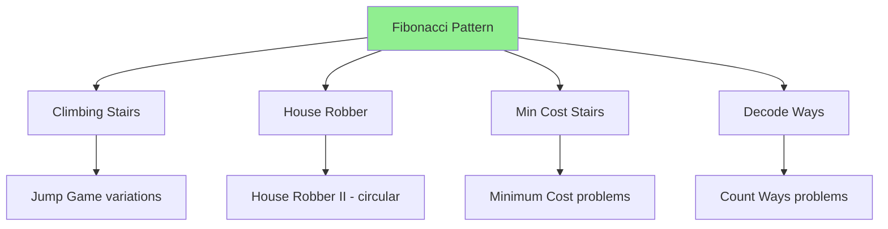

# 4.1 Fibonacci Pattern Overview

> **The Fibonacci Pattern** is the simplest and most common DP pattern. Any problem where the current state depends on a constant number of previous states follows this pattern. Master this first—it's the foundation for all other DP patterns.

---

## 🎯 Pattern Recognition

<details>
<summary><strong>How to Identify Fibonacci Pattern</strong></summary>

**Look for these signals:**
- Current answer depends on **previous 1-2 (or few) answers**
- Linear progression through array/sequence
- Making a binary choice at each step (take/skip, go/stay)
- Problem asks for count, min, max of ways to reach end

**Keywords in problem statements:**
- "reach the end", "climb to top"
- "maximum profit", "minimum cost"
- "number of ways"
- "can't use adjacent"

**Quick Recognition Test:**
```
Can I express answer[i] using only answer[i-1] and answer[i-2]?
If YES → Fibonacci pattern!
```

</details>

---

## ✅ When to Use

- Linear sequence problems
- State depends on previous 1-3 states only
- Binary decisions at each position
- Problems involving steps, costs, or paths along a line

## ❌ When NOT to Use

| Situation | Why | Use Instead |
|-----------|-----|-------------|
| Multiple choices per step | More than 2-3 dependencies | General 1D DP |
| 2D grid movement | Two dimensions | Grid DP |
| Comparing two sequences | Need both indices | LCS/Two Sequence DP |
| Items with weights | Capacity constraint | Knapsack DP |

---

## 🔗 Concept Map

<details>
<summary><strong>Pattern Hierarchy</strong></summary>



**This pattern is foundation for:**
- [Linear DP Patterns](./4.2-Linear-DP-Patterns.md)
- [Jump Game Pattern](./4.3-Jump-Game-Pattern.md)
- State Machine DP (Stock problems)

</details>

---

## 📐 Core Template

### The Pattern Structure

```
State:      dp[i] = answer considering positions 0 to i
Recurrence: dp[i] = f(dp[i-1], dp[i-2])  // or few more
Base Cases: dp[0], dp[1] = known values
Order:      Left to right (0 → n)
Optimize:   O(1) space with 2-3 variables
```

### Generic Template Code

```python
def fibonacci_pattern(nums: list) -> int:
    """Generic template for Fibonacci-pattern DP."""
    if not nums:
        return 0
    if len(nums) == 1:
        return base_case_single(nums[0])
    
    # Base cases
    prev2 = base_case_0
    prev1 = base_case_1
    
    for i in range(2, len(nums)):
        # Recurrence: current depends on prev1, prev2
        curr = combine(prev1, prev2, nums[i])
        prev2 = prev1
        prev1 = curr
    
    return prev1
```

---

## 📐 Classic Fibonacci

The pattern is named after this sequence:

```
F(0) = 0
F(1) = 1
F(n) = F(n-1) + F(n-2)

Sequence: 0, 1, 1, 2, 3, 5, 8, 13, 21, 34, ...
```

**Visualization:**
```
Index:    0   1   2   3   4   5   6    7    8
Value:   [0] [1] [1] [2] [3] [5] [8] [13] [21]
              ↓   ↓
              └───┴── sum gives next
```

### Implementation Evolution

```python
# Version 1: Naive Recursion - O(2^n)
def fib_naive(n):
    if n <= 1:
        return n
    return fib_naive(n-1) + fib_naive(n-2)

# Version 2: Memoization - O(n) time, O(n) space
def fib_memo(n, memo={}):
    if n in memo:
        return memo[n]
    if n <= 1:
        return n
    memo[n] = fib_memo(n-1, memo) + fib_memo(n-2, memo)
    return memo[n]

# Version 3: Tabulation - O(n) time, O(n) space
def fib_table(n):
    if n <= 1:
        return n
    dp = [0] * (n + 1)
    dp[1] = 1
    for i in range(2, n + 1):
        dp[i] = dp[i-1] + dp[i-2]
    return dp[n]

# Version 4: Optimized - O(n) time, O(1) space
def fib_optimized(n):
    if n <= 1:
        return n
    prev2, prev1 = 0, 1
    for _ in range(2, n + 1):
        curr = prev1 + prev2
        prev2, prev1 = prev1, curr
    return prev1
```

---

## 💻 Problems Following This Pattern

### Problem 1: Climbing Stairs

**Problem:** You can climb 1 or 2 steps. How many ways to reach step n?

**Pattern Mapping:**
```
State:      dp[i] = ways to reach step i
Recurrence: dp[i] = dp[i-1] + dp[i-2]  (from step i-1 or i-2)
Base Cases: dp[0] = 1, dp[1] = 1
```

```python
def climb_stairs(n: int) -> int:
    """
    Exactly Fibonacci! 
    Ways to reach step n = ways to reach n-1 + ways to reach n-2
    """
    if n <= 2:
        return n
    
    prev2, prev1 = 1, 2  # dp[1], dp[2]
    
    for i in range(3, n + 1):
        curr = prev1 + prev2
        prev2, prev1 = prev1, curr
    
    return prev1
```

### Problem 2: House Robber

**Problem:** Rob houses for max money, can't rob adjacent houses.

**Pattern Mapping:**
```
State:      dp[i] = max money robbing houses 0 to i
Recurrence: dp[i] = max(dp[i-1], dp[i-2] + nums[i])
            (skip house i) OR (rob house i, skip i-1)
Base Cases: dp[0] = nums[0], dp[1] = max(nums[0], nums[1])
```

```python
def rob(nums: list[int]) -> int:
    """
    At each house: skip (keep prev1) or rob (prev2 + current)
    """
    if not nums:
        return 0
    if len(nums) == 1:
        return nums[0]
    
    prev2 = nums[0]
    prev1 = max(nums[0], nums[1])
    
    for i in range(2, len(nums)):
        curr = max(prev1, prev2 + nums[i])
        prev2, prev1 = prev1, curr
    
    return prev1
```

### Problem 3: Min Cost Climbing Stairs

**Problem:** Each step has a cost. Find minimum cost to reach top.

**Pattern Mapping:**
```
State:      dp[i] = min cost to reach step i
Recurrence: dp[i] = min(dp[i-1], dp[i-2]) + cost[i]
Base Cases: dp[0] = cost[0], dp[1] = cost[1]
```

```python
def min_cost_climbing_stairs(cost: list[int]) -> int:
    """
    Minimum cost Fibonacci - take cheaper path to each step.
    """
    n = len(cost)
    if n == 2:
        return min(cost)
    
    prev2 = cost[0]
    prev1 = cost[1]
    
    for i in range(2, n):
        curr = min(prev1, prev2) + cost[i]
        prev2, prev1 = prev1, curr
    
    # Can reach top from last or second-to-last step
    return min(prev1, prev2)
```

### Problem 4: Decode Ways

**Problem:** A=1, B=2, ..., Z=26. Count ways to decode a digit string.

**Pattern Mapping:**
```
State:      dp[i] = ways to decode s[0:i]
Recurrence: dp[i] = (dp[i-1] if valid single) + (dp[i-2] if valid double)
Base Cases: dp[0] = 1 (empty), dp[1] = 1 if s[0] != '0'
```

```python
def num_decodings(s: str) -> int:
    """
    Fibonacci variant with validity conditions.
    """
    if not s or s[0] == '0':
        return 0
    
    n = len(s)
    prev2 = 1  # dp[0]: empty string
    prev1 = 1  # dp[1]: first char (already checked not '0')
    
    for i in range(2, n + 1):
        curr = 0
        
        # Single digit decode (1-9)
        if s[i-1] != '0':
            curr += prev1
        
        # Two digit decode (10-26)
        two_digit = int(s[i-2:i])
        if 10 <= two_digit <= 26:
            curr += prev2
        
        prev2, prev1 = prev1, curr
    
    return prev1
```

---

## 🔄 Variations of Fibonacci Pattern

| Variation | Recurrence | Example |
|-----------|------------|---------|
| Sum of previous 2 | `dp[i] = dp[i-1] + dp[i-2]` | Climbing Stairs |
| Max of two choices | `dp[i] = max(skip, take)` | House Robber |
| Min of two paths | `dp[i] = min(path1, path2) + cost` | Min Cost Stairs |
| Conditional sum | `dp[i] = sum of valid options` | Decode Ways |
| Sum of previous 3 | `dp[i] = dp[i-1] + dp[i-2] + dp[i-3]` | Tribonacci |

---

## ⚡ Complexity Analysis

| Version | Time | Space |
|---------|------|-------|
| Naive Recursion | O(2ⁿ) | O(n) |
| Memoization | O(n) | O(n) |
| Tabulation | O(n) | O(n) |
| **Optimized** | O(n) | **O(1)** |

**Why O(1) space is always achievable:**
```
Fibonacci pattern only looks at previous 2-3 states
→ Only need 2-3 variables instead of array
→ Space reduces from O(n) to O(1)
```

---

## ⚠️ Common Mistakes

### 1. Off-by-One in Base Cases

**❌ Wrong:**
```python
# Climbing stairs
prev2, prev1 = 0, 1
# dp[0] = 0 means 0 ways to reach step 0? Wrong!
```

**✅ Correct:**
```python
prev2, prev1 = 1, 2  # dp[1] = 1 way, dp[2] = 2 ways
```

### 2. Wrong Variable Update Order

**❌ Wrong:**
```python
for i in range(2, n + 1):
    prev2 = prev1  # Overwrites too early!
    prev1 = prev1 + prev2  # Uses wrong prev2
```

**✅ Correct:**
```python
for i in range(2, n + 1):
    curr = prev1 + prev2
    prev2 = prev1  # Order matters!
    prev1 = curr
```

### 3. Not Handling Edge Cases

**❌ Wrong:**
```python
def climb_stairs(n):
    prev2, prev1 = 1, 2
    for i in range(3, n + 1):
        ...
    return prev1  # Fails for n=1, n=2
```

**✅ Correct:**
```python
def climb_stairs(n):
    if n <= 2:
        return n
    prev2, prev1 = 1, 2
    for i in range(3, n + 1):
        ...
    return prev1
```

---

## 📝 Practice Problems (Progressive)

**Easy (Pure Fibonacci):**
- [ ] [Fibonacci Number](https://leetcode.com/problems/fibonacci-number/) - Direct implementation
- [ ] [Climbing Stairs](https://leetcode.com/problems/climbing-stairs/) - Classic variant
- [ ] [N-th Tribonacci](https://leetcode.com/problems/n-th-tribonacci-number/) - 3 previous

**Medium (With conditions):**
- [ ] [Min Cost Climbing Stairs](https://leetcode.com/problems/min-cost-climbing-stairs/) - Optimization
- [ ] [House Robber](https://leetcode.com/problems/house-robber/) - Take/skip decision
- [ ] [House Robber II](https://leetcode.com/problems/house-robber-ii/) - Circular array
- [ ] [Decode Ways](https://leetcode.com/problems/decode-ways/) - Conditional counting

**Hard (Extensions):**
- [ ] [Decode Ways II](https://leetcode.com/problems/decode-ways-ii/) - With wildcards

<details>
<summary><strong>🧠 Spaced Repetition Schedule</strong></summary>

- **Day 1:** Solve Climbing Stairs and Fibonacci
- **Day 3:** Solve House Robber without looking at notes
- **Day 7:** Solve Decode Ways (harder conditional logic)
- **Day 14:** Solve House Robber II (circular variation)
- **Day 30:** Time yourself: solve any Fibonacci pattern in 10 min

</details>

---

## 🎤 Interview Context

<details>
<summary><strong>How to Explain This Pattern</strong></summary>

**Recognition statement:**
> "This is a Fibonacci-pattern problem because the answer at position i only depends on the answers at i-1 and i-2."

**Follow-up about optimization:**
> "Since we only need the previous two values, I can optimize from O(n) space to O(1) by using two variables."

**Company Focus:**
| Company | Fibonacci Pattern | Common Problems |
|---------|------------------|-----------------|
| All | ⭐⭐⭐⭐⭐ | Climbing Stairs, House Robber |
| Google | ⭐⭐⭐ | Often as warm-up, then harder |
| Amazon | ⭐⭐⭐⭐ | Classic problems |

</details>

---

## ⏱️ Time Estimates

| Activity | Time |
|----------|------|
| Understand pattern | 15-20 min |
| Solve easy problem | 10-15 min |
| Solve medium problem | 15-25 min |
| Master pattern | 5-7 problems |
| Interview speed | 10 min or less |

---

> **💡 Key Insight:** The Fibonacci pattern is the "Hello World" of DP. If you can identify that current state only depends on previous 1-2 states, you can immediately apply O(1) space optimization. This pattern appears in ~15-20% of DP interview problems.

> **🔗 Related:** [Linear DP Patterns](./4.2-Linear-DP-Patterns.md) | [Jump Game Pattern](./4.3-Jump-Game-Pattern.md) | [DP Fundamentals](../01-DP-Fundamentals/1.1-What-Is-DP.md)
