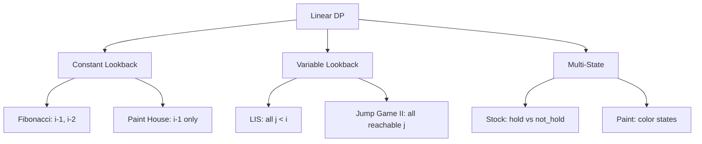

# 4.2 Linear DP Patterns

> **Linear DP** extends the Fibonacci pattern to handle more complex linear sequences. Instead of just 2 previous states, you might need to consider all previous states or make more nuanced decisions at each step.

---

## 🎯 Pattern Recognition

<details>
<summary><strong>How to Identify Linear DP</strong></summary>

**Look for these signals:**
- Processing a 1D array/sequence left-to-right
- Answer at position i depends on **some or all** positions before i
- Making optimal choices along a linear path
- No 2D grid or multiple sequences

**Keywords:**
- "longest subsequence", "maximum sum"
- "number of ways starting from"
- "paint houses", "costs along a row"

**Linear DP vs Fibonacci:**
```
Fibonacci: dp[i] = f(dp[i-1], dp[i-2])     // constant lookback
Linear DP: dp[i] = f(dp[0], dp[1], ..., dp[i-1])  // variable lookback
```

</details>

---

## ✅ When to Use

- Sequential decision problems
- Longest increasing/decreasing subsequence
- Painting/coloring problems with constraints
- Maximum/minimum along a path

## ❌ When NOT to Use

| Situation | Why | Use Instead |
|-----------|-----|-------------|
| Only 2 previous states needed | Overkill | Fibonacci Pattern |
| 2D grid movement | Wrong dimension | Grid DP |
| Comparing two strings | Need 2D | LCS/Sequence DP |

---

## 📐 Linear DP Categories



---

## 💻 Pattern 1: Paint House

**Problem:** Paint n houses with 3 colors. Adjacent houses can't have same color. Find minimum cost.

```python
def min_cost_paint_house(costs: list[list[int]]) -> int:
    """
    costs[i] = [red_cost, blue_cost, green_cost] for house i
    
    State: dp[i][c] = min cost to paint houses 0..i with house i color c
    Recurrence: dp[i][c] = costs[i][c] + min(dp[i-1][other colors])
    """
    if not costs:
        return 0
    
    n = len(costs)
    RED, BLUE, GREEN = 0, 1, 2
    
    # Previous row costs
    prev = costs[0][:]
    
    for i in range(1, n):
        curr = [0, 0, 0]
        curr[RED] = costs[i][RED] + min(prev[BLUE], prev[GREEN])
        curr[BLUE] = costs[i][BLUE] + min(prev[RED], prev[GREEN])
        curr[GREEN] = costs[i][GREEN] + min(prev[RED], prev[BLUE])
        prev = curr
    
    return min(prev)
```

```javascript
function minCostPaintHouse(costs) {
    if (!costs.length) return 0;
    
    let prev = [...costs[0]];
    
    for (let i = 1; i < costs.length; i++) {
        const curr = [
            costs[i][0] + Math.min(prev[1], prev[2]),
            costs[i][1] + Math.min(prev[0], prev[2]),
            costs[i][2] + Math.min(prev[0], prev[1])
        ];
        prev = curr;
    }
    
    return Math.min(...prev);
}
```

**Visualization:**
```
House:     0        1        2        3
Colors:  [R B G]  [R B G]  [R B G]  [R B G]
Cost:    [17,2,17][16,16,5][14,3,19][3,16,9]

dp[0]: [17, 2, 17]

dp[1]: R = 16 + min(2,17) = 18
       B = 16 + min(17,17) = 33
       G = 5 + min(17,2) = 7

dp[2]: R = 14 + min(33,7) = 21
       B = 3 + min(18,7) = 10
       G = 19 + min(18,33) = 37

dp[3]: R = 3 + min(10,37) = 13
       B = 16 + min(21,37) = 37
       G = 9 + min(21,10) = 19

Answer: min(13, 37, 19) = 10 ← Path: Blue(2) → Green(5) → Blue(3) → [never reaches]
```

---

## 💻 Pattern 2: Paint House II (K Colors)

**Extension:** What if there are k colors instead of 3?

```python
def min_cost_paint_house_ii(costs: list[list[int]]) -> int:
    """
    Naive: O(nk²) - for each house, try each color, find min of other colors
    Optimized: O(nk) - track min and second_min from previous row
    """
    if not costs:
        return 0
    
    n, k = len(costs), len(costs[0])
    
    # Track min, second_min, and min_color from previous row
    prev_min = prev_second_min = 0
    prev_min_color = -1
    
    for i in range(n):
        curr_min = curr_second_min = float('inf')
        curr_min_color = -1
        
        for c in range(k):
            # Cost at this color = current + best from prev (different color)
            if c != prev_min_color:
                total = costs[i][c] + prev_min
            else:
                total = costs[i][c] + prev_second_min
            
            # Update current row's min and second_min
            if total < curr_min:
                curr_second_min = curr_min
                curr_min = total
                curr_min_color = c
            elif total < curr_second_min:
                curr_second_min = total
        
        prev_min = curr_min
        prev_second_min = curr_second_min
        prev_min_color = curr_min_color
    
    return prev_min
```

**Key Insight:** To find "minimum excluding current color", we only need:
- The overall minimum (use if different color)
- The second minimum (use if same color as minimum)

---

## 💻 Pattern 3: Delete and Earn

**Problem:** Given nums, you can delete num and earn num points. When you delete num, all num-1 and num+1 are also deleted.

```python
def delete_and_earn(nums: list[int]) -> int:
    """
    Transform: This is House Robber in disguise!
    - Count points for each value
    - Adjacent values can't both be chosen
    """
    if not nums:
        return 0
    
    # Build points array
    max_num = max(nums)
    points = [0] * (max_num + 1)
    for num in nums:
        points[num] += num  # Total points for choosing this value
    
    # Now it's House Robber on points array
    if max_num <= 1:
        return points[max_num]
    
    prev2 = points[0]
    prev1 = max(points[0], points[1])
    
    for i in range(2, max_num + 1):
        curr = max(prev1, prev2 + points[i])
        prev2, prev1 = prev1, curr
    
    return prev1
```

```javascript
function deleteAndEarn(nums) {
    if (!nums.length) return 0;
    
    const maxNum = Math.max(...nums);
    const points = new Array(maxNum + 1).fill(0);
    
    for (const num of nums) {
        points[num] += num;
    }
    
    // House Robber
    let prev2 = points[0];
    let prev1 = Math.max(points[0], points[1] || 0);
    
    for (let i = 2; i <= maxNum; i++) {
        const curr = Math.max(prev1, prev2 + points[i]);
        prev2 = prev1;
        prev1 = curr;
    }
    
    return prev1;
}
```

---

## 💻 Pattern 4: Maximum Sum Subarray Variations

### Maximum Sum Circular Subarray

**Problem:** Find max sum subarray in a circular array.

```python
def max_subarray_circular(nums: list[int]) -> int:
    """
    Two cases:
    1. Max subarray doesn't wrap around (normal Kadane)
    2. Max subarray wraps around = total - min_subarray
    
    Answer = max(case1, case2)
    """
    total = 0
    max_sum = cur_max = nums[0]
    min_sum = cur_min = nums[0]
    
    for i in range(len(nums)):
        total += nums[i]
        
        # Kadane for max
        cur_max = max(nums[i], cur_max + nums[i])
        max_sum = max(max_sum, cur_max)
        
        # Kadane for min
        cur_min = min(nums[i], cur_min + nums[i])
        min_sum = min(min_sum, cur_min)
    
    # If all negative, min_sum = total, so case2 gives 0
    # In that case, return max_sum (least negative)
    if max_sum < 0:
        return max_sum
    
    return max(max_sum, total - min_sum)
```

**Visualization:**
```
Array: [5, -3, 5]

Case 1 (no wrap): max subarray = [5, -3, 5] = 7
                  or [5] = 5

Case 2 (wrap):    Wrapped max = total - min_subarray
                  total = 7
                  min_subarray = [-3] = -3
                  wrapped = 7 - (-3) = 10
                  This means: [5] + [5] wrapping around

Answer: max(7, 10) = 10
```

---

## 💻 Pattern 5: Counting DP

### Count Ways to Reach End

**Problem:** Jump from 0 to n-1. From position i, you can jump 1 to k steps. Count ways.

```python
def count_ways_to_end(n: int, k: int) -> int:
    """
    dp[i] = number of ways to reach position i
    dp[i] = dp[i-1] + dp[i-2] + ... + dp[i-k]
    
    Optimized with prefix sum or sliding window.
    """
    if n == 1:
        return 1
    
    dp = [0] * n
    dp[0] = 1
    
    # Sliding window sum of previous k values
    window_sum = 1
    
    for i in range(1, n):
        dp[i] = window_sum
        window_sum += dp[i]
        
        # Remove element outside window
        if i >= k:
            window_sum -= dp[i - k]
    
    return dp[n - 1]
```

---

## ⚡ Complexity Analysis

| Pattern | Time | Space | Can Optimize Space? |
|---------|------|-------|---------------------|
| Paint House (3 colors) | O(n) | O(1) | Already O(1) |
| Paint House II (k colors) | O(nk) | O(1) | Already O(1) |
| Delete and Earn | O(n + max) | O(max) | No (need full array) |
| Circular Max Subarray | O(n) | O(1) | Already O(1) |
| Count Ways (k jumps) | O(n) | O(n) | O(k) with sliding window |

---

## 🔄 Problem Transformation Patterns

| Original Problem | Transformed To |
|------------------|----------------|
| Delete and Earn | House Robber on value counts |
| Circular subarray | Normal + inverted |
| K jumps | Fibonacci with window |
| K colors no adjacent | Min/second-min tracking |

---

## ⚠️ Common Mistakes

### 1. Delete and Earn: Not Grouping Values

**❌ Wrong:** Process array as-is
```python
# This doesn't work because same values should be grouped
for num in nums:
    # Can't decide to "take" or "skip" individual occurrences
```

**✅ Correct:** Transform to points array first
```python
points = [0] * (max_num + 1)
for num in nums:
    points[num] += num  # Sum all contributions
```

### 2. Circular Array: Forgetting All-Negative Case

**❌ Wrong:**
```python
return max(max_sum, total - min_sum)
# If all negative, min_sum = total, so total - min_sum = 0
# But empty subarray not allowed!
```

**✅ Correct:**
```python
if max_sum < 0:  # All negative
    return max_sum  # Return least negative
return max(max_sum, total - min_sum)
```

### 3. Paint House II: O(nk²) Instead of O(nk)

**❌ Wrong:** Finding min for each color by scanning all others
```python
for c in range(k):
    best = min(prev[other] for other in range(k) if other != c)
```

**✅ Correct:** Track min and second_min
```python
# Only need: min value and second_min value
# If current color == min_color, use second_min
```

---

## 📝 Practice Problems (Progressive)

**Easy:**
- [ ] [Climbing Stairs](https://leetcode.com/problems/climbing-stairs/) - Base pattern
- [ ] [Maximum Subarray](https://leetcode.com/problems/maximum-subarray/) - Kadane

**Medium:**
- [ ] [Paint House](https://leetcode.com/problems/paint-house/) - Multi-state
- [ ] [Delete and Earn](https://leetcode.com/problems/delete-and-earn/) - Transform
- [ ] [Maximum Sum Circular Subarray](https://leetcode.com/problems/maximum-sum-circular-subarray/) - Two cases
- [ ] [Jump Game](https://leetcode.com/problems/jump-game/) - Reachability

**Hard:**
- [ ] [Paint House II](https://leetcode.com/problems/paint-house-ii/) - Optimized k colors

<details>
<summary><strong>🧠 Spaced Repetition Schedule</strong></summary>

- **Day 1:** Paint House - understand multi-state linear DP
- **Day 3:** Delete and Earn - practice problem transformation
- **Day 7:** Circular Subarray - handle edge cases
- **Day 14:** Paint House II - master min/second-min optimization
- **Day 30:** Mixed practice - identify which pattern applies

</details>

---

## 🎤 Interview Context

<details>
<summary><strong>How to Communicate Linear DP</strong></summary>

**When you see Paint House:**
> "This is linear DP where I need to track states at each position. Since adjacent houses can't have the same color, I'll track the minimum cost ending in each color."

**When you see Delete and Earn:**
> "I notice that deleting a number affects adjacent values. Let me transform this: if I group by value and treat consecutive values like houses, this becomes House Robber!"

**Optimization discussion:**
> "For k colors, the naive approach is O(nk²). I can optimize to O(nk) by tracking just the minimum and second minimum from the previous row."

</details>

---

## ⏱️ Time Estimates

| Activity | Time |
|----------|------|
| Understand multi-state linear DP | 30 min |
| Paint House | 20-25 min |
| Delete and Earn transformation | 20-30 min |
| Paint House II optimization | 30-40 min |

---

> **💡 Key Insight:** Many problems transform into simpler DP patterns. Delete and Earn is House Robber. Circular subarray is two Kadane passes. Paint House II optimization comes from realizing you only need min and second-min, not all previous values.

> **🔗 Related:** [Fibonacci Pattern](./4.1-Fibonacci-Pattern-Overview.md) | [Jump Game Pattern](./4.3-Jump-Game-Pattern.md) | [State Machine DP](../12-State-Machine-DP/)
