# 4.3 Jump Game Pattern

> **Jump Game problems** form a distinct sub-pattern of linear DP. They involve making jump decisions along an array, with variations including reachability, minimum jumps, and constrained jumps. These problems frequently appear in interviews.

---

## 🎯 Pattern Recognition

<details>
<summary><strong>How to Identify Jump Game Problems</strong></summary>

**Look for these signals:**
- Array where each element represents jump length/capability
- Goal: reach end, count jumps, or check reachability
- "From index i, you can jump to i+1, i+2, ..., i+nums[i]"
- Frog/person moving along positions

**Keywords:**
- "can reach", "jump to", "minimum jumps"
- "each element is the maximum jump"
- "reach the last index"

**Pattern variations:**
```
Jump Game I:    Can you reach the end?        (Greedy/DP)
Jump Game II:   Minimum jumps to reach end    (Greedy/DP)
Jump Game III:  Can reach value 0? (bi-directional) (BFS/DFS)
Jump Game IV:   Jump to same values           (BFS)
Jump Game V:    Maximum jumps in descending   (DP + Sorting)
```

</details>

---

## ✅ When to Use

- Array traversal with variable step sizes
- Reachability problems
- Minimum steps/jumps problems
- When Greedy gives optimal solution (Jump I, II)

## ❌ When NOT to Use

| Situation | Why | Use Instead |
|-----------|-----|-------------|
| Jumps to same values | Not linear | BFS (Jump Game IV) |
| Bidirectional jumps | Graph problem | BFS/DFS (Jump Game III) |
| Need all paths | Not just optimal | Backtracking |

---

## 📐 Jump Game Family Overview

```mermaid
graph LR
    A[Jump Game Family] --> B[Type I: Reachability]
    A --> C[Type II: Minimum Jumps]
    A --> D[Type III+: Graph-based]
    
    B --> B1["Greedy O(n)"]
    C --> C1["Greedy O(n)"]
    C --> C2["DP O(n²) for comparison"]
    D --> D1["BFS O(n)"]
```



---

## 💻 Jump Game I: Can Reach End?

**Problem:** Each element is max jump length. Can you reach the last index?

### Greedy Approach (Optimal)

```python
def can_jump(nums: list[int]) -> bool:
    """
    Track the farthest reachable position.
    If we can ever reach/pass the end, return True.
    
    Time: O(n), Space: O(1)
    """
    farthest = 0
    
    for i in range(len(nums)):
        # If current position is beyond farthest, unreachable
        if i > farthest:
            return False
        
        # Update farthest reachable from position i
        farthest = max(farthest, i + nums[i])
        
        # Early exit if we can reach the end
        if farthest >= len(nums) - 1:
            return True
    
    return True
```

```javascript
function canJump(nums) {
    let farthest = 0;
    
    for (let i = 0; i < nums.length; i++) {
        if (i > farthest) return false;
        farthest = Math.max(farthest, i + nums[i]);
        if (farthest >= nums.length - 1) return true;
    }
    
    return true;
}
```

### DP Approach (For Understanding)

```python
def can_jump_dp(nums: list[int]) -> bool:
    """
    DP approach: dp[i] = can we reach position i?
    
    Time: O(n²), Space: O(n)
    Less efficient but shows DP thinking.
    """
    n = len(nums)
    dp = [False] * n
    dp[0] = True  # Start position always reachable
    
    for i in range(1, n):
        # Check all positions that could jump to i
        for j in range(i):
            if dp[j] and j + nums[j] >= i:
                dp[i] = True
                break
    
    return dp[n - 1]
```

**Visualization:**
```
nums = [2, 3, 1, 1, 4]
index:  0  1  2  3  4

i=0: farthest = max(0, 0+2) = 2
i=1: farthest = max(2, 1+3) = 4 ≥ 4 ✓ Can reach!

nums = [3, 2, 1, 0, 4]
index:  0  1  2  3  4

i=0: farthest = 3
i=1: farthest = max(3, 1+2) = 3
i=2: farthest = max(3, 2+1) = 3
i=3: farthest = max(3, 3+0) = 3
i=4: 4 > 3 → Can't reach! ✗
```

---

## 💻 Jump Game II: Minimum Jumps

**Problem:** Return minimum jumps to reach the last index. Guaranteed reachable.

### Greedy BFS Approach (Optimal)

```python
def jump(nums: list[int]) -> int:
    """
    Think of it as BFS: each "level" is positions reachable with same # of jumps.
    
    Time: O(n), Space: O(1)
    """
    n = len(nums)
    if n <= 1:
        return 0
    
    jumps = 0
    current_end = 0      # End of current jump level
    farthest = 0         # Farthest reachable
    
    for i in range(n - 1):  # Don't need to jump FROM last index
        farthest = max(farthest, i + nums[i])
        
        # Reached end of current level, must jump
        if i == current_end:
            jumps += 1
            current_end = farthest
            
            # Early exit
            if current_end >= n - 1:
                break
    
    return jumps
```

```javascript
function jump(nums) {
    const n = nums.length;
    if (n <= 1) return 0;
    
    let jumps = 0;
    let currentEnd = 0;
    let farthest = 0;
    
    for (let i = 0; i < n - 1; i++) {
        farthest = Math.max(farthest, i + nums[i]);
        
        if (i === currentEnd) {
            jumps++;
            currentEnd = farthest;
            
            if (currentEnd >= n - 1) break;
        }
    }
    
    return jumps;
}
```

### DP Approach (For Learning)

```python
def jump_dp(nums: list[int]) -> int:
    """
    DP: dp[i] = minimum jumps to reach position i
    
    Time: O(n²), Space: O(n)
    """
    n = len(nums)
    dp = [float('inf')] * n
    dp[0] = 0
    
    for i in range(n):
        # From position i, update all reachable positions
        for j in range(i + 1, min(i + nums[i] + 1, n)):
            dp[j] = min(dp[j], dp[i] + 1)
    
    return dp[n - 1]
```

**Visualization (Greedy as BFS levels):**
```
nums = [2, 3, 1, 1, 4]
index:  0  1  2  3  4

Level 0 (start):     [0]
Level 1 (1 jump):    [1, 2]     (can reach from 0)
Level 2 (2 jumps):   [3, 4]     (can reach from level 1)

Jump 1: from 0, can reach indices 1,2
Jump 2: from 1 or 2, can reach 4

Answer: 2 jumps
```

---

## 💻 Jump Game with Cost

**Problem:** Jump costs money. Find minimum cost to reach end.

```python
def min_cost_jump(nums: list[int], costs: list[int]) -> int:
    """
    nums[i] = max jump from i
    costs[i] = cost to land on i
    
    State: dp[i] = min cost to reach position i
    """
    n = len(nums)
    dp = [float('inf')] * n
    dp[0] = costs[0]  # Cost to start at position 0
    
    for i in range(n):
        if dp[i] == float('inf'):
            continue
        
        # Jump to all reachable positions
        for j in range(i + 1, min(i + nums[i] + 1, n)):
            dp[j] = min(dp[j], dp[i] + costs[j])
    
    return dp[n - 1]
```

---

## 💻 Frog Jump (Variable Jumps)

**Problem:** Frog starts at stone 0. It can jump k-1, k, or k+1 units if last jump was k. Can it cross?

```python
def can_cross(stones: list[int]) -> bool:
    """
    State: (stone_position, last_jump) → can reach end?
    Use set for O(1) stone lookup.
    
    Time: O(n²), Space: O(n²) for memoization
    """
    if stones[1] != 1:  # First jump must be 1
        return False
    
    stone_set = set(stones)
    target = stones[-1]
    
    # Memoization: (position, last_jump) → can reach?
    memo = {}
    
    def dfs(pos, last_jump):
        if pos == target:
            return True
        if (pos, last_jump) in memo:
            return memo[(pos, last_jump)]
        
        # Try jumps of size k-1, k, k+1
        for jump in [last_jump - 1, last_jump, last_jump + 1]:
            if jump > 0:  # Jump must be positive
                next_pos = pos + jump
                if next_pos in stone_set:
                    if dfs(next_pos, jump):
                        memo[(pos, last_jump)] = True
                        return True
        
        memo[(pos, last_jump)] = False
        return False
    
    return dfs(1, 1)  # Start at stone 1 with jump of 1
```

---

## 💻 Jump Game III: Bidirectional

**Problem:** From index i, jump to i+arr[i] or i-arr[i]. Can you reach index with value 0?

```python
def can_reach(arr: list[int], start: int) -> bool:
    """
    This is BFS/DFS, not DP - bidirectional jumps create graph.
    
    Time: O(n), Space: O(n)
    """
    from collections import deque
    
    n = len(arr)
    visited = [False] * n
    queue = deque([start])
    
    while queue:
        i = queue.popleft()
        
        if arr[i] == 0:
            return True
        
        if visited[i]:
            continue
        visited[i] = True
        
        # Jump forward
        if i + arr[i] < n:
            queue.append(i + arr[i])
        
        # Jump backward
        if i - arr[i] >= 0:
            queue.append(i - arr[i])
    
    return False
```

---

## ⚡ Complexity Analysis

| Problem | Approach | Time | Space |
|---------|----------|------|-------|
| Jump Game I | Greedy | O(n) | O(1) |
| Jump Game I | DP | O(n²) | O(n) |
| Jump Game II | Greedy BFS | O(n) | O(1) |
| Jump Game II | DP | O(n²) | O(n) |
| Frog Jump | DFS + Memo | O(n²) | O(n²) |
| Jump Game III | BFS | O(n) | O(n) |

**Why Greedy works for Jump I/II:**
- Local optimal (jump as far as possible) leads to global optimal
- No "cost" that might make shorter jumps better
- Once you can reach a position, there's no benefit to reaching it "more"

---

## 🔄 Pattern Variations

| Variation | Key Difference | Approach |
|-----------|----------------|----------|
| Can reach? | Yes/No question | Greedy |
| Min jumps | Counting | Greedy (BFS levels) |
| Min cost | Optimization | DP |
| Variable jump size | Last jump affects next | DP with 2D state |
| Bidirectional | Graph problem | BFS/DFS |

---

## ⚠️ Common Mistakes

### 1. Jump Game II: Looping Through Last Index

**❌ Wrong:**
```python
for i in range(n):  # Includes last index
    if i == current_end:
        jumps += 1  # Unnecessary jump when already at end
```

**✅ Correct:**
```python
for i in range(n - 1):  # Exclude last index
    # Don't need to jump FROM the destination
```

### 2. Frog Jump: Forgetting Jump Must Be Positive

**❌ Wrong:**
```python
for jump in [last_jump - 1, last_jump, last_jump + 1]:
    next_pos = pos + jump  # jump could be 0 or negative!
```

**✅ Correct:**
```python
for jump in [last_jump - 1, last_jump, last_jump + 1]:
    if jump > 0:  # Must be positive
        next_pos = pos + jump
```

### 3. Thinking All Jump Games Use Same Approach

**❌ Wrong:** Applying greedy to Jump Game III
```python
# Greedy doesn't work for bidirectional!
```

**✅ Correct:** Recognize Jump Game III is a graph traversal
```python
# Use BFS because you can go backward
```

---

## 📝 Practice Problems (Progressive)

**Easy:**
- [ ] [Jump Game](https://leetcode.com/problems/jump-game/) - Greedy reachability

**Medium:**
- [ ] [Jump Game II](https://leetcode.com/problems/jump-game-ii/) - Minimum jumps
- [ ] [Jump Game III](https://leetcode.com/problems/jump-game-iii/) - BFS approach
- [ ] [Jump Game VII](https://leetcode.com/problems/jump-game-vii/) - Range jumps

**Hard:**
- [ ] [Frog Jump](https://leetcode.com/problems/frog-jump/) - Variable jump DP
- [ ] [Jump Game IV](https://leetcode.com/problems/jump-game-iv/) - BFS with value grouping
- [ ] [Jump Game V](https://leetcode.com/problems/jump-game-v/) - DP with sorting

<details>
<summary><strong>🧠 Spaced Repetition Schedule</strong></summary>

- **Day 1:** Jump Game I (understand greedy)
- **Day 3:** Jump Game II (BFS level thinking)
- **Day 7:** Jump Game III (recognize graph problem)
- **Day 14:** Frog Jump (2D state DP)
- **Day 30:** Quickly identify which approach for each variant

</details>

---

## 🎤 Interview Context

<details>
<summary><strong>How to Communicate Jump Game Solutions</strong></summary>

**For Jump Game I:**
> "I'll use a greedy approach: track the farthest position reachable. If at any point my current index exceeds farthest, I'm stuck. This is O(n) time, O(1) space."

**For Jump Game II:**
> "I think of this as BFS where each 'level' represents positions reachable with the same number of jumps. I track when I've exhausted the current level and increment my jump count."

**For Frog Jump:**
> "The key insight is that my jump options depend on my last jump, so I need 2D state: (position, last_jump). I'll use memoization to avoid recomputing."

**Company Focus:**
| Company | Jump Games | Notes |
|---------|-----------|-------|
| Meta | ⭐⭐⭐ | Jump I/II common |
| Google | ⭐⭐ | May ask variations |
| Amazon | ⭐⭐⭐ | Classic problems |

</details>

---

## ⏱️ Time Estimates

| Activity | Time |
|----------|------|
| Jump Game I (greedy) | 10-15 min |
| Jump Game II (greedy BFS) | 15-20 min |
| Jump Game III (BFS) | 15-20 min |
| Frog Jump (2D DP) | 25-35 min |

---

> **💡 Key Insight:** Jump Game I and II work with greedy because there's no "cost" to jumping farther. The moment you add costs, constraints, or bidirectional movement, you need DP or BFS. Always ask: "Does local optimal guarantee global optimal?"

> **🔗 Related:** [Fibonacci Pattern](./4.1-Fibonacci-Pattern-Overview.md) | [Linear DP](./4.2-Linear-DP-Patterns.md) | [BFS/DFS](../10-Graphs/)
