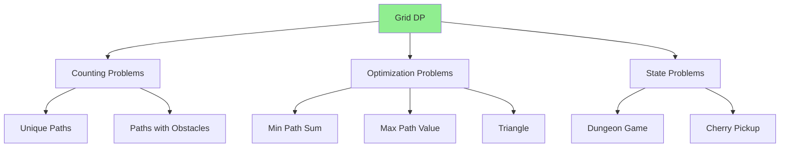

# 5.1 Grid DP Fundamentals

> **Grid DP** is the natural extension of linear DP to two dimensions. Any time you're moving through a 2D matrix, making optimal decisions along the way, Grid DP is your go-to pattern.

---

## 🎯 Pattern Recognition

<details>
<summary><strong>How to Identify Grid DP</strong></summary>

**Look for these signals:**
- 2D grid/matrix traversal
- Movement restricted to right/down (or similar)
- Count paths, find min/max cost, or check reachability
- Answer depends on neighboring cells

**Keywords:**
- "unique paths", "minimum path sum"
- "reach bottom-right from top-left"
- "only move right or down"
- "m × n grid"

**Grid DP vs Other Patterns:**
```
Grid:     dp[i][j] = f(dp[i-1][j], dp[i][j-1])  // from top or left
Linear:   dp[i] = f(dp[i-1], dp[i-2])           // 1D
LCS:      dp[i][j] = f(dp[i-1][j], dp[i][j-1], dp[i-1][j-1])  // 2 sequences
```

</details>

---

## ✅ When to Use

- 2D grid traversal with constrained movement
- Path counting in matrices
- Minimum/maximum path cost problems
- When answer at (i,j) depends on previous rows/columns

## ❌ When NOT to Use

| Situation | Why | Use Instead |
|-----------|-----|-------------|
| Arbitrary movement | Not optimal substructure | BFS/DFS |
| Disconnected cells | Can't guarantee order | Graph algorithms |
| Complex state | More than position | State machine DP |

---

## 🔗 Concept Map

<details>
<summary><strong>Grid DP Pattern Hierarchy</strong></summary>



</details>

---

## 📐 Core Template

### Standard Grid DP Structure

```
State:      dp[i][j] = answer for cell (i, j)
Recurrence: dp[i][j] = f(dp[i-1][j], dp[i][j-1]) + contribution(i,j)
Base Cases: dp[0][0], first row, first column
Order:      Top-to-bottom, left-to-right
Optimize:   Often O(n) space with single row
```

### Generic Template

```python
def grid_dp(grid: list[list[int]]) -> int:
    """Generic Grid DP template."""
    m, n = len(grid), len(grid[0])
    dp = [[0] * n for _ in range(m)]
    
    # Base case: starting cell
    dp[0][0] = initial_value(grid[0][0])
    
    # Base case: first row (can only come from left)
    for j in range(1, n):
        dp[0][j] = compute_from_left(dp[0][j-1], grid[0][j])
    
    # Base case: first column (can only come from top)
    for i in range(1, m):
        dp[i][0] = compute_from_top(dp[i-1][0], grid[i][0])
    
    # Fill rest of grid
    for i in range(1, m):
        for j in range(1, n):
            dp[i][j] = combine(
                dp[i-1][j],    # from top
                dp[i][j-1],    # from left
                grid[i][j]     # current cell
            )
    
    return dp[m-1][n-1]
```

---

## 💻 Problem 1: Unique Paths

**Problem:** Robot at top-left, can only move right or down. Count paths to bottom-right.

**Pattern Mapping:**
```
State:      dp[i][j] = number of ways to reach (i, j)
Recurrence: dp[i][j] = dp[i-1][j] + dp[i][j-1]
Base Cases: dp[0][j] = 1, dp[i][0] = 1 (only one way along edges)
```

**Visualization:**
```
Grid 3x3:
[1] [1] [1]      First row: 1 way each (can only go right)
[1] [2] [3]      dp[1][1] = 1+1 = 2
[1] [3] [6]      dp[2][2] = 3+3 = 6

Answer: 6 paths
```

```python
def unique_paths(m: int, n: int) -> int:
    """
    Count paths in m × n grid.
    Time: O(m*n), Space: O(n) with optimization
    """
    # Space-optimized: only need previous row
    dp = [1] * n  # First row is all 1s
    
    for i in range(1, m):
        for j in range(1, n):
            dp[j] = dp[j] + dp[j-1]  # top + left
    
    return dp[n-1]
```

```javascript
function uniquePaths(m, n) {
    const dp = new Array(n).fill(1);
    
    for (let i = 1; i < m; i++) {
        for (let j = 1; j < n; j++) {
            dp[j] = dp[j] + dp[j-1];
        }
    }
    
    return dp[n-1];
}
```

---

## 💻 Problem 2: Unique Paths II (With Obstacles)

**Problem:** Same as above, but some cells are blocked (value 1).

```python
def unique_paths_with_obstacles(grid: list[list[int]]) -> int:
    """
    0 = empty, 1 = obstacle
    """
    m, n = len(grid), len(grid[0])
    
    # If start or end blocked
    if grid[0][0] == 1 or grid[m-1][n-1] == 1:
        return 0
    
    dp = [0] * n
    dp[0] = 1
    
    for i in range(m):
        for j in range(n):
            if grid[i][j] == 1:
                dp[j] = 0  # Blocked cell
            elif j > 0:
                dp[j] = dp[j] + dp[j-1]  # top + left
    
    return dp[n-1]
```

---

## 💻 Problem 3: Minimum Path Sum

**Problem:** Find path from top-left to bottom-right with minimum sum.

```python
def min_path_sum(grid: list[list[int]]) -> int:
    """
    dp[i][j] = minimum sum to reach (i, j)
    """
    m, n = len(grid), len(grid[0])
    
    # Space optimized
    dp = [0] * n
    dp[0] = grid[0][0]
    
    # First row
    for j in range(1, n):
        dp[j] = dp[j-1] + grid[0][j]
    
    # Rest of grid
    for i in range(1, m):
        dp[0] += grid[i][0]  # First column: add from top
        for j in range(1, n):
            dp[j] = min(dp[j], dp[j-1]) + grid[i][j]
    
    return dp[n-1]
```

```javascript
function minPathSum(grid) {
    const m = grid.length, n = grid[0].length;
    const dp = new Array(n).fill(0);
    
    dp[0] = grid[0][0];
    for (let j = 1; j < n; j++) {
        dp[j] = dp[j-1] + grid[0][j];
    }
    
    for (let i = 1; i < m; i++) {
        dp[0] += grid[i][0];
        for (let j = 1; j < n; j++) {
            dp[j] = Math.min(dp[j], dp[j-1]) + grid[i][j];
        }
    }
    
    return dp[n-1];
}
```

---

## 💻 Problem 4: Triangle

**Problem:** Find minimum path sum from top to bottom. Each step: move to adjacent number on row below.

**Visualization:**
```
    [2]
   [3,4]
  [6,5,7]
 [4,1,8,3]

Minimum path: 2 → 3 → 5 → 1 = 11
```

```python
def minimum_total(triangle: list[list[int]]) -> int:
    """
    Bottom-up approach: start from bottom row.
    dp[j] = min path sum starting from (i, j)
    """
    n = len(triangle)
    # Start with bottom row
    dp = triangle[-1][:]
    
    # Work upward
    for i in range(n - 2, -1, -1):
        for j in range(i + 1):
            dp[j] = triangle[i][j] + min(dp[j], dp[j+1])
    
    return dp[0]
```

**Why bottom-up?**
- Top-down requires tracking min of all paths reaching each cell
- Bottom-up naturally accumulates minimum path

---

## 🔄 Space Optimization Patterns

### 2D → 1D Optimization

```python
# Original 2D
dp = [[0] * n for _ in range(m)]
for i in range(m):
    for j in range(n):
        dp[i][j] = f(dp[i-1][j], dp[i][j-1])

# Optimized 1D (when only need previous row)
dp = [0] * n
for i in range(m):
    for j in range(n):
        # dp[j] still contains value from row i-1 (top)
        # dp[j-1] already updated to row i (left)
        dp[j] = f(dp[j], dp[j-1])
```

### When 1D Works

| Access Pattern | Can Optimize? |
|----------------|---------------|
| `dp[i-1][j]` and `dp[i][j-1]` | ✅ Yes |
| `dp[i-1][j-1]` needed | ⚠️ Need extra variable |
| Multiple previous rows | ❌ Need 2D or rolling array |

---

## ⚡ Complexity Analysis

| Problem | Time | Space (2D) | Space (Optimized) |
|---------|------|------------|-------------------|
| Unique Paths | O(m×n) | O(m×n) | O(n) |
| With Obstacles | O(m×n) | O(m×n) | O(n) |
| Min Path Sum | O(m×n) | O(m×n) | O(n) |
| Triangle | O(n²) | O(n²) | O(n) |

---

## ⚠️ Common Mistakes

### 1. Forgetting Obstacle Check

**❌ Wrong:**
```python
for i in range(m):
    for j in range(n):
        dp[j] += dp[j-1]  # Even for obstacles!
```

**✅ Correct:**
```python
for i in range(m):
    for j in range(n):
        if grid[i][j] == 1:
            dp[j] = 0  # No paths through obstacle
        elif j > 0:
            dp[j] += dp[j-1]
```

### 2. Wrong First Row/Column Initialization

**❌ Wrong:**
```python
dp = [1] * n  # Assumes all cells reachable!
```

**✅ Correct:**
```python
dp = [0] * n
dp[0] = 1 if grid[0][0] == 0 else 0
for j in range(1, n):
    dp[j] = dp[j-1] if grid[0][j] == 0 else 0
```

### 3. Off-by-One in 1D Optimization

**❌ Wrong:**
```python
for j in range(n):  # Includes j=0
    dp[j] = dp[j] + dp[j-1]  # dp[-1] access!
```

**✅ Correct:**
```python
for j in range(1, n):  # Start from 1
    dp[j] = dp[j] + dp[j-1]
```

---

## 📝 Practice Problems (Progressive)

**Easy:**
- [ ] [Unique Paths](https://leetcode.com/problems/unique-paths/) - Basic counting
- [ ] [Min Path Sum](https://leetcode.com/problems/minimum-path-sum/) - Basic optimization

**Medium:**
- [ ] [Unique Paths II](https://leetcode.com/problems/unique-paths-ii/) - With obstacles
- [ ] [Triangle](https://leetcode.com/problems/triangle/) - Irregular grid
- [ ] [Minimum Falling Path Sum](https://leetcode.com/problems/minimum-falling-path-sum/) - 3 directions

**Hard:**
- [ ] [Dungeon Game](https://leetcode.com/problems/dungeon-game/) - Backward DP
- [ ] [Cherry Pickup](https://leetcode.com/problems/cherry-pickup/) - Two paths simultaneously

<details>
<summary><strong>🧠 Spaced Repetition Schedule</strong></summary>

- **Day 1:** Unique Paths (understand basic pattern)
- **Day 3:** Min Path Sum (optimization variant)
- **Day 7:** Unique Paths II (handle obstacles)
- **Day 14:** Triangle (irregular grid, bottom-up)
- **Day 30:** Dungeon Game (backward thinking)

</details>

---

## 🎤 Interview Context

<details>
<summary><strong>How to Communicate Grid DP</strong></summary>

**Opening statement:**
> "This is a grid DP problem. The answer at each cell depends on cells I've already computed—from the top and left. I'll use dp[i][j] to store the answer for each cell."

**Space optimization discussion:**
> "Since I only need the previous row, I can optimize from O(m×n) to O(n) space by using a single array and updating left-to-right."

**For obstacles:**
> "When I hit an obstacle, I set dp to 0—no paths can go through it."

</details>

---

## ⏱️ Time Estimates

| Activity | Time |
|----------|------|
| Understand Grid DP | 20-30 min |
| Unique Paths | 10-15 min |
| Min Path Sum | 15-20 min |
| Triangle | 15-20 min |
| Master pattern | 6-8 problems |

---

> **💡 Key Insight:** Grid DP is "2D Fibonacci"—each cell combines values from cells that come "before" it in the traversal order. Space optimization works because you only need the previous row when processing left-to-right, top-to-bottom.

> **🔗 Related:** [Fibonacci Pattern](../02-Fibonacci-Pattern/4.1-Fibonacci-Pattern-Overview.md) | [LCS Pattern](../06-LCS-Pattern/) | [DP Fundamentals](../01-DP-Fundamentals/1.1-What-Is-DP.md)
