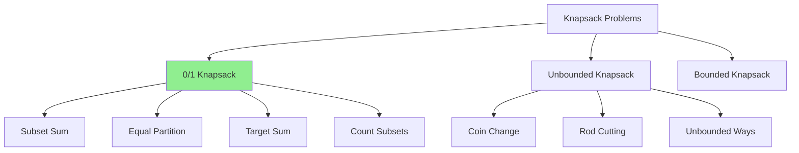

# 6.1 0/1 Knapsack Pattern

> **The 0/1 Knapsack Pattern** is the foundation for all bounded choice DP problems. "0/1" means you either take an item completely (1) or leave it (0)—no fractions. This pattern appears in countless interview problems disguised under different names.

---

## 🎯 Pattern Recognition

<details>
<summary><strong>How to Identify 0/1 Knapsack</strong></summary>

**Look for these signals:**
- Fixed set of items with values and weights/costs
- Capacity/budget constraint
- Each item can be used **at most once**
- Maximize value or count ways under constraint

**Keywords:**
- "maximum profit with capacity"
- "can we achieve exactly this sum"
- "each item can be selected at most once"
- "subset sum", "partition"

**The pattern signature:**
```
For each item, two choices:
  1. Include item (if it fits)
  2. Exclude item

dp[i][w] = max(
    dp[i-1][w],              // exclude item i
    dp[i-1][w-weight[i]] + value[i]  // include item i
)
```

</details>

---

## ✅ When to Use

- Maximizing value within a capacity
- Subset selection with constraints
- Counting subsets that meet criteria
- Partitioning problems (can we split into equal halves?)

## ❌ When NOT to Use

| Situation | Why | Use Instead |
|-----------|-----|-------------|
| Items can be used multiple times | No "at most once" constraint | Unbounded Knapsack |
| Items can be split | Fractional values | Greedy (fractional knapsack) |
| Order matters | Sequence, not subset | Sequence DP |
| No capacity constraint | Different structure | Greedy or other DP |

---

## 🔗 Concept Map

<details>
<summary><strong>Knapsack Family</strong></summary>



**This pattern leads to:**
- [Unbounded Knapsack](../05-Knapsack-Unbounded/)
- [Target Sum variations](./6.2-01-Knapsack-Practice/)

</details>

---

## 📐 Core Template

### The Classic 0/1 Knapsack

```
Given:
  - n items with weights[] and values[]
  - Knapsack capacity W
  
Find:
  - Maximum value achievable

State:      dp[i][w] = max value using items 0..i-1 with capacity w
Recurrence: dp[i][w] = max(
              dp[i-1][w],                    // skip item i
              dp[i-1][w-weights[i-1]] + values[i-1]  // take item i
            )
Base Case:  dp[0][w] = 0 (no items = no value)
            dp[i][0] = 0 (no capacity = no value)
```

**Visualization:**
```
Items: weights = [1, 3, 4, 5], values = [1, 4, 5, 7]
Capacity: W = 7

     w:  0   1   2   3   4   5   6   7
i=0:    [0] [0] [0] [0] [0] [0] [0] [0]
i=1:    [0] [1] [1] [1] [1] [1] [1] [1]  item 0: w=1, v=1
i=2:    [0] [1] [1] [4] [5] [5] [5] [5]  item 1: w=3, v=4
i=3:    [0] [1] [1] [4] [5] [6] [6] [9]  item 2: w=4, v=5
i=4:    [0] [1] [1] [4] [5] [7] [8] [9]  item 3: w=5, v=7

Answer: dp[4][7] = 9 (items 1 and 2: 4+5=9)
```

---

## 💻 Implementation

### 2D Solution

```python
def knapsack_01(weights: list[int], values: list[int], W: int) -> int:
    """
    Classic 0/1 Knapsack.
    Time: O(n*W), Space: O(n*W)
    """
    n = len(weights)
    dp = [[0] * (W + 1) for _ in range(n + 1)]
    
    for i in range(1, n + 1):
        for w in range(W + 1):
            # Option 1: Don't take item i-1
            dp[i][w] = dp[i-1][w]
            
            # Option 2: Take item i-1 (if it fits)
            if weights[i-1] <= w:
                dp[i][w] = max(
                    dp[i][w],
                    dp[i-1][w - weights[i-1]] + values[i-1]
                )
    
    return dp[n][W]
```

### 1D Space Optimized

```python
def knapsack_01_optimized(weights: list[int], values: list[int], W: int) -> int:
    """
    Space optimized to O(W).
    CRITICAL: Must iterate W backwards to avoid using updated values.
    """
    n = len(weights)
    dp = [0] * (W + 1)
    
    for i in range(n):
        # Iterate backwards to prevent using same item twice
        for w in range(W, weights[i] - 1, -1):
            dp[w] = max(dp[w], dp[w - weights[i]] + values[i])
    
    return dp[W]
```

```javascript
function knapsack01(weights, values, W) {
    const n = weights.length;
    const dp = new Array(W + 1).fill(0);
    
    for (let i = 0; i < n; i++) {
        // Backwards iteration is critical!
        for (let w = W; w >= weights[i]; w--) {
            dp[w] = Math.max(dp[w], dp[w - weights[i]] + values[i]);
        }
    }
    
    return dp[W];
}
```

---

## ⚠️ Critical: Backward Iteration

**Why iterate backwards in 1D?**

```python
# Forward iteration (WRONG for 0/1):
for w in range(weights[i], W + 1):
    dp[w] = max(dp[w], dp[w - weights[i]] + values[i])
    # dp[w - weights[i]] may have been updated in THIS iteration
    # This means we're using item i MULTIPLE times!

# Backward iteration (CORRECT for 0/1):
for w in range(W, weights[i] - 1, -1):
    dp[w] = max(dp[w], dp[w - weights[i]] + values[i])
    # dp[w - weights[i]] is from PREVIOUS iteration
    # Item i is only considered once
```

**Visual example:**
```
Item: weight=2, value=3, W=6
Initial dp: [0, 0, 0, 0, 0, 0, 0]

Forward (wrong):
w=2: dp[2] = max(0, dp[0]+3) = 3 → [0,0,3,0,0,0,0]
w=4: dp[4] = max(0, dp[2]+3) = 6 → [0,0,3,0,6,0,0]  # Used item again!
w=6: dp[6] = max(0, dp[4]+3) = 9 → [0,0,3,0,6,0,9]  # 3 times!

Backward (correct):
w=6: dp[6] = max(0, dp[4]+3) = 3 → [0,0,0,0,0,0,3]
w=4: dp[4] = max(0, dp[2]+3) = 3 → [0,0,0,0,3,0,3]
w=2: dp[2] = max(0, dp[0]+3) = 3 → [0,0,3,0,3,0,3]  # Correct!
```

---

## 💻 Common Variations

### 1. Subset Sum (Decision)

**Problem:** Can we select a subset that sums to exactly S?

```python
def can_sum(nums: list[int], target: int) -> bool:
    """Is there a subset that sums to target?"""
    dp = [False] * (target + 1)
    dp[0] = True  # Empty subset sums to 0
    
    for num in nums:
        for s in range(target, num - 1, -1):
            dp[s] = dp[s] or dp[s - num]
    
    return dp[target]
```

### 2. Count Subsets

**Problem:** How many subsets sum to exactly S?

```python
def count_subsets(nums: list[int], target: int) -> int:
    """Count subsets that sum to target."""
    dp = [0] * (target + 1)
    dp[0] = 1  # One way to get sum 0 (empty subset)
    
    for num in nums:
        for s in range(target, num - 1, -1):
            dp[s] += dp[s - num]
    
    return dp[target]
```

### 3. Equal Partition

**Problem:** Can we partition into two subsets with equal sums?

```python
def can_partition(nums: list[int]) -> bool:
    """Can we split nums into two equal-sum halves?"""
    total = sum(nums)
    
    # If odd sum, can't partition equally
    if total % 2 != 0:
        return False
    
    target = total // 2
    
    # Reduce to: can we find subset summing to target?
    dp = [False] * (target + 1)
    dp[0] = True
    
    for num in nums:
        for s in range(target, num - 1, -1):
            dp[s] = dp[s] or dp[s - num]
    
    return dp[target]
```

### 4. Target Sum (with + and -)

**Problem:** Assign + or - to each number to reach target.

```python
def find_target_sum_ways(nums: list[int], target: int) -> int:
    """
    Count ways to assign +/- to reach target.
    
    If P = sum of positives, N = sum of negatives:
    P - N = target
    P + N = total
    → P = (target + total) / 2
    
    Reduce to: count subsets summing to P
    """
    total = sum(nums)
    
    # Check if target is achievable
    if abs(target) > total or (total + target) % 2 != 0:
        return 0
    
    P = (total + target) // 2
    
    dp = [0] * (P + 1)
    dp[0] = 1
    
    for num in nums:
        for s in range(P, num - 1, -1):
            dp[s] += dp[s - num]
    
    return dp[P]
```

---

## ⚡ Complexity Analysis

| Variant | Time | Space (2D) | Space (1D) |
|---------|------|------------|------------|
| Classic 0/1 | O(n×W) | O(n×W) | O(W) |
| Subset Sum | O(n×S) | O(n×S) | O(S) |
| Count Subsets | O(n×S) | O(n×S) | O(S) |
| Equal Partition | O(n×(sum/2)) | O(n×sum) | O(sum/2) |

---

## ⚠️ Common Mistakes

### 1. Forward Instead of Backward Loop

**❌ Wrong:**
```python
for num in nums:
    for s in range(num, target + 1):  # Forward!
        dp[s] = max(dp[s], dp[s - num] + num)
# This allows using same item multiple times → Unbounded, not 0/1
```

**✅ Correct:**
```python
for num in nums:
    for s in range(target, num - 1, -1):  # Backward!
        dp[s] = max(dp[s], dp[s - num] + num)
```

### 2. Wrong Base Case for Counting

**❌ Wrong:**
```python
dp = [0] * (target + 1)
# dp[0] = 0 means no way to get sum 0
```

**✅ Correct:**
```python
dp = [0] * (target + 1)
dp[0] = 1  # One way to get sum 0: select nothing
```

### 3. Not Handling Zeros in Target Sum

**❌ Partial:**
```python
# What if nums has zeros?
# Each zero can be + or -, both giving 0
# Need to handle separately
```

**✅ Full handling:**
```python
zeros = nums.count(0)
nums = [n for n in nums if n != 0]
# Each zero doubles the number of ways
result = count_subsets(nums, P) * (2 ** zeros)
```

---

## 📝 Practice Problems (Progressive)

**Easy/Medium:**
- [ ] [Partition Equal Subset Sum](https://leetcode.com/problems/partition-equal-subset-sum/) - Classic reduction
- [ ] [Subset Sum](https://www.geeksforgeeks.org/subset-sum-problem-dp-25/) - Foundation

**Medium:**
- [ ] [Target Sum](https://leetcode.com/problems/target-sum/) - Count with +/-
- [ ] [Last Stone Weight II](https://leetcode.com/problems/last-stone-weight-ii/) - Min difference partition
- [ ] [Ones and Zeroes](https://leetcode.com/problems/ones-and-zeroes/) - 2D knapsack

**Hard:**
- [ ] [Profitable Schemes](https://leetcode.com/problems/profitable-schemes/) - Multi-constraint

<details>
<summary><strong>🧠 Spaced Repetition Schedule</strong></summary>

- **Day 1:** Classic Knapsack (understand the template)
- **Day 3:** Partition Equal Subset Sum (reduction thinking)
- **Day 7:** Target Sum (mathematical transformation)
- **Day 14:** Ones and Zeroes (2D constraint)
- **Day 30:** Mix problems, identify pattern quickly

</details>

---

## 🎤 Interview Context

<details>
<summary><strong>How to Communicate Knapsack</strong></summary>

**Pattern recognition:**
> "This looks like a 0/1 Knapsack problem because we're selecting items (at most once each) to maximize value under a capacity constraint."

**Reduction insight:**
> "I can reduce this to subset sum by thinking of [specific transformation]..."

**Space optimization:**
> "I'll iterate backwards over the capacity to ensure each item is only used once. This optimizes from O(n×W) to O(W) space."

**Company Focus:**
| Company | Knapsack Variants |
|---------|-------------------|
| Google | Medium, often disguised |
| Amazon | Common, direct problems |
| Meta | Subset/partition problems |

</details>

---

## ⏱️ Time Estimates

| Activity | Time |
|----------|------|
| Learn 0/1 template | 30-40 min |
| Solve Partition | 20-25 min |
| Solve Target Sum | 25-30 min |
| Master reductions | 5-8 problems |

---

> **💡 Key Insight:** Most 0/1 Knapsack problems are "subset selection under constraint." The key transformation is recognizing what's the "capacity" and what's the "value." For subset sum: capacity = target, value = whether we reach it. For partition: capacity = total/2.

> **🔗 Related:** [Unbounded Knapsack](../05-Knapsack-Unbounded/) | [DP Fundamentals](../01-DP-Fundamentals/) | [Fibonacci Pattern](../02-Fibonacci-Pattern/)
