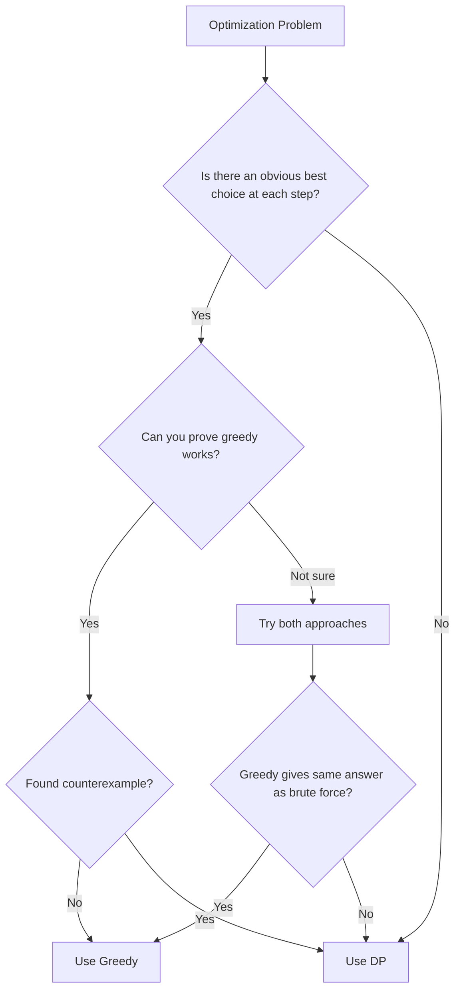

# 1.3 Greedy vs Dynamic Programming

> **Definition:** Greedy makes one choice per step and never reconsiders; DP explores all choices and combines optimal subproblem solutions. Use greedy when local optimal = global optimal; use DP when you need to try all possibilities.

---

## 🎯 Pattern Recognition

<details>
<summary><strong>Decision Framework: Greedy or DP?</strong></summary>

**Choose Greedy when:**
- [x] Making a locally optimal choice doesn't eliminate globally optimal
- [x] Problem has obvious "best" choice at each step
- [x] No need to reconsider or backtrack
- [x] Sorting + single pass solves it
- [x] Interval scheduling, assignment, covering problems

**Choose DP when:**
- [x] Need to explore ALL choices to find optimum
- [x] Current choice affects future options in complex ways
- [x] Problem has overlapping subproblems
- [x] Counting problems (how many ways?)
- [x] Partition/subset problems with constraints
- [x] Can't find a counterexample where greedy fails

**Red flags suggesting DP:**
- "Number of ways to..."
- "Minimum/maximum considering ALL possibilities"
- Constraints that couple decisions (knapsack capacity)
- Non-canonical coin systems

</details>

---

## ✅ Side-by-Side Comparison

| Aspect | Greedy | Dynamic Programming |
|--------|--------|---------------------|
| **Approach** | Make best local choice, move on | Try all choices, combine results |
| **Subproblems** | One subproblem after choice | Multiple subproblems considered |
| **Reconsideration** | Never look back | Compares all options |
| **Correctness** | Only for special problems | Always finds optimal |
| **Time** | Usually O(n log n) | Usually O(n²) or O(n × capacity) |
| **Space** | Usually O(1) or O(n) | O(n) to O(n²) for memoization |
| **Implementation** | Simpler | More complex |
| **Proof required** | Yes (correctness) | No (exhaustive) |

---

## ❌ When to Use Each

### Greedy Problems

| Problem | Greedy Strategy | Time |
|---------|-----------------|------|
| Activity Selection | Sort by end, pick non-overlapping | O(n log n) |
| Fractional Knapsack | Sort by ratio, take fractions | O(n log n) |
| Huffman Coding | Combine min frequencies | O(n log n) |
| Jump Game | Track max reachable | O(n) |
| Merge Intervals | Sort by start, merge | O(n log n) |

### DP Problems

| Problem | DP Approach | Time |
|---------|-------------|------|
| 0/1 Knapsack | dp[i][w] = max with/without item i | O(n × W) |
| Coin Change | dp[amount] = min coins to make amount | O(n × amount) |
| LCS | dp[i][j] = longest common subsequence | O(m × n) |
| Edit Distance | dp[i][j] = min operations | O(m × n) |
| Longest Path | dp with topological sort | O(V + E) |

---

## 🔗 Concept Map

<details>
<summary><strong>Prerequisites & Connections</strong></summary>

**Before this, you should know:**
- [What Is Greedy](./1.1-What-Is-Greedy.md) - Greedy fundamentals
- [When Greedy Works](./1.2-When-Greedy-Works.md) - Correctness conditions
- [DP Fundamentals](../../11-Dynamic-Programming/01-DP-Fundamentals/1.1-What-Is-DP.md) - DP basics

**After mastering this:**
- [Problem Solving Framework](./3.0-Greedy-Problem-Solving-Framework.md) - Decision process
- [Interval Problems](../02-Interval-Pattern/4.1-Interval-Greedy-Overview.md) - Classic greedy

**Key insight:**
Greedy is a special case that works when you don't need DP's exhaustive search.

</details>

---

## 📐 Same Problem, Different Constraints

### Knapsack Problem

**Fractional Knapsack (Greedy Works ✅)**
```
Items: [(weight=10, value=60), (weight=20, value=100), (weight=30, value=120)]
Capacity: 50

Can take fractions → Sort by value/weight ratio → Take greedily

Ratios: 6.0, 5.0, 4.0
Take: item1 (10kg, $60) + item2 (20kg, $100) + 2/3 of item3 (20kg, $80)
Total: 60 + 100 + 80 = $240 ✅
```

**0/1 Knapsack (Greedy Fails ❌, Use DP)**
```
Same items, but can't take fractions

Greedy by ratio:
- Item1 (ratio 6.0): weight=10, capacity left=40
- Item2 (ratio 5.0): weight=20, capacity left=20
- Item3 (ratio 4.0): won't fit
Total: $160 ❌

DP optimal:
- Item2 (20kg) + Item3 (30kg) = 50kg, $220 ✅

Greedy fails because we can't take fractions!
```

### Coin Change

**Canonical Denominations (Greedy Works ✅)**
```
Coins: [1, 5, 10, 25], Target: 41

Greedy: 25 + 10 + 5 + 1 = 4 coins ✅ (also optimal)

Works because US coins have special structure:
- Each coin ≥ 2× next smaller
```

**Non-Canonical Denominations (Greedy Fails ❌)**
```
Coins: [1, 3, 4], Target: 6

Greedy: 4 + 1 + 1 = 3 coins ❌
Optimal: 3 + 3 = 2 coins ✅

No simple relationship between coins!
```

---

## 💻 Code Implementation

**Python - Same Problem, Greedy vs DP:**

```python
# ===== KNAPSACK COMPARISON =====

def fractional_knapsack_greedy(items, capacity):
    """
    Fractional Knapsack - GREEDY works.
    items: list of (weight, value)
    
    Time: O(n log n), Space: O(1)
    """
    # Sort by value/weight ratio (descending)
    sorted_items = sorted(items, key=lambda x: x[1]/x[0], reverse=True)
    
    total_value = 0
    remaining = capacity
    
    for weight, value in sorted_items:
        if weight <= remaining:
            # Take whole item
            total_value += value
            remaining -= weight
        else:
            # Take fraction
            fraction = remaining / weight
            total_value += value * fraction
            break
    
    return total_value


def knapsack_01_dp(items, capacity):
    """
    0/1 Knapsack - Need DP.
    
    Time: O(n * capacity), Space: O(capacity)
    """
    n = len(items)
    dp = [0] * (capacity + 1)
    
    for weight, value in items:
        # Traverse backwards to avoid using same item twice
        for w in range(capacity, weight - 1, -1):
            dp[w] = max(dp[w], dp[w - weight] + value)
    
    return dp[capacity]


# Test
items = [(10, 60), (20, 100), (30, 120)]  # (weight, value)
capacity = 50

print(f"Fractional (Greedy): ${fractional_knapsack_greedy(items, capacity)}")
print(f"0/1 (DP): ${knapsack_01_dp(items, capacity)}")
# Fractional: $240, 0/1: $220


# ===== COIN CHANGE COMPARISON =====

def coin_change_greedy(coins, amount):
    """
    Greedy coin change - ONLY works for canonical coins!
    
    Time: O(n), Space: O(1)
    """
    coins_sorted = sorted(coins, reverse=True)
    count = 0
    
    for coin in coins_sorted:
        if amount >= coin:
            num_coins = amount // coin
            count += num_coins
            amount -= coin * num_coins
    
    return count if amount == 0 else -1


def coin_change_dp(coins, amount):
    """
    DP coin change - Always finds optimal.
    
    Time: O(n * amount), Space: O(amount)
    """
    dp = [float('inf')] * (amount + 1)
    dp[0] = 0
    
    for a in range(1, amount + 1):
        for coin in coins:
            if coin <= a and dp[a - coin] != float('inf'):
                dp[a] = min(dp[a], dp[a - coin] + 1)
    
    return dp[amount] if dp[amount] != float('inf') else -1


# Test canonical coins (greedy works)
print(f"\nCanonical coins [1,5,10,25], target=41:")
print(f"Greedy: {coin_change_greedy([1,5,10,25], 41)} coins")
print(f"DP: {coin_change_dp([1,5,10,25], 41)} coins")

# Test non-canonical coins (greedy fails)
print(f"\nNon-canonical coins [1,3,4], target=6:")
print(f"Greedy: {coin_change_greedy([1,3,4], 6)} coins")
print(f"DP: {coin_change_dp([1,3,4], 6)} coins")
```

**JavaScript:**
```javascript
// Fractional Knapsack - Greedy
function fractionalKnapsackGreedy(items, capacity) {
    // Sort by value/weight ratio descending
    const sorted = [...items].sort((a, b) => 
        (b.value / b.weight) - (a.value / a.weight)
    );
    
    let totalValue = 0;
    let remaining = capacity;
    
    for (const { weight, value } of sorted) {
        if (weight <= remaining) {
            totalValue += value;
            remaining -= weight;
        } else {
            totalValue += value * (remaining / weight);
            break;
        }
    }
    return totalValue;
}

// 0/1 Knapsack - DP
function knapsack01DP(items, capacity) {
    const dp = new Array(capacity + 1).fill(0);
    
    for (const { weight, value } of items) {
        for (let w = capacity; w >= weight; w--) {
            dp[w] = Math.max(dp[w], dp[w - weight] + value);
        }
    }
    return dp[capacity];
}

// Test
const items = [
    { weight: 10, value: 60 },
    { weight: 20, value: 100 },
    { weight: 30, value: 120 }
];

console.log("Fractional (Greedy):", fractionalKnapsackGreedy(items, 50));
console.log("0/1 (DP):", knapsack01DP(items, 50));
```

---

## ⚡ Complexity Analysis

| Approach | Time | Space | When Faster |
|----------|------|-------|-------------|
| **Greedy** | O(n log n) | O(1) | When it works |
| **DP** | O(n × state) | O(state) | When needed |
| **Brute Force** | O(2^n) | O(n) | Never (reference) |

**Performance difference can be huge:**
```
n = 1000, state = 10000

Greedy: 1000 × log(1000) ≈ 10,000 operations
DP: 1000 × 10000 = 10,000,000 operations
Brute Force: 2^1000 ≈ ∞ (impossible)
```

---

## 🔄 Decision Tree



---

## ⚠️ Common Mistakes

1. **Assuming greedy works for all optimization problems**
   - ❌ "It's asking for minimum, so greedy must work"
   - ✅ Check if problem has greedy choice property

2. **Not knowing when DP is overkill**
   - ❌ Using DP for activity selection (O(n²))
   - ✅ Use greedy (O(n log n)) when applicable

3. **Choosing wrong approach due to similar wording**
   - ❌ "Coin change = greedy" (only for canonical coins)
   - ✅ Check coin structure before deciding

4. **Forgetting hybrid approaches**
   - ❌ Thinking it's always one or the other
   - ✅ Some problems use greedy within DP, or binary search + greedy

---

## 📝 Practice Problems

### Greedy (simpler, faster)
- [ ] [Merge Intervals](https://leetcode.com/problems/merge-intervals/) - Sort + greedy merge
- [ ] [Jump Game](https://leetcode.com/problems/jump-game/) - Track reachable
- [ ] [Gas Station](https://leetcode.com/problems/gas-station/) - Track surplus

### DP (necessary for correctness)
- [ ] [Coin Change](https://leetcode.com/problems/coin-change/) - Can't use greedy
- [ ] [0/1 Knapsack](https://www.geeksforgeeks.org/0-1-knapsack-problem-dp-10/) - Item selection
- [ ] [Longest Increasing Subsequence](https://leetcode.com/problems/longest-increasing-subsequence/) - Subsequence

### Could Be Either (practice deciding)
- [ ] [Best Time to Buy and Sell Stock](https://leetcode.com/problems/best-time-to-buy-and-sell-stock/) - Greedy works
- [ ] [Best Time to Buy and Sell Stock II](https://leetcode.com/problems/best-time-to-buy-and-sell-stock-ii/) - Greedy works
- [ ] [Best Time to Buy and Sell Stock III](https://leetcode.com/problems/best-time-to-buy-and-sell-stock-iii/) - DP needed

<details>
<summary><strong>🧠 Spaced Repetition Schedule</strong></summary>

- **Day 1:** Compare knapsack variants (fractional vs 0/1)
- **Day 3:** Compare coin change with different coins
- **Day 7:** Categorize 10 problems as greedy or DP
- **Day 14:** Explain the decision to a peer
- **Day 30:** Solve an unfamiliar problem, justify approach

</details>

---

## 🎤 Interview Context

<details>
<summary><strong>Articulating Greedy vs DP Choice</strong></summary>

**Opening statement:**
```
"Before I start coding, let me think about whether this 
is a greedy or DP problem..."
```

**Choosing Greedy:**
```
"I think greedy works here because:
1. There's a clear 'best' choice at each step (e.g., earliest ending)
2. Making that choice doesn't eliminate the optimal solution
3. I can't think of a counterexample where greedy fails

My approach: sort by [criterion], then iterate and greedily select."
```

**Choosing DP:**
```
"I don't think greedy works because:
1. Here's a counterexample: [explain]
2. We need to consider ALL choices, not just the locally best
3. The problem has overlapping subproblems

My approach: define state as [x], recurrence as [y]."
```

**Company expectations:**
| Company | What They Value |
|---------|-----------------|
| Amazon | Correct approach choice, justify it |
| Meta | Quick recognition, clean implementation |
| Google | May ask to prove greedy correctness |
| Microsoft | Show both options if unsure |

</details>

---

## ⏱️ Time Estimates

| Activity | Time | Notes |
|----------|------|-------|
| Learn distinction | 30 min | Theory |
| Practice deciding | 1-2 hours | Multiple problems |
| Master the choice | 3-5 hours | Various problem types |
| Articulate reasoning | 20 min | Interview prep |

---

> **💡 Key Insight:** When in doubt, try greedy first—it's faster to implement and run. If you find a counterexample, switch to DP. The skill is in quickly recognizing which approach fits the problem structure.

> **🔗 Related:** [What Is Greedy](./1.1-What-Is-Greedy.md) | [When Greedy Works](./1.2-When-Greedy-Works.md) | [DP Fundamentals](../../11-Dynamic-Programming/01-DP-Fundamentals/1.1-What-Is-DP.md)
