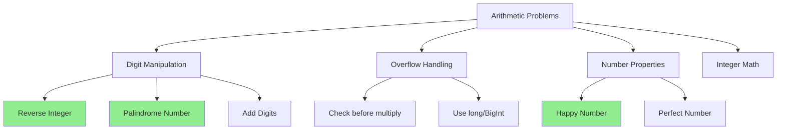

# Arithmetic Basics

> **Foundation of numerical operations for DSA.**
>
> Understanding overflow, integer properties, and digit manipulation.

---

## 🎯 Pattern Recognition



**Recognize arithmetic problems when you see:**
- "Reverse digits"
- "Check if palindrome"
- "Sum of digits"
- "Without converting to string"
- Integer overflow constraints

---

## 📐 Core Operations

### Digit Extraction

The fundamental operation: extract digits using modulo and division.

```python
def extract_digits(n: int) -> list[int]:
    """
    Extract digits from right to left.
    
    123 → [3, 2, 1]
    """
    if n == 0:
        return [0]
    
    digits = []
    n = abs(n)
    
    while n:
        digits.append(n % 10)  # Get last digit
        n //= 10               # Remove last digit
    
    return digits


# Examples
print(extract_digits(123))   # [3, 2, 1]
print(extract_digits(4567))  # [7, 6, 5, 4]
```

```javascript
function extractDigits(n) {
    if (n === 0) return [0];
    
    const digits = [];
    n = Math.abs(n);
    
    while (n > 0) {
        digits.push(n % 10);
        n = Math.floor(n / 10);
    }
    
    return digits;
}

console.log(extractDigits(123));  // [3, 2, 1]
```

### Digit Building

Build a number from digits.

```python
def build_number(digits: list[int]) -> int:
    """
    Build number from digits (left to right).
    
    [1, 2, 3] → 123
    """
    result = 0
    for d in digits:
        result = result * 10 + d
    return result


print(build_number([1, 2, 3]))  # 123
```

```javascript
function buildNumber(digits) {
    return digits.reduce((acc, d) => acc * 10 + d, 0);
}

console.log(buildNumber([1, 2, 3]));  // 123
```

---

## 💻 Classic Problems

### Problem 1: Reverse Integer (LC 7)

```python
def reverse(x: int) -> int:
    """
    Reverse integer with overflow check.
    
    Time: O(log x) - number of digits
    Space: O(1)
    """
    INT_MAX = 2**31 - 1  # 2147483647
    INT_MIN = -2**31     # -2147483648
    
    result = 0
    sign = 1 if x >= 0 else -1
    x = abs(x)
    
    while x:
        digit = x % 10
        x //= 10
        
        # Check overflow BEFORE adding
        if result > INT_MAX // 10:
            return 0
        if result == INT_MAX // 10 and digit > 7:
            return 0
            
        result = result * 10 + digit
    
    return sign * result


print(reverse(123))   # 321
print(reverse(-123))  # -321
print(reverse(1534236469))  # 0 (overflow)
```

```javascript
function reverse(x) {
    const INT_MAX = 2147483647;
    const INT_MIN = -2147483648;
    
    let result = 0;
    const sign = x >= 0 ? 1 : -1;
    x = Math.abs(x);
    
    while (x > 0) {
        const digit = x % 10;
        x = Math.floor(x / 10);
        
        // Check overflow
        if (result > Math.floor(INT_MAX / 10)) return 0;
        if (result === Math.floor(INT_MAX / 10) && digit > 7) return 0;
        
        result = result * 10 + digit;
    }
    
    return sign * result;
}
```

### Problem 2: Palindrome Number (LC 9)

```python
def isPalindrome(x: int) -> bool:
    """
    Check if number is palindrome without converting to string.
    
    Key insight: Reverse only half the number to avoid overflow.
    
    Time: O(log x)
    Space: O(1)
    """
    # Negative numbers and numbers ending in 0 (except 0) aren't palindromes
    if x < 0 or (x % 10 == 0 and x != 0):
        return False
    
    reversed_half = 0
    while x > reversed_half:
        reversed_half = reversed_half * 10 + x % 10
        x //= 10
    
    # For odd length, reversed_half has one more digit
    return x == reversed_half or x == reversed_half // 10


print(isPalindrome(121))   # True
print(isPalindrome(12321)) # True
print(isPalindrome(-121))  # False
print(isPalindrome(10))    # False
```

```javascript
function isPalindrome(x) {
    if (x < 0 || (x % 10 === 0 && x !== 0)) {
        return false;
    }
    
    let reversedHalf = 0;
    while (x > reversedHalf) {
        reversedHalf = reversedHalf * 10 + x % 10;
        x = Math.floor(x / 10);
    }
    
    return x === reversedHalf || x === Math.floor(reversedHalf / 10);
}
```

### Problem 3: Happy Number (LC 202)

A happy number eventually reaches 1 when repeatedly replacing it with the sum of squares of its digits.

```python
def isHappy(n: int) -> bool:
    """
    Check if n is a happy number.
    
    Key insight: Use Floyd's cycle detection.
    If not happy, it enters a cycle.
    
    Time: O(log n) - digits shrink quickly
    Space: O(1) with Floyd's algorithm
    """
    def get_next(num: int) -> int:
        total = 0
        while num:
            digit = num % 10
            num //= 10
            total += digit * digit
        return total
    
    slow = n
    fast = get_next(n)
    
    while fast != 1 and slow != fast:
        slow = get_next(slow)
        fast = get_next(get_next(fast))
    
    return fast == 1


print(isHappy(19))  # True: 19→82→68→100→1
print(isHappy(2))   # False: enters cycle
```

```javascript
function isHappy(n) {
    function getNext(num) {
        let total = 0;
        while (num > 0) {
            const digit = num % 10;
            num = Math.floor(num / 10);
            total += digit * digit;
        }
        return total;
    }
    
    let slow = n;
    let fast = getNext(n);
    
    while (fast !== 1 && slow !== fast) {
        slow = getNext(slow);
        fast = getNext(getNext(fast));
    }
    
    return fast === 1;
}
```

### Problem 4: Add Digits (LC 258)

```python
def addDigits(num: int) -> int:
    """
    Repeatedly sum digits until single digit.
    
    Math trick: This is the digital root.
    Result is num % 9, with special case for multiples of 9.
    
    Time: O(1) with math formula
    Space: O(1)
    """
    if num == 0:
        return 0
    return 1 + (num - 1) % 9


# Iterative version (for understanding)
def addDigits_iterative(num: int) -> int:
    while num >= 10:
        total = 0
        while num:
            total += num % 10
            num //= 10
        num = total
    return num


print(addDigits(38))   # 2: 38→11→2
print(addDigits(123))  # 6: 123→6
```

```javascript
function addDigits(num) {
    if (num === 0) return 0;
    return 1 + (num - 1) % 9;
}
```

---

## ⚡ Overflow Handling Strategies

### Strategy 1: Check Before Operation

```python
def safe_multiply(a: int, b: int, MAX: int) -> int | None:
    """Multiply with overflow check."""
    if a > MAX // b:
        return None  # Would overflow
    return a * b
```

### Strategy 2: Reverse Half (Palindrome Trick)

```python
# Instead of reversing entire number:
# Just reverse half to stay within bounds
while x > reversed_half:
    reversed_half = reversed_half * 10 + x % 10
    x //= 10
```

### Strategy 3: Use Bigger Type

```python
# Python has arbitrary precision integers
# In other languages, use long long or BigInt

# JavaScript
# Use BigInt for very large numbers
# const big = BigInt(number)
```

---

## 🔄 Integer Division Tricks

### Floor vs Ceiling Division

```python
# Floor division (rounds toward negative infinity)
print(7 // 3)    # 2
print(-7 // 3)   # -3 (Python)

# Ceiling division
import math
print(math.ceil(7 / 3))  # 3

# Integer ceiling without float
# ceil(a/b) = (a + b - 1) // b for positive numbers
def ceil_div(a: int, b: int) -> int:
    return (a + b - 1) // b

print(ceil_div(7, 3))  # 3
print(ceil_div(9, 3))  # 3
```

```javascript
// JavaScript floor division
console.log(Math.floor(7 / 3));   // 2
console.log(Math.floor(-7 / 3));  // -3

// Ceiling division
console.log(Math.ceil(7 / 3));    // 3

// Integer ceiling
const ceilDiv = (a, b) => Math.floor((a + b - 1) / b);
```

### Rounding to Nearest

```python
# Round to nearest integer
round(2.5)  # 2 (banker's rounding in Python 3)
round(3.5)  # 4

# Round to nearest multiple of k
def round_to_multiple(n: int, k: int) -> int:
    return ((n + k // 2) // k) * k

print(round_to_multiple(17, 5))  # 15
print(round_to_multiple(18, 5))  # 20
```

---

## ⚠️ Common Mistakes

### 1. Integer Division in Different Languages

```python
# Python: // always floors
print(-7 // 2)  # -4 (toward negative infinity)

# C++/Java: / truncates toward zero
# -7 / 2 = -3
```

### 2. Overflow on Intermediate Results

```python
# ❌ WRONG - overflow on a * b even if result fits
def compute(a, b, c):
    return (a * b) // c

# ✅ CORRECT - check or use BigInt
def compute_safe(a, b, c):
    # Use Python's arbitrary precision
    return (a * b) // c
```

### 3. Digit Extraction Direction

```python
# Extracting gives REVERSED order
123 % 10 = 3  # last digit first
12 % 10 = 2
1 % 10 = 1

# Building reverses back
# If you want original order, store and reverse
```

---

## ✅ When to Use Digit Manipulation

- Reverse number problems
- Palindrome checks
- Digit sum/product operations
- Number validation without strings

## ❌ When NOT to Use

| Scenario | Use Instead |
|----------|-------------|
| String output needed | Just convert to string |
| Complex parsing | String methods |
| Very large numbers | String manipulation |

---

## 📝 Practice Problems

| Problem | Difficulty | Key Technique |
|---------|------------|---------------|
| [Reverse Integer](https://leetcode.com/problems/reverse-integer/) | 🟡 Medium | Overflow check |
| [Palindrome Number](https://leetcode.com/problems/palindrome-number/) | 🟢 Easy | Reverse half |
| [Happy Number](https://leetcode.com/problems/happy-number/) | 🟢 Easy | Cycle detection |
| [Add Digits](https://leetcode.com/problems/add-digits/) | 🟢 Easy | Digital root |
| [Sqrt(x)](https://leetcode.com/problems/sqrtx/) | 🟢 Easy | Binary search |

---

## 🎤 Interview Context

<details>
<summary><strong>How to Communicate</strong></summary>

**For Reverse Integer:**
> "I'll extract digits using mod 10 and build the reversed number. The key is checking for overflow before each multiplication by 10."

**For Palindrome:**
> "Instead of reversing the whole number and risking overflow, I'll reverse only half and compare with the remaining half."

**Company Frequency:**
| Company | Frequency | Focus |
|---------|-----------|-------|
| Amazon | ⭐⭐⭐ | Overflow handling |
| Meta | ⭐⭐⭐ | Edge cases |
| Google | ⭐⭐ | Math tricks |

</details>

---

## ⏱️ Time Estimates

| Activity | Time |
|----------|------|
| Learn digit manipulation | 15 min |
| Solve Reverse Integer | 20 min |
| Solve Palindrome | 15 min |
| Master pattern | 1 hour |

---

## 🧠 Spaced Repetition

<details>
<summary><strong>Review Schedule</strong></summary>

- **Day 1:** Implement digit extraction from scratch
- **Day 3:** Solve Palindrome without string conversion
- **Day 7:** Implement Happy Number with Floyd's
- **Day 14:** Solve a new digit manipulation problem
- **Day 30:** Review overflow handling strategies

</details>

---

> **💡 Key Insight:** Most digit problems follow the pattern: extract with `% 10`, move with `// 10`, build with `* 10 + digit`. Master this and you can solve any digit manipulation problem.

> **🔗 Related:** [Modular Arithmetic →](./1.2-Modular-Arithmetic.md) | [Fast Power →](./1.3-Fast-Power.md)
