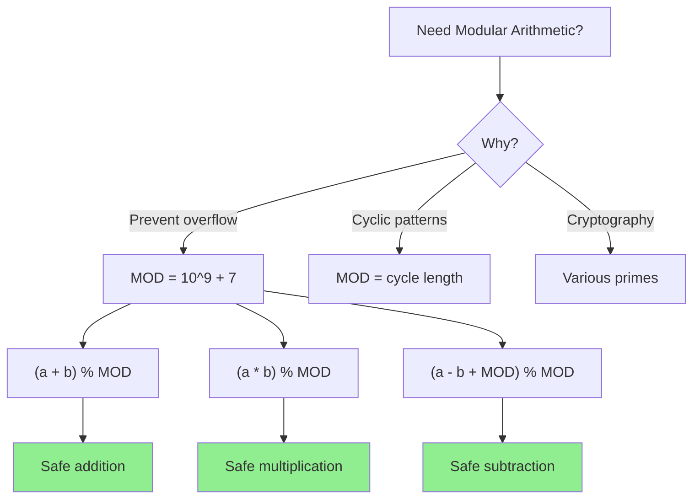

# Modular Arithmetic

> **Essential for handling large numbers in competitive programming.**
>
> The MOD = 10^9 + 7 pattern appears in countless interview problems.

---

## 🎯 Pattern Recognition



**Look for modular arithmetic when:**
- Problem says "return answer modulo 10^9 + 7"
- Computing factorials, combinations
- Counting problems with large answers
- Power/exponentiation operations

---

## 📐 Why 10^9 + 7?

### The Magic Number

`MOD = 1000000007 (10^9 + 7)`

**Why this specific number?**

1. **It's prime** → Modular inverse exists for all non-zero numbers
2. **Fits in 32-bit signed** → 2^31 - 1 ≈ 2.1 × 10^9
3. **Product fits in 64-bit** → (10^9)^2 = 10^18 < 2^63
4. **Large enough** → Low collision probability

### Safe Operations

```python
MOD = 1_000_000_007

# Two numbers < MOD
a, b = 500_000_000, 700_000_000

# Addition: result < 2 * MOD, fits in 32-bit
(a + b) % MOD  # = 200_000_000

# Multiplication: result < MOD^2, fits in 64-bit
(a * b) % MOD  # Needs 64-bit intermediate

# Python handles this automatically
# In C++/Java, cast to long long first
```

---

## 💻 Core Operations

### Addition and Subtraction

```python
MOD = 1_000_000_007

def mod_add(a: int, b: int) -> int:
    """Modular addition."""
    return (a + b) % MOD

def mod_sub(a: int, b: int) -> int:
    """Modular subtraction (handles negative)."""
    return (a - b + MOD) % MOD

# Examples
print(mod_add(5, 7))       # 12
print(mod_sub(3, 8))       # 10^9 + 7 - 5 = 1000000002
print(mod_sub(10, 3))      # 7
```

```javascript
const MOD = 1000000007n;  // Use BigInt

function modAdd(a, b) {
    return (a + b) % MOD;
}

function modSub(a, b) {
    return ((a - b) % MOD + MOD) % MOD;
}
```

### Multiplication

```python
MOD = 1_000_000_007

def mod_mul(a: int, b: int) -> int:
    """Modular multiplication."""
    return (a * b) % MOD

# Example: Large factorial
def factorial_mod(n: int) -> int:
    result = 1
    for i in range(2, n + 1):
        result = (result * i) % MOD
    return result

print(factorial_mod(20))  # 2432902008 (instead of 2432902008176640000)
```

```javascript
const MOD = 1000000007n;

function modMul(a, b) {
    return (a * b) % MOD;
}

function factorialMod(n) {
    let result = 1n;
    for (let i = 2n; i <= n; i++) {
        result = (result * i) % MOD;
    }
    return result;
}
```

### Division (Modular Inverse)

**Key:** Division by `b` = Multiplication by `b^(-1) mod MOD`

```python
MOD = 1_000_000_007

def mod_pow(base: int, exp: int, mod: int) -> int:
    """Fast modular exponentiation."""
    result = 1
    base %= mod
    while exp > 0:
        if exp & 1:
            result = (result * base) % mod
        exp >>= 1
        base = (base * base) % mod
    return result

def mod_inverse(a: int) -> int:
    """
    Modular inverse using Fermat's Little Theorem.
    Works only when MOD is prime.
    
    a^(-1) ≡ a^(MOD-2) (mod MOD)
    """
    return mod_pow(a, MOD - 2, MOD)

def mod_div(a: int, b: int) -> int:
    """Modular division: a / b mod MOD."""
    return (a * mod_inverse(b)) % MOD


# Example: Compute 10 / 3 mod MOD
print(mod_div(10, 3))  # Some number x where 3x ≡ 10 (mod MOD)
# Verify: (result * 3) % MOD should equal 10
```

```javascript
const MOD = 1000000007n;

function modPow(base, exp, mod) {
    let result = 1n;
    base = base % mod;
    while (exp > 0n) {
        if (exp & 1n) {
            result = (result * base) % mod;
        }
        exp >>= 1n;
        base = (base * base) % mod;
    }
    return result;
}

function modInverse(a) {
    return modPow(a, MOD - 2n, MOD);
}

function modDiv(a, b) {
    return (a * modInverse(b)) % MOD;
}
```

---

## 🔢 Common Patterns

### Pattern 1: Factorial with Modulo

```python
MOD = 1_000_000_007

class ModFactorial:
    """Precompute factorials for efficient nCr calculations."""
    
    def __init__(self, max_n: int):
        self.fact = [1] * (max_n + 1)
        self.inv_fact = [1] * (max_n + 1)
        
        # Compute factorials
        for i in range(1, max_n + 1):
            self.fact[i] = (self.fact[i-1] * i) % MOD
        
        # Compute inverse factorials
        self.inv_fact[max_n] = pow(self.fact[max_n], MOD - 2, MOD)
        for i in range(max_n - 1, -1, -1):
            self.inv_fact[i] = (self.inv_fact[i+1] * (i+1)) % MOD
    
    def nCr(self, n: int, r: int) -> int:
        """Compute C(n, r) mod MOD in O(1)."""
        if r < 0 or r > n:
            return 0
        return (self.fact[n] * self.inv_fact[r] % MOD) * self.inv_fact[n-r] % MOD
    
    def nPr(self, n: int, r: int) -> int:
        """Compute P(n, r) mod MOD in O(1)."""
        if r < 0 or r > n:
            return 0
        return (self.fact[n] * self.inv_fact[n-r]) % MOD


# Usage
mf = ModFactorial(1000)
print(mf.nCr(10, 3))   # 120
print(mf.nCr(100, 50)) # Large number mod 10^9+7
```

### Pattern 2: Sum Formulas with Modulo

```python
MOD = 1_000_000_007

def sum_1_to_n(n: int) -> int:
    """Sum of 1 to n, mod MOD."""
    # Formula: n * (n + 1) / 2
    # Division requires modular inverse
    return (n * (n + 1) % MOD) * mod_inverse(2) % MOD

def sum_squares(n: int) -> int:
    """Sum of 1² + 2² + ... + n², mod MOD."""
    # Formula: n * (n + 1) * (2n + 1) / 6
    numerator = n * (n + 1) % MOD * (2 * n + 1) % MOD
    return numerator * mod_inverse(6) % MOD


print(sum_1_to_n(1000000))  # Fast, no overflow
```

### Pattern 3: Power Tower

```python
def power_tower(a: int, b: int, c: int) -> int:
    """
    Compute a^(b^c) mod MOD.
    
    Key: By Fermat's little theorem, a^p ≡ a (mod p)
    So a^x ≡ a^(x mod (p-1)) for x >= 1 when gcd(a, p) = 1
    """
    MOD = 1_000_000_007
    
    # First compute b^c mod (MOD-1)
    exp = pow(b, c, MOD - 1)
    
    # Handle edge case: if exp is 0 but original exponent isn't 0
    if exp == 0 and (b > 0 and c > 0):
        exp = MOD - 1
    
    # Now compute a^exp mod MOD
    return pow(a, exp, MOD)
```

---

## ⚠️ Common Mistakes

### 1. Negative Numbers After Subtraction

```python
# ❌ WRONG - Python handles this, but other languages don't
result = (a - b) % MOD  # Could be negative in C++/Java

# ✅ CORRECT - Always add MOD first
result = (a - b + MOD) % MOD

# Even safer
result = ((a - b) % MOD + MOD) % MOD
```

### 2. Overflow Before Modulo

```python
# ❌ WRONG (in C++/Java) - overflow before modulo
int result = a * b % MOD;  // a * b overflows 32-bit

# ✅ CORRECT - cast first
long long result = (long long)a * b % MOD;
```

### 3. Division Without Inverse

```python
# ❌ WRONG - regular division doesn't work
result = (a / b) % MOD

# ✅ CORRECT - use modular inverse
result = (a * mod_inverse(b)) % MOD
```

### 4. Inverse Doesn't Exist

```python
# Inverse exists only if gcd(a, MOD) = 1
# For prime MOD, this means a != 0 (mod MOD)

def safe_mod_inverse(a: int, mod: int) -> int:
    a = a % mod
    if a == 0:
        raise ValueError("Inverse doesn't exist for 0")
    return pow(a, mod - 2, mod)
```

---

## 📊 Modular Arithmetic Properties

| Property | Formula | Notes |
|----------|---------|-------|
| Addition | (a + b) mod m = ((a mod m) + (b mod m)) mod m | Safe |
| Subtraction | (a - b) mod m = ((a - b) mod m + m) mod m | Add m for negative |
| Multiplication | (a × b) mod m = ((a mod m) × (b mod m)) mod m | Watch overflow |
| Division | (a / b) mod m = (a × b⁻¹) mod m | Need inverse |
| Power | a^n mod m = use fast exponentiation | O(log n) |
| Inverse (prime m) | a⁻¹ ≡ a^(m-2) (mod m) | Fermat's theorem |

---

## ✅ When to Use

- Answer "modulo 10^9 + 7" required
- Counting/combinatorics problems
- Large number operations
- Prevent integer overflow

## ❌ When NOT to Use

| Scenario | Reason |
|----------|--------|
| Need exact value | Modulo loses information |
| Comparing sizes | a % m < b % m doesn't mean a < b |
| Non-prime modulus | Inverse might not exist |

---

## 📝 Practice Problems

| Problem | Difficulty | Key Technique |
|---------|------------|---------------|
| [Pow(x, n)](https://leetcode.com/problems/powx-n/) | 🟡 Medium | Fast exponentiation |
| [Super Pow](https://leetcode.com/problems/super-pow/) | 🟡 Medium | Modular exponentiation |
| [Unique Paths](https://leetcode.com/problems/unique-paths/) | 🟡 Medium | nCr with modulo |
| [Count Sorted Vowel Strings](https://leetcode.com/problems/count-sorted-vowel-strings/) | 🟡 Medium | Combinations |
| [Pascal's Triangle II](https://leetcode.com/problems/pascals-triangle-ii/) | 🟢 Easy | nCr pattern |

---

## 🎤 Interview Context

<details>
<summary><strong>How to Communicate</strong></summary>

**When you see "modulo 10^9 + 7":**
> "I'll use modular arithmetic to prevent overflow. Since 10^9 + 7 is prime, I can use Fermat's Little Theorem for division."

**Explaining the inverse:**
> "For division in modular arithmetic, I multiply by the modular inverse. Since our modulus is prime, a^(-1) equals a^(p-2) mod p."

**Company Frequency:**
| Company | Frequency | Focus |
|---------|-----------|-------|
| Google | ⭐⭐⭐⭐ | Math-heavy problems |
| Amazon | ⭐⭐⭐ | Counting problems |
| Meta | ⭐⭐⭐ | DP with large answers |

</details>

---

## ⏱️ Time Estimates

| Activity | Time |
|----------|------|
| Learn basics | 20 min |
| Understand inverse | 30 min |
| Implement ModFactorial | 20 min |
| Master pattern | 2 hours |

---

## 🧠 Spaced Repetition

<details>
<summary><strong>Review Schedule</strong></summary>

- **Day 1:** Implement mod operations from scratch
- **Day 3:** Compute nCr with modular inverse
- **Day 7:** Solve Super Pow problem
- **Day 14:** Implement ModFactorial class
- **Day 30:** Solve counting problem with large answer

</details>

---

> **💡 Key Insight:** Modular arithmetic preserves addition and multiplication, but division requires the multiplicative inverse. For prime modulus, the inverse is `a^(p-2) mod p` by Fermat's Little Theorem.

> **🔗 Related:** [← Arithmetic Basics](./1.1-Arithmetic-Basics.md) | [Fast Power →](./1.3-Fast-Power.md) | [Modular Inverse](../05-Modular-Inverse/5.1-Modular-Inverse-Basics.md)
