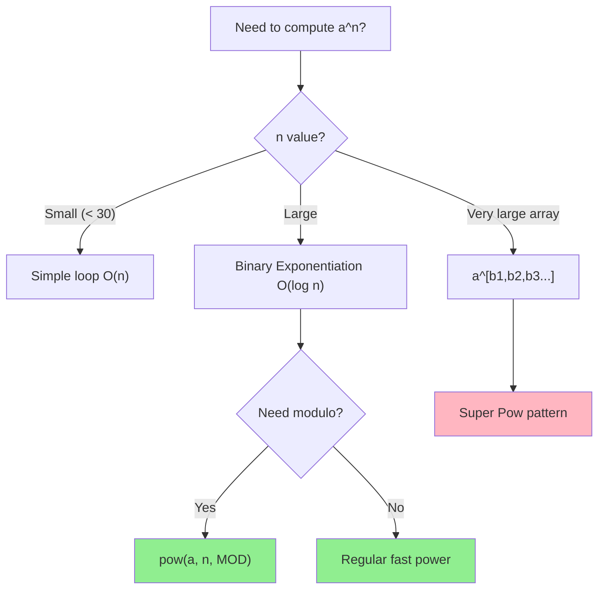

# Fast Power (Binary Exponentiation)

> **Compute a^n in O(log n) time.**
>
> Essential for modular exponentiation and large power calculations.

---

## 🎯 Pattern Recognition



**Use binary exponentiation when:**
- Computing large powers (n > 30)
- Need a^n mod m
- Matrix exponentiation (Fibonacci)
- Power in competitive programming

---

## 📐 How It Works

### Key Insight

Instead of multiplying `a` n times (O(n)), use the binary representation:

$$a^n = \begin{cases} 
(a^{n/2})^2 & \text{if n is even} \\
a \cdot (a^{(n-1)/2})^2 & \text{if n is odd}
\end{cases}$$

### Example: Compute 3^13

```
13 in binary = 1101

3^13 = 3^8 × 3^4 × 3^1
     = 6561 × 81 × 3
     = 1594323

Step-by-step:
n=13 (odd):  result *= 3    → result=3,    base=9
n=6  (even): result stays   → result=3,    base=81
n=3  (odd):  result *= 81   → result=243,  base=6561
n=1  (odd):  result *= 6561 → result=1594323

Answer: 1594323
```

### Visual Trace

```
Binary Exponentiation: 3^13

exp = 13 = 1101₂

Step 1: exp=13 (odd)
        result = 1 × 3 = 3
        base = 3 × 3 = 9
        exp = 6

Step 2: exp=6 (even)
        result = 3 (unchanged)
        base = 9 × 9 = 81
        exp = 3

Step 3: exp=3 (odd)
        result = 3 × 81 = 243
        base = 81 × 81 = 6561
        exp = 1

Step 4: exp=1 (odd)
        result = 243 × 6561 = 1594323
        exp = 0

Final: 3^13 = 1594323
```

---

## 💻 Code Implementation

### Iterative (Preferred)

```python
def fast_pow(base: int, exp: int) -> int:
    """
    Compute base^exp using binary exponentiation.
    
    Time: O(log exp)
    Space: O(1)
    """
    result = 1
    while exp > 0:
        if exp & 1:           # If exp is odd
            result *= base
        base *= base          # Square the base
        exp >>= 1             # Divide exp by 2
    return result


# Examples
print(fast_pow(2, 10))   # 1024
print(fast_pow(3, 13))   # 1594323
print(fast_pow(5, 0))    # 1
```

```javascript
function fastPow(base, exp) {
    let result = 1;
    while (exp > 0) {
        if (exp & 1) {
            result *= base;
        }
        base *= base;
        exp >>= 1;
    }
    return result;
}

console.log(fastPow(2, 10));  // 1024
console.log(fastPow(3, 13));  // 1594323
```

### With Modulo (Most Common)

```python
def mod_pow(base: int, exp: int, mod: int) -> int:
    """
    Compute base^exp mod m using binary exponentiation.
    
    Time: O(log exp)
    Space: O(1)
    """
    result = 1
    base %= mod  # Handle base > mod
    
    while exp > 0:
        if exp & 1:
            result = (result * base) % mod
        base = (base * base) % mod
        exp >>= 1
    
    return result


MOD = 1_000_000_007

# Examples
print(mod_pow(2, 100, MOD))    # 976371285
print(mod_pow(7, 1000, MOD))   # Large result mod MOD

# Python has built-in!
print(pow(2, 100, MOD))        # Same result, optimized C
```

```javascript
function modPow(base, exp, mod) {
    let result = 1n;
    base = BigInt(base) % BigInt(mod);
    exp = BigInt(exp);
    mod = BigInt(mod);
    
    while (exp > 0n) {
        if (exp & 1n) {
            result = (result * base) % mod;
        }
        base = (base * base) % mod;
        exp >>= 1n;
    }
    
    return Number(result);
}

const MOD = 1000000007n;
console.log(modPow(2, 100, MOD));  // 976371285
```

### Recursive Version

```python
def fast_pow_recursive(base: int, exp: int) -> int:
    """
    Recursive binary exponentiation.
    
    Time: O(log exp)
    Space: O(log exp) - stack
    """
    if exp == 0:
        return 1
    
    half = fast_pow_recursive(base, exp // 2)
    
    if exp % 2 == 0:
        return half * half
    else:
        return half * half * base


print(fast_pow_recursive(2, 10))  # 1024
```

```javascript
function fastPowRecursive(base, exp) {
    if (exp === 0) return 1;
    
    const half = fastPowRecursive(base, Math.floor(exp / 2));
    
    return exp % 2 === 0 ? half * half : half * half * base;
}
```

---

## 📖 Problem: Pow(x, n) - LC 50

Handle negative exponents and edge cases.

```python
def myPow(x: float, n: int) -> float:
    """
    Compute x^n handling all edge cases.
    
    Time: O(log |n|)
    Space: O(1)
    """
    if n == 0:
        return 1.0
    
    # Handle negative exponent
    if n < 0:
        x = 1 / x
        n = -n
    
    result = 1.0
    while n > 0:
        if n & 1:
            result *= x
        x *= x
        n >>= 1
    
    return result


# Test cases
print(myPow(2.0, 10))     # 1024.0
print(myPow(2.1, 3))      # 9.261
print(myPow(2.0, -2))     # 0.25
print(myPow(0.0, 5))      # 0.0
print(myPow(1.0, 1000000))# 1.0
```

```javascript
function myPow(x, n) {
    if (n === 0) return 1.0;
    
    if (n < 0) {
        x = 1 / x;
        n = -n;
    }
    
    let result = 1.0;
    while (n > 0) {
        if (n & 1) {
            result *= x;
        }
        x *= x;
        n = Math.floor(n / 2);
    }
    
    return result;
}
```

---

## 📖 Problem: Super Pow - LC 372

Compute a^b where b is a large array of digits.

```python
def superPow(a: int, b: list[int]) -> int:
    """
    Compute a^b mod 1337 where b is array of digits.
    
    Key: a^1234 = a^1000 × a^200 × a^30 × a^4
               = (a^123)^10 × a^4
               
    Time: O(n log 10) = O(n) where n is len(b)
    Space: O(1)
    """
    MOD = 1337
    
    def pow_mod(base: int, exp: int) -> int:
        """Helper for base^exp mod MOD."""
        result = 1
        base %= MOD
        while exp > 0:
            if exp & 1:
                result = (result * base) % MOD
            base = (base * base) % MOD
            exp >>= 1
        return result
    
    result = 1
    for digit in b:
        result = pow_mod(result, 10) * pow_mod(a, digit) % MOD
    
    return result


# Test cases
print(superPow(2, [3]))        # 8
print(superPow(2, [1, 0]))     # 2^10 = 1024 mod 1337 = 1024
print(superPow(2, [1, 0, 0]))  # 2^100 mod 1337 = ...
```

```javascript
function superPow(a, b) {
    const MOD = 1337;
    
    function powMod(base, exp) {
        let result = 1;
        base %= MOD;
        while (exp > 0) {
            if (exp & 1) result = (result * base) % MOD;
            base = (base * base) % MOD;
            exp >>= 1;
        }
        return result;
    }
    
    let result = 1;
    for (const digit of b) {
        result = powMod(result, 10) * powMod(a, digit) % MOD;
    }
    
    return result;
}
```

---

## 🔄 Applications

### 1. Modular Inverse (Fermat's Theorem)

```python
def mod_inverse(a: int, p: int) -> int:
    """
    Find a^(-1) mod p using Fermat's Little Theorem.
    Requires p to be prime.
    
    a^(-1) ≡ a^(p-2) (mod p)
    """
    return pow(a, p - 2, p)


MOD = 1_000_000_007
print(mod_inverse(3, MOD))  # 3^(-1) mod MOD
```

### 2. Matrix Exponentiation (Fibonacci)

```python
def matrix_mult(A: list, B: list, mod: int) -> list:
    """Multiply two 2x2 matrices."""
    return [
        [(A[0][0]*B[0][0] + A[0][1]*B[1][0]) % mod,
         (A[0][0]*B[0][1] + A[0][1]*B[1][1]) % mod],
        [(A[1][0]*B[0][0] + A[1][1]*B[1][0]) % mod,
         (A[1][0]*B[0][1] + A[1][1]*B[1][1]) % mod]
    ]

def matrix_pow(M: list, n: int, mod: int) -> list:
    """Compute M^n using binary exponentiation."""
    result = [[1, 0], [0, 1]]  # Identity matrix
    
    while n > 0:
        if n & 1:
            result = matrix_mult(result, M, mod)
        M = matrix_mult(M, M, mod)
        n >>= 1
    
    return result

def fibonacci(n: int) -> int:
    """
    Compute nth Fibonacci number in O(log n).
    
    Uses: [[1,1],[1,0]]^n = [[F(n+1),F(n)],[F(n),F(n-1)]]
    """
    if n <= 1:
        return n
    
    MOD = 1_000_000_007
    M = [[1, 1], [1, 0]]
    result = matrix_pow(M, n - 1, MOD)
    return result[0][0]


# Test
print(fibonacci(10))     # 55
print(fibonacci(50))     # 12586269025 (or mod)
print(fibonacci(1000000))# Very large, computed in O(log n)
```

### 3. Counting Problems

```python
def count_paths_grid(n: int, m: int) -> int:
    """
    Count paths in n×m grid (only right and down).
    
    Answer: C(n+m-2, n-1) = (n+m-2)! / ((n-1)! × (m-1)!)
    
    Uses fast power for modular inverse.
    """
    MOD = 1_000_000_007
    
    # Compute numerator: (n+m-2)!
    numerator = 1
    for i in range(1, n + m - 1):
        numerator = (numerator * i) % MOD
    
    # Compute denominator: (n-1)! × (m-1)!
    denom1 = 1
    for i in range(1, n):
        denom1 = (denom1 * i) % MOD
    
    denom2 = 1
    for i in range(1, m):
        denom2 = (denom2 * i) % MOD
    
    denominator = (denom1 * denom2) % MOD
    
    # Divide using modular inverse
    return (numerator * pow(denominator, MOD - 2, MOD)) % MOD
```

---

## ⚡ Complexity Analysis

| Approach | Time | Space | Use Case |
|----------|------|-------|----------|
| Naive loop | O(n) | O(1) | Small n (< 30) |
| Binary exp (iterative) | O(log n) | O(1) | Large n |
| Binary exp (recursive) | O(log n) | O(log n) | When recursion is clearer |
| Matrix exp | O(k³ log n) | O(k²) | Linear recurrences |

---

## ⚠️ Common Mistakes

### 1. Integer Overflow

```python
# ❌ WRONG (in C++/Java)
result = (result * base) % MOD;  # result * base might overflow

# ✅ CORRECT
result = (1LL * result * base) % MOD;  // Cast to long long
# Python handles this automatically
```

### 2. Wrong Bit Operation

```python
# ❌ WRONG - & has lower precedence than ==
if exp & 1 == 1:  # This is exp & (1 == 1) = exp & 1
    
# ✅ CORRECT
if (exp & 1) == 1:
# Or simply
if exp & 1:  # Non-zero is truthy
```

### 3. Negative Exponent Handling

```python
# ❌ WRONG - doesn't handle negative
def myPow(x, n):
    if n < 0:
        return 1 / myPow(x, -n)  # May overflow for n = INT_MIN

# ✅ CORRECT - handle overflow
def myPow(x, n):
    if n < 0:
        x = 1 / x
        n = -n  # Still problematic for INT_MIN
```

### 4. Zero Base with Zero Exponent

```python
# 0^0 is mathematically undefined
# But most problems define it as 1
print(pow(0, 0))  # 1 in Python
```

---

## ✅ When to Use

- Large exponents (n > 1000)
- Need modular exponentiation
- Matrix power for recurrences
- Competitive programming

## ❌ When NOT to Use

| Scenario | Use Instead |
|----------|-------------|
| Small exponents (n < 20) | Simple loop |
| Floating point precision needed | Math library |
| Symbolic computation | Specialized library |

---

## 📝 Practice Problems

| Problem | Difficulty | Key Technique |
|---------|------------|---------------|
| [Pow(x, n)](https://leetcode.com/problems/powx-n/) | 🟡 Medium | Basic binary exp |
| [Super Pow](https://leetcode.com/problems/super-pow/) | 🟡 Medium | Digit-by-digit |
| [Count Good Numbers](https://leetcode.com/problems/count-good-numbers/) | 🟡 Medium | Mod exponentiation |
| [Fibonacci Number](https://leetcode.com/problems/fibonacci-number/) | 🟢 Easy | Matrix exp (advanced) |

---

## 🎤 Interview Context

<details>
<summary><strong>How to Communicate</strong></summary>

**Explaining the approach:**
> "I'll use binary exponentiation which reduces O(n) to O(log n) by using the binary representation of the exponent. At each step, I square the base and multiply into the result when the current bit is 1."

**Explaining modular arithmetic:**
> "Since we need the result modulo 10^9+7, I'll take modulo at each step to prevent overflow while preserving the mathematical properties."

**Company Frequency:**
| Company | Frequency | Focus |
|---------|-----------|-------|
| Google | ⭐⭐⭐⭐ | Math-heavy |
| Amazon | ⭐⭐⭐ | Pow(x, n) |
| Meta | ⭐⭐⭐ | Modular exp |

</details>

---

## ⏱️ Time Estimates

| Activity | Time |
|----------|------|
| Learn binary exp | 20 min |
| Implement iterative | 10 min |
| Solve Pow(x, n) | 15 min |
| Learn matrix exp | 45 min |
| Master pattern | 2 hours |

---

## 🧠 Spaced Repetition

<details>
<summary><strong>Review Schedule</strong></summary>

- **Day 1:** Implement binary exp from scratch
- **Day 3:** Solve Pow(x, n) with negative handling
- **Day 7:** Implement Super Pow
- **Day 14:** Implement matrix exponentiation for Fibonacci
- **Day 30:** Solve a new counting problem with modular exp

</details>

---

> **💡 Key Insight:** Binary exponentiation works by decomposing n into powers of 2. Since a^(2k) = (a^k)², we can compute each power of 2 by squaring, and multiply only those that appear in n's binary representation.

> **🔗 Related:** [← Modular Arithmetic](./1.2-Modular-Arithmetic.md) | [Modular Inverse →](../05-Modular-Inverse/5.1-Modular-Inverse-Basics.md) | [GCD](../02-GCD-LCM/2.1-Euclidean-Algorithm.md)
