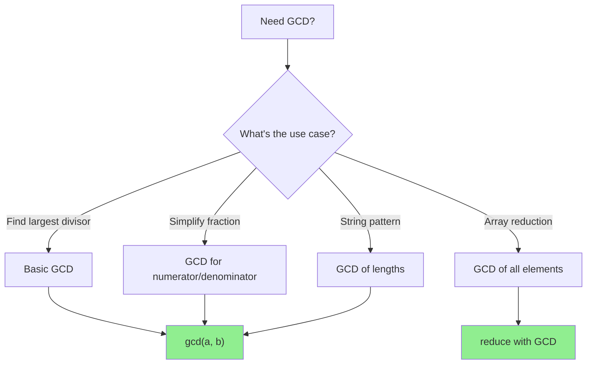

# Euclidean Algorithm (GCD)

> **The most efficient way to compute the Greatest Common Divisor.**
>
> Essential for interview problems involving divisibility and string patterns.

---

## 🎯 Pattern Recognition



**Use GCD when you see:**
- "Greatest common divisor" or "largest common factor"
- "Simplify to lowest terms"
- "Pattern that repeats" (strings)
- "All elements divisible by"
- Fraction reduction

---

## 📐 How It Works

### The Key Insight

**Euclidean Algorithm:** `gcd(a, b) = gcd(b, a % b)`

Why? If `d` divides both `a` and `b`, then `d` also divides `a - b`, `a - 2b`, ... and thus `a % b`.

### Step-by-Step Example

```
gcd(48, 18):
  48 % 18 = 12  →  gcd(18, 12)
  18 % 12 = 6   →  gcd(12, 6)
  12 % 6  = 0   →  gcd(6, 0) = 6

Answer: gcd(48, 18) = 6
```

### Visual Trace

```
a = 48, b = 18
┌────────────────────────────────────────────────┐
│ 48 = 18 × 2 + 12                               │
│      ↓                                         │
│ 18 = 12 × 1 + 6                                │
│      ↓                                         │
│ 12 = 6 × 2 + 0  ← remainder is 0, GCD = 6      │
└────────────────────────────────────────────────┘
```

---

## 💻 Code Implementation

### Iterative (Preferred)

```python
def gcd(a: int, b: int) -> int:
    """
    Compute GCD using Euclidean Algorithm.
    
    Time: O(log(min(a, b)))
    Space: O(1)
    """
    while b:
        a, b = b, a % b
    return a


# Examples
print(gcd(48, 18))   # 6
print(gcd(17, 5))    # 1 (coprime)
print(gcd(100, 25))  # 25
print(gcd(0, 5))     # 5
print(gcd(5, 0))     # 5
```

```javascript
function gcd(a, b) {
    /**
     * Compute GCD using Euclidean Algorithm.
     * Time: O(log(min(a, b)))
     * Space: O(1)
     */
    while (b !== 0) {
        [a, b] = [b, a % b];
    }
    return a;
}

// Examples
console.log(gcd(48, 18));   // 6
console.log(gcd(17, 5));    // 1
console.log(gcd(100, 25));  // 25
```

### Recursive Version

```python
def gcd_recursive(a: int, b: int) -> int:
    """Recursive GCD - elegant but uses stack space."""
    if b == 0:
        return a
    return gcd_recursive(b, a % b)


# One-liner
gcd = lambda a, b: a if b == 0 else gcd(b, a % b)
```

```javascript
function gcdRecursive(a, b) {
    if (b === 0) return a;
    return gcdRecursive(b, a % b);
}

// One-liner
const gcd = (a, b) => b === 0 ? a : gcd(b, a % b);
```

### Built-in Functions

```python
import math

# Python 3.5+
print(math.gcd(48, 18))  # 6

# Python 3.9+ - multiple arguments
print(math.gcd(12, 18, 24))  # 6

# For arrays
from functools import reduce
arr = [12, 18, 24, 36]
result = reduce(math.gcd, arr)  # 6
```

```javascript
// No built-in, but easy to implement for arrays
function gcdArray(arr) {
    return arr.reduce((a, b) => gcd(a, b));
}

console.log(gcdArray([12, 18, 24, 36]));  // 6
```

---

## 🔄 LCM from GCD

**Formula:** `lcm(a, b) = a * b / gcd(a, b)`

```python
def lcm(a: int, b: int) -> int:
    """
    Compute LCM using GCD.
    Note: Divide first to avoid overflow.
    """
    return a // gcd(a, b) * b


# Examples
print(lcm(4, 6))    # 12
print(lcm(21, 6))   # 42

# Python 3.9+ has built-in
import math
print(math.lcm(4, 6))  # 12
```

```javascript
function lcm(a, b) {
    // Divide first to avoid overflow
    return (a / gcd(a, b)) * b;
}

console.log(lcm(4, 6));   // 12
console.log(lcm(21, 6));  // 42
```

---

## ⚡ Complexity Analysis

| Metric | Value | Explanation |
|--------|-------|-------------|
| Time | O(log(min(a, b))) | Each step reduces by at least half |
| Space (iterative) | O(1) | Only two variables |
| Space (recursive) | O(log(min(a, b))) | Stack depth |

### Why O(log n)?

After two iterations, the larger number is reduced by at least half:
- If `b > a/2`: `a % b < a/2`
- If `b ≤ a/2`: `a % b < b ≤ a/2`

So we need at most `2 × log(min(a, b))` iterations.

---

## ⚠️ Common Mistakes

### 1. Wrong Order of Arguments

```python
# ❌ WRONG - might think order matters
def gcd_wrong(a, b):
    if a < b:
        a, b = b, a  # Unnecessary!
    # ...

# ✅ CORRECT - order doesn't matter
# gcd(18, 48) and gcd(48, 18) both work
# First iteration handles the swap automatically
```

### 2. Not Handling Zero

```python
# GCD with zero
gcd(0, 5)  # = 5 (by definition, gcd(0, n) = n)
gcd(5, 0)  # = 5
gcd(0, 0)  # = 0 (or undefined - check problem requirements)
```

### 3. Negative Numbers

```python
# GCD is always positive
gcd(-12, 8)  # Should return 4

def gcd_safe(a: int, b: int) -> int:
    """Handle negative numbers."""
    a, b = abs(a), abs(b)
    while b:
        a, b = b, a % b
    return a
```

---

## ✅ When to Use

- Finding common factors
- Simplifying fractions
- String pattern problems (GCD of lengths)
- Checking if two numbers are coprime (gcd = 1)
- Array problems requiring common divisor

## ❌ When NOT to Use

| Scenario | Use Instead |
|----------|-------------|
| Need prime factors | Prime factorization |
| Need all divisors | Iterate to √n |
| Just checking divisibility | Use modulo directly |

---

## 📝 Practice Problems

| Problem | Difficulty | Key Technique |
|---------|------------|---------------|
| [Greatest Common Divisor of Strings](https://leetcode.com/problems/greatest-common-divisor-of-strings/) | 🟢 Easy | GCD of lengths |
| [X of a Kind in a Deck of Cards](https://leetcode.com/problems/x-of-a-kind-in-a-deck-of-cards/) | 🟢 Easy | GCD of counts |
| [Max Points on a Line](https://leetcode.com/problems/max-points-on-a-line/) | 🔴 Hard | GCD for slope |

---

## 🎤 Interview Context

<details>
<summary><strong>How to Communicate</strong></summary>

**Explaining the algorithm:**
> "I'll use the Euclidean algorithm which states that gcd(a, b) equals gcd(b, a mod b). This works because any common divisor of a and b also divides their remainder."

**Complexity justification:**
> "The time complexity is O(log min(a, b)) because each iteration reduces the larger number by at least half."

**Company Frequency:**
| Company | Frequency | Focus |
|---------|-----------|-------|
| Amazon | ⭐⭐⭐⭐ | GCD of Strings |
| Meta | ⭐⭐⭐ | String patterns |
| Google | ⭐⭐⭐ | Math problems |

</details>

---

## ⏱️ Time Estimates

| Activity | Time |
|----------|------|
| Learn algorithm | 15 min |
| Implement from scratch | 5 min |
| Solve Easy problem | 10 min |
| Master pattern | 30 min |

---

## 🧠 Spaced Repetition

<details>
<summary><strong>Review Schedule</strong></summary>

- **Day 1:** Implement GCD iteratively from scratch
- **Day 3:** Explain why gcd(a, b) = gcd(b, a % b) works
- **Day 7:** Solve GCD of Strings problem
- **Day 14:** Implement Extended GCD
- **Day 30:** Use GCD in a slope calculation problem

</details>

---

> **💡 Key Insight:** GCD is one of the oldest algorithms (300 BC, Euclid) and still one of the most efficient. The key is that `gcd(a, b) = gcd(b, a % b)` - the remainder preserves all common divisors.

> **🔗 Related:** [Extended GCD →](./2.2-Extended-GCD.md) | [GCD Applications →](./2.3-GCD-Applications.md) | [Modular Inverse](../05-Modular-Inverse/5.1-Modular-Inverse-Basics.md)
