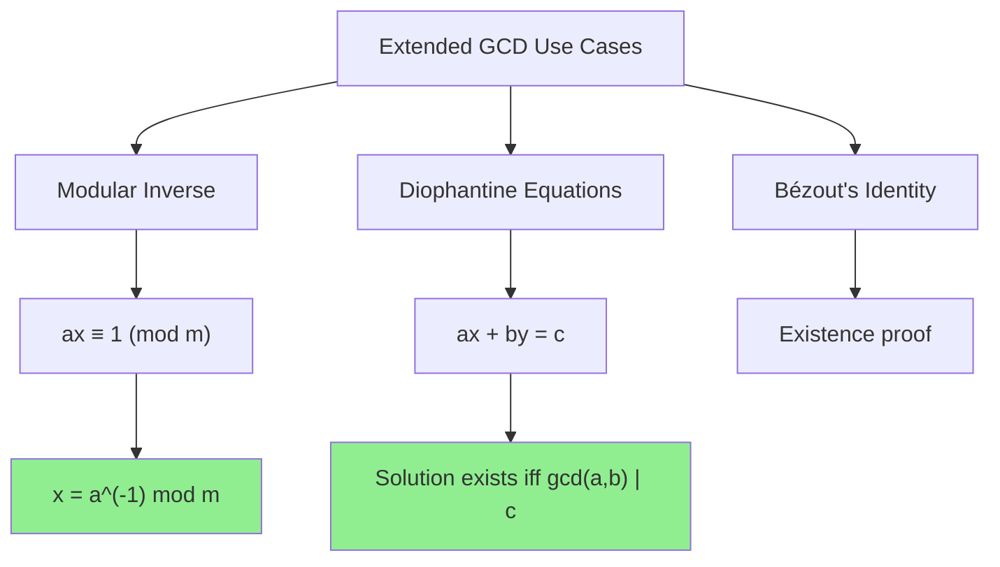

# Extended Euclidean Algorithm

> **Find integers x, y such that ax + by = gcd(a, b)**
>
> Essential for modular inverse and cryptography applications.

---

## 🎯 Pattern Recognition



**Use Extended GCD when:**
- Need modular inverse
- Solving linear Diophantine equations
- Finding coefficients for Bézout's identity
- Cryptographic applications (RSA)

---

## 📐 How It Works

### Bézout's Identity

For any integers `a` and `b`, there exist integers `x` and `y` such that:

$$ax + by = \gcd(a, b)$$

Extended GCD finds these coefficients `x` and `y`.

### Step-by-Step Derivation

Starting from Euclidean algorithm, we track how to express each remainder as a linear combination:

```
gcd(48, 18):

Step 1: 48 = 18 × 2 + 12
        → 12 = 48 - 18 × 2       ... (1)

Step 2: 18 = 12 × 1 + 6
        → 6 = 18 - 12 × 1        ... (2)

Step 3: 12 = 6 × 2 + 0
        → gcd = 6

Back-substitute:
From (2): 6 = 18 - 12 × 1
Substitute (1) for 12:
         6 = 18 - (48 - 18 × 2) × 1
         6 = 18 - 48 + 18 × 2
         6 = 18 × 3 - 48 × 1
         6 = (-1) × 48 + 3 × 18

So: x = -1, y = 3
Verify: (-1) × 48 + 3 × 18 = -48 + 54 = 6 ✓
```

### Visual Trace

```
Extended GCD(48, 18):

Forward pass (compute GCD):
┌─────────────────────────────────────┐
│  a=48, b=18 → q=2, r=12            │
│  a=18, b=12 → q=1, r=6             │
│  a=12, b=6  → q=2, r=0 → gcd=6     │
└─────────────────────────────────────┘

Backward pass (compute x, y):
┌─────────────────────────────────────┐
│  Base: x=1, y=0 (for gcd)          │
│  Step: x=0-1×2=-1, y=1 → (-1,3)    │
│  Step: x=1-(-1)×2=3, y=-1          │
│  Result: x=-1, y=3                  │
└─────────────────────────────────────┘

Verify: (-1)×48 + 3×18 = -48 + 54 = 6 ✓
```

---

## 💻 Code Implementation

### Iterative Version

```python
def extended_gcd(a: int, b: int) -> tuple[int, int, int]:
    """
    Extended Euclidean Algorithm.
    
    Returns (gcd, x, y) such that ax + by = gcd(a, b)
    
    Time: O(log(min(a, b)))
    Space: O(1)
    """
    old_r, r = a, b
    old_s, s = 1, 0
    old_t, t = 0, 1
    
    while r != 0:
        quotient = old_r // r
        old_r, r = r, old_r - quotient * r
        old_s, s = s, old_s - quotient * s
        old_t, t = t, old_t - quotient * t
    
    # old_r = gcd, old_s = x, old_t = y
    return old_r, old_s, old_t


# Examples
gcd, x, y = extended_gcd(48, 18)
print(f"gcd={gcd}, x={x}, y={y}")  # gcd=6, x=-1, y=3
print(f"Verify: {x}*48 + {y}*18 = {x*48 + y*18}")  # = 6

gcd, x, y = extended_gcd(35, 15)
print(f"gcd={gcd}, x={x}, y={y}")  # gcd=5, x=1, y=-2
print(f"Verify: {x}*35 + {y}*15 = {x*35 + y*15}")  # = 5
```

```javascript
function extendedGcd(a, b) {
    /**
     * Extended Euclidean Algorithm.
     * Returns [gcd, x, y] such that ax + by = gcd(a, b)
     */
    let [oldR, r] = [a, b];
    let [oldS, s] = [1, 0];
    let [oldT, t] = [0, 1];
    
    while (r !== 0) {
        const quotient = Math.floor(oldR / r);
        [oldR, r] = [r, oldR - quotient * r];
        [oldS, s] = [s, oldS - quotient * s];
        [oldT, t] = [t, oldT - quotient * t];
    }
    
    return [oldR, oldS, oldT];
}

// Examples
let [gcd, x, y] = extendedGcd(48, 18);
console.log(`gcd=${gcd}, x=${x}, y=${y}`);  // gcd=6, x=-1, y=3
console.log(`Verify: ${x}*48 + ${y}*18 = ${x*48 + y*18}`);  // = 6
```

### Recursive Version

```python
def extended_gcd_recursive(a: int, b: int) -> tuple[int, int, int]:
    """
    Recursive Extended GCD.
    
    More elegant but uses O(log n) stack space.
    """
    if b == 0:
        return a, 1, 0
    
    gcd, x1, y1 = extended_gcd_recursive(b, a % b)
    x = y1
    y = x1 - (a // b) * y1
    
    return gcd, x, y


# Test
gcd, x, y = extended_gcd_recursive(48, 18)
print(f"gcd={gcd}, x={x}, y={y}")  # gcd=6, x=-1, y=3
```

```javascript
function extendedGcdRecursive(a, b) {
    if (b === 0) {
        return [a, 1, 0];
    }
    
    const [gcd, x1, y1] = extendedGcdRecursive(b, a % b);
    const x = y1;
    const y = x1 - Math.floor(a / b) * y1;
    
    return [gcd, x, y];
}
```

---

## 🔑 Application: Modular Inverse

The main interview application of Extended GCD is finding modular inverse.

**Definition:** `a^(-1) mod m` is the value `x` such that `ax ≡ 1 (mod m)`

```python
def mod_inverse(a: int, m: int) -> int:
    """
    Find modular inverse of a mod m using Extended GCD.
    
    Returns -1 if inverse doesn't exist (when gcd(a, m) != 1)
    
    Time: O(log m)
    Space: O(1)
    """
    gcd, x, _ = extended_gcd(a, m)
    
    if gcd != 1:
        return -1  # Inverse doesn't exist
    
    # x might be negative, make it positive
    return (x % m + m) % m


# Examples
print(mod_inverse(3, 7))   # 5, because 3*5 = 15 ≡ 1 (mod 7)
print(mod_inverse(10, 17)) # 12, because 10*12 = 120 ≡ 1 (mod 17)
print(mod_inverse(6, 9))   # -1, gcd(6,9)=3≠1, no inverse
```

```javascript
function modInverse(a, m) {
    const [gcd, x] = extendedGcd(a, m);
    
    if (gcd !== 1) {
        return -1;  // Inverse doesn't exist
    }
    
    return ((x % m) + m) % m;
}

console.log(modInverse(3, 7));   // 5
console.log(modInverse(10, 17)); // 12
console.log(modInverse(6, 9));   // -1
```

---

## 🔄 Application: Linear Diophantine Equations

**Problem:** Solve `ax + by = c` for integers x, y.

```python
def solve_diophantine(a: int, b: int, c: int) -> tuple[int, int] | None:
    """
    Solve ax + by = c for integers x, y.
    
    Returns None if no solution exists.
    Returns one particular solution (x0, y0).
    General solution: x = x0 + (b/g)*t, y = y0 - (a/g)*t for any integer t
    """
    gcd, x0, y0 = extended_gcd(a, b)
    
    # Solution exists iff gcd(a,b) divides c
    if c % gcd != 0:
        return None
    
    # Scale the solution
    scale = c // gcd
    return x0 * scale, y0 * scale


# Example: 3x + 5y = 1
result = solve_diophantine(3, 5, 1)
print(result)  # (2, -1): 3*2 + 5*(-1) = 6 - 5 = 1 ✓

# Example: 6x + 9y = 12
result = solve_diophantine(6, 9, 12)
print(result)  # (2, 0) or another solution: 6*2 + 9*0 = 12 ✓

# Example: 6x + 9y = 7 (no solution since gcd(6,9)=3 doesn't divide 7)
result = solve_diophantine(6, 9, 7)
print(result)  # None
```

```javascript
function solveDiophantine(a, b, c) {
    const [gcd, x0, y0] = extendedGcd(a, b);
    
    if (c % gcd !== 0) {
        return null;
    }
    
    const scale = c / gcd;
    return [x0 * scale, y0 * scale];
}

console.log(solveDiophantine(3, 5, 1));  // [2, -1]
console.log(solveDiophantine(6, 9, 12)); // [2, 0]
console.log(solveDiophantine(6, 9, 7));  // null
```

---

## ⚡ Complexity Analysis

| Metric | Value | Explanation |
|--------|-------|-------------|
| Time | O(log(min(a, b))) | Same as regular GCD |
| Space (iterative) | O(1) | Six variables |
| Space (recursive) | O(log(min(a, b))) | Stack depth |

---

## ⚠️ Common Mistakes

### 1. Forgetting to Handle Negative Results

```python
# ❌ WRONG - x might be negative
def mod_inverse_wrong(a, m):
    _, x, _ = extended_gcd(a, m)
    return x  # Could be negative!

# ✅ CORRECT - normalize to positive
def mod_inverse_correct(a, m):
    _, x, _ = extended_gcd(a, m)
    return (x % m + m) % m
```

### 2. Not Checking if Inverse Exists

```python
# ❌ WRONG - assuming inverse always exists
def divide_mod(a, b, m):
    inv = mod_inverse(b, m)
    return (a * inv) % m

# ✅ CORRECT - check gcd first
def divide_mod_safe(a, b, m):
    inv = mod_inverse(b, m)
    if inv == -1:
        raise ValueError("Inverse doesn't exist")
    return (a * inv) % m
```

### 3. Integer Overflow (in other languages)

```python
# Python handles big integers automatically
# But in C++/Java, use long long or modular operations
```

---

## ✅ When to Use

- Finding modular inverse when m is not prime
- Solving linear Diophantine equations
- Cryptography (RSA key generation)
- Chinese Remainder Theorem

## ❌ When NOT to Use

| Scenario | Use Instead |
|----------|-------------|
| m is prime | Fermat's Little Theorem: a^(m-2) mod m |
| Only need GCD | Regular Euclidean algorithm |
| Large modulus | May need careful overflow handling |

---

## 📝 Practice Problems

| Problem | Difficulty | Key Technique |
|---------|------------|---------------|
| [Super Pow](https://leetcode.com/problems/super-pow/) | 🟡 Medium | Modular inverse |
| Basic modular inverse | 🟢 Easy | Extended GCD |
| Diophantine equation solver | 🟡 Medium | Extended GCD |

---

## 🎤 Interview Context

<details>
<summary><strong>How to Communicate</strong></summary>

**Explaining the algorithm:**
> "Extended GCD not only finds the GCD but also finds coefficients x and y satisfying Bézout's identity: ax + by = gcd(a, b). This is essential for finding modular inverses."

**When to mention:**
- When asked about modular inverse with non-prime modulus
- When solving linear Diophantine equations
- When discussing cryptographic algorithms

**Company Frequency:**
| Company | Frequency | Focus |
|---------|-----------|-------|
| Google | ⭐⭐⭐ | Math problems |
| Quant firms | ⭐⭐⭐⭐ | Number theory |
| Security companies | ⭐⭐⭐ | Cryptography |

</details>

---

## ⏱️ Time Estimates

| Activity | Time |
|----------|------|
| Learn algorithm | 30 min |
| Implement from scratch | 15 min |
| Understand proof | 20 min |
| Master applications | 1 hour |

---

## 🧠 Spaced Repetition

<details>
<summary><strong>Review Schedule</strong></summary>

After learning:
- **Day 1:** Re-implement without looking
- **Day 3:** Derive the back-substitution by hand
- **Day 7:** Implement modular inverse using Extended GCD
- **Day 14:** Solve a Diophantine equation problem
- **Day 30:** Explain Bézout's identity to someone

</details>

---

> **💡 Key Insight:** Extended GCD extends the basic algorithm to track how each remainder can be expressed as a linear combination of the original inputs. This is the foundation of modular arithmetic in cryptography.

> **🔗 Related:** [← Euclidean Algorithm](./2.1-Euclidean-Algorithm.md) | [GCD Applications →](./2.3-GCD-Applications.md) | [Modular Inverse](../05-Modular-Inverse/5.1-Modular-Inverse-Basics.md)
