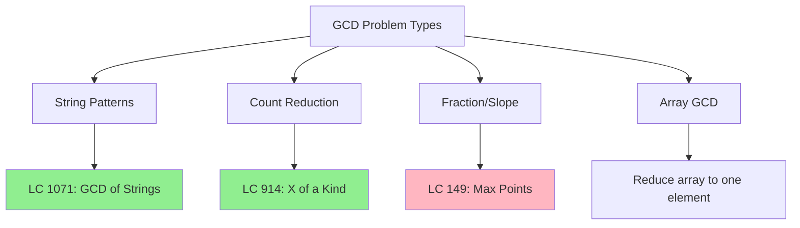

# GCD Applications (Interview Problems)

> **Real interview problems using GCD patterns.**
>
> Amazon and Meta frequently ask these problems.

---

## 🎯 Pattern Recognition



**Interview Frequency by Company:**

| Pattern | Amazon | Meta | Google |
|---------|--------|------|--------|
| GCD of Strings | ⭐⭐⭐⭐⭐ | ⭐⭐⭐ | ⭐⭐ |
| GCD of Counts | ⭐⭐⭐ | ⭐⭐⭐ | ⭐⭐ |
| GCD for Slope | ⭐⭐ | ⭐⭐ | ⭐⭐⭐⭐ |

---

## 📖 Problem 1: GCD of Strings (LC 1071)

**Problem:** Find the largest string X such that both str1 and str2 are made of X repeated.

### Key Insight

If a string X divides both str1 and str2, then:
1. `len(X)` must divide both `len(str1)` and `len(str2)`
2. So `len(X)` divides `gcd(len(str1), len(str2))`
3. The largest such X has length = `gcd(len(str1), len(str2))`

### Visual Example

```
str1 = "ABCABC"  (length 6)
str2 = "ABC"     (length 3)

gcd(6, 3) = 3

Candidate: str1[0:3] = "ABC"
Check: "ABC" * 2 = "ABCABC" ✓
       "ABC" * 1 = "ABC" ✓

Answer: "ABC"
```

```
str1 = "ABABAB"  (length 6)
str2 = "ABAB"    (length 4)

gcd(6, 4) = 2

Candidate: str1[0:2] = "AB"
Check: "AB" * 3 = "ABABAB" ✓
       "AB" * 2 = "ABAB" ✓

Answer: "AB"
```

### Solution

```python
def gcdOfStrings(str1: str, str2: str) -> str:
    """
    Find largest string that divides both str1 and str2.
    
    Key insight: str1 + str2 == str2 + str1 iff a common divisor exists.
    
    Time: O(n + m)
    Space: O(n + m) for string concatenation
    """
    # If no common divisor exists
    if str1 + str2 != str2 + str1:
        return ""
    
    # GCD of lengths gives the answer length
    from math import gcd
    gcd_len = gcd(len(str1), len(str2))
    
    return str1[:gcd_len]


# Test cases
print(gcdOfStrings("ABCABC", "ABC"))     # "ABC"
print(gcdOfStrings("ABABAB", "ABAB"))    # "AB"
print(gcdOfStrings("LEET", "CODE"))      # ""
print(gcdOfStrings("ABCDEF", "ABC"))     # ""
```

```javascript
function gcdOfStrings(str1, str2) {
    // Check if common divisor exists
    if (str1 + str2 !== str2 + str1) {
        return "";
    }
    
    // GCD function
    const gcd = (a, b) => b === 0 ? a : gcd(b, a % b);
    
    const gcdLen = gcd(str1.length, str2.length);
    return str1.substring(0, gcdLen);
}

console.log(gcdOfStrings("ABCABC", "ABC"));  // "ABC"
console.log(gcdOfStrings("ABABAB", "ABAB")); // "AB"
console.log(gcdOfStrings("LEET", "CODE"));   // ""
```

### Why str1 + str2 == str2 + str1?

```
If X divides both:
  str1 = X + X + ... + X  (a copies)
  str2 = X + X + ... + X  (b copies)

Then:
  str1 + str2 = X × (a + b)
  str2 + str1 = X × (b + a)

They're equal! The converse is also true.
```

---

## 📖 Problem 2: X of a Kind in Deck (LC 914)

**Problem:** Given counts of each card, check if we can partition into groups of size X ≥ 2 where each group has the same card.

### Key Insight

A valid partition exists iff GCD of all counts ≥ 2.

```
Cards: [1,2,3,4,4,3,2,1]
Counts: {1:2, 2:2, 3:2, 4:2}
GCD(2,2,2,2) = 2 ≥ 2 ✓

Cards: [1,1,1,2,2,2,3,3]
Counts: {1:3, 2:3, 3:2}
GCD(3,3,2) = 1 < 2 ✗
```

### Solution

```python
from collections import Counter
from functools import reduce
from math import gcd

def hasGroupsSizeX(deck: list[int]) -> bool:
    """
    Check if deck can be partitioned into groups of size X >= 2.
    
    Time: O(n log m) where m is max count
    Space: O(n) for counter
    """
    counts = Counter(deck)
    
    # Find GCD of all counts
    g = reduce(gcd, counts.values())
    
    return g >= 2


# Test cases
print(hasGroupsSizeX([1,2,3,4,4,3,2,1]))  # True (X=2)
print(hasGroupsSizeX([1,1,1,2,2,2,3,3]))  # False
print(hasGroupsSizeX([1,1,2,2,2,2]))      # True (X=2)
print(hasGroupsSizeX([1,1,1,1,2,2,2,2,2,2]))  # True (X=2)
```

```javascript
function hasGroupsSizeX(deck) {
    // Count each card
    const counts = new Map();
    for (const card of deck) {
        counts.set(card, (counts.get(card) || 0) + 1);
    }
    
    // GCD function
    const gcd = (a, b) => b === 0 ? a : gcd(b, a % b);
    
    // Find GCD of all counts
    let g = 0;
    for (const count of counts.values()) {
        g = gcd(g, count);
    }
    
    return g >= 2;
}

console.log(hasGroupsSizeX([1,2,3,4,4,3,2,1]));  // true
console.log(hasGroupsSizeX([1,1,1,2,2,2,3,3]));  // false
```

---

## 📖 Problem 3: Max Points on a Line (LC 149)

**Problem:** Find the maximum number of points that lie on the same line.

### Key Insight

Use GCD to normalize slope representation `(dy, dx)` to avoid floating point errors.

```
Points: (1,1), (2,2), (3,3)
Slopes from (1,1):
  to (2,2): dy=1, dx=1 → normalized (1,1)
  to (3,3): dy=2, dx=2 → gcd=2 → normalized (1,1)

Same normalized slope = same line!
```

### Solution

```python
from collections import defaultdict
from math import gcd

def maxPoints(points: list[list[int]]) -> int:
    """
    Find max points on same line.
    
    Key: Normalize slope using GCD to avoid floating point errors.
    
    Time: O(n²)
    Space: O(n)
    """
    n = len(points)
    if n <= 2:
        return n
    
    result = 0
    
    for i in range(n):
        slopes = defaultdict(int)
        
        for j in range(i + 1, n):
            dx = points[j][0] - points[i][0]
            dy = points[j][1] - points[i][1]
            
            # Normalize the slope
            g = gcd(dx, dy)
            dx //= g
            dy //= g
            
            # Ensure consistent sign (put negative on dy)
            if dx < 0:
                dx, dy = -dx, -dy
            elif dx == 0:
                dy = abs(dy)
            
            slopes[(dx, dy)] += 1
        
        if slopes:
            result = max(result, max(slopes.values()) + 1)
    
    return result


# Test cases
print(maxPoints([[1,1],[2,2],[3,3]]))  # 3
print(maxPoints([[1,1],[3,2],[5,3],[4,1],[2,3],[1,4]]))  # 4
```

```javascript
function maxPoints(points) {
    const n = points.length;
    if (n <= 2) return n;
    
    const gcd = (a, b) => b === 0 ? a : gcd(b, a % b);
    
    let result = 0;
    
    for (let i = 0; i < n; i++) {
        const slopes = new Map();
        
        for (let j = i + 1; j < n; j++) {
            let dx = points[j][0] - points[i][0];
            let dy = points[j][1] - points[i][1];
            
            // Normalize the slope
            const g = gcd(Math.abs(dx), Math.abs(dy));
            dx = dx / g;
            dy = dy / g;
            
            // Ensure consistent sign
            if (dx < 0) {
                dx = -dx;
                dy = -dy;
            } else if (dx === 0) {
                dy = Math.abs(dy);
            }
            
            const key = `${dx},${dy}`;
            slopes.set(key, (slopes.get(key) || 0) + 1);
        }
        
        for (const count of slopes.values()) {
            result = Math.max(result, count + 1);
        }
    }
    
    return result;
}
```

---

## 📖 Problem 4: Reduce Array to GCD

**Problem:** Given an array, find GCD of all elements.

### Solution

```python
from functools import reduce
from math import gcd

def arrayGCD(arr: list[int]) -> int:
    """
    Find GCD of all elements in array.
    
    Time: O(n log m) where m is max element
    Space: O(1)
    """
    return reduce(gcd, arr)


# Test cases
print(arrayGCD([12, 18, 24]))  # 6
print(arrayGCD([5, 10, 15, 20]))  # 5
print(arrayGCD([7, 11, 13]))  # 1 (all coprime)
```

```javascript
function arrayGCD(arr) {
    const gcd = (a, b) => b === 0 ? a : gcd(b, a % b);
    return arr.reduce((a, b) => gcd(a, b));
}

console.log(arrayGCD([12, 18, 24]));  // 6
console.log(arrayGCD([5, 10, 15, 20]));  // 5
```

---

## 📖 Problem 5: LCM of Array

**Problem:** Find LCM of all elements.

### Solution

```python
from functools import reduce
from math import gcd

def lcm(a: int, b: int) -> int:
    return a // gcd(a, b) * b

def arrayLCM(arr: list[int]) -> int:
    """
    Find LCM of all elements.
    
    Time: O(n log m)
    Space: O(1)
    """
    return reduce(lcm, arr)


# Test cases
print(arrayLCM([4, 6, 8]))  # 24
print(arrayLCM([2, 3, 5, 7]))  # 210
```

```javascript
function arrayLCM(arr) {
    const gcd = (a, b) => b === 0 ? a : gcd(b, a % b);
    const lcm = (a, b) => (a / gcd(a, b)) * b;
    return arr.reduce((a, b) => lcm(a, b));
}

console.log(arrayLCM([4, 6, 8]));  // 24
console.log(arrayLCM([2, 3, 5, 7]));  // 210
```

---

## ⚡ Complexity Summary

| Problem | Time | Space |
|---------|------|-------|
| GCD of Strings | O(n + m) | O(n + m) |
| X of a Kind | O(n log m) | O(n) |
| Max Points on Line | O(n²) | O(n) |
| Array GCD | O(n log m) | O(1) |
| Array LCM | O(n log m) | O(1) |

---

## ⚠️ Common Interview Mistakes

### 1. GCD of Strings - Missing Existence Check

```python
# ❌ WRONG - doesn't check if common divisor exists
def gcdOfStrings_wrong(str1, str2):
    from math import gcd
    return str1[:gcd(len(str1), len(str2))]

# ✅ CORRECT - check str1 + str2 == str2 + str1 first
```

### 2. Slope - Floating Point Errors

```python
# ❌ WRONG - floating point comparison fails
slope = (y2 - y1) / (x2 - x1)

# ✅ CORRECT - use GCD to normalize integer representation
```

### 3. Slope - Division by Zero

```python
# ❌ WRONG - crashes on vertical lines
slope = dy / dx  # dx could be 0

# ✅ CORRECT - handle vertical lines separately
if dx == 0:
    key = (0, 1)  # or use float('inf')
```

---

## 🎤 Interview Tips

<details>
<summary><strong>Communication Strategy</strong></summary>

**For GCD of Strings:**
> "First, I need to verify a common divisor exists. If str1 + str2 equals str2 + str1, then the GCD of their lengths gives us the answer length."

**For Max Points:**
> "I'll use GCD to normalize slopes instead of floating point division, which avoids precision errors. For each point, I count points with the same normalized slope."

</details>

---

## 📝 Practice Problems Summary

| Problem | Difficulty | Pattern |
|---------|------------|---------|
| [GCD of Strings](https://leetcode.com/problems/greatest-common-divisor-of-strings/) | 🟢 Easy | String + GCD |
| [X of a Kind in Deck](https://leetcode.com/problems/x-of-a-kind-in-a-deck-of-cards/) | 🟢 Easy | Count + GCD |
| [Max Points on Line](https://leetcode.com/problems/max-points-on-a-line/) | 🔴 Hard | Slope + GCD |
| [Ugly Number II](https://leetcode.com/problems/ugly-number-ii/) | 🟡 Medium | LCM concept |

---

## ⏱️ Time Estimates

| Activity | Time |
|----------|------|
| Learn GCD of Strings | 15 min |
| Learn Slope normalization | 20 min |
| Solve all 4 problems | 1-2 hours |
| Master pattern | 2-3 hours |

---

## 🧠 Spaced Repetition

<details>
<summary><strong>Review Schedule</strong></summary>

- **Day 1:** Redo GCD of Strings without looking
- **Day 3:** Implement slope normalization from scratch
- **Day 7:** Solve X of a Kind in Deck
- **Day 14:** Solve Max Points on a Line
- **Day 30:** Review all four problems

</details>

---

> **💡 Key Insight:** GCD appears in unexpected places - string patterns, deck partitioning, slope calculation. The pattern is: whenever you need to find a "common measure" or simplify ratios, think GCD.

> **🔗 Related:** [← Extended GCD](./2.2-Extended-GCD.md) | [Prime Numbers →](../03-Prime-Numbers/3.1-Prime-Basics.md)
