# Prime Number Basics

> **Foundation for divisibility, factorization, and many number theory problems.**
>
> Understanding primes unlocks counting, cryptography, and optimization problems.

---

## 🎯 Pattern Recognition

```mermaid
flowchart TD
    A["Prime-Related Problem?"] --> B{"What do you need?"}
    B -->|"Check if prime"| C["Primality Test"]
    B -->|"Count primes ≤ n"| D["Sieve of Eratosthenes"]
    B -->|"Find factors"| E["Factorization"]
    B -->|"All divisors"| F["Divisor Enumeration"]
    
    C --> C1["Trial division O(√n)"]
    D --> D1["Sieve O(n log log n)"]
    E --> E1["Trial division"]
    E --> E2["Pollard's rho (advanced)"]
    F --> F1["Iterate to √n"]
    
    style C1 fill:#90EE90
    style D1 fill:#90EE90
    style F1 fill:#90EE90
```



**Recognize prime problems when you see:**
- "Is n prime?"
- "Count primes less than n"
- "Find all factors"
- "Check divisibility"
- "Unique prime factorization"

---

## 📐 What is a Prime?

A **prime number** is a natural number greater than 1 with no positive divisors other than 1 and itself.

```
First 15 primes: 2, 3, 5, 7, 11, 13, 17, 19, 23, 29, 31, 37, 41, 43, 47
```

**Key Properties:**
- 2 is the only even prime
- 1 is NOT prime
- Every integer > 1 has a unique prime factorization (Fundamental Theorem of Arithmetic)

---

## 💻 Primality Testing

### Basic: Trial Division O(√n)

```python
def is_prime(n: int) -> bool:
    """
    Check if n is prime using trial division.
    
    Key insight: If n has a factor > √n, it also has one < √n.
    So we only need to check up to √n.
    
    Time: O(√n)
    Space: O(1)
    """
    if n < 2:
        return False
    if n == 2:
        return True
    if n % 2 == 0:
        return False
    
    # Check odd numbers up to √n
    i = 3
    while i * i <= n:
        if n % i == 0:
            return False
        i += 2
    
    return True


# Examples
print(is_prime(2))    # True
print(is_prime(17))   # True
print(is_prime(18))   # False
print(is_prime(1))    # False
print(is_prime(97))   # True
```

```javascript
function isPrime(n) {
    if (n < 2) return false;
    if (n === 2) return true;
    if (n % 2 === 0) return false;
    
    for (let i = 3; i * i <= n; i += 2) {
        if (n % i === 0) return false;
    }
    
    return true;
}

console.log(isPrime(17));  // true
console.log(isPrime(18));  // false
```

### Optimized: 6k ± 1 Optimization

All primes > 3 are of the form `6k ± 1` (i.e., 6k-1 or 6k+1).

```python
def is_prime_optimized(n: int) -> bool:
    """
    Optimized primality test using 6k±1 pattern.
    
    Skips multiples of 2 and 3.
    Time: O(√n) but ~3x faster in practice
    """
    if n <= 1:
        return False
    if n <= 3:
        return True
    if n % 2 == 0 or n % 3 == 0:
        return False
    
    i = 5
    while i * i <= n:
        if n % i == 0 or n % (i + 2) == 0:
            return False
        i += 6
    
    return True


# This checks: 5, 7, 11, 13, 17, 19, 23, 25, ...
# (6k-1 and 6k+1 for k = 1, 2, 3, ...)
```

```javascript
function isPrimeOptimized(n) {
    if (n <= 1) return false;
    if (n <= 3) return true;
    if (n % 2 === 0 || n % 3 === 0) return false;
    
    for (let i = 5; i * i <= n; i += 6) {
        if (n % i === 0 || n % (i + 2) === 0) {
            return false;
        }
    }
    
    return true;
}
```

---

## 🔢 Finding All Divisors

### All Divisors in O(√n)

```python
def get_divisors(n: int) -> list[int]:
    """
    Find all divisors of n.
    
    Key: For each divisor d ≤ √n, n/d is also a divisor.
    
    Time: O(√n)
    Space: O(number of divisors)
    """
    divisors = []
    i = 1
    while i * i <= n:
        if n % i == 0:
            divisors.append(i)
            if i != n // i:  # Avoid duplicate for perfect squares
                divisors.append(n // i)
        i += 1
    
    return sorted(divisors)


# Examples
print(get_divisors(12))   # [1, 2, 3, 4, 6, 12]
print(get_divisors(100))  # [1, 2, 4, 5, 10, 20, 25, 50, 100]
print(get_divisors(17))   # [1, 17] (prime)
```

```javascript
function getDivisors(n) {
    const divisors = [];
    for (let i = 1; i * i <= n; i++) {
        if (n % i === 0) {
            divisors.push(i);
            if (i !== n / i) {
                divisors.push(n / i);
            }
        }
    }
    return divisors.sort((a, b) => a - b);
}

console.log(getDivisors(12));  // [1, 2, 3, 4, 6, 12]
```

### Count Divisors

```python
def count_divisors(n: int) -> int:
    """Count number of divisors of n."""
    count = 0
    i = 1
    while i * i <= n:
        if n % i == 0:
            count += 1
            if i != n // i:
                count += 1
        i += 1
    return count


print(count_divisors(12))   # 6
print(count_divisors(100))  # 9
```

---

## 🔢 Prime Factorization

### Trial Division Factorization

```python
def prime_factors(n: int) -> dict[int, int]:
    """
    Find prime factorization of n.
    
    Returns: {prime: exponent} dictionary
    
    Time: O(√n)
    Space: O(log n) for factors
    """
    factors = {}
    
    # Handle factor of 2
    while n % 2 == 0:
        factors[2] = factors.get(2, 0) + 1
        n //= 2
    
    # Check odd factors
    i = 3
    while i * i <= n:
        while n % i == 0:
            factors[i] = factors.get(i, 0) + 1
            n //= i
        i += 2
    
    # If n > 1, it's a prime factor
    if n > 1:
        factors[n] = 1
    
    return factors


# Examples
print(prime_factors(12))    # {2: 2, 3: 1} → 12 = 2² × 3
print(prime_factors(100))   # {2: 2, 5: 2} → 100 = 2² × 5²
print(prime_factors(84))    # {2: 2, 3: 1, 7: 1} → 84 = 2² × 3 × 7
print(prime_factors(17))    # {17: 1} (prime)
```

```javascript
function primeFactors(n) {
    const factors = new Map();
    
    while (n % 2 === 0) {
        factors.set(2, (factors.get(2) || 0) + 1);
        n = Math.floor(n / 2);
    }
    
    for (let i = 3; i * i <= n; i += 2) {
        while (n % i === 0) {
            factors.set(i, (factors.get(i) || 0) + 1);
            n = Math.floor(n / i);
        }
    }
    
    if (n > 1) {
        factors.set(n, 1);
    }
    
    return factors;
}

console.log(primeFactors(84));  // Map { 2 => 2, 3 => 1, 7 => 1 }
```

### Count Divisors from Factorization

If $n = p_1^{a_1} \times p_2^{a_2} \times ... \times p_k^{a_k}$, then:

$$\text{Number of divisors} = (a_1 + 1) \times (a_2 + 1) \times ... \times (a_k + 1)$$

```python
def count_divisors_fast(n: int) -> int:
    """Count divisors using prime factorization."""
    factors = prime_factors(n)
    result = 1
    for exp in factors.values():
        result *= (exp + 1)
    return result


print(count_divisors_fast(12))   # (2+1) × (1+1) = 6
print(count_divisors_fast(100))  # (2+1) × (2+1) = 9
```

---

## 📖 Problem: Perfect Number (LC 507)

A perfect number equals the sum of its proper divisors.

```python
def checkPerfectNumber(num: int) -> bool:
    """
    Check if num is a perfect number.
    
    Perfect: sum of proper divisors = num
    Examples: 6 = 1+2+3, 28 = 1+2+4+7+14
    
    Time: O(√n)
    Space: O(1)
    """
    if num <= 1:
        return False
    
    divisor_sum = 1  # 1 is always a proper divisor
    i = 2
    while i * i <= num:
        if num % i == 0:
            divisor_sum += i
            if i != num // i:
                divisor_sum += num // i
        i += 1
    
    return divisor_sum == num


# Perfect numbers: 6, 28, 496, 8128, ...
print(checkPerfectNumber(6))     # True
print(checkPerfectNumber(28))    # True
print(checkPerfectNumber(12))    # False
```

```javascript
function checkPerfectNumber(num) {
    if (num <= 1) return false;
    
    let sum = 1;
    for (let i = 2; i * i <= num; i++) {
        if (num % i === 0) {
            sum += i;
            if (i !== num / i) {
                sum += num / i;
            }
        }
    }
    
    return sum === num;
}
```

---

## 📖 Problem: Ugly Number (LC 263)

```python
def isUgly(n: int) -> bool:
    """
    Check if n's only prime factors are 2, 3, 5.
    
    Time: O(log n)
    Space: O(1)
    """
    if n <= 0:
        return False
    
    for factor in [2, 3, 5]:
        while n % factor == 0:
            n //= factor
    
    return n == 1


print(isUgly(6))    # True (2 × 3)
print(isUgly(8))    # True (2³)
print(isUgly(14))   # False (2 × 7)
print(isUgly(1))    # True
```

```javascript
function isUgly(n) {
    if (n <= 0) return false;
    
    for (const factor of [2, 3, 5]) {
        while (n % factor === 0) {
            n = Math.floor(n / factor);
        }
    }
    
    return n === 1;
}
```

---

## ⚡ Complexity Summary

| Operation | Time | Space |
|-----------|------|-------|
| Primality test | O(√n) | O(1) |
| All divisors | O(√n) | O(d) where d = divisor count |
| Prime factorization | O(√n) | O(log n) |
| Count divisors | O(√n) | O(1) |

---

## ⚠️ Common Mistakes

### 1. Forgetting Edge Cases

```python
# ❌ WRONG - crashes or gives wrong answer
def is_prime_wrong(n):
    for i in range(2, int(n**0.5) + 1):
        if n % i == 0:
            return False
    return True

# is_prime_wrong(1) returns True (wrong!)
# is_prime_wrong(0) returns True (wrong!)

# ✅ CORRECT
def is_prime_correct(n):
    if n < 2:
        return False
    # ... rest of logic
```

### 2. Square Root Boundary

```python
# ❌ WRONG - misses edge case
while i * i < n:  # Should be <= n

# ✅ CORRECT
while i * i <= n:
```

### 3. Duplicate Divisors for Perfect Squares

```python
# ❌ WRONG - counts √n twice for perfect squares
if n % i == 0:
    divisors.append(i)
    divisors.append(n // i)

# ✅ CORRECT
if n % i == 0:
    divisors.append(i)
    if i != n // i:
        divisors.append(n // i)
```

---

## ✅ When to Use

- Checking primality
- Finding factors
- Number theory problems
- Cryptography basics
- GCD/LCM calculations

## ❌ When NOT to Use

| Scenario | Use Instead |
|----------|-------------|
| Count primes ≤ n | Sieve of Eratosthenes |
| Very large n (10^18) | Miller-Rabin primality |
| Need many primes | Precompute with sieve |

---

## 📝 Practice Problems

| Problem | Difficulty | Key Technique |
|---------|------------|---------------|
| [Count Primes](https://leetcode.com/problems/count-primes/) | 🟡 Medium | Sieve (next topic) |
| [Perfect Number](https://leetcode.com/problems/perfect-number/) | 🟢 Easy | Sum of divisors |
| [Ugly Number](https://leetcode.com/problems/ugly-number/) | 🟢 Easy | Factor check |
| [Ugly Number II](https://leetcode.com/problems/ugly-number-ii/) | 🟡 Medium | DP + primes |

---

## 🎤 Interview Context

<details>
<summary><strong>How to Communicate</strong></summary>

**Explaining primality test:**
> "I'll use trial division up to √n because if n has a factor larger than √n, it must have a corresponding factor smaller than √n."

**Explaining factorization:**
> "I'll divide out each prime factor completely before moving to the next. This guarantees I find all prime factors."

**Company Frequency:**
| Company | Frequency | Focus |
|---------|-----------|-------|
| Amazon | ⭐⭐⭐ | Ugly numbers |
| Google | ⭐⭐⭐⭐ | Math problems |
| Meta | ⭐⭐ | Basic primes |

</details>

---

## ⏱️ Time Estimates

| Activity | Time |
|----------|------|
| Learn primality test | 15 min |
| Learn factorization | 20 min |
| Solve Perfect Number | 15 min |
| Solve Ugly Number | 10 min |
| Master pattern | 1 hour |

---

## 🧠 Spaced Repetition

<details>
<summary><strong>Review Schedule</strong></summary>

- **Day 1:** Implement is_prime from scratch
- **Day 3:** Implement prime factorization
- **Day 7:** Solve Perfect Number problem
- **Day 14:** Solve Ugly Number II
- **Day 30:** Review all prime-related problems

</details>

---

> **💡 Key Insight:** The √n boundary is the key to efficient prime operations. If n = a × b, one of a or b must be ≤ √n. This reduces O(n) to O(√n).

> **🔗 Related:** [Sieve of Eratosthenes →](./3.2-Sieve-of-Eratosthenes.md) | [Factorial Problems →](./3.3-Factorial-Trailing-Zeros.md) | [GCD](../02-GCD-LCM/2.1-Euclidean-Algorithm.md)
