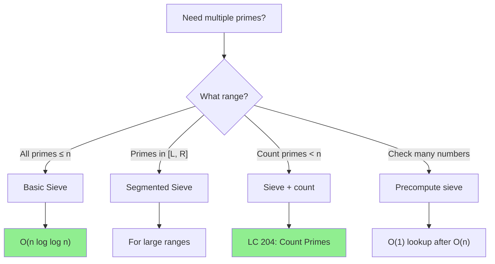

# Sieve of Eratosthenes

> **The most efficient way to find all primes up to n.**
>
> Essential for counting primes, prime factorization, and preprocessing.

---

## 🎯 Pattern Recognition



**Use Sieve when:**
- "Count primes less than n"
- Need to check primality of many numbers
- Need all primes in a range
- Preprocessing for factorization

---

## 📐 How It Works

### The Algorithm

1. Create boolean array `is_prime[0..n]`, initialize all to True
2. Mark 0 and 1 as not prime
3. For each prime p starting from 2:
   - Mark all multiples of p as composite (not prime)
   - Start marking from p² (smaller multiples already marked)
4. Remaining True values are primes

### Visual Example

```
Find primes ≤ 30:

Initial: [F F T T T T T T T T T T T T T T T T T T T T T T T T T T T T T]
              0 1 2 3 4 5 6 7 8 9 ...

Step 1 (p=2): Mark multiples of 2 (4,6,8,10,...)
         [F F T T F T F T F T F T F T F T F T F T F T F T F T F T F T F]
              0 1 2 3 4 5 6 7 8 9 10 11 12 13 14 15 16 17 18 19 20 21...

Step 2 (p=3): Mark multiples of 3 (9,15,21,27,...)
         [F F T T F T F T F F F T F T F F F T F T F F F T F T F F F T F]

Step 3 (p=5): Mark 25 (5²)
         [F F T T F T F T F F F T F T F F F T F T F F F T F F F F F T F]

Done (next prime 7, but 7² = 49 > 30)

Primes ≤ 30: 2, 3, 5, 7, 11, 13, 17, 19, 23, 29
```

---

## 💻 Code Implementation

### Basic Sieve

```python
def sieve_of_eratosthenes(n: int) -> list[bool]:
    """
    Find all primes up to n using Sieve of Eratosthenes.
    
    Returns: is_prime array where is_prime[i] = True if i is prime
    
    Time: O(n log log n)
    Space: O(n)
    """
    if n < 2:
        return [False] * (n + 1)
    
    is_prime = [True] * (n + 1)
    is_prime[0] = is_prime[1] = False
    
    # Only need to check up to √n
    p = 2
    while p * p <= n:
        if is_prime[p]:
            # Mark multiples of p starting from p²
            for multiple in range(p * p, n + 1, p):
                is_prime[multiple] = False
        p += 1
    
    return is_prime


def get_primes(n: int) -> list[int]:
    """Return list of all primes up to n."""
    is_prime = sieve_of_eratosthenes(n)
    return [i for i in range(2, n + 1) if is_prime[i]]


# Examples
print(get_primes(30))  # [2, 3, 5, 7, 11, 13, 17, 19, 23, 29]
print(get_primes(10))  # [2, 3, 5, 7]
print(len(get_primes(1000)))  # 168 primes ≤ 1000
```

```javascript
function sieveOfEratosthenes(n) {
    if (n < 2) return new Array(n + 1).fill(false);
    
    const isPrime = new Array(n + 1).fill(true);
    isPrime[0] = isPrime[1] = false;
    
    for (let p = 2; p * p <= n; p++) {
        if (isPrime[p]) {
            for (let multiple = p * p; multiple <= n; multiple += p) {
                isPrime[multiple] = false;
            }
        }
    }
    
    return isPrime;
}

function getPrimes(n) {
    const isPrime = sieveOfEratosthenes(n);
    return isPrime.reduce((primes, isPrime, i) => {
        if (isPrime) primes.push(i);
        return primes;
    }, []);
}

console.log(getPrimes(30));  // [2, 3, 5, 7, 11, 13, 17, 19, 23, 29]
```

### Memory-Optimized Sieve (Odd Numbers Only)

```python
def sieve_optimized(n: int) -> list[int]:
    """
    Memory-optimized sieve storing only odd numbers.
    
    Space: O(n/2)
    """
    if n < 2:
        return []
    if n == 2:
        return [2]
    
    # Only store odd numbers: index i represents number 2i+1
    size = n // 2
    is_prime = [True] * size
    
    # Process odd numbers starting from 3
    i = 0  # represents 3
    while (2 * i + 3) * (2 * i + 3) <= n:
        if is_prime[i]:
            p = 2 * i + 3
            # Mark multiples of p starting from p²
            # Convert p² to index: (p²-3)/2
            start = (p * p - 3) // 2
            for j in range(start, size, p):
                is_prime[j] = False
        i += 1
    
    # Collect primes
    primes = [2]
    for i in range(size):
        if is_prime[i]:
            primes.append(2 * i + 3)
    
    return primes


print(sieve_optimized(30))  # [2, 3, 5, 7, 11, 13, 17, 19, 23, 29]
```

---

## 📖 Problem: Count Primes (LC 204)

```python
def countPrimes(n: int) -> int:
    """
    Count primes less than n.
    
    Time: O(n log log n)
    Space: O(n)
    """
    if n <= 2:
        return 0
    
    is_prime = [True] * n
    is_prime[0] = is_prime[1] = False
    
    p = 2
    while p * p < n:
        if is_prime[p]:
            for multiple in range(p * p, n, p):
                is_prime[multiple] = False
        p += 1
    
    return sum(is_prime)


# Test cases
print(countPrimes(10))   # 4 (primes: 2, 3, 5, 7)
print(countPrimes(0))    # 0
print(countPrimes(1))    # 0
print(countPrimes(2))    # 0 (primes LESS than 2)
print(countPrimes(100))  # 25
```

```javascript
function countPrimes(n) {
    if (n <= 2) return 0;
    
    const isPrime = new Array(n).fill(true);
    isPrime[0] = isPrime[1] = false;
    
    for (let p = 2; p * p < n; p++) {
        if (isPrime[p]) {
            for (let multiple = p * p; multiple < n; multiple += p) {
                isPrime[multiple] = false;
            }
        }
    }
    
    return isPrime.filter(Boolean).length;
}

console.log(countPrimes(10));  // 4
console.log(countPrimes(100)); // 25
```

---

## 🔢 Smallest Prime Factor Sieve

Useful for fast factorization of multiple numbers.

```python
def smallest_prime_factor(n: int) -> list[int]:
    """
    Precompute smallest prime factor for each number up to n.
    
    spf[i] = smallest prime factor of i
    
    Time: O(n log log n)
    Space: O(n)
    """
    spf = list(range(n + 1))  # spf[i] = i initially
    
    p = 2
    while p * p <= n:
        if spf[p] == p:  # p is prime
            for multiple in range(p * p, n + 1, p):
                if spf[multiple] == multiple:
                    spf[multiple] = p
        p += 1
    
    return spf


def fast_factorize(num: int, spf: list[int]) -> dict[int, int]:
    """
    Factorize num using precomputed SPF.
    
    Time: O(log num)
    """
    factors = {}
    while num > 1:
        p = spf[num]
        factors[p] = factors.get(p, 0) + 1
        num //= p
    return factors


# Usage
spf = smallest_prime_factor(1000)
print(fast_factorize(84, spf))   # {2: 2, 3: 1, 7: 1}
print(fast_factorize(100, spf))  # {2: 2, 5: 2}
print(fast_factorize(97, spf))   # {97: 1} (prime)
```

```javascript
function smallestPrimeFactor(n) {
    const spf = Array.from({length: n + 1}, (_, i) => i);
    
    for (let p = 2; p * p <= n; p++) {
        if (spf[p] === p) {
            for (let multiple = p * p; multiple <= n; multiple += p) {
                if (spf[multiple] === multiple) {
                    spf[multiple] = p;
                }
            }
        }
    }
    
    return spf;
}

function fastFactorize(num, spf) {
    const factors = new Map();
    while (num > 1) {
        const p = spf[num];
        factors.set(p, (factors.get(p) || 0) + 1);
        num = Math.floor(num / p);
    }
    return factors;
}
```

---

## 🔄 Segmented Sieve

For finding primes in range [L, R] when R is large but R - L is small.

```python
def segmented_sieve(L: int, R: int) -> list[int]:
    """
    Find primes in range [L, R].
    
    Useful when R is large (e.g., 10^12) but R-L is small (e.g., 10^6).
    
    Time: O(√R + (R-L) log log R)
    Space: O(√R + (R-L))
    """
    import math
    
    limit = int(math.sqrt(R)) + 1
    
    # Step 1: Find all primes up to √R using basic sieve
    small_primes = []
    is_prime = [True] * (limit + 1)
    is_prime[0] = is_prime[1] = False
    
    for p in range(2, limit + 1):
        if is_prime[p]:
            small_primes.append(p)
            for multiple in range(p * p, limit + 1, p):
                is_prime[multiple] = False
    
    # Step 2: Use small primes to sieve [L, R]
    segment = [True] * (R - L + 1)
    
    # Handle L = 0 or 1
    if L == 0:
        segment[0] = False
    if L <= 1:
        if L == 1:
            segment[0] = False
        elif R >= 1:
            segment[1] = False
    
    for p in small_primes:
        # Find first multiple of p in range [L, R]
        start = max(p * p, ((L + p - 1) // p) * p)
        for multiple in range(start, R + 1, p):
            segment[multiple - L] = False
    
    return [L + i for i in range(R - L + 1) if segment[i] and L + i >= 2]


# Example: Find primes between 100 and 150
print(segmented_sieve(100, 150))
# [101, 103, 107, 109, 113, 127, 131, 137, 139, 149]
```

---

## ⚡ Complexity Analysis

| Variant | Time | Space | Use Case |
|---------|------|-------|----------|
| Basic Sieve | O(n log log n) | O(n) | General purpose |
| Odd-only Sieve | O(n log log n) | O(n/2) | Memory constrained |
| SPF Sieve | O(n log log n) | O(n) | Fast factorization |
| Segmented Sieve | O(√R + (R-L) log log R) | O(√R + (R-L)) | Large ranges |

### Why O(n log log n)?

Each prime p marks n/p composites. Total operations:
$$\sum_{p \leq \sqrt{n}} \frac{n}{p} = n \cdot \sum_{p \leq \sqrt{n}} \frac{1}{p} \approx n \log \log n$$

---

## ⚠️ Common Mistakes

### 1. Off-by-One in Count Primes

```python
# ❌ WRONG - problem asks for primes LESS than n
def countPrimes_wrong(n):
    is_prime = sieve_of_eratosthenes(n)
    return sum(is_prime)  # Includes n if prime!

# ✅ CORRECT
def countPrimes_correct(n):
    if n <= 2:
        return 0
    is_prime = sieve_of_eratosthenes(n - 1)  # Up to n-1
    return sum(is_prime)
```

### 2. Starting from Wrong Multiple

```python
# ❌ WRONG - starting from 2*p wastes time
for multiple in range(2 * p, n + 1, p):
    is_prime[multiple] = False

# ✅ CORRECT - start from p²
for multiple in range(p * p, n + 1, p):
    is_prime[multiple] = False
```

### 3. Memory for Large n

```python
# ❌ WRONG - memory error for n = 10^9
is_prime = [True] * (10**9)  # ~1 GB!

# ✅ CORRECT - use segmented sieve or bit array
import bitarray
is_prime = bitarray.bitarray(10**9)  # ~125 MB
```

---

## ✅ When to Use

- Count primes ≤ n
- Get all primes in a range
- Precompute for multiple primality checks
- Fast factorization of many numbers

## ❌ When NOT to Use

| Scenario | Use Instead |
|----------|-------------|
| Check single number | Trial division O(√n) |
| Very large n (> 10^9) | Segmented sieve or probabilistic tests |
| Need just primality | Miller-Rabin test |

---

## 📝 Practice Problems

| Problem | Difficulty | Key Technique |
|---------|------------|---------------|
| [Count Primes](https://leetcode.com/problems/count-primes/) | 🟡 Medium | Basic sieve |
| [Prime Arrangements](https://leetcode.com/problems/prime-arrangements/) | 🟢 Easy | Sieve + permutations |
| [Closest Prime Numbers in Range](https://leetcode.com/problems/closest-prime-numbers-in-range/) | 🟡 Medium | Segmented sieve |

---

## 🎤 Interview Context

<details>
<summary><strong>How to Communicate</strong></summary>

**Explaining the algorithm:**
> "The Sieve of Eratosthenes works by iteratively marking multiples of each prime as composite. Starting from p², because smaller multiples were already marked by smaller primes."

**Complexity justification:**
> "The time complexity is O(n log log n), which is nearly linear. This is because the sum 1/2 + 1/3 + 1/5 + ... for primes grows as log log n."

**Company Frequency:**
| Company | Frequency | Focus |
|---------|-----------|-------|
| Google | ⭐⭐⭐⭐ | Algorithm knowledge |
| Amazon | ⭐⭐⭐ | Count Primes |
| Meta | ⭐⭐ | Basic implementation |

</details>

---

## ⏱️ Time Estimates

| Activity | Time |
|----------|------|
| Learn basic sieve | 20 min |
| Implement from scratch | 15 min |
| Solve Count Primes | 15 min |
| Learn SPF variant | 20 min |
| Master pattern | 1.5 hours |

---

## 🧠 Spaced Repetition

<details>
<summary><strong>Review Schedule</strong></summary>

- **Day 1:** Implement basic sieve from scratch
- **Day 3:** Solve Count Primes problem
- **Day 7:** Implement SPF sieve
- **Day 14:** Implement segmented sieve concept
- **Day 30:** Review and optimize implementations

</details>

---

> **💡 Key Insight:** The sieve works because every composite has at least one prime factor ≤ √n. By marking multiples of all primes up to √n, we identify all composites up to n.

> **🔗 Related:** [← Prime Basics](./3.1-Prime-Basics.md) | [Factorial Trailing Zeros →](./3.3-Factorial-Trailing-Zeros.md) | [SPF for Fast Factorization](./3.1-Prime-Basics.md#prime-factorization)
