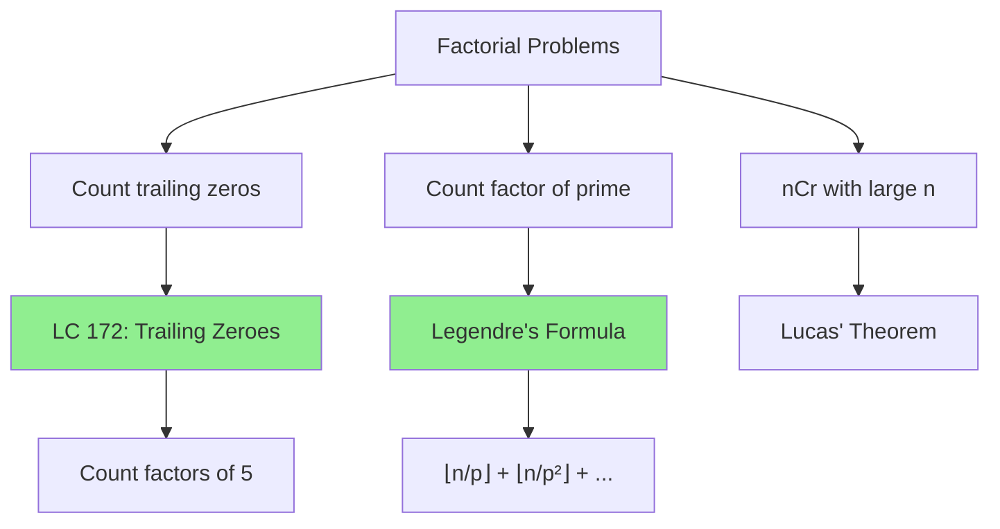

# Factorial and Trailing Zeros

> **Count factors of a prime in factorial - a classic interview problem.**
>
> Teaches Legendre's formula and multiplicative thinking.

---

## 🎯 Pattern Recognition



**Recognize factorial problems when you see:**
- "How many trailing zeros in n!"
- "Highest power of p that divides n!"
- "Count factors in factorial"
- Combinatorics with large factorials

---

## 📐 Trailing Zeros in Factorial

### The Key Insight

A trailing zero is created by a factor of 10 = 2 × 5.

In n!, there are always more factors of 2 than 5, so:

**Trailing zeros = count of factor 5 in n!**

### Why More 2s Than 5s?

```
In 10!:
- Multiples of 2: 2, 4, 6, 8, 10 → 8 factors of 2
- Multiples of 5: 5, 10 → 2 factors of 5

The bottleneck is always 5.
```

### Counting Factors of 5

Simple approach: count multiples of 5.

But wait! 25 = 5² contributes TWO 5s, 125 = 5³ contributes THREE, etc.

**Formula:**
$$\text{Trailing zeros} = \left\lfloor \frac{n}{5} \right\rfloor + \left\lfloor \frac{n}{25} \right\rfloor + \left\lfloor \frac{n}{125} \right\rfloor + ...$$

### Visual Example

```
n = 100

⌊100/5⌋   = 20  (multiples of 5: 5,10,15,...,100)
⌊100/25⌋  = 4   (multiples of 25: 25,50,75,100 - extra 5)
⌊100/125⌋ = 0   (no multiples of 125)

Total = 24 trailing zeros
```

---

## 💻 Problem: Factorial Trailing Zeroes (LC 172)

```python
def trailingZeroes(n: int) -> int:
    """
    Count trailing zeros in n!
    
    Key: Count factors of 5.
    
    Time: O(log₅ n)
    Space: O(1)
    """
    count = 0
    power_of_5 = 5
    
    while power_of_5 <= n:
        count += n // power_of_5
        power_of_5 *= 5
    
    return count


# Alternative: divide n by 5 repeatedly
def trailingZeroes_v2(n: int) -> int:
    count = 0
    while n >= 5:
        n //= 5
        count += n
    return count


# Examples
print(trailingZeroes(5))    # 1 (5! = 120)
print(trailingZeroes(10))   # 2 (10! = 3628800)
print(trailingZeroes(25))   # 6 (5+1 from 25)
print(trailingZeroes(100))  # 24
```

```javascript
function trailingZeroes(n) {
    let count = 0;
    let powerOf5 = 5;
    
    while (powerOf5 <= n) {
        count += Math.floor(n / powerOf5);
        powerOf5 *= 5;
    }
    
    return count;
}

// Alternative
function trailingZeroes_v2(n) {
    let count = 0;
    while (n >= 5) {
        n = Math.floor(n / 5);
        count += n;
    }
    return count;
}

console.log(trailingZeroes(100));  // 24
```

---

## 📐 Legendre's Formula

**General form:** Count highest power of prime p dividing n!

$$\nu_p(n!) = \sum_{i=1}^{\infty} \left\lfloor \frac{n}{p^i} \right\rfloor = \frac{n - s_p(n)}{p - 1}$$

Where $s_p(n)$ is the sum of digits of n in base p.

```python
def legendre(n: int, p: int) -> int:
    """
    Count highest power of prime p that divides n!
    
    Time: O(log_p n)
    Space: O(1)
    """
    count = 0
    power = p
    while power <= n:
        count += n // power
        power *= p
    return count


# Examples
print(legendre(10, 2))   # 8 (10! is divisible by 2^8)
print(legendre(10, 3))   # 4 (10! is divisible by 3^4)
print(legendre(10, 5))   # 2 (10! is divisible by 5^2 → 2 trailing zeros)
print(legendre(100, 5))  # 24
```

```javascript
function legendre(n, p) {
    let count = 0;
    let power = p;
    while (power <= n) {
        count += Math.floor(n / power);
        power *= p;
    }
    return count;
}
```

---

## 📖 Problem: Preimage Size of Factorial Zeroes (LC 793)

**Harder variant:** Given k, find how many n exist such that n! has exactly k trailing zeros.

```python
def preimageSizeFZF(k: int) -> int:
    """
    Find count of n where trailingZeroes(n!) = k.
    
    Key insight: 
    - trailingZeroes(n) increases by 1 for multiples of 5
    - Increases by 2 for multiples of 25, etc.
    - So some k values have 5 valid n, some have 0
    
    Answer is either 0 or 5.
    
    Use binary search to find if k is achievable.
    
    Time: O(log² k)
    """
    def trailing_zeros(n: int) -> int:
        count = 0
        while n >= 5:
            n //= 5
            count += n
        return count
    
    def count_less_equal(target: int) -> int:
        """Count how many n have trailing_zeros(n!) <= target."""
        if target < 0:
            return 0
        
        # Binary search for rightmost n with trailing_zeros <= target
        lo, hi = 0, 5 * (target + 1)
        while lo < hi:
            mid = (lo + hi + 1) // 2
            if trailing_zeros(mid) <= target:
                lo = mid
            else:
                hi = mid - 1
        return lo + 1
    
    return count_less_equal(k) - count_less_equal(k - 1)


# Alternative cleaner approach
def preimageSizeFZF_v2(k: int) -> int:
    """Binary search approach."""
    def trailing_zeros(n: int) -> int:
        count = 0
        while n >= 5:
            n //= 5
            count += n
        return count
    
    def lower_bound(target: int) -> int:
        """Find smallest n with trailing_zeros(n) >= target."""
        lo, hi = 0, 5 * target + 1
        while lo < hi:
            mid = (lo + hi) // 2
            if trailing_zeros(mid) < target:
                lo = mid + 1
            else:
                hi = mid
        return lo
    
    # If we can find n with exactly k zeros, answer is 5
    # Otherwise, answer is 0
    left = lower_bound(k)
    if trailing_zeros(left) == k:
        return 5
    return 0


print(preimageSizeFZF(0))   # 5 (n = 0,1,2,3,4)
print(preimageSizeFZF(5))   # 0 (skip from 4 to 6 zeros at n=25)
print(preimageSizeFZF(3))   # 5
```

---

## 🔢 Related: Factorial Divisibility

### Check if n! is divisible by m

```python
def factorial_divisible_by(n: int, m: int) -> bool:
    """
    Check if n! is divisible by m.
    
    Method: Factor m, check each prime power divides n!
    """
    from collections import Counter
    
    # Factor m
    factors = Counter()
    temp = m
    d = 2
    while d * d <= temp:
        while temp % d == 0:
            factors[d] += 1
            temp //= d
        d += 1
    if temp > 1:
        factors[temp] += 1
    
    # Check each prime power
    for prime, needed in factors.items():
        available = legendre(n, prime)
        if available < needed:
            return False
    return True


print(factorial_divisible_by(10, 100))   # True (10! has 2^8 × 5^2)
print(factorial_divisible_by(5, 100))    # False (5! = 120, not divisible by 100)
```

### Find Minimum n such that n! is divisible by m

```python
def min_factorial_divisible(m: int) -> int:
    """
    Find smallest n such that n! is divisible by m.
    
    Uses binary search on n.
    """
    from collections import Counter
    
    # Factor m
    factors = Counter()
    temp = m
    d = 2
    while d * d <= temp:
        while temp % d == 0:
            factors[d] += 1
            temp //= d
        d += 1
    if temp > 1:
        factors[temp] += 1
    
    def is_sufficient(n: int) -> bool:
        for prime, needed in factors.items():
            if legendre(n, prime) < needed:
                return False
        return True
    
    # Binary search
    lo, hi = 1, m
    while lo < hi:
        mid = (lo + hi) // 2
        if is_sufficient(mid):
            hi = mid
        else:
            lo = mid + 1
    
    return lo


print(min_factorial_divisible(100))  # 10
print(min_factorial_divisible(24))   # 4 (4! = 24)
```

---

## 📊 Factorial Properties Table

| Property | Formula | Example |
|----------|---------|---------|
| Trailing zeros | ⌊n/5⌋ + ⌊n/25⌋ + ... | 100! has 24 zeros |
| Power of 2 in n! | ⌊n/2⌋ + ⌊n/4⌋ + ... | 10! has 2^8 |
| Power of p in n! | Legendre's formula | Σ⌊n/p^i⌋ |
| n! in base p | (n - sum of digits in base p)/(p-1) | Alternate formula |

---

## ⚡ Complexity Analysis

| Operation | Time | Space |
|-----------|------|-------|
| Trailing zeros | O(log₅ n) | O(1) |
| Legendre formula | O(log_p n) | O(1) |
| Preimage (LC 793) | O(log² k) | O(1) |
| Check divisibility | O(√m + k log m) | O(k) for k prime factors |

---

## ⚠️ Common Mistakes

### 1. Overflow with Power Multiplication

```python
# ❌ WRONG - power_of_5 can overflow in some languages
while power_of_5 <= n:
    count += n // power_of_5
    power_of_5 *= 5  # May overflow!

# ✅ CORRECT - divide n instead
while n >= 5:
    n //= 5
    count += n
```

### 2. Forgetting Higher Powers

```python
# ❌ WRONG - only counts multiples of 5
def trailing_wrong(n):
    return n // 5

# 25 contributes 2 fives, 125 contributes 3, etc.

# ✅ CORRECT
def trailing_correct(n):
    count = 0
    while n >= 5:
        n //= 5
        count += n
    return count
```

### 3. Wrong for Preimage Problem

```python
# ❌ WRONG - not all k are achievable
# When n goes from 24 to 25:
# trailing_zeros(24!) = 4
# trailing_zeros(25!) = 6
# So k=5 has NO valid n!
```

---

## ✅ When to Use

- Counting trailing zeros
- Finding prime power in factorial
- Combinatorics with factorials
- Divisibility problems

## ❌ When NOT to Use

| Scenario | Use Instead |
|----------|-------------|
| Need actual factorial value | Modular computation |
| Small n (< 20) | Direct calculation |
| Non-factorial counting | Other techniques |

---

## 📝 Practice Problems

| Problem | Difficulty | Key Technique |
|---------|------------|---------------|
| [Factorial Trailing Zeroes](https://leetcode.com/problems/factorial-trailing-zeroes/) | 🟡 Medium | Count factor 5 |
| [Preimage Size of Factorial Zeroes](https://leetcode.com/problems/preimage-size-of-factorial-zeroes-function/) | 🔴 Hard | Binary search |
| [Maximum Trailing Zeros in Grid](https://leetcode.com/problems/maximum-trailing-zeros-in-a-cornered-path/) | 🟡 Medium | Count 2s and 5s |

---

## 🎤 Interview Context

<details>
<summary><strong>How to Communicate</strong></summary>

**Explaining the approach:**
> "Trailing zeros come from factors of 10, which is 2 × 5. Since there are always more 2s than 5s in n!, I just need to count the factors of 5. I use Legendre's formula which adds n/5 + n/25 + n/125 + ..."

**Why divide repeatedly?**
> "Numbers like 25 contribute two 5s, 125 contributes three, etc. The first term counts all multiples of 5, the second counts extra 5s from 25, and so on."

**Company Frequency:**
| Company | Frequency | Focus |
|---------|-----------|-------|
| Google | ⭐⭐⭐⭐ | Math insight |
| Amazon | ⭐⭐⭐ | Basic version |
| Bloomberg | ⭐⭐⭐ | Variations |

</details>

---

## ⏱️ Time Estimates

| Activity | Time |
|----------|------|
| Understand trailing zeros | 10 min |
| Implement Legendre | 10 min |
| Solve LC 172 | 15 min |
| Understand preimage | 30 min |
| Master pattern | 1 hour |

---

## 🧠 Spaced Repetition

<details>
<summary><strong>Review Schedule</strong></summary>

- **Day 1:** Implement trailing zeros from scratch
- **Day 3:** Explain why we sum n/5 + n/25 + ...
- **Day 7:** Solve the preimage problem
- **Day 14:** Implement Legendre for any prime
- **Day 30:** Solve a related combinatorics problem

</details>

---

> **💡 Key Insight:** The number of trailing zeros equals the number of (2,5) pairs in the prime factorization. Since 2s are abundant, just count 5s using n/5 + n/25 + n/125 + ...

> **🔗 Related:** [← Sieve of Eratosthenes](./3.2-Sieve-of-Eratosthenes.md) | [Combinatorics →](../04-Combinatorics/4.1-nCr-Basics.md) | [Modular Arithmetic](../01-Fundamentals/1.2-Modular-Arithmetic.md)
