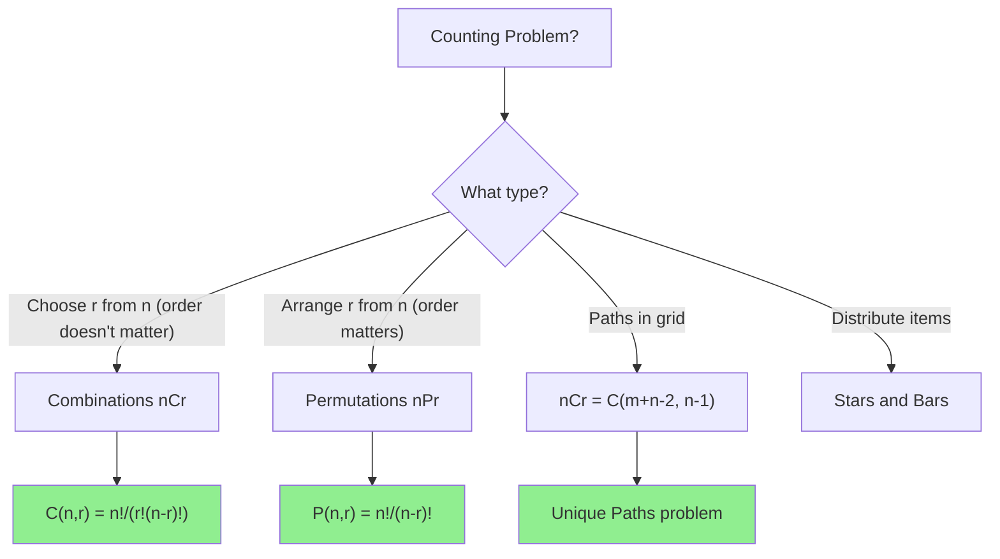

# nCr Basics (Combinations)

> **Count ways to choose r items from n items without order.**
>
> Foundation for counting, probability, and dynamic programming.

---

## 🎯 Pattern Recognition



**Use combinations when:**
- "How many ways to choose"
- "Select k items from n"
- "Subset of size k"
- "Path counting in grid"

---

## 📐 The Formulas

### Combinations (Order Doesn't Matter)

$$C(n, r) = \binom{n}{r} = \frac{n!}{r!(n-r)!}$$

**Intuition:** Choose r items from n. Divide by r! because order doesn't matter.

### Permutations (Order Matters)

$$P(n, r) = \frac{n!}{(n-r)!}$$

**Intuition:** Arrange r items from n. Order matters, so no division by r!.

### Key Relationships

```
P(n, r) = C(n, r) × r!
C(n, r) = C(n, n-r)         (symmetry)
C(n, 0) = C(n, n) = 1
C(n, 1) = C(n, n-1) = n
C(n, r) = C(n-1, r-1) + C(n-1, r)  (Pascal's identity)
```

---

## 💻 Computing nCr

### Method 1: Direct Formula (Careful with Overflow)

```python
def nCr_direct(n: int, r: int) -> int:
    """
    Compute C(n, r) directly.
    
    Trick: Multiply and divide alternately to avoid overflow.
    
    Time: O(r)
    Space: O(1)
    """
    if r < 0 or r > n:
        return 0
    if r == 0 or r == n:
        return 1
    
    # Use symmetry: C(n, r) = C(n, n-r)
    r = min(r, n - r)
    
    result = 1
    for i in range(r):
        result = result * (n - i) // (i + 1)
    
    return result


# Examples
print(nCr_direct(5, 2))   # 10
print(nCr_direct(10, 3))  # 120
print(nCr_direct(52, 5))  # 2598960 (poker hands)
```

```javascript
function nCr(n, r) {
    if (r < 0 || r > n) return 0;
    if (r === 0 || r === n) return 1;
    
    r = Math.min(r, n - r);
    
    let result = 1;
    for (let i = 0; i < r; i++) {
        result = result * (n - i) / (i + 1);
    }
    
    return Math.round(result);  // Handle floating point
}

console.log(nCr(5, 2));   // 10
console.log(nCr(10, 3));  // 120
```

### Method 2: Pascal's Triangle (DP)

```python
def pascal_triangle(n: int) -> list[list[int]]:
    """
    Build Pascal's triangle up to row n.
    
    C(n, r) = triangle[n][r]
    
    Time: O(n²)
    Space: O(n²)
    """
    triangle = [[1]]
    
    for i in range(1, n + 1):
        row = [1]
        for j in range(1, i):
            row.append(triangle[i-1][j-1] + triangle[i-1][j])
        row.append(1)
        triangle.append(row)
    
    return triangle


def nCr_pascal(n: int, r: int, triangle: list[list[int]]) -> int:
    """Look up C(n, r) from precomputed triangle."""
    if r < 0 or r > n:
        return 0
    return triangle[n][r]


# Precompute
triangle = pascal_triangle(20)
print(triangle[5])           # [1, 5, 10, 10, 5, 1]
print(nCr_pascal(5, 2, triangle))  # 10
```

```javascript
function pascalTriangle(n) {
    const triangle = [[1]];
    
    for (let i = 1; i <= n; i++) {
        const row = [1];
        for (let j = 1; j < i; j++) {
            row.push(triangle[i-1][j-1] + triangle[i-1][j]);
        }
        row.push(1);
        triangle.push(row);
    }
    
    return triangle;
}

const triangle = pascalTriangle(10);
console.log(triangle[5]);  // [1, 5, 10, 10, 5, 1]
```

### Method 3: With Modulo (for Large Numbers)

```python
MOD = 1_000_000_007

def nCr_mod(n: int, r: int, mod: int = MOD) -> int:
    """
    Compute C(n, r) mod p using modular inverse.
    
    Time: O(r log mod) for inverse computation
    Space: O(1)
    """
    if r < 0 or r > n:
        return 0
    if r == 0 or r == n:
        return 1
    
    r = min(r, n - r)
    
    # Compute numerator and denominator
    numerator = 1
    denominator = 1
    
    for i in range(r):
        numerator = (numerator * (n - i)) % mod
        denominator = (denominator * (i + 1)) % mod
    
    # Modular inverse of denominator
    return (numerator * pow(denominator, mod - 2, mod)) % mod


print(nCr_mod(1000, 500))  # Large but mod 10^9+7
```

### Method 4: Precompute Factorials (Best for Multiple Queries)

```python
class Combinatorics:
    """
    Precompute factorials for O(1) nCr queries.
    
    Time: O(n) preprocessing, O(1) per query
    Space: O(n)
    """
    
    def __init__(self, max_n: int, mod: int = 1_000_000_007):
        self.mod = mod
        self.fact = [1] * (max_n + 1)
        self.inv_fact = [1] * (max_n + 1)
        
        # Compute factorials
        for i in range(1, max_n + 1):
            self.fact[i] = (self.fact[i-1] * i) % mod
        
        # Compute inverse factorials
        self.inv_fact[max_n] = pow(self.fact[max_n], mod - 2, mod)
        for i in range(max_n - 1, -1, -1):
            self.inv_fact[i] = (self.inv_fact[i+1] * (i+1)) % mod
    
    def nCr(self, n: int, r: int) -> int:
        """C(n, r) mod p in O(1)."""
        if r < 0 or r > n:
            return 0
        return (self.fact[n] * self.inv_fact[r] % self.mod) * self.inv_fact[n-r] % self.mod
    
    def nPr(self, n: int, r: int) -> int:
        """P(n, r) mod p in O(1)."""
        if r < 0 or r > n:
            return 0
        return (self.fact[n] * self.inv_fact[n-r]) % self.mod


# Usage
comb = Combinatorics(1000)
print(comb.nCr(10, 3))    # 120
print(comb.nCr(1000, 500))# Large number mod 10^9+7
print(comb.nPr(5, 3))     # 60
```

---

## 📖 Problem: Pascal's Triangle (LC 118)

```python
def generate(numRows: int) -> list[list[int]]:
    """
    Generate first numRows of Pascal's triangle.
    
    Time: O(numRows²)
    Space: O(numRows²)
    """
    triangle = []
    
    for i in range(numRows):
        row = [1] * (i + 1)
        for j in range(1, i):
            row[j] = triangle[i-1][j-1] + triangle[i-1][j]
        triangle.append(row)
    
    return triangle


print(generate(5))
# [[1], [1, 1], [1, 2, 1], [1, 3, 3, 1], [1, 4, 6, 4, 1]]
```

```javascript
function generate(numRows) {
    const triangle = [];
    
    for (let i = 0; i < numRows; i++) {
        const row = new Array(i + 1).fill(1);
        for (let j = 1; j < i; j++) {
            row[j] = triangle[i-1][j-1] + triangle[i-1][j];
        }
        triangle.push(row);
    }
    
    return triangle;
}
```

## 📖 Problem: Pascal's Triangle II (LC 119)

```python
def getRow(rowIndex: int) -> list[int]:
    """
    Get row rowIndex of Pascal's triangle.
    
    Space-optimized: only store one row.
    
    Time: O(rowIndex)
    Space: O(rowIndex)
    """
    row = [1] * (rowIndex + 1)
    
    for i in range(1, rowIndex):
        # Update from right to left to avoid overwriting needed values
        for j in range(i, 0, -1):
            row[j] += row[j-1]
    
    return row


print(getRow(4))  # [1, 4, 6, 4, 1]

# Alternative: Direct computation
def getRow_direct(rowIndex: int) -> list[int]:
    row = [1]
    for i in range(rowIndex):
        row.append(row[-1] * (rowIndex - i) // (i + 1))
    return row
```

---

## 📖 Problem: Unique Paths (LC 62)

```python
def uniquePaths(m: int, n: int) -> int:
    """
    Count paths from top-left to bottom-right.
    Only move right or down.
    
    Key: Need (m-1) down moves and (n-1) right moves.
    Choose positions for right moves: C(m+n-2, n-1)
    
    Time: O(min(m, n))
    Space: O(1)
    """
    # Total moves = (m-1) + (n-1) = m + n - 2
    # Choose (n-1) right moves (or (m-1) down moves)
    return nCr_direct(m + n - 2, n - 1)


def uniquePaths_dp(m: int, n: int) -> int:
    """DP approach for comparison."""
    dp = [1] * n
    for i in range(1, m):
        for j in range(1, n):
            dp[j] += dp[j-1]
    return dp[n-1]


print(uniquePaths(3, 7))  # 28
print(uniquePaths(3, 2))  # 3
```

```javascript
function uniquePaths(m, n) {
    // C(m+n-2, n-1)
    return nCr(m + n - 2, n - 1);
}
```

---

## 📊 Common Formulas

| Formula | Expression | Example |
|---------|------------|---------|
| Choose r from n | C(n, r) = n!/(r!(n-r)!) | C(5,2) = 10 |
| Arrange r from n | P(n, r) = n!/(n-r)! | P(5,2) = 20 |
| Grid paths (m×n) | C(m+n-2, n-1) | 3×3 grid: C(4,2) = 6 |
| Multiset | C(n+r-1, r) | 3 types, choose 5: C(7,5) = 21 |
| Derangements | D(n) = n! × Σ(-1)^k/k! | D(4) = 9 |

---

## ⚡ Complexity Analysis

| Method | Preprocess | Query | Space |
|--------|------------|-------|-------|
| Direct formula | - | O(min(r, n-r)) | O(1) |
| Pascal's triangle | O(n²) | O(1) | O(n²) |
| Factorial precompute | O(n) | O(1) | O(n) |
| DP (grid paths) | - | O(m × n) | O(n) |

---

## ⚠️ Common Mistakes

### 1. Overflow in Direct Computation

```python
# ❌ WRONG - overflow before division
def nCr_wrong(n, r):
    import math
    return math.factorial(n) // (math.factorial(r) * math.factorial(n - r))
    # Works in Python but overflows in other languages

# ✅ CORRECT - alternate multiply and divide
def nCr_correct(n, r):
    r = min(r, n - r)
    result = 1
    for i in range(r):
        result = result * (n - i) // (i + 1)  # Divide immediately
    return result
```

### 2. Wrong Formula for Permutations

```python
# ❌ WRONG - this is combinations
def nPr_wrong(n, r):
    return nCr(n, r)

# ✅ CORRECT
def nPr_correct(n, r):
    return nCr(n, r) * factorial(r)
    # Or: n! / (n-r)!
```

### 3. Edge Cases

```python
# Always handle:
# - r > n → return 0
# - r < 0 → return 0
# - r = 0 or r = n → return 1
```

---

## ✅ When to Use

- Counting selection problems
- Grid path problems
- Probability calculations
- Binomial expansion coefficients

## ❌ When NOT to Use

| Scenario | Use Instead |
|----------|-------------|
| Need exact large value | Use modular arithmetic |
| Order matters | Use permutations |
| With repetition | Use multiset formula |

---

## 📝 Practice Problems

| Problem | Difficulty | Key Technique |
|---------|------------|---------------|
| [Pascal's Triangle](https://leetcode.com/problems/pascals-triangle/) | 🟢 Easy | Build triangle |
| [Pascal's Triangle II](https://leetcode.com/problems/pascals-triangle-ii/) | 🟢 Easy | Space-optimized |
| [Unique Paths](https://leetcode.com/problems/unique-paths/) | 🟡 Medium | nCr formula |
| [Unique Paths II](https://leetcode.com/problems/unique-paths-ii/) | 🟡 Medium | DP with obstacles |

---

## 🎤 Interview Context

<details>
<summary><strong>How to Communicate</strong></summary>

**Explaining Unique Paths:**
> "This is a combinatorics problem. We need m-1 down moves and n-1 right moves. The answer is choosing which (n-1) of the (m+n-2) moves are right: C(m+n-2, n-1)."

**When to use DP vs formula:**
> "The formula gives O(min(m,n)) time for the basic problem. But if there are obstacles, I'd use DP since the formula doesn't handle blocked cells."

**Company Frequency:**
| Company | Frequency | Focus |
|---------|-----------|-------|
| Google | ⭐⭐⭐⭐ | Counting problems |
| Amazon | ⭐⭐⭐ | Grid paths |
| Meta | ⭐⭐⭐ | Combinatorics |

</details>

---

## ⏱️ Time Estimates

| Activity | Time |
|----------|------|
| Learn formulas | 15 min |
| Implement nCr | 10 min |
| Solve Pascal's Triangle | 15 min |
| Solve Unique Paths | 15 min |
| Master pattern | 1.5 hours |

---

## 🧠 Spaced Repetition

<details>
<summary><strong>Review Schedule</strong></summary>

- **Day 1:** Implement nCr from scratch (3 methods)
- **Day 3:** Solve Unique Paths with formula
- **Day 7:** Implement Combinatorics class
- **Day 14:** Solve Unique Paths II with DP
- **Day 30:** Review all combinatorics formulas

</details>

---

> **💡 Key Insight:** Pascal's identity C(n,r) = C(n-1,r-1) + C(n-1,r) says: for each item, we either include it (from n-1, choose r-1 more) or exclude it (from n-1, choose r).

> **🔗 Related:** [Pascal's Triangle →](./4.2-Pascals-Triangle.md) | [Catalan Numbers →](./4.3-Catalan-Numbers.md) | [Stars and Bars →](./4.4-Stars-and-Bars.md)
