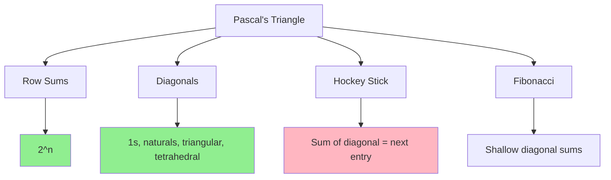

# Pascal's Triangle Properties

> **The visual representation of binomial coefficients.**
>
> Contains powerful patterns for combinatorics and number theory.

---

## 🎯 Pattern Recognition



**Pascal's Triangle appears in:**
- Binomial coefficients
- Counting paths
- Probability distributions
- Number pattern problems

---

## 📐 Structure of Pascal's Triangle

```
Row 0:              1
Row 1:            1   1
Row 2:          1   2   1
Row 3:        1   3   3   1
Row 4:      1   4   6   4   1
Row 5:    1   5  10  10   5   1
Row 6:  1   6  15  20  15   6   1
```

**Entry at row n, position r:** C(n, r)

---

## 💡 Key Properties

### Property 1: Symmetry

```python
# C(n, r) = C(n, n-r)
# Row is symmetric around the middle

def verify_symmetry(n: int):
    row = get_row(n)
    return row == row[::-1]

print(verify_symmetry(5))  # True
```

### Property 2: Row Sum = 2^n

```python
# Sum of row n = 2^n
# Because (1+1)^n = sum of C(n,r) for r = 0 to n

def row_sum(n: int) -> int:
    return 2 ** n

print(row_sum(5))  # 32
print(sum(get_row(5)))  # 32 [1+5+10+10+5+1]
```

### Property 3: Alternating Sum = 0

```python
# C(n,0) - C(n,1) + C(n,2) - ... = 0 for n > 0
# Because (1-1)^n = 0

def alternating_sum(n: int) -> int:
    row = get_row(n)
    return sum((-1)**i * row[i] for i in range(len(row)))

print(alternating_sum(5))  # 0
```

### Property 4: Pascal's Identity

```python
# C(n, r) = C(n-1, r-1) + C(n-1, r)
# Each entry is sum of two entries above it

def verify_pascal_identity(n: int, r: int) -> bool:
    if r == 0 or r == n:
        return True
    return nCr(n, r) == nCr(n-1, r-1) + nCr(n-1, r)
```

---

## 🔢 Diagonals of Pascal's Triangle

```
      1                    ← All 1s
    1   1                  ← Natural numbers (1, 2, 3, ...)
  1   2   1                ← Triangular numbers (1, 3, 6, 10, ...)
 1  3   3   1              ← Tetrahedral numbers (1, 4, 10, 20, ...)
1  4   6   4  1
```

### The Diagonals

| Diagonal | Name | Formula | Values |
|----------|------|---------|--------|
| 1st | Ones | C(n, 0) | 1, 1, 1, 1, ... |
| 2nd | Naturals | C(n, 1) | 1, 2, 3, 4, ... |
| 3rd | Triangular | C(n, 2) | 1, 3, 6, 10, ... |
| 4th | Tetrahedral | C(n, 3) | 1, 4, 10, 20, ... |

```python
def get_diagonal(k: int, length: int) -> list[int]:
    """Get kth diagonal of Pascal's triangle."""
    return [nCr(n + k, k) for n in range(length)]


print(get_diagonal(0, 6))  # [1, 1, 1, 1, 1, 1] - ones
print(get_diagonal(1, 6))  # [1, 2, 3, 4, 5, 6] - naturals
print(get_diagonal(2, 6))  # [1, 3, 6, 10, 15, 21] - triangular
print(get_diagonal(3, 6))  # [1, 4, 10, 20, 35, 56] - tetrahedral
```

---

## 🏒 Hockey Stick Identity

```
      1
    1   1
  1   2   1
1   3   3   1       ← C(3,1)=3 ↘
1   4   6   4   1     ← C(4,1)=4 ↘
1   5  10  10   5   1   ← C(5,1)=5 ↘ Sum to C(6,2)=15
1   6  15  ...                    ↙
     └──────────────────────────┘
```

**Hockey Stick Identity:**
$$C(r, r) + C(r+1, r) + C(r+2, r) + ... + C(n, r) = C(n+1, r+1)$$

```python
def hockey_stick(n: int, r: int) -> int:
    """Sum of column from row r to row n equals C(n+1, r+1)."""
    return sum(nCr(i, r) for i in range(r, n + 1))


# Verify: sum of C(r,r) to C(n,r) = C(n+1, r+1)
print(hockey_stick(5, 2))    # 1+3+6+10 = 20
print(nCr(6, 3))             # 20 ✓
```

**Use case:** Counting problems where you sum over different sizes.

---

## 🐚 Fibonacci in Pascal's Triangle

The shallow diagonals sum to Fibonacci numbers!

```
         1                    → 1 = F(1)
       1   1                  → 1+1 = 2 (draw diagonal)
     1   2   1                
   1   3   3   1              
 1   4   6   4   1            
1   5  10  10   5   1         

Diagonal sums: 1, 1, 2, 3, 5, 8, 13, ...
```

```python
def fibonacci_from_pascal(n: int) -> int:
    """
    Compute Fibonacci(n) using Pascal's triangle.
    
    F(n) = sum of C(n-1-k, k) for valid k
    """
    total = 0
    k = 0
    while n - 1 - k >= k:
        total += nCr(n - 1 - k, k)
        k += 1
    return total


for i in range(1, 11):
    print(fibonacci_from_pascal(i), end=" ")
# 1 1 2 3 5 8 13 21 34 55
```

---

## 💻 Efficient Pascal's Triangle Generation

### Row by Row (O(n) space)

```python
def get_row(row_index: int) -> list[int]:
    """
    Get specific row of Pascal's triangle.
    
    Time: O(row_index)
    Space: O(row_index)
    """
    row = [1]
    for i in range(row_index):
        row.append(row[-1] * (row_index - i) // (i + 1))
    return row


print(get_row(5))  # [1, 5, 10, 10, 5, 1]
print(get_row(10))  # [1, 10, 45, 120, 210, 252, 210, 120, 45, 10, 1]
```

```javascript
function getRow(rowIndex) {
    const row = [1];
    for (let i = 0; i < rowIndex; i++) {
        row.push(row[row.length - 1] * (rowIndex - i) / (i + 1));
    }
    return row;
}
```

### In-Place Update

```python
def get_row_inplace(row_index: int) -> list[int]:
    """
    Build row in-place by updating from right to left.
    """
    row = [1] * (row_index + 1)
    
    for i in range(1, row_index + 1):
        for j in range(i - 1, 0, -1):
            row[j] += row[j - 1]
    
    return row
```

---

## 📖 Pascal's Triangle Modulo Prime

### Lucas' Theorem

For prime p:
$$C(n, r) \mod p = \prod_{i} C(n_i, r_i) \mod p$$

Where $n_i$ and $r_i$ are digits of n and r in base p.

```python
def nCr_lucas(n: int, r: int, p: int) -> int:
    """
    Compute C(n, r) mod p using Lucas' theorem.
    
    Useful when n is very large but p is small.
    """
    def nCr_small(n: int, r: int, p: int) -> int:
        if r > n:
            return 0
        if r == 0 or r == n:
            return 1
        
        # For small values, compute directly
        numerator = 1
        denominator = 1
        for i in range(r):
            numerator = (numerator * (n - i)) % p
            denominator = (denominator * (i + 1)) % p
        
        return (numerator * pow(denominator, p - 2, p)) % p
    
    result = 1
    while n > 0 or r > 0:
        ni = n % p
        ri = r % p
        result = (result * nCr_small(ni, ri, p)) % p
        n //= p
        r //= p
    
    return result


# Example: C(1000000000, 500000000) mod 13
print(nCr_lucas(1000000000, 500000000, 13))
```

---

## 📊 Summary of Identities

| Identity | Formula | Use Case |
|----------|---------|----------|
| Symmetry | C(n,r) = C(n, n-r) | Reduce computation |
| Row Sum | Σ C(n,r) = 2^n | Counting all subsets |
| Alternating Sum | Σ (-1)^r C(n,r) = 0 | Inclusion-exclusion |
| Pascal's | C(n,r) = C(n-1,r-1) + C(n-1,r) | DP construction |
| Hockey Stick | Σ C(i,r) = C(n+1,r+1) | Sum of column |
| Vandermonde | Σ C(m,k)C(n,r-k) = C(m+n,r) | Convolution |

---

## ⚠️ Common Mistakes

### 1. Off-by-One in Row Indexing

```python
# Row 0: [1]
# Row 1: [1, 1]
# Row 5: [1, 5, 10, 10, 5, 1]

# ❌ WRONG - row 5 has 6 elements, not 5
len(get_row(5))  # 6, not 5
```

### 2. Not Using Symmetry

```python
# ❌ SLOW - computing C(100, 99) the hard way
result = nCr(100, 99)  # 99 multiplications

# ✅ FAST - use symmetry
result = nCr(100, 1)   # 1 multiplication
```

---

## ✅ When to Use Pascal's Properties

- Simplifying combinatorial expressions
- Finding patterns in counting
- Proving identities
- Efficient computation tricks

## ❌ When NOT to Use

| Scenario | Alternative |
|----------|-------------|
| Need single C(n,r) with small values | Direct formula: n!/(r!(n-r)!) |
| Need C(n,r) mod prime, n very large | Lucas' theorem |
| Need all values up to n, many queries | Precompute factorial arrays |
| r is close to n | Use symmetry: C(n,r) = C(n, n-r) |

---

## 📝 Practice Problems

| Problem | Difficulty | Key Technique |
|---------|------------|---------------|
| [Pascal's Triangle](https://leetcode.com/problems/pascals-triangle/) | 🟢 Easy | Generate triangle |
| [Pascal's Triangle II](https://leetcode.com/problems/pascals-triangle-ii/) | 🟢 Easy | Single row O(k) space |
| [Kth Symbol in Grammar](https://leetcode.com/problems/k-th-symbol-in-grammar/) | 🟡 Medium | Pattern recognition |

---

## 🎤 Interview Context

<details>
<summary><strong>How to Communicate</strong></summary>

**Explaining Pascal's identity:**
> "Each entry in Pascal's triangle is the sum of the two entries above it, which corresponds to the combinatorial identity C(n,r) = C(n-1,r-1) + C(n-1,r). This says: for any item, we either include it or exclude it."

**Using in interviews:**
> "I'll use the property that row n sums to 2^n because we're counting all possible subsets of n items."

**Company Frequency:**
| Company | Frequency | Focus |
|---------|-----------|-------|
| Google | ⭐⭐⭐ | Pattern problems |
| Amazon | ⭐⭐ | Basic generation |
| Meta | ⭐⭐ | Properties |

</details>

---

## ⏱️ Time Estimates

| Activity | Time |
|----------|------|
| Learn triangle structure | 10 min |
| Learn 3 main properties | 15 min |
| Learn hockey stick | 15 min |
| Implement efficiently | 20 min |
| Master pattern | 1 hour |

---

## 🧠 Spaced Repetition

<details>
<summary><strong>Review Schedule</strong></summary>

- **Day 1:** Generate Pascal's triangle
- **Day 3:** Explain why row sum = 2^n
- **Day 7:** Prove hockey stick identity
- **Day 14:** Find Fibonacci in Pascal's
- **Day 30:** Review all identities

</details>

---

> **💡 Key Insight:** Pascal's Triangle is not just about combinations—it encodes natural numbers, triangular numbers, Fibonacci, and many other sequences. The hockey stick identity is especially useful for summing "choose k from varying n" problems.

> **🔗 Related:** [← nCr Basics](./4.1-nCr-Basics.md) | [Catalan Numbers →](./4.3-Catalan-Numbers.md)
