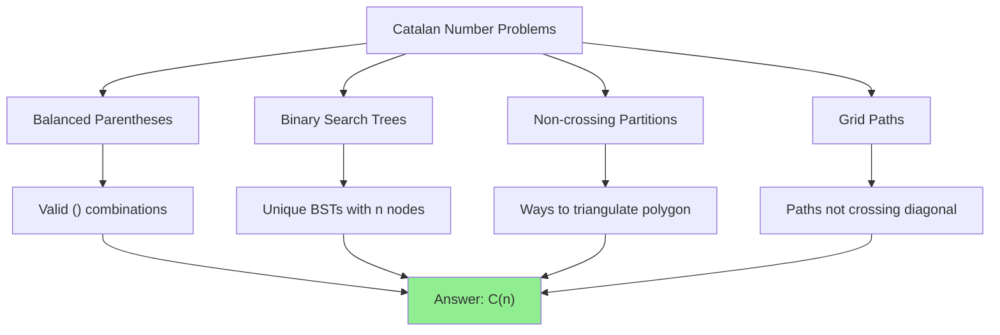

# Catalan Numbers

> **The sequence that counts parentheses, trees, paths, and more.**
>
> One of the most important sequences in combinatorics.

---

## 🎯 Pattern Recognition



**Catalan numbers appear when:**
- "Count valid parentheses"
- "Number of unique BSTs"
- "Ways to multiply matrices"
- "Non-crossing structures"
- "Paths below diagonal"

---

## 📐 The Catalan Sequence

```
C(0) = 1
C(1) = 1
C(2) = 2
C(3) = 5
C(4) = 14
C(5) = 42
C(6) = 132
C(7) = 429
C(8) = 1430
...
```

### Formulas

**Closed form:**
$$C(n) = \frac{1}{n+1} \binom{2n}{n} = \frac{(2n)!}{(n+1)! \cdot n!}$$

**Recurrence:**
$$C(n) = \sum_{i=0}^{n-1} C(i) \cdot C(n-1-i)$$

**Alternative:**
$$C(n) = \frac{C(n-1) \cdot (4n-2)}{n+1}$$

---

## 💻 Computing Catalan Numbers

### Method 1: Closed Form

```python
def catalan(n: int) -> int:
    """
    Compute nth Catalan number using closed form.
    
    C(n) = C(2n, n) / (n + 1)
    
    Time: O(n)
    Space: O(1)
    """
    if n <= 1:
        return 1
    
    # Compute C(2n, n)
    result = 1
    for i in range(n):
        result = result * (2 * n - i) // (i + 1)
    
    # Divide by (n + 1)
    return result // (n + 1)


for i in range(10):
    print(f"C({i}) = {catalan(i)}")
# C(0) = 1, C(1) = 1, C(2) = 2, C(3) = 5, C(4) = 14, ...
```

```javascript
function catalan(n) {
    if (n <= 1) return 1;
    
    let result = 1;
    for (let i = 0; i < n; i++) {
        result = result * (2 * n - i) / (i + 1);
    }
    
    return Math.round(result / (n + 1));
}

for (let i = 0; i < 10; i++) {
    console.log(`C(${i}) = ${catalan(i)}`);
}
```

### Method 2: Recurrence (DP)

```python
def catalan_dp(n: int) -> int:
    """
    Compute Catalan using recurrence relation.
    
    C(n) = sum of C(i) * C(n-1-i) for i = 0 to n-1
    
    Time: O(n²)
    Space: O(n)
    """
    if n <= 1:
        return 1
    
    dp = [0] * (n + 1)
    dp[0] = dp[1] = 1
    
    for i in range(2, n + 1):
        for j in range(i):
            dp[i] += dp[j] * dp[i - 1 - j]
    
    return dp[n]


print([catalan_dp(i) for i in range(10)])
# [1, 1, 2, 5, 14, 42, 132, 429, 1430, 4862]
```

### Method 3: Iterative Formula

```python
def catalan_iterative(n: int) -> int:
    """
    C(n) = C(n-1) * (4n - 2) / (n + 1)
    
    Time: O(n)
    Space: O(1)
    """
    if n <= 1:
        return 1
    
    result = 1
    for i in range(1, n + 1):
        result = result * (4 * i - 2) // (i + 1)
    
    return result
```

### With Modulo

```python
MOD = 1_000_000_007

def catalan_mod(n: int) -> int:
    """Catalan number mod 10^9+7."""
    if n <= 1:
        return 1
    
    # C(2n, n) / (n + 1) mod MOD
    # Use modular inverse for division
    
    numerator = 1
    denominator = 1
    
    for i in range(n):
        numerator = (numerator * (2 * n - i)) % MOD
        denominator = (denominator * (i + 1)) % MOD
    
    # Multiply by inverse of (n + 1)
    denominator = (denominator * (n + 1)) % MOD
    
    return (numerator * pow(denominator, MOD - 2, MOD)) % MOD


print(catalan_mod(100))  # Large Catalan mod 10^9+7
```

---

## 📖 Problem: Unique Binary Search Trees (LC 96)

**Classic Catalan application:** Count BSTs with nodes 1 to n.

```python
def numTrees(n: int) -> int:
    """
    Count unique BSTs with n nodes.
    
    Why Catalan?
    - Choose root i (1 ≤ i ≤ n)
    - Left subtree has i-1 nodes: C(i-1) ways
    - Right subtree has n-i nodes: C(n-i) ways
    - Total: sum of C(i-1) * C(n-i) = C(n) (Catalan recurrence!)
    
    Time: O(n²) with DP, O(n) with formula
    Space: O(n) with DP, O(1) with formula
    """
    # DP approach (shows the recurrence)
    dp = [0] * (n + 1)
    dp[0] = dp[1] = 1
    
    for nodes in range(2, n + 1):
        for root in range(1, nodes + 1):
            left = root - 1          # nodes in left subtree
            right = nodes - root     # nodes in right subtree
            dp[nodes] += dp[left] * dp[right]
    
    return dp[n]


# Formula approach
def numTrees_formula(n: int) -> int:
    return catalan(n)


print(numTrees(3))  # 5
print(numTrees(4))  # 14
```

```javascript
function numTrees(n) {
    const dp = new Array(n + 1).fill(0);
    dp[0] = dp[1] = 1;
    
    for (let nodes = 2; nodes <= n; nodes++) {
        for (let root = 1; root <= nodes; root++) {
            dp[nodes] += dp[root - 1] * dp[nodes - root];
        }
    }
    
    return dp[n];
}
```

### Why This is Catalan

```
For n = 3 nodes:

Root = 1: left = 0 nodes, right = 2 nodes
          C(0) * C(2) = 1 * 2 = 2 trees

Root = 2: left = 1 node, right = 1 node
          C(1) * C(1) = 1 * 1 = 1 tree

Root = 3: left = 2 nodes, right = 0 nodes
          C(2) * C(0) = 2 * 1 = 2 trees

Total = 2 + 1 + 2 = 5 = C(3)
```

---

## 📖 Problem: Generate Parentheses (Related)

**Count:** Catalan number C(n) counts valid combinations.

**Generate:** Use backtracking.

```python
def generateParenthesis(n: int) -> list[str]:
    """
    Generate all valid parentheses combinations.
    
    Count = C(n) Catalan number
    """
    result = []
    
    def backtrack(s: str, open_count: int, close_count: int):
        if len(s) == 2 * n:
            result.append(s)
            return
        
        if open_count < n:
            backtrack(s + '(', open_count + 1, close_count)
        if close_count < open_count:
            backtrack(s + ')', open_count, close_count + 1)
    
    backtrack('', 0, 0)
    return result


result = generateParenthesis(3)
print(len(result))  # 5 = C(3)
print(result)       # ["((()))", "(()())", "(())()", "()(())", "()()()"]
```

---

## 🔢 All Catalan Interpretations

The nth Catalan number counts:

| Interpretation | n = 3 |
|---------------|-------|
| Valid parentheses with n pairs | ((())), (()()), (())(), ()(()), ()()() = 5 |
| BSTs with n nodes | 5 unique structures |
| Full binary trees with n+1 leaves | 5 trees |
| Ways to triangulate (n+2)-gon | Pentagon: 5 ways |
| Paths from (0,0) to (n,n) not crossing diagonal | 5 paths |
| Ways to multiply n+1 matrices | 5 parenthesizations |
| Non-crossing partitions of n+1 points | 5 ways |

---

## 📊 Visual: Path Interpretation

Catalan = paths from (0,0) to (n,n) staying **below or on** diagonal.

```
n = 3:

  3 ─────────x
    │ · · ╱
  2 ├───x╱──
    │ ╱ · ·
  1 ├x──────
    │ · · ·
  0 x───────
    0   1   2   3

R = Right, U = Up
Valid: Never go above diagonal (more U's than R's at any point)

All 5 paths:
1. R R R U U U
2. R R U R U U
3. R R U U R U
4. R U R R U U
5. R U R U R U
```

---

## ⚡ Complexity Analysis

| Method | Time | Space |
|--------|------|-------|
| DP recurrence | O(n²) | O(n) |
| Closed formula | O(n) | O(1) |
| Iterative formula | O(n) | O(1) |
| With modular inverse | O(n) | O(1) |

---

## ⚠️ Common Mistakes

### 1. Wrong Base Cases

```python
# ❌ WRONG
C(0) = 0  # Should be 1!

# ✅ CORRECT
C(0) = 1  # Empty structure counts as 1
C(1) = 1
```

### 2. Wrong Recurrence Range

```python
# ❌ WRONG - off by one
for j in range(1, i + 1):
    dp[i] += dp[j] * dp[i - j]

# ✅ CORRECT
for j in range(i):
    dp[i] += dp[j] * dp[i - 1 - j]
```

### 3. Overflow Without Modulo

```python
# C(20) = 6564120420 > 2^32
# C(35) ≈ 10^18, overflows even 64-bit

# Always use modular arithmetic for large n
```

---

## ✅ When to Use Catalan

- Counting valid parentheses
- Counting BST structures
- Counting lattice paths below diagonal
- Counting non-crossing structures
- Matrix chain multiplication counting

## ❌ When NOT to Use

| Scenario | Use Instead |
|----------|-------------|
| Need to generate all | Backtracking |
| Non-binary tree | Different formula |
| Paths can cross diagonal | Regular grid paths C(2n, n) |

---

## 📝 Practice Problems

| Problem | Difficulty | Key Technique |
|---------|------------|---------------|
| [Unique Binary Search Trees](https://leetcode.com/problems/unique-binary-search-trees/) | 🟡 Medium | DP or Catalan formula |
| [Unique Binary Search Trees II](https://leetcode.com/problems/unique-binary-search-trees-ii/) | 🟡 Medium | Generate all trees |
| [Generate Parentheses](https://leetcode.com/problems/generate-parentheses/) | 🟡 Medium | Backtracking (count = Catalan) |
| [Different Ways to Add Parentheses](https://leetcode.com/problems/different-ways-to-add-parentheses/) | 🟡 Medium | Divide and conquer |

---

## 🎤 Interview Context

<details>
<summary><strong>How to Communicate</strong></summary>

**Recognizing Catalan:**
> "This problem is about counting valid structures with n elements. The recurrence has the form C(n) = sum of C(i) × C(n-1-i), which is the Catalan recurrence."

**Explaining BST counting:**
> "For each choice of root, the left and right subtrees are independent subproblems. With root i, there are C(i-1) left trees and C(n-i) right trees. Summing over all roots gives the Catalan recurrence."

**Company Frequency:**
| Company | Frequency | Focus |
|---------|-----------|-------|
| Google | ⭐⭐⭐⭐ | Pattern recognition |
| Amazon | ⭐⭐⭐ | Unique BSTs |
| Meta | ⭐⭐⭐ | Parentheses |

</details>

---

## ⏱️ Time Estimates

| Activity | Time |
|----------|------|
| Learn Catalan definition | 10 min |
| Understand BST connection | 20 min |
| Implement DP version | 15 min |
| Implement formula | 10 min |
| Master pattern | 1.5 hours |

---

## 🧠 Spaced Repetition

<details>
<summary><strong>Review Schedule</strong></summary>

- **Day 1:** Compute first 10 Catalan numbers
- **Day 3:** Solve Unique BSTs problem
- **Day 7:** Explain why parentheses = Catalan
- **Day 14:** Derive closed form from recurrence
- **Day 30:** Identify Catalan in a new problem

</details>

---

> **💡 Key Insight:** Catalan numbers appear whenever you split a structure into two independent parts (left/right, inside/outside, before/after). The recurrence C(n) = Σ C(i) × C(n-1-i) captures this "split and recombine" pattern.

> **🔗 Related:** [← Pascal's Triangle](./4.2-Pascals-Triangle.md) | [Stars and Bars →](./4.4-Stars-and-Bars.md) | [Unique Paths](./4.1-nCr-Basics.md)
