# Stars and Bars (Multisets)

> **Count ways to distribute identical items into distinct groups.**
>
> The key technique for "sum equals n" counting problems.

---

## 🎯 Pattern Recognition

```mermaid
flowchart TD
    A["Distribution Problem?"] --> B{"What's being distributed?"}
    B -->|"Identical items → distinct bins"| C["Stars and Bars"]
    B -->|"Distinct items → distinct bins"| D["n^k or k^n"]
    B -->|"Distinct items → identical bins"| E["Partition numbers"]
    
    C --> C1["Non-negative: C(n+k-1, k-1)"]
    C --> C2["Positive: C(n-1, k-1)"]
    
    style C1 fill:#90EE90
    style C2 fill:#90EE90
```



**Use Stars and Bars when:**
- "How many ways to distribute n identical items"
- "Non-negative integer solutions to x₁ + x₂ + ... = n"
- "Multiset of size r from n types"
- "Ways to make change" (with infinite coins)

---

## 📐 The Two Theorems

### Theorem 1: Non-negative Solutions

**Question:** How many ways to put n identical balls into k distinct bins?

**Equivalent:** Count non-negative integer solutions to:
$$x_1 + x_2 + ... + x_k = n$$

**Answer:**
$$\binom{n + k - 1}{k - 1} = \binom{n + k - 1}{n}$$

### Theorem 2: Positive Solutions

**Question:** Same, but each bin must have at least 1 ball.

**Equivalent:** Count positive integer solutions to:
$$x_1 + x_2 + ... + x_k = n$$

**Answer:**
$$\binom{n - 1}{k - 1}$$

---

## 📊 Visual Explanation

### Stars and Bars Visualization

Represent n balls as ★ and k-1 dividers as |.

```
n = 5 balls, k = 3 bins

★★|★★★|     means (2, 3, 0)
★|★|★★★     means (1, 1, 3)
|★★★★★|     means (0, 5, 0)
★★★★★||     means (5, 0, 0)
```

**Counting:** Arrange n ★s and k-1 |s.
- Total positions: n + k - 1
- Choose k - 1 positions for bars: C(n + k - 1, k - 1)

---

## 💻 Code Implementation

```python
def stars_and_bars_nonneg(n: int, k: int) -> int:
    """
    Count non-negative integer solutions to:
    x1 + x2 + ... + xk = n
    
    Each xi >= 0
    
    Answer: C(n + k - 1, k - 1)
    
    Time: O(k)
    Space: O(1)
    """
    return nCr(n + k - 1, k - 1)


def stars_and_bars_positive(n: int, k: int) -> int:
    """
    Count positive integer solutions to:
    x1 + x2 + ... + xk = n
    
    Each xi >= 1
    
    Answer: C(n - 1, k - 1)
    
    Time: O(k)
    Space: O(1)
    """
    if n < k:
        return 0  # Not enough to give each bin at least 1
    return nCr(n - 1, k - 1)


def nCr(n: int, r: int) -> int:
    """Helper: compute C(n, r)."""
    if r < 0 or r > n:
        return 0
    if r == 0 or r == n:
        return 1
    r = min(r, n - r)
    result = 1
    for i in range(r):
        result = result * (n - i) // (i + 1)
    return result


# Examples
print(stars_and_bars_nonneg(5, 3))   # C(7, 2) = 21
print(stars_and_bars_positive(5, 3)) # C(4, 2) = 6

# Verify: x1 + x2 + x3 = 5, xi >= 1
# (1,1,3), (1,2,2), (1,3,1), (2,1,2), (2,2,1), (3,1,1) = 6 ✓
```

```javascript
function starsAndBarsNonneg(n, k) {
    return nCr(n + k - 1, k - 1);
}

function starsAndBarsPositive(n, k) {
    if (n < k) return 0;
    return nCr(n - 1, k - 1);
}

function nCr(n, r) {
    if (r < 0 || r > n) return 0;
    if (r === 0 || r === n) return 1;
    r = Math.min(r, n - r);
    let result = 1;
    for (let i = 0; i < r; i++) {
        result = result * (n - i) / (i + 1);
    }
    return Math.round(result);
}

console.log(starsAndBarsNonneg(5, 3));   // 21
console.log(starsAndBarsPositive(5, 3)); // 6
```

---

## 📖 Classic Applications

### 1. Multisets

**Question:** How many ways to choose r items from n types, with repetition allowed?

```python
def multiset(n: int, r: int) -> int:
    """
    Choose r items from n types with repetition.
    
    This is stars and bars with r balls, n bins.
    
    Answer: C(r + n - 1, n - 1) = C(r + n - 1, r)
    """
    return nCr(r + n - 1, r)


# Example: Choose 5 fruits from {apple, banana, cherry}
# How many different selections?
print(multiset(3, 5))  # C(7, 2) = 21
```

### 2. Making Change

**Question:** How many ways to make $n using coins of values c₁, c₂, ..., cₖ?

```python
def count_ways_to_make_change(n: int, coins: list[int]) -> int:
    """
    Count ways to make change for n using given coins.
    
    This is DP, not simple stars and bars (unless all coins = 1).
    
    Time: O(n * len(coins))
    Space: O(n)
    """
    dp = [0] * (n + 1)
    dp[0] = 1
    
    for coin in coins:
        for amount in range(coin, n + 1):
            dp[amount] += dp[amount - coin]
    
    return dp[n]


print(count_ways_to_make_change(5, [1, 2, 5]))  # 4 ways
# 5×1, 3×1+1×2, 1×1+2×2, 1×5
```

### 3. Balls into Urns

```python
def balls_into_urns(n_balls: int, k_urns: int, min_per_urn: int = 0) -> int:
    """
    Put n identical balls into k distinct urns.
    Each urn must have at least min_per_urn balls.
    """
    if min_per_urn == 0:
        return stars_and_bars_nonneg(n_balls, k_urns)
    
    # Give min_per_urn to each urn first
    remaining = n_balls - k_urns * min_per_urn
    if remaining < 0:
        return 0
    return stars_and_bars_nonneg(remaining, k_urns)


# 10 balls into 4 urns, each gets at least 2
print(balls_into_urns(10, 4, 2))  # C(2+4-1, 4-1) = C(5,3) = 10
```

### 4. Distributing Distinct Items into Distinct Bins

**Note:** This is NOT stars and bars. Use different formula.

```python
def distinct_into_distinct(n_items: int, k_bins: int, at_least_one_per_bin: bool = False) -> int:
    """
    Put n distinct items into k distinct bins.
    
    Without constraint: k^n
    Each bin at least one: k! * S(n, k) where S is Stirling number
    """
    if not at_least_one_per_bin:
        return k_bins ** n_items
    
    # Stirling numbers are more complex
    # For small cases, use inclusion-exclusion
    pass
```

---

## 📖 Problem: Count Sorted Vowel Strings (LC 1641)

**Given n, count strings of n lowercase vowels in sorted order.**

```python
def countVowelStrings(n: int) -> int:
    """
    Count n-length sorted vowel strings (aeiou).
    
    This is: choose n items from 5 types with repetition.
    = Multiset(5, n)
    = C(n + 5 - 1, n)
    = C(n + 4, n)
    = C(n + 4, 4)
    
    Time: O(1) with formula
    Space: O(1)
    """
    return nCr(n + 4, 4)


# Alternative: DP approach
def countVowelStrings_dp(n: int) -> int:
    """
    dp[i] = ways using vowels i through 4 (0=a, 4=u)
    """
    dp = [1] * 5  # Start: 1 way to use each vowel alone
    
    for _ in range(n - 1):
        # Cumulative sum from right
        for i in range(3, -1, -1):
            dp[i] += dp[i + 1]
    
    return sum(dp)


print(countVowelStrings(2))  # 15 = C(6, 4)
print(countVowelStrings(33)) # 66045 = C(37, 4)
```

```javascript
function countVowelStrings(n) {
    // C(n + 4, 4)
    return nCr(n + 4, 4);
}

console.log(countVowelStrings(2));  // 15
console.log(countVowelStrings(33)); // 66045
```

---

## 📖 With Constraints (Bounded Stars and Bars)

**Question:** Count solutions to x₁ + x₂ + ... + xₖ = n where 0 ≤ xᵢ ≤ bᵢ.

Use inclusion-exclusion.

```python
def bounded_stars_and_bars(n: int, bounds: list[int]) -> int:
    """
    Count non-negative solutions to x1 + x2 + ... + xk = n
    where 0 <= xi <= bounds[i].
    
    Uses inclusion-exclusion principle.
    
    Time: O(2^k * k)
    Space: O(k)
    """
    k = len(bounds)
    total = 0
    
    # Iterate over all subsets of constraints
    for mask in range(1 << k):
        # Count solutions with some xi > bounds[i]
        excess = 0
        sign = 1
        
        for i in range(k):
            if mask & (1 << i):
                excess += bounds[i] + 1
                sign *= -1
        
        if n - excess >= 0:
            total += sign * nCr(n - excess + k - 1, k - 1)
    
    return total


# Example: x1 + x2 + x3 = 5, where 0 <= x1 <= 2, 0 <= x2 <= 3, 0 <= x3 <= 4
print(bounded_stars_and_bars(5, [2, 3, 4]))
```

---

## 📊 Summary of Formulas

| Problem | Constraint | Formula |
|---------|------------|---------|
| x₁ + ... + xₖ = n | xᵢ ≥ 0 | C(n + k - 1, k - 1) |
| x₁ + ... + xₖ = n | xᵢ ≥ 1 | C(n - 1, k - 1) |
| x₁ + ... + xₖ = n | xᵢ ≥ mᵢ | Substitute yᵢ = xᵢ - mᵢ |
| x₁ + ... + xₖ ≤ n | xᵢ ≥ 0 | C(n + k, k) (add slack variable) |
| Multiset size r from n types | repetition allowed | C(r + n - 1, r) |

---

## ⚡ Complexity Analysis

| Operation | Time | Space |
|-----------|------|-------|
| Basic formula | O(min(n, k)) | O(1) |
| With min constraint | O(min(n, k)) | O(1) |
| With upper bounds | O(2^k × k) | O(k) |

---

## ⚠️ Common Mistakes

### 1. Confusing "At Least" with "At Most"

```python
# x >= 1: Use positive version C(n-1, k-1)
# x >= 0: Use non-negative version C(n+k-1, k-1)
# x <= b: Use inclusion-exclusion
```

### 2. Wrong Substitution for Minimum Constraint

```python
# ❌ WRONG
# x1 + x2 + x3 = 10, each xi >= 2
# NOT: C(10 + 3 - 1, 3 - 1) = C(12, 2)

# ✅ CORRECT
# Substitute yi = xi - 2, so yi >= 0
# y1 + y2 + y3 = 10 - 6 = 4
# Answer: C(4 + 3 - 1, 3 - 1) = C(6, 2) = 15
```

### 3. Using Stars and Bars for Distinct Items

```python
# ❌ WRONG - distinct items need different formula
# 5 distinct balls into 3 bins = C(5+3-1, 3-1) = 21

# ✅ CORRECT
# 5 distinct balls into 3 distinct bins = 3^5 = 243
```

---

## ✅ When to Use Stars and Bars

- Distributing identical items
- Counting non-negative/positive integer solutions
- Multiset selections
- Partition of number into parts

## ❌ When NOT to Use

| Scenario | Use Instead |
|----------|-------------|
| Distinct items | Permutations/arrangements |
| Order matters | Different counting |
| Upper bounds | Inclusion-exclusion |
| Specific coin values | DP for making change |

---

## 📝 Practice Problems

| Problem | Difficulty | Key Technique |
|---------|------------|---------------|
| [Count Sorted Vowel Strings](https://leetcode.com/problems/count-sorted-vowel-strings/) | 🟡 Medium | Multiset formula |
| [Combination Sum IV](https://leetcode.com/problems/combination-sum-iv/) | 🟡 Medium | DP (order matters) |
| [Coin Change 2](https://leetcode.com/problems/coin-change-ii/) | 🟡 Medium | DP (specific values) |

---

## 🎤 Interview Context

<details>
<summary><strong>How to Communicate</strong></summary>

**Identifying the pattern:**
> "This is a 'distribute n identical items into k distinct bins' problem. The answer is C(n + k - 1, k - 1), using the stars and bars technique."

**Explaining the visualization:**
> "I think of n stars and k-1 bars. Arranging these gives C(n + k - 1, k - 1) ways, where each arrangement corresponds to a different distribution."

**Company Frequency:**
| Company | Frequency | Focus |
|---------|-----------|-------|
| Google | ⭐⭐⭐⭐ | Counting problems |
| Amazon | ⭐⭐⭐ | Distribution |
| Quant firms | ⭐⭐⭐⭐ | Combinatorics |

</details>

---

## ⏱️ Time Estimates

| Activity | Time |
|----------|------|
| Learn basic formulas | 15 min |
| Understand visualization | 10 min |
| Solve Count Sorted Vowels | 15 min |
| Learn with constraints | 25 min |
| Master pattern | 1.5 hours |

---

## 🧠 Spaced Repetition

<details>
<summary><strong>Review Schedule</strong></summary>

- **Day 1:** Derive the two main formulas
- **Day 3:** Solve multiset problem
- **Day 7:** Apply to a new distribution problem
- **Day 14:** Handle minimum constraints
- **Day 30:** Solve bounded version

</details>

---

> **💡 Key Insight:** Stars and Bars transforms a "sum equals n" problem into a "choose positions" problem. The n items are stars, the k-1 dividers are bars, and we choose where to place the bars.

> **🔗 Related:** [← Catalan Numbers](./4.3-Catalan-Numbers.md) | [nCr Basics](./4.1-nCr-Basics.md) | [Modular Arithmetic](../01-Fundamentals/1.2-Modular-Arithmetic.md)
