# Modular Inverse Basics

> **Division in modular arithmetic requires the multiplicative inverse.**
>
> Essential for computing nCr, fractions, and cryptography under modulo.

---

## 🎯 Pattern Recognition

```mermaid
flowchart TD
    A["Need Division mod m?"] --> B{"Is m prime?"}
    B -->|"Yes"| C["Fermat's Method"]
    B -->|"No"| D{"Is gcd(a,m) = 1?"}
    
    C --> C1["a^(-1) = a^(m-2) mod m"]
    
    D -->|"Yes"| E["Extended GCD"]
    D -->|"No"| F["Inverse doesn't exist!"]
    
    C1 --> G["Use fast power"]
    E --> H["Find x: ax ≡ 1 (mod m)"]
    
    style C1 fill:#90EE90
    style E fill:#90EE90
    style F fill:#FFB6C1
```



**Need modular inverse when:**
- Computing (a / b) mod m
- Calculating nCr with large factorials
- Solving linear congruences
- Cryptographic operations

---

## 📐 What is Modular Inverse?

The **modular inverse** of `a` modulo `m` is the number `x` such that:

$$a \cdot x \equiv 1 \pmod{m}$$

We write $x = a^{-1} \mod m$.

**Key fact:** The inverse exists if and only if gcd(a, m) = 1.

### Examples

```
a = 3, m = 7:   3 × 5 = 15 ≡ 1 (mod 7)   → 3^(-1) = 5
a = 2, m = 5:   2 × 3 = 6 ≡ 1 (mod 5)    → 2^(-1) = 3
a = 4, m = 6:   No inverse! gcd(4, 6) = 2 ≠ 1
```

---

## 💻 Method 1: Fermat's Little Theorem (Prime Modulus)

For **prime** m:
$$a^{m-1} \equiv 1 \pmod{m}$$

Therefore:
$$a^{-1} \equiv a^{m-2} \pmod{m}$$

```python
MOD = 1_000_000_007  # Prime!

def mod_inverse_fermat(a: int, mod: int = MOD) -> int:
    """
    Compute a^(-1) mod m using Fermat's Little Theorem.
    
    REQUIRES: mod is prime!
    
    Time: O(log mod)
    Space: O(1)
    """
    return pow(a, mod - 2, mod)


# Examples
print(mod_inverse_fermat(3, 7))   # 5 (because 3 × 5 ≡ 1 mod 7)
print(mod_inverse_fermat(2, 5))   # 3 (because 2 × 3 ≡ 1 mod 5)

# Verify
a = 12345
inv = mod_inverse_fermat(a)
print((a * inv) % MOD)  # 1 ✓
```

```javascript
const MOD = 1000000007n;

function modInverseFermat(a, mod = MOD) {
    return modPow(a, mod - 2n, mod);
}

function modPow(base, exp, mod) {
    let result = 1n;
    base = base % mod;
    while (exp > 0n) {
        if (exp & 1n) result = (result * base) % mod;
        exp >>= 1n;
        base = (base * base) % mod;
    }
    return result;
}

console.log(modInverseFermat(3n, 7n));  // 5n
```

---

## 💻 Method 2: Extended Euclidean Algorithm (Any Modulus)

Works for **any** m when gcd(a, m) = 1.

Finds x, y such that: ax + my = gcd(a, m) = 1

Then x is the modular inverse.

```python
def extended_gcd(a: int, b: int) -> tuple[int, int, int]:
    """
    Returns (gcd, x, y) such that ax + by = gcd
    """
    if b == 0:
        return a, 1, 0
    
    gcd, x1, y1 = extended_gcd(b, a % b)
    x = y1
    y = x1 - (a // b) * y1
    return gcd, x, y


def mod_inverse_extended(a: int, m: int) -> int:
    """
    Compute a^(-1) mod m using Extended GCD.
    
    Works for ANY m (doesn't need to be prime).
    Returns -1 if inverse doesn't exist.
    
    Time: O(log min(a, m))
    Space: O(log min(a, m)) for recursion
    """
    gcd, x, _ = extended_gcd(a % m, m)
    
    if gcd != 1:
        return -1  # Inverse doesn't exist
    
    return (x % m + m) % m  # Make positive


# Examples
print(mod_inverse_extended(3, 7))   # 5
print(mod_inverse_extended(3, 26))  # 9 (because 3 × 9 = 27 ≡ 1 mod 26)
print(mod_inverse_extended(4, 6))   # -1 (doesn't exist, gcd = 2)
```

```javascript
function extendedGcd(a, b) {
    if (b === 0) return [a, 1, 0];
    const [gcd, x1, y1] = extendedGcd(b, a % b);
    return [gcd, y1, x1 - Math.floor(a / b) * y1];
}

function modInverseExtended(a, m) {
    const [gcd, x] = extendedGcd(a % m, m);
    if (gcd !== 1) return -1;
    return ((x % m) + m) % m;
}
```

---

## 💻 Method 3: Iterative Extended GCD

More efficient, no recursion.

```python
def mod_inverse_iterative(a: int, m: int) -> int:
    """
    Iterative Extended GCD for modular inverse.
    
    Time: O(log m)
    Space: O(1)
    """
    if m == 1:
        return 0
    
    m0 = m
    x0, x1 = 0, 1
    
    while a > 1:
        q = a // m
        m, a = a % m, m
        x0, x1 = x1 - q * x0, x0
    
    return (x1 + m0) % m0


print(mod_inverse_iterative(3, 7))   # 5
print(mod_inverse_iterative(17, 120))  # 113
```

---

## 🔢 Using Modular Inverse

### Division in Modular Arithmetic

```python
MOD = 1_000_000_007

def mod_divide(a: int, b: int) -> int:
    """
    Compute (a / b) mod MOD.
    
    = a × b^(-1) mod MOD
    """
    return (a * mod_inverse_fermat(b)) % MOD


# Example: 10 / 3 mod 7
# 10 / 3 = 10 × 3^(-1) = 10 × 5 = 50 ≡ 1 (mod 7)
# Verify: 1 × 3 = 3 ≡ 3, and 10 ≡ 3 (mod 7) ✓
print(mod_divide(10, 3) * 3 % 7)  # Should equal 10 % 7 = 3
```

### Computing nCr mod p

```python
MOD = 1_000_000_007

def nCr_mod(n: int, r: int) -> int:
    """
    Compute C(n, r) mod MOD using modular inverse.
    """
    if r < 0 or r > n:
        return 0
    
    numerator = 1
    denominator = 1
    
    for i in range(r):
        numerator = (numerator * (n - i)) % MOD
        denominator = (denominator * (i + 1)) % MOD
    
    return (numerator * pow(denominator, MOD - 2, MOD)) % MOD


print(nCr_mod(10, 3))      # 120
print(nCr_mod(1000, 500))  # Large number mod MOD
```

### Precomputed Inverse Factorials

```python
class FastCombinatorics:
    """O(n) precomputation, O(1) queries."""
    
    def __init__(self, max_n: int, mod: int = MOD):
        self.mod = mod
        self.fact = [1] * (max_n + 1)
        self.inv_fact = [1] * (max_n + 1)
        
        # Forward: compute factorials
        for i in range(1, max_n + 1):
            self.fact[i] = (self.fact[i-1] * i) % mod
        
        # Backward: compute inverse factorials
        self.inv_fact[max_n] = pow(self.fact[max_n], mod - 2, mod)
        for i in range(max_n - 1, -1, -1):
            self.inv_fact[i] = (self.inv_fact[i+1] * (i+1)) % mod
    
    def nCr(self, n: int, r: int) -> int:
        if r < 0 or r > n:
            return 0
        return (self.fact[n] * self.inv_fact[r] % self.mod) * self.inv_fact[n-r] % self.mod


# Usage
comb = FastCombinatorics(10000)
print(comb.nCr(100, 50))  # Instant!
```

---

## ⚡ Method Comparison

| Method | Time | Space | When to Use |
|--------|------|-------|-------------|
| Fermat's | O(log m) | O(1) | m is prime |
| Extended GCD (recursive) | O(log m) | O(log m) | General, small stack |
| Extended GCD (iterative) | O(log m) | O(1) | General, best |
| Precomputed | O(n) prep, O(1) query | O(n) | Many queries |

---

## ⚠️ Common Mistakes

### 1. Forgetting Inverse Doesn't Always Exist

```python
# ❌ WRONG - assumes inverse always exists
def divide(a, b, m):
    return (a * pow(b, m - 2, m)) % m

# ✅ CORRECT - check gcd first
def divide_safe(a, b, m):
    from math import gcd
    if gcd(b, m) != 1:
        raise ValueError(f"Inverse of {b} mod {m} doesn't exist")
    return (a * pow(b, m - 2, m)) % m
```

### 2. Using Fermat for Non-Prime Modulus

```python
# ❌ WRONG - Fermat requires prime m
pow(a, m - 2, m)  # Only works if m is prime!

# ✅ CORRECT - use Extended GCD for non-prime
mod_inverse_extended(a, m)
```

### 3. Negative Result from Extended GCD

```python
# Extended GCD can return negative x
# ❌ WRONG
x = extended_gcd(a, m)[1]
return x  # Might be negative!

# ✅ CORRECT - normalize
return (x % m + m) % m
```

### 4. Overflow Before Taking Mod

```python
# In languages with fixed-size integers:
# ❌ WRONG - a * inv might overflow
result = (a * inverse) % mod

# ✅ CORRECT (C++/Java)
result = (1LL * a * inverse) % mod
```

---

## 📊 When Inverse Exists

| Condition | Inverse exists? |
|-----------|-----------------|
| m is prime, a ≢ 0 (mod m) | ✅ Yes |
| gcd(a, m) = 1 | ✅ Yes |
| gcd(a, m) > 1 | ❌ No |
| a ≡ 0 (mod m) | ❌ No |

---

## ✅ When to Use Each Method

| Scenario | Method |
|----------|--------|
| m is prime (like 10^9+7) | Fermat's (simplest) |
| m is not prime | Extended GCD |
| Many inverses needed | Precompute factorial inverses |
| One-off calculation | Any method |

## ❌ When NOT to Use

| Scenario | Alternative |
|----------|-------------|
| gcd(a, m) ≠ 1 | Inverse doesn't exist |
| Need exact (non-modular) division | Regular division |
| Very small m | Lookup table |

---

## 📝 Practice Problems

| Problem | Difficulty | Key Technique |
|---------|------------|---------------|
| [Super Pow](https://leetcode.com/problems/super-pow/) | 🟡 Medium | Modular inverse |
| [Unique Paths](https://leetcode.com/problems/unique-paths/) | 🟡 Medium | nCr with inverse |
| [Count Good Numbers](https://leetcode.com/problems/count-good-numbers/) | 🟡 Medium | Modular exponentiation |

---

## 🎤 Interview Context

<details>
<summary><strong>How to Communicate</strong></summary>

**Explaining why we need inverse:**
> "In modular arithmetic, we can't directly divide. Instead, we multiply by the modular inverse. For prime modulus, Fermat's Little Theorem says a^(-1) = a^(p-2) mod p."

**Explaining the formula:**
> "By Fermat's Little Theorem, a^(p-1) ≡ 1 mod p for prime p. So a × a^(p-2) ≡ 1 mod p, meaning a^(p-2) is the inverse."

**Company Frequency:**
| Company | Frequency | Focus |
|---------|-----------|-------|
| Google | ⭐⭐⭐⭐ | Math problems |
| Quant firms | ⭐⭐⭐⭐⭐ | Number theory |
| Meta | ⭐⭐⭐ | Large number handling |

</details>

---

## ⏱️ Time Estimates

| Activity | Time |
|----------|------|
| Understand concept | 15 min |
| Implement Fermat's | 5 min |
| Implement Extended GCD | 15 min |
| Precompute factorials | 20 min |
| Master pattern | 1 hour |

---

## 🧠 Spaced Repetition

<details>
<summary><strong>Review Schedule</strong></summary>

- **Day 1:** Implement Fermat's method
- **Day 3:** Compute nCr with modular inverse
- **Day 7:** Implement Extended GCD
- **Day 14:** Precompute inverse factorials
- **Day 30:** Solve a new problem using inverse

</details>

---

> **💡 Key Insight:** The modular inverse transforms division into multiplication. For prime m, use a^(m-2). For any m (when gcd = 1), use Extended GCD. This unlocks all fraction operations in modular arithmetic.

> **🔗 Related:** [Chinese Remainder Theorem →](./5.2-Chinese-Remainder-Theorem.md) | [Extended GCD](../02-GCD-LCM/2.2-Extended-GCD.md) | [Fast Power](../01-Fundamentals/1.3-Fast-Power.md)
