# Chinese Remainder Theorem (CRT)

> **Find a number that satisfies multiple modular conditions simultaneously.**
>
> Combines remainders from coprime moduli into a single solution.

---

## 🎯 Pattern Recognition

```mermaid
flowchart TD
    A["System of Congruences"] --> B{"Moduli coprime?"}
    
    B -->|"Yes"| C["CRT Applies!"]
    B -->|"No"| D{"Compatible remainders?"}
    
    C --> C1["Unique solution mod M"]
    C --> C2["M = m1 × m2 × ... × mk"]
    
    D -->|"Yes"| E["Generalized CRT"]
    D -->|"No"| F["No solution!"]
    
    style C fill:#90EE90
    style F fill:#FFB6C1
```



**Use CRT when:**
- Given multiple "remainder after dividing by..." conditions
- Moduli are pairwise coprime
- Need to find numbers in multiple residue classes

---

## 📐 The Theorem

**Chinese Remainder Theorem:** Given pairwise coprime moduli $m_1, m_2, \ldots, m_k$ and any remainders $r_1, r_2, \ldots, r_k$, there exists a **unique** solution modulo $M = m_1 \cdot m_2 \cdots m_k$ to:

$$x \equiv r_1 \pmod{m_1}$$
$$x \equiv r_2 \pmod{m_2}$$
$$\vdots$$
$$x \equiv r_k \pmod{m_k}$$

### Simple Example

Find $x$ such that:
- $x \equiv 2 \pmod{3}$
- $x \equiv 3 \pmod{5}$

**Answer:** $x \equiv 8 \pmod{15}$

Verify: 8 = 2×3 + 2 ≡ 2 (mod 3) ✓, and 8 = 1×5 + 3 ≡ 3 (mod 5) ✓

---

## 💻 CRT Construction Formula

For two equations:
$$x \equiv r_1 \pmod{m_1}, \quad x \equiv r_2 \pmod{m_2}$$

Solution:
$$x = r_1 \cdot M_2 \cdot y_2 + r_2 \cdot M_1 \cdot y_1 \pmod{M}$$

Where:
- $M = m_1 \cdot m_2$
- $M_1 = M / m_1 = m_2$
- $M_2 = M / m_2 = m_1$
- $y_1 = M_1^{-1} \pmod{m_1}$ (modular inverse)
- $y_2 = M_2^{-1} \pmod{m_2}$ (modular inverse)

---

## 💻 Implementation

### Method 1: Incremental CRT

Solve equations one pair at a time.

```python
def extended_gcd(a: int, b: int) -> tuple[int, int, int]:
    """Returns (gcd, x, y) such that ax + by = gcd."""
    if b == 0:
        return a, 1, 0
    gcd, x1, y1 = extended_gcd(b, a % b)
    return gcd, y1, x1 - (a // b) * y1


def mod_inverse(a: int, m: int) -> int:
    """Compute a^(-1) mod m using Extended GCD."""
    gcd, x, _ = extended_gcd(a % m, m)
    if gcd != 1:
        raise ValueError(f"Inverse doesn't exist: gcd({a}, {m}) = {gcd}")
    return (x % m + m) % m


def crt_two(r1: int, m1: int, r2: int, m2: int) -> tuple[int, int]:
    """
    Solve:
        x ≡ r1 (mod m1)
        x ≡ r2 (mod m2)
    
    Returns (solution, combined_modulus).
    Requires gcd(m1, m2) = 1.
    
    Time: O(log min(m1, m2))
    """
    from math import gcd
    
    if gcd(m1, m2) != 1:
        raise ValueError(f"Moduli must be coprime: gcd({m1}, {m2}) != 1")
    
    M = m1 * m2
    
    # x = r1 + m1 × k for some k
    # r1 + m1 × k ≡ r2 (mod m2)
    # m1 × k ≡ (r2 - r1) (mod m2)
    # k ≡ (r2 - r1) × m1^(-1) (mod m2)
    
    k = ((r2 - r1) * mod_inverse(m1, m2)) % m2
    x = (r1 + m1 * k) % M
    
    return x, M


def chinese_remainder_theorem(remainders: list[int], moduli: list[int]) -> int:
    """
    Solve system of congruences using CRT.
    
    x ≡ remainders[i] (mod moduli[i]) for all i
    
    All moduli must be pairwise coprime.
    
    Time: O(k × log max_mod) where k is number of equations
    Space: O(1)
    """
    if len(remainders) != len(moduli):
        raise ValueError("remainders and moduli must have same length")
    
    x, m = remainders[0], moduli[0]
    
    for i in range(1, len(remainders)):
        x, m = crt_two(x, m, remainders[i], moduli[i])
    
    return x


# Examples
print(chinese_remainder_theorem([2, 3], [3, 5]))      # 8
print(chinese_remainder_theorem([1, 2, 3], [2, 3, 5]))  # 23

# Verify
x = 23
print(x % 2, x % 3, x % 5)  # 1, 2, 3 ✓
```

```javascript
function extendedGcd(a, b) {
    if (b === 0) return [a, 1, 0];
    const [gcd, x1, y1] = extendedGcd(b, a % b);
    return [gcd, y1, x1 - Math.floor(a / b) * y1];
}

function modInverse(a, m) {
    const [gcd, x] = extendedGcd(a % m, m);
    if (gcd !== 1) throw new Error("Inverse doesn't exist");
    return ((x % m) + m) % m;
}

function crtTwo(r1, m1, r2, m2) {
    const M = m1 * m2;
    const k = ((r2 - r1) * modInverse(m1, m2)) % m2;
    const x = ((r1 + m1 * k) % M + M) % M;
    return [x, M];
}

function chineseRemainderTheorem(remainders, moduli) {
    let [x, m] = [remainders[0], moduli[0]];
    for (let i = 1; i < remainders.length; i++) {
        [x, m] = crtTwo(x, m, remainders[i], moduli[i]);
    }
    return x;
}

console.log(chineseRemainderTheorem([2, 3], [3, 5])); // 8
```

---

### Method 2: Direct Formula

```python
def crt_direct(remainders: list[int], moduli: list[int]) -> int:
    """
    CRT using the direct construction formula.
    
    x = Σ r_i × M_i × y_i (mod M)
    
    where:
      M = Π m_i (product of all moduli)
      M_i = M / m_i
      y_i = M_i^(-1) mod m_i
    """
    from math import prod
    
    M = prod(moduli)
    x = 0
    
    for r_i, m_i in zip(remainders, moduli):
        M_i = M // m_i                    # Product of all other moduli
        y_i = mod_inverse(M_i, m_i)       # Inverse of M_i mod m_i
        x += r_i * M_i * y_i
    
    return x % M


print(crt_direct([2, 3], [3, 5]))  # 8
```

---

## 📊 Visual Example

**Find x such that:**
- x ≡ 2 (mod 3)
- x ≡ 3 (mod 5)  
- x ≡ 2 (mod 7)

```
Numbers ≡ 2 (mod 3): 2, 5, 8, 11, 14, 17, 20, 23, 26, 29, 32, 35, 38, 41, 44, ...
Numbers ≡ 3 (mod 5):    3, 8, 13, 18, 23, 28, 33, 38, 43, ...
Numbers ≡ 2 (mod 7):       2, 9, 16, 23, 30, 37, 44, ...

Intersection: 23, 23+105=128, 23+210=233, ...

Solution: x ≡ 23 (mod 105)
```

---

## 🔢 Applications

### 1. Computing Large nCr

When MOD is not prime but a product of prime powers:

```python
def nCr_non_prime_mod(n: int, r: int, mod: int) -> int:
    """
    Compute C(n, r) mod m where m is not necessarily prime.
    
    Uses CRT by factoring m into prime powers.
    """
    from sympy import factorint
    
    factors = factorint(mod)  # {prime: power}
    remainders = []
    moduli = []
    
    for p, e in factors.items():
        p_e = p ** e
        moduli.append(p_e)
        # Compute C(n, r) mod p^e using Lucas' theorem extension
        remainders.append(nCr_prime_power(n, r, p, e))
    
    return chinese_remainder_theorem(remainders, moduli)
```

### 2. Reconstructing from Multiple Moduli

```python
def solve_with_multiple_mods(n: int) -> int:
    """
    Compute f(n) by computing it modulo several small primes,
    then using CRT to reconstruct.
    """
    # Use several small primes
    primes = [1000000007, 1000000009, 998244353]
    results = []
    
    for p in primes:
        results.append(compute_f_mod(n, p))
    
    return chinese_remainder_theorem(results, primes)
```

### 3. Classic Puzzle

**What's the smallest positive integer divisible by 3, 5, and 7 that leaves remainder 1 when divided by each?**

```python
# x ≡ 1 (mod 3)
# x ≡ 1 (mod 5)
# x ≡ 1 (mod 7)

x = chinese_remainder_theorem([1, 1, 1], [3, 5, 7])
print(x)  # 1

# Actually x = 1 satisfies all! The "smallest > 105" would be 106.
# For "leaves remainder 2":
x = chinese_remainder_theorem([2, 2, 2], [3, 5, 7])
print(x)  # 107
```

---

## ⚠️ Common Mistakes

### 1. Moduli Not Coprime

```python
# ❌ WRONG - gcd(4, 6) = 2 ≠ 1
chinese_remainder_theorem([1, 2], [4, 6])  # Will fail!

# ✅ Check coprimality first
from math import gcd
from itertools import combinations

def are_pairwise_coprime(moduli):
    return all(gcd(a, b) == 1 for a, b in combinations(moduli, 2))
```

### 2. Negative Remainders

```python
# ❌ WRONG - negative intermediate result
x = r1 + m1 * k  # k might make x negative

# ✅ CORRECT - normalize
x = (r1 + m1 * k) % M
if x < 0:
    x += M
```

### 3. Inconsistent System

When moduli are not coprime, the system might have no solution:

```python
# x ≡ 1 (mod 2)  →  x is odd
# x ≡ 0 (mod 4)  →  x is divisible by 4 (even!)
# These are inconsistent! No solution exists.
```

---

## ⚡ Complexity Analysis

| Operation | Time | Space |
|-----------|------|-------|
| CRT for 2 equations | O(log m) | O(1) |
| CRT for k equations | O(k log M) | O(1) |
| Direct formula | O(k log M) | O(k) |

Where M is the product of all moduli.

---

## 📐 Generalized CRT

When moduli are NOT coprime:

```python
def generalized_crt_two(r1: int, m1: int, r2: int, m2: int) -> tuple[int, int]:
    """
    Solve CRT even when gcd(m1, m2) > 1.
    
    Returns (solution, lcm(m1, m2)) or None if no solution.
    """
    from math import gcd, lcm
    
    g = gcd(m1, m2)
    
    # Check compatibility
    if (r1 - r2) % g != 0:
        return None  # No solution
    
    # Reduce to coprime case
    _, x, y = extended_gcd(m1 // g, m2 // g)
    
    L = lcm(m1, m2)
    diff = (r2 - r1) // g
    x = (r1 + m1 * diff * x) % L
    
    return x, L


# Works even when not coprime!
print(generalized_crt_two(3, 6, 5, 10))  # (15, 30)
# Verify: 15 % 6 = 3 ✓, 15 % 10 = 5 ✓
```

---

## ✅ When to Use

| Scenario | Use CRT? |
|----------|----------|
| Multiple remainder conditions | ✅ |
| Coprime moduli | ✅ |
| Need unique solution mod M | ✅ |
| Reconstruct from hash values | ✅ |

## ❌ When NOT to Use

| Scenario | Alternative |
|----------|-------------|
| Non-coprime moduli | Generalized CRT |
| Single modulus | Direct computation |
| Very large k (many equations) | May overflow |

---

## 📝 Practice Problems

| Problem | Difficulty | Key Technique |
|---------|------------|---------------|
| [Check If It Is a Straight Line](https://leetcode.com/problems/check-if-it-is-a-straight-line/) | 🟢 Easy | Related math |
| [Max Points on a Line](https://leetcode.com/problems/max-points-on-a-line/) | 🔴 Hard | GCD for slopes |

*Note: Pure CRT problems are rare in LeetCode but common in competitive programming (Codeforces, USACO).*

---

## 🎤 Interview Context

<details>
<summary><strong>How to Communicate</strong></summary>

**Explaining the concept:**
> "CRT tells us that if we have conditions like 'x leaves remainder 2 when divided by 3 and remainder 3 when divided by 5,' there's a unique answer modulo 15. The theorem gives us a constructive way to find it."

**When it comes up:**
- Problems involving multiple remainder conditions
- Large number computations with coprime moduli
- Clock arithmetic puzzles
- Cryptographic applications (RSA uses CRT for efficiency)

</details>

---

## ⏱️ Time Estimates

| Activity | Time |
|----------|------|
| Understand theorem | 20 min |
| Implement basic CRT | 15 min |
| Implement generalized | 30 min |
| Apply to problems | 30 min |

---

## 🧠 Spaced Repetition

<details>
<summary><strong>Review Schedule</strong></summary>

- **Day 1:** Solve 2-equation CRT by hand
- **Day 3:** Implement incremental CRT
- **Day 7:** Implement direct formula
- **Day 14:** Generalized CRT
- **Day 30:** Real competitive problem

</details>

---

> **💡 Key Insight:** CRT transforms a complex "find x satisfying all conditions" problem into simple modular arithmetic. The magic is that coprime moduli guarantee a unique solution, and we can construct it systematically using modular inverses.

> **🔗 Related:** [Modular Inverse](./5.1-Modular-Inverse-Basics.md) | [Extended GCD](../02-GCD-LCM/2.2-Extended-GCD.md) | [LCM/GCD](../02-GCD-LCM/2.1-Euclidean-Algorithm.md)
